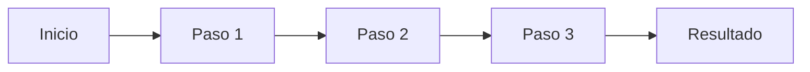

# 📁 Plantilla de Estructura para Nuevos Módulos

> Guía para mantener consistencia al crear los módulos faltantes para certificaciones

---

## 🎯 Estructura Estándar por Módulo

Cada módulo debe seguir esta estructura:

```
modulo-XX-nombre-descriptivo/
├── 📄 README.md                    (40-70KB, contenido principal)
├── 📄 RESUMEN-MODULO.md            (15-30KB, quick reference)
├── 📄 README.md.backup             (backup antes de cambios)
├── 📁 laboratorios/
│   ├── lab-01-basico.md
│   ├── lab-02-intermedio.md
│   ├── lab-03-avanzado.md
│   └── lab-04-troubleshooting.md   (opcional)
├── 📁 ejemplos/
│   ├── archivo-ejemplo-1.yaml
│   ├── archivo-ejemplo-2.yaml
│   ├── script-ejemplo.sh
│   └── README.md                   (explicación de ejemplos)
└── 📁 troubleshooting/             (opcional para módulos avanzados)
    ├── common-issues.md
    └── debugging-checklist.md
```

---

## 📝 Plantilla README.md (Contenido Principal)

```markdown
# Módulo XX: [Título Descriptivo]

> *"Quote inspiracional relacionado con el tema"*

**Duración**: [X horas] (Principiante) | [Y horas] (Intermedio) | [Z horas] (Certificación)  
**Nivel**: [Principiante/Intermedio/Avanzado]  
**Prerequisitos**: [Módulos previos necesarios]

---

## 🎯 Objetivos de Aprendizaje

Al completar este módulo, serás capaz de:

### 🎓 Conceptuales
- Concepto clave 1
- Concepto clave 2
- Concepto clave 3

### 🛠️ Técnicos
- Habilidad práctica 1
- Habilidad práctica 2
- Habilidad práctica 3

### 🔍 Troubleshooting
- Diagnosticar problema tipo 1
- Resolver error común 1
- Identificar causa raíz de issue X

### 🏢 Profesionales
- Aplicación enterprise 1
- Best practice industria 1
- Preparación para certificación [CKA/CKAD/AKS]

---

## 📋 Prerequisitos

### Conocimientos Requeridos:
- ✅ Conocimiento X del Módulo Y
- ✅ Comprensión de concepto Z
- ✅ Experiencia con herramienta W

### Herramientas Necesarias:
- ✅ kubectl configurado
- ✅ Cluster K8s funcional (Minikube/AKS)
- ✅ Editor con YAML syntax highlighting

### Archivos del Módulo:
- 📄 [Laboratorios](./laboratorios/)
- 📄 [Ejemplos YAML](./ejemplos/)
- 📄 [RESUMEN-MODULO.md](./RESUMEN-MODULO.md) - Quick reference

---

## 📖 Estructura del Módulo

### 🧩 Sección 1: Fundamentos de [Tema]

#### 1.1 ¿Qué es [Concepto]?

[Explicación clara y concisa]

**Analogía del mundo real:**
> [Analogía para facilitar comprensión]

#### 1.2 ¿Por qué usar [Concepto]?

**Ventajas:**
- ✅ Ventaja 1
- ✅ Ventaja 2
- ✅ Ventaja 3

**Casos de uso:**
1. Caso de uso empresarial 1
2. Caso de uso técnico 2
3. Caso de uso DevOps 3

#### 1.3 [Concepto] vs Alternativas

| Aspecto | [Concepto] | Alternativa 1 | Alternativa 2 |
|---------|------------|---------------|---------------|
| Pro 1   | ⭐⭐⭐⭐⭐ | ⭐⭐⭐ | ⭐⭐ |
| Pro 2   | Descripción | Descripción | Descripción |
| Uso     | Cuando... | Cuando... | Cuando... |

---

### 🔧 Sección 2: Arquitectura y Componentes

#### 2.1 Arquitectura de [Concepto]

```
┌─────────────────────────────────────────────┐
│            [Diagrama ASCII]                  │
│                                              │
│  Componente A  →  Componente B  →  Output   │
│                                              │
└─────────────────────────────────────────────┘
```

**Componentes principales:**
1. **Componente A**: Descripción y función
2. **Componente B**: Descripción y función
3. **Componente C**: Descripción y función

#### 2.2 Flujo de Trabajo



---

### 💻 Sección 3: Sintaxis y Comandos

#### 3.1 Comandos Básicos

```bash
# Comando 1: Descripción
kubectl [comando] [opciones]

# Ejemplo:
kubectl get [recurso] -n [namespace]

# Salida esperada:
NAME       STATUS    AGE
recurso1   Ready     5m
```

#### 3.2 Comandos Avanzados

```bash
# Comando complejo con explicación
kubectl [comando-avanzado] \
  --opcion1=valor1 \
  --opcion2=valor2 \
  --flag-importante

# Explicación de cada flag:
# --opcion1: Controla comportamiento X
# --opcion2: Define límite Y
```

---

### 📝 Sección 4: Manifiestos YAML

#### 4.1 Estructura Básica

```yaml
apiVersion: v1
kind: [Tipo]
metadata:
  name: ejemplo-basico
  namespace: default
  labels:
    app: mi-app
spec:
  # Especificación principal
  campo1: valor1
  campo2: valor2
  
  # Configuración adicional
  seccion:
    subcampo: valor
```

**Campos importantes:**
- `apiVersion`: Versión de API a usar
- `kind`: Tipo de recurso K8s
- `metadata`: Información identificativa
- `spec`: Especificación del recurso

#### 4.2 Ejemplos Prácticos

**Ejemplo 1: Caso de uso simple**

```yaml
# Ver archivo completo: ejemplos/ejemplo-simple.yaml
apiVersion: v1
kind: [Tipo]
metadata:
  name: ejemplo-simple
spec:
  campo: valor
```

**Ejemplo 2: Caso de uso avanzado**

```yaml
# Ver archivo completo: ejemplos/ejemplo-avanzado.yaml
apiVersion: v1
kind: [Tipo]
metadata:
  name: ejemplo-avanzado
  annotations:
    descripcion: "Ejemplo con configuración compleja"
spec:
  configuracion:
    avanzada: valor
  optimizaciones:
    - opcion1
    - opcion2
```

---

### 🧪 Sección 5: Laboratorios Prácticos

#### Lab 1: [Nombre Lab Básico]
**Objetivo**: Aprender fundamentos mediante práctica guiada  
**Duración**: 15-20 minutos  
**Dificultad**: 🟢 Básico

📝 **[Ver guía completa](./laboratorios/lab-01-basico.md)**

**Pasos rápidos:**
1. Crear recurso básico
2. Verificar funcionamiento
3. Inspeccionar configuración
4. Limpiar recursos

#### Lab 2: [Nombre Lab Intermedio]
**Objetivo**: Aplicar conceptos en escenario realista  
**Duración**: 30-40 minutos  
**Dificultad**: 🟡 Intermedio

📝 **[Ver guía completa](./laboratorios/lab-02-intermedio.md)**

#### Lab 3: [Nombre Lab Avanzado]
**Objetivo**: Resolver problema complejo  
**Duración**: 45-60 minutos  
**Dificultad**: 🔴 Avanzado

📝 **[Ver guía completa](./laboratorios/lab-03-avanzado.md)**

#### Lab 4: [Troubleshooting Challenge]
**Objetivo**: Diagnosticar y resolver fallas  
**Duración**: 30-45 minutos  
**Dificultad**: 🔴 Avanzado

📝 **[Ver guía completa](./laboratorios/lab-04-troubleshooting.md)**

---

### 🔍 Sección 6: Troubleshooting

#### 6.1 Problemas Comunes

**Problema 1: [Descripción del error]**

```bash
# Síntoma:
Error message aquí

# Causa:
Explicación de por qué ocurre

# Solución:
kubectl fix comando
```

**Problema 2: [Otro error común]**

```bash
# Debugging steps:
1. kubectl describe [recurso]
2. kubectl logs [pod]
3. kubectl get events --sort-by='.lastTimestamp'
```

#### 6.2 Comandos de Debugging

```bash
# Ver logs detallados
kubectl logs [pod] --previous --tail=100

# Ejecutar shell dentro del pod
kubectl exec -it [pod] -- /bin/bash

# Ver eventos del cluster
kubectl get events --all-namespaces --sort-by='.lastTimestamp'

# Describir recurso para debugging
kubectl describe [tipo] [nombre]
```

#### 6.3 Checklist de Troubleshooting

- [ ] ¿El recurso está en estado correcto? (`kubectl get`)
- [ ] ¿Hay errores en eventos? (`kubectl describe`)
- [ ] ¿Los logs muestran errores? (`kubectl logs`)
- [ ] ¿La configuración YAML es válida? (`kubectl apply --dry-run`)
- [ ] ¿Hay recursos suficientes? (CPU, memoria)
- [ ] ¿Las network policies permiten comunicación?

---

### 💡 Sección 7: Best Practices

#### 7.1 Mejores Prácticas de Configuración

✅ **DO (Hacer)**:
- Usar resource requests y limits
- Implementar health checks
- Versionado de manifiestos (Git)
- Labels y selectors consistentes
- Documentar con annotations

❌ **DON'T (No hacer)**:
- Usar `latest` tag en producción
- Hardcodear valores sensibles
- Ignorar resource limits
- Deployar sin health checks
- Omitir namespaces en producción

#### 7.2 Patrones de Diseño

**Patrón 1: [Nombre del patrón]**
- **Cuándo usar**: Caso de uso específico
- **Ventajas**: Beneficio 1, Beneficio 2
- **Ejemplo**: Ver `ejemplos/patron-1.yaml`

**Patrón 2: [Otro patrón]**
- **Cuándo usar**: Otro caso de uso
- **Ventajas**: Otros beneficios
- **Ejemplo**: Ver `ejemplos/patron-2.yaml`

#### 7.3 Seguridad

🔒 **Consideraciones de seguridad:**
- No ejecutar como root (usar securityContext)
- Aplicar principio de menor privilegio
- Usar RBAC para control de acceso
- Encriptar datos sensibles (Secrets)
- Escanear imágenes por vulnerabilidades

---

### 🔗 Sección 8: Integración con Otros Componentes

#### 8.1 Relación con [Componente A]

[Explicación de cómo interactúa con otros componentes del cluster]

```yaml
# Ejemplo de integración
apiVersion: v1
kind: [Tipo]
metadata:
  name: integracion-ejemplo
spec:
  vinculoA: componente-a
  vinculoB: componente-b
```

#### 8.2 Casos de Uso Reales

**Caso 1: [Aplicación enterprise]**
- Contexto: Empresa con microservicios
- Desafío: Problema específico
- Solución: Cómo [concepto] resuelve el problema

**Caso 2: [Startup tech]**
- Contexto: Startup con recursos limitados
- Desafío: Optimización de costos
- Solución: Implementación eficiente

---

### 📚 Sección 9: Recursos Adicionales

#### Documentación Oficial
- [Kubernetes Docs](https://kubernetes.io/docs/)
- [API Reference](https://kubernetes.io/docs/reference/)
- [Best Practices](https://kubernetes.io/docs/concepts/)

#### Tutoriales y Guías
- Tutorial oficial: [link]
- Blog post recomendado: [link]
- Video explicativo: [link]

#### Herramientas Complementarias
- Herramienta 1: Descripción y link
- Herramienta 2: Descripción y link

#### Comunidad y Soporte
- Kubernetes Slack: [canal específico]
- Stack Overflow: [tag]
- GitHub Issues: [repo]

---

### ✅ Sección 10: Evaluación y Siguientes Pasos

#### Checklist de Dominio del Módulo

**Conceptos teóricos:**
- [ ] Explicar qué es [concepto] y cuándo usarlo
- [ ] Comparar [concepto] vs alternativas
- [ ] Identificar casos de uso apropiados

**Habilidades prácticas:**
- [ ] Crear y configurar [recurso] desde cero
- [ ] Modificar configuración existente
- [ ] Diagnosticar problemas comunes
- [ ] Implementar best practices

**Troubleshooting:**
- [ ] Resolver error tipo 1
- [ ] Debugging con kubectl describe/logs
- [ ] Identificar y corregir misconfigurations

#### Ejercicios de Auto-Evaluación

**Ejercicio 1: Implementación desde cero**
- Crear [recurso] con especificaciones dadas
- Verificar funcionamiento correcto
- Optimizar configuración

**Ejercicio 2: Debugging challenge**
- Corregir manifesto YAML roto
- Diagnosticar pod que no arranca
- Solucionar problema de conectividad

**Ejercicio 3: Diseño de solución**
- Diseñar arquitectura para caso de uso dado
- Justificar decisiones técnicas
- Documentar configuración

#### Preparación para Certificación

**CKAD/CKA Relevance:**
- ⭐⭐⭐⭐⭐ Este módulo es crítico para [certificación]
- Peso en examen: ~[X]% de las preguntas
- Temas clave a dominar: [lista]

**Preguntas tipo examen:**
1. Pregunta práctica sobre [concepto]
2. Troubleshooting scenario
3. Best practices question

---

### ▶️ Navegación

- **⬅️ Módulo Anterior**: [Módulo X - Título](../modulo-X/)
- **➡️ Siguiente Módulo**: [Módulo Y - Título](../modulo-Y/)
- **🏠 Índice del Área**: [Área 2 - Arquitectura](../README.md)
- **📚 Curso Principal**: [Inicio](../../README.md)
- **📋 RESUMEN**: [RESUMEN-MODULO.md](./RESUMEN-MODULO.md)

---

### 💡 Tips de Estudio

**Para principiantes:**
- 📖 Lee la teoría completa primero
- 🧪 Haz todos los labs en orden
- 🔄 Repite los labs hasta dominarlos
- 📝 Toma notas de comandos importantes

**Para intermedios:**
- 🎯 Enfócate en labs avanzados
- 🔍 Experimenta más allá de las guías
- 💡 Intenta resolver problemas antes de ver soluciones
- 🏗️ Crea tus propios ejemplos

**Para certificación:**
- ⏱️ Practica bajo presión de tiempo
- 📚 Memoriza comandos sin autocompletado
- 🧩 Resuelve todos los troubleshooting challenges
- 🎓 Simula condiciones de examen

---

**🎉 ¡Felicitaciones por completar el Módulo [XX]!**

*Has adquirido conocimientos fundamentales de [concepto] que te preparan para [objetivo siguiente].*

**Tiempo estimado de estudio**: [X] horas (principiante) | [Y] horas (intermedio) | [Z] horas (certificación)  
**Estado**: ✅ 100% Actualizado
```

---

## 📄 Plantilla RESUMEN-MODULO.md (Quick Reference)

```markdown
# 📋 RESUMEN - Módulo XX: [Título]

> Referencia rápida de comandos, conceptos y troubleshooting

---

## 🎯 Objetivos Clave (One-Liner)

- ✅ [Objetivo 1 en una línea]
- ✅ [Objetivo 2 en una línea]
- ✅ [Objetivo 3 en una línea]

---

## 📝 Conceptos Fundamentales

### ¿Qué es [Concepto]?
[Definición en 2-3 líneas máximo]

### ¿Cuándo usar?
- Caso de uso 1
- Caso de uso 2
- Caso de uso 3

---

## ⚡ Comandos Esenciales

### Operaciones Básicas

```bash
# Crear
kubectl create [recurso] [nombre] [opciones]

# Listar
kubectl get [recurso] -n [namespace]

# Describir
kubectl describe [recurso] [nombre]

# Eliminar
kubectl delete [recurso] [nombre]
```

### Operaciones Avanzadas

```bash
# Comando avanzado 1
kubectl [comando] --opcion1 --opcion2

# Comando avanzado 2
kubectl [otro-comando] -o yaml | kubectl apply -f -
```

---

## 📄 YAML Template Mínimo

```yaml
apiVersion: v1
kind: [Tipo]
metadata:
  name: nombre-recurso
spec:
  campo1: valor1
  campo2: valor2
```

---

## 🔍 Troubleshooting Quick Guide

### Error 1: [Mensaje de error]
**Causa**: [Razón]  
**Fix**: `kubectl fix comando`

### Error 2: [Otro error]
**Causa**: [Razón]  
**Fix**: `kubectl otro-comando`

---

## 💡 One-Liners Útiles

```bash
# One-liner 1: Descripción
kubectl comando | grep filtro

# One-liner 2: Descripción
kubectl get all -A --show-labels

# One-liner 3: Descripción
kubectl logs -f deployment/nombre --tail=50
```

---

## ✅ Checklist de Validación

- [ ] Recurso creado correctamente
- [ ] Estado en `Ready`/`Running`
- [ ] Sin errores en logs
- [ ] Health checks pasando
- [ ] Configuración según best practices

---

## 🎓 Para Certificación

**Comandos críticos para memorizar:**
1. `kubectl comando-critico-1`
2. `kubectl comando-critico-2`
3. `kubectl comando-critico-3`

**Tiempo típico en examen**: 3-5 minutos

---

## 🔗 Links Rápidos

- 📖 [README completo](./README.md)
- 🧪 [Laboratorios](./laboratorios/)
- 📦 [Ejemplos](./ejemplos/)
- 📚 [Docs oficiales](https://kubernetes.io/docs/)

---

**Última actualización**: [Fecha]  
**Versión**: 1.0
```

---

## 🧪 Plantilla Laboratorio (lab-XX-nombre.md)

```markdown
# Lab XX: [Título del Laboratorio]

**Objetivo**: [Objetivo específico y medible]  
**Duración estimada**: XX minutos  
**Dificultad**: 🟢 Básico | 🟡 Intermedio | 🔴 Avanzado  
**Prerequisitos**: [Módulos/conocimientos necesarios]

---

## 📋 Escenario

[Descripción del escenario realista del laboratorio]

**Contexto empresarial** (opcional):
> [Situación del mundo real que motiva el ejercicio]

---

## 🎯 Objetivos de Aprendizaje

Al completar este lab, habrás:
- ✅ Objetivo práctico 1
- ✅ Objetivo práctico 2
- ✅ Objetivo práctico 3

---

## 🛠️ Preparación del Entorno

### Prerequisitos:
```bash
# Verificar cluster funcional
kubectl cluster-info

# Verificar namespace
kubectl get ns

# Preparar directorio de trabajo
mkdir -p ~/labs/modulo-XX/lab-YY
cd ~/labs/modulo-XX/lab-YY
```

### Archivos necesarios:
- 📄 `archivo-ejemplo.yaml` (descargar de `ejemplos/`)
- 📄 `script-auxiliar.sh` (opcional)

---

## 📝 Paso a Paso

### Paso 1: [Descripción del paso]

**Objetivo**: [Qué se logra con este paso]

```bash
# Comando a ejecutar
kubectl comando opciones

# Salida esperada:
[salida del comando]
```

**Explicación**:
[Qué hace el comando y por qué es importante]

**Verificación**:
```bash
# Verificar resultado
kubectl get recurso
```

---

### Paso 2: [Siguiente paso]

**Objetivo**: [Qué se logra]

Crea el siguiente archivo YAML:

```yaml
# archivo: recurso.yaml
apiVersion: v1
kind: [Tipo]
metadata:
  name: lab-recurso
spec:
  config: valor
```

Aplica el manifiesto:
```bash
kubectl apply -f recurso.yaml
```

**Verificación**:
```bash
# Verificar creación
kubectl describe [recurso] lab-recurso
```

---

### Paso 3: [Otro paso]

[Continuar patrón similar...]

---

## 🧪 Validación de Resultados

### Checklist de Éxito:
- [ ] Recurso creado correctamente
- [ ] Estado es `Ready`/`Running`
- [ ] No hay errores en logs
- [ ] Funcionalidad principal funciona
- [ ] Configuración según especificaciones

### Comandos de Validación:
```bash
# Verificar estado
kubectl get [recurso] -o wide

# Verificar logs
kubectl logs [pod]

# Verificar funcionalidad
kubectl exec -it [pod] -- [comando-test]
```

---

## 🔍 Troubleshooting

### Problema Común 1: [Descripción]
**Síntoma**: [Qué se observa]  
**Causa**: [Por qué ocurre]  
**Solución**:
```bash
kubectl fix comando
```

### Problema Común 2: [Descripción]
[Similar al anterior...]

---

## 🧹 Limpieza

```bash
# Eliminar recursos creados
kubectl delete -f recurso.yaml

# Verificar limpieza
kubectl get [recurso]

# Opcional: limpiar namespace completo
kubectl delete ns [namespace-lab]
```

---

## 💡 Desafíos Adicionales (Opcional)

### Desafío 1: [Nombre]
**Objetivo**: [Qué hacer]  
**Pista**: [Hint sin dar solución completa]

### Desafío 2: [Nombre]
**Objetivo**: [Variación del lab principal]  
**Pista**: [Orientación sin solución]

---

## 📚 Conceptos Clave Aplicados

- **Concepto 1**: [Qué se aprendió]
- **Concepto 2**: [Otra skill]
- **Concepto 3**: [Más aprendizaje]

---

## ➡️ Siguiente Paso

**Lab completado**: ✅  
**Siguiente**: [Lab XX+1: Título](./lab-XX+1-nombre.md)  
**Volver**: [README del módulo](../README.md)

---

**🎉 ¡Felicitaciones!** Has completado el Lab XX.
```

---

## 📊 Métricas de Calidad por Módulo

### Checklist de Completitud:

- [ ] **README.md**: 40-70KB de contenido
- [ ] **RESUMEN-MODULO.md**: 15-30KB quick reference
- [ ] **Laboratorios**: Mínimo 3 labs (básico, intermedio, avanzado)
- [ ] **Ejemplos**: Mínimo 3 archivos YAML comentados
- [ ] **Troubleshooting**: Sección con 5+ problemas comunes
- [ ] **Best Practices**: Sección DO/DON'T clara
- [ ] **Navegación**: Links a módulos anterior/siguiente funcionando
- [ ] **Alineación certificación**: Indicar relevancia CKA/CKAD/AKS
- [ ] **Testing**: Todos los comandos y labs probados

### Criterios de Calidad:

| Aspecto | Mínimo | Óptimo |
|---------|--------|--------|
| **Contenido README** | 40KB | 60KB+ |
| **Labs** | 3 | 4+ |
| **Ejemplos YAML** | 3 | 5+ |
| **Diagramas ASCII** | 2 | 4+ |
| **Comandos únicos** | 15 | 25+ |
| **Casos de uso reales** | 2 | 3+ |
| **Screenshots/outputs** | 5 | 10+ |
| **Links externos** | 3 | 6+ |

---

## 🚀 Proceso de Creación Recomendado

### Día 1: Estructura y Teoría
1. Crear estructura de carpetas
2. Escribir README.md (secciones 1-4: fundamentos, arquitectura, sintaxis, YAML)
3. Crear ejemplos YAML básicos

### Día 2: Práctica y Labs
4. Escribir laboratorios (3-4 labs)
5. Probar todos los labs en cluster real
6. Ajustar basado en testing

### Día 3: Refinamiento
7. Escribir secciones avanzadas (troubleshooting, best practices)
8. Crear RESUMEN-MODULO.md
9. Testing completo end-to-end
10. Peer review

---

## 📋 Documentos de Referencia

- **GUIA-ESTRUCTURA-MODULOS.md**: Estándares generales del curso
- **PLAN-CERTIFICACIONES.md**: Alineación con certificaciones
- **área-1-fundamentos-docker/modulo-1-virtualizacion/**: Ejemplo de módulo completo

---

**¿Listo para crear el primer módulo nuevo?** 🚀

Recomendación: Comenzar con **Módulo 19: Jobs & CronJobs** (Sprint 1, CKAD)
