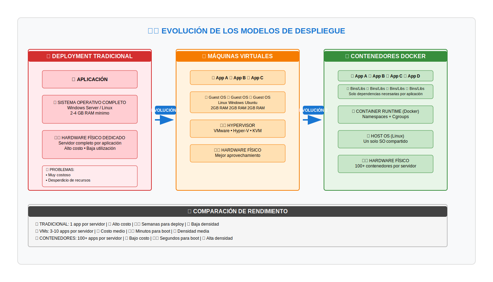

# 🐳 Módulo 2: Contenerización con Docker – La Evolución de la Virtualización

**Duración**: 3 horas  
**Modalidad**: Teórico – Práctico

## 🎯 Objetivo del módulo

Comprender los fundamentos de la contenerización, Docker como plataforma de contenedores, y cómo esta tecnología representa una evolución natural de la virtualización, preparando las bases conceptuales y técnicas para Kubernetes.

---

## 🧩 1. Evolución de los modelos de despliegue

**Función**: Comprende la evolución desde deployment tradicional hasta contenedores modernos

[](../assets/diagrams/modulo-2-docker/deployment-evolution.drawio)

**🎯 Evolución Completa de Despliegue:**

> 🔗 **[Editar Diagrama en Draw.io](https://app.diagrams.net/#Uhttps://raw.githubusercontent.com/Harol-Reina/kubernetes-aks-course/main/area-1-fundamentos-docker/assets/diagrams/modulo-2-docker/deployment-evolution.drawio)**

**📋 Fases de la Evolución:**

### **🏢 Deployment Tradicional - El modelo inicial**
Anteriormente, la manera de desplegar aplicaciones era en **servidores físicos**:

**Problemas del modelo tradicional:**
- **Muy costoso**: Cada aplicación requería hardware dedicado
- **Escalabilidad limitada**: Más carga = más máquinas físicas
- **Desperdicio de recursos**: Hardware infrautilizado
- **Baja densidad**: Una aplicación por servidor

### **💻 Máquinas Virtuales - Primera evolución**
Las VMs permitieron virtualizar sistemas operativos completos dentro del mismo hardware:

**Mejoras de las VMs:**
- Mejor aprovechamiento del hardware
- Múltiples aplicaciones en un servidor físico
- Escalamiento más económico

**Limitaciones persistentes:**
- Cada VM necesita SO completo (2+ GB RAM, espacio en disco)
- Alto overhead de recursos del sistema operativo
- Arranque lento (minutos)

### **🐳 Contenedores - La evolución actual**
Los contenedores resuelven las limitaciones anteriores:

**Ventajas de los contenedores:**
- **Granularidad**: Asignación precisa de recursos (100MB RAM vs 2GB)
- **Aislamiento**: Procesos completamente separados
- **Eficiencia**: Comparten el kernel del SO host
- **Velocidad**: Arranque en segundos
- **Densidad**: 100+ contenedores por servidor

---

## 🧩 2. ¿Qué es la contenerización?

Un **contenedor** es básicamente un **proceso aislado** que:
- Corre en su propio namespace
- Contiene todas las librerías y binarios necesarios
- Utiliza solo los recursos que necesita
- Está completamente aislado de otros contenedores

### **Concepto fundamental:**
```
Contenedor = Proceso Aislado + Librerías + Binarios + Recursos Controlados
```

### Diferencias fundamentales con la virtualización tradicional:

| Aspecto | Máquina Virtual | Contenedor |
|---------|----------------|------------|
| **SO Guest** | Completo (GB) | Compartido (MB) |
| **Arranque** | Minutos | Segundos |
| **Recursos** | Alto overhead | Mínimo overhead |
| **Aislamiento** | Hardware virtual | Namespaces/cgroups |
| **Portabilidad** | Limitada al hipervisor | Alta entre hosts |
| **Densidad** | Baja (2-10 VMs) | Alta (100+ contenedores) |
| **Asignación RAM** | Mínimo 2GB | Desde 50MB |

---

## 🧩 3. Conceptos Fundamentales de Docker

Antes de profundizar en las tecnologías subyacentes, es esencial entender los **4 conceptos clave** que forman el ecosistema Docker. Estos conceptos son la base para trabajar efectivamente con contenedores.

### **🎯 Los 4 Pilares de Docker**

```
┌─────────────────────────────────────────────────────┐
│           ECOSISTEMA DOCKER                         │
├─────────────────────────────────────────────────────┤
│                                                     │
│  1. 📦 Contenedor  ←→  Instancia en ejecución       │
│  2. 🖼️  Imagen      ←→  Plantilla inmutable         │
│  3. 📝 Dockerfile  ←→  Receta de construcción       │
│  4. 🌐 Docker Hub  ←→  Repositorio de imágenes      │
│                                                     │
└─────────────────────────────────────────────────────┘
```

---

### **📦 3.1. Contenedor: La Instancia en Ejecución**

**Definición**: Un contenedor es una **instancia de una imagen**, es decir, un **proceso aislado** que se ejecuta en el sistema operativo.

#### **⚠️ Concepto Crucial:**

> **Un contenedor NO es una máquina virtual, es un PROCESO**. Cuando el proceso principal finaliza, el contenedor también finaliza.

#### **Visualización del Concepto:**

```
┌─────────────────────────────────────────┐
│     Sistema Operativo Host (Linux)      │
│                                         │
│  ┌──────────┐  ┌──────────┐             │
│  │Proceso 1 │  │Proceso 2 │  ← Procesos │
│  │ nginx    │  │ postgres │    aislados │
│  │ PID 1234 │  │ PID 5678 │             │
│  └──────────┘  └──────────┘             │
│       ▲              ▲                  │
│       │              │                  │
│  Contenedor A   Contenedor B            │
│  (instancia)    (instancia)             │
│                                         │
│  Imagen: nginx  Imagen: postgres        │
│  (plantilla)    (plantilla)             │
└─────────────────────────────────────────┘
```

#### **Ciclo de Vida del Contenedor:**

Un contenedor se ejecuta con un **comando principal** (definido en `CMD` o `ENTRYPOINT`). Este comando determina el ciclo de vida:

**Tipo 1: Tarea que finaliza (Batch Job)**
```bash
# Contenedor ejecuta un comando y termina
docker run ubuntu echo "Hola Docker"

# Flujo:
# 1. Crea contenedor desde imagen ubuntu
# 2. Ejecuta comando: echo "Hola Docker"
# 3. Imprime: "Hola Docker"
# 4. Comando termina → Contenedor se detiene

# Verificar estado
docker ps        # No aparece (ya finalizó)
docker ps -a     # Aparece con STATUS: Exited (0)
```

**Tipo 2: Servicio continuo (Daemon)**
```bash
# Contenedor ejecuta un servicio que no termina
docker run -d --name webserver nginx

# Flujo:
# 1. Crea contenedor desde imagen nginx
# 2. Ejecuta comando: nginx (modo daemon)
# 3. Nginx sigue corriendo indefinidamente
# 4. Contenedor permanece activo

# Verificar estado
docker ps        # Aparece con STATUS: Up 5 seconds
```

#### **Características de los Contenedores:**

- ✅ **Efímeros**: Se crean y destruyen fácilmente
- ✅ **Inmutables**: No modificas el contenedor, creas uno nuevo
- ✅ **Aislados**: No interfieren entre sí
- ✅ **Reproducibles**: Misma imagen = mismo comportamiento
- ✅ **Múltiples instancias**: Puedes ejecutar N contenedores de la misma imagen

#### **Ejemplo Práctico: Múltiples Instancias**

```bash
# Ejecutar 3 servidores web desde la misma imagen
docker run -d --name web1 -p 8081:80 nginx
docker run -d --name web2 -p 8082:80 nginx
docker run -d --name web3 -p 8083:80 nginx

# Resultado: 3 contenedores independientes
# - Cada uno con su propio proceso
# - Cada uno con su propia IP
# - Cada uno con su propio filesystem
# - Todos desde la MISMA imagen nginx
```

---

### **🖼️ 3.2. Imagen: La Plantilla Inmutable**

**Definición**: Una imagen es un **archivo binario de solo lectura** que contiene todos los elementos necesarios para ejecutar un contenedor.

#### **Componentes de una Imagen:**

```
┌─────────────────────────────────────────┐
│         Docker Image (Layers)           │
├─────────────────────────────────────────┤
│  Capa 5: ⚙️ Configuración               │
│   └─ CMD, EXPOSE, ENV, USER             │
├─────────────────────────────────────────┤
│  Capa 4: 📱 Aplicación                  │
│   └─ Tu código o binarios               │
├─────────────────────────────────────────┤
│  Capa 3: 📚 Librerías del lenguaje      │
│   └─ npm install, pip install           │
├─────────────────────────────────────────┤
│  Capa 2: 🔧 Herramientas del sistema    │
│   └─ curl, wget, vim, etc.              │
├─────────────────────────────────────────┤
│  Capa 1: 🐧 Sistema base                │
│   └─ Ubuntu, Alpine, Debian             │
└─────────────────────────────────────────┘
```

#### **Ejemplo Concreto: Imagen de Aplicación Java**

```
Imagen: mi-aplicacion-java:1.0

Contiene:
├─ Base OS (Ubuntu 22.04)               → 78 MB
├─ OpenJDK 17                           → 200 MB
├─ Librerías Java (Spring Boot, etc.)   → 50 MB
├─ Tu aplicación compilada (app.jar)    → 25 MB
└─ Configuración (CMD: java -jar...)    → metadata

Total: ~353 MB (vs 2-4 GB de una VM)
```

#### **Sistema de Capas (Layers):**

Las imágenes usan un **sistema de capas** que permite reutilización y eficiencia:

```bash
# Ejemplo: Construyendo una imagen

FROM ubuntu:22.04        # ← Capa base (compartida)
RUN apt-get update       # ← Nueva capa
RUN apt-get install -y nginx  # ← Nueva capa
COPY index.html /var/www/  # ← Nueva capa
CMD ["nginx"]            # ← Metadata (no es capa)

# Resultado:
# - Capa de ubuntu se reutiliza entre todas las imágenes
# - Solo las capas nuevas ocupan espacio adicional
# - Las capas son INMUTABLES (solo lectura)
```

#### **Características de las Imágenes:**

- ✅ **Inmutables**: Una vez creada, no cambia
- ✅ **Versionadas**: Tags para diferentes versiones
- ✅ **Reutilizables**: Base para múltiples contenedores
- ✅ **Portables**: Funcionan en cualquier host con Docker
- ✅ **Eficientes**: Sistema de capas ahorra espacio

#### **Tags y Versionado:**

```bash
# Diferentes versiones de la misma imagen
nginx:latest       # Última versión estable
nginx:1.24         # Versión específica 1.24
nginx:1.24-alpine  # Versión 1.24 sobre Alpine Linux
nginx:stable       # Canal estable

# Tus propias imágenes
miapp:latest       # Última versión
miapp:v1.0.0       # Release específico
miapp:dev          # Versión de desarrollo
miapp:staging      # Versión para staging
```

---

### **📝 3.3. Dockerfile: El Plano de Construcción**

**Definición**: Un Dockerfile es un **archivo de texto** con instrucciones secuenciales que especifican cómo construir una imagen.

#### **Analogía Útil:**

```
Dockerfile  =  Receta de cocina
   ↓
Imagen      =  Plato preparado y empacado
   ↓
Contenedor  =  Plato servido en la mesa
```

#### **Estructura Básica de un Dockerfile:**

```dockerfile
# 1. Imagen base desde la que partimos
FROM ubuntu:22.04

# 2. Información del mantenedor (opcional)
LABEL maintainer="tu@email.com"

# 3. Instalar dependencias del sistema
RUN apt-get update && apt-get install -y \
    apache2 \
    curl \
    vim \
    && rm -rf /var/lib/apt/lists/*

# 4. Establecer directorio de trabajo
WORKDIR /var/www/html

# 5. Copiar archivos de nuestra aplicación
COPY index.html .
COPY styles.css .

# 6. Definir variables de entorno
ENV APP_ENV=production
ENV APP_PORT=80

# 7. Exponer puertos que usa la aplicación
EXPOSE 80

# 8. Crear usuario no-root (seguridad)
RUN useradd -m appuser
USER appuser

# 9. Comando que se ejecutará al iniciar el contenedor
CMD ["apache2ctl", "-D", "FOREGROUND"]
```

#### **Instrucciones Más Comunes:**

| Instrucción | Descripción | Ejemplo |
|-------------|-------------|---------|
| `FROM` | Imagen base | `FROM node:18` |
| `RUN` | Ejecutar comando durante el build | `RUN npm install` |
| `COPY` | Copiar archivos al contenedor | `COPY app.js /app/` |
| `WORKDIR` | Establecer directorio de trabajo | `WORKDIR /app` |
| `ENV` | Variables de entorno | `ENV NODE_ENV=production` |
| `EXPOSE` | Documentar puertos usados | `EXPOSE 3000` |
| `CMD` | Comando por defecto | `CMD ["node", "app.js"]` |
| `ENTRYPOINT` | Comando principal (no overrideable fácilmente) | `ENTRYPOINT ["python"]` |

#### **Ejemplo Práctico: Aplicación Node.js**

```dockerfile
# Dockerfile para app Node.js

FROM node:18-alpine

WORKDIR /usr/src/app

# Copiar package.json primero (optimización de capas)
COPY package*.json ./

# Instalar dependencias
RUN npm ci --only=production

# Copiar código fuente
COPY . .

# Exponer puerto
EXPOSE 3000

# Usuario no-root
USER node

# Comando de inicio
CMD ["node", "server.js"]
```

#### **Construir la Imagen:**

```bash
# Construir imagen desde Dockerfile
docker build -t mi-app-node:v1.0 .

# Opciones comunes:
# -t : Tag/nombre de la imagen
# -f : Especificar archivo Dockerfile diferente
# --no-cache : No usar cache de builds anteriores
# --build-arg : Pasar argumentos al build

# Ejemplo con más opciones:
docker build \
  -t mi-app-node:v1.0 \
  -f Dockerfile.production \
  --build-arg NODE_ENV=production \
  .
```

---

### **🌐 3.4. Docker Hub y Registries**

**Definición**: Docker Hub es un **repositorio público de imágenes** de contenedores, similar a GitHub pero para imágenes Docker en lugar de código fuente.

#### **Arquitectura de Distribución:**

```
┌──────────────┐     push      ┌──────────────┐
│ Desarrollador│ ────────────► │ Docker Hub   │
│   (local)    │               │  Registry    │
└──────────────┘               └──────────────┘
                                      │
                                      │ pull
                    ┌─────────────────┼─────────────────┐
                    ▼                 ▼                 ▼
              ┌──────────┐      ┌──────────┐      ┌──────────┐
              │ Server 1 │      │ Server 2 │      │ Server 3 │
              │Production│      │Production│      │Production│
              └──────────┘      └──────────┘      └──────────┘
```

#### **Funcionalidades de Docker Hub:**

**1. Buscar Imágenes Oficiales:**
```bash
# Buscar en Docker Hub
docker search nginx

# Resultado:
NAME                DESCRIPTION                     STARS   OFFICIAL
nginx               Official build of Nginx         18000   [OK]
nginx/nginx-ingress NGINX Ingress Controller        500
bitnami/nginx       Bitnami nginx container         200
```

**2. Descargar Imágenes:**
```bash
# Descargar última versión
docker pull nginx

# Descargar versión específica
docker pull nginx:1.24

# Descargar desde tag específico
docker pull nginx:1.24-alpine
```

**3. Subir Tus Propias Imágenes:**
```bash
# 1. Login en Docker Hub
docker login

# 2. Tagear tu imagen con tu username
docker tag mi-app:latest tu-usuario/mi-app:v1.0

# 3. Push al registry
docker push tu-usuario/mi-app:v1.0

# Ahora otros pueden usar:
docker pull tu-usuario/mi-app:v1.0
```

#### **Registries Alternativos:**

Docker Hub no es el único registry disponible. Existen muchas alternativas:

| Registry | URL | Caso de Uso |
|----------|-----|-------------|
| **Docker Hub** | `hub.docker.com` | Público, gratuito, oficial |
| **GitHub Container Registry** | `ghcr.io` | Integración con GitHub repos |
| **GitLab Container Registry** | `registry.gitlab.com` | Integración con GitLab CI/CD |
| **Amazon ECR** | `*.amazonaws.com` | AWS, privado |
| **Google GCR** | `gcr.io` | Google Cloud Platform |
| **Azure ACR** | `*.azurecr.io` | Azure, privado |
| **Harbor** | `self-hosted` | On-premise, enterprise |

#### **Ejemplo con Diferentes Registries:**

```bash
# Docker Hub (por defecto)
docker pull nginx:latest

# GitHub Container Registry
docker pull ghcr.io/usuario/proyecto:latest

# Google Container Registry
docker pull gcr.io/proyecto-id/imagen:tag

# Azure Container Registry
docker pull miregistry.azurecr.io/miapp:v1.0

# Registry privado custom
docker pull registry.miempresa.com/backend:latest
```

#### **Imágenes Oficiales vs Community:**

**Imágenes Oficiales** (⭐ Verified):
- ✅ Mantenidas por Docker, Inc o el proyecto oficial
- ✅ Regularmente actualizadas
- ✅ Escaneadas por vulnerabilidades
- ✅ Documentación completa
- Ejemplos: `nginx`, `postgres`, `redis`, `node`, `python`

**Imágenes de la Comunidad**:
- ⚠️ Creadas por usuarios individuales u organizaciones
- ⚠️ Calidad variable
- ⚠️ Verificar stars, downloads y última actualización
- Ejemplos: `bitnami/nginx`, `linuxserver/plex`

---

### **🔄 3.5. Workflow Completo de Docker**

Ahora que conoces los 4 conceptos fundamentales, veamos cómo se relacionan en el flujo de trabajo completo:

```
┌─────────────────────────────────────────────────────────────────┐
│              WORKFLOW COMPLETO DE DOCKER                        │
└─────────────────────────────────────────────────────────────────┘

1️⃣ DESARROLLO LOCAL
   ├─ Escribes tu código (app.py, package.json, etc.)
   ├─ Creas Dockerfile con instrucciones de build
   └─ Defines dependencias y configuración

2️⃣ BUILD (Construcción de Imagen)
   ├─ docker build -t miapp:v1.0 .
   ├─ Docker lee el Dockerfile
   ├─ Ejecuta cada instrucción creando capas
   └─ Genera imagen binaria inmutable

3️⃣ TEST LOCAL (Opcional pero recomendado)
   ├─ docker run -d -p 8080:80 miapp:v1.0
   ├─ Pruebas funcionales
   └─ Verificación de comportamiento

4️⃣ TAG Y PUSH (Distribución)
   ├─ docker tag miapp:v1.0 usuario/miapp:v1.0
   ├─ docker login
   └─ docker push usuario/miapp:v1.0

5️⃣ PULL EN OTROS ENTORNOS
   ├─ Servidores de staging/producción
   ├─ docker pull usuario/miapp:v1.0
   └─ Otros desarrolladores del equipo

6️⃣ RUN (Ejecución en Producción)
   ├─ docker run -d -p 80:80 usuario/miapp:v1.0
   ├─ Se crea contenedor desde la imagen
   └─ Aplicación corriendo en producción

7️⃣ GESTIÓN Y MONITOREO
   ├─ docker ps (contenedores activos)
   ├─ docker logs <id> (ver logs)
   ├─ docker stats (uso de recursos)
   └─ docker stop/start/restart
```

#### **Diagrama Visual del Workflow:**

```
Desarrollador Local
├─ Código fuente (app.js, index.html...)
├─ Dockerfile
│
▼ docker build
│
Imagen Local (miapp:v1.0)
│
▼ docker tag + docker push
│
┌────────────────────┐
│   Docker Hub       │
│  usuario/miapp:v1.0│
└────────────────────┘
         │
         │ docker pull
         │
    ┌────┴────┬────────┬────────┐
    ▼         ▼        ▼        ▼
Server 1  Server 2  Server 3  Dev Team
    │         │        │        │
    ▼         ▼        ▼        ▼
Container Container Container Container
(instancia) (instancia) (instancia) (instancia)
```

---

### **💡 3.6. Resumen de Conceptos Clave**

#### **Tabla de Relaciones:**

| Concepto | Analogía | Es... | No es... |
|----------|----------|-------|----------|
| **Contenedor** | Proceso en ejecución | Una instancia activa | Una máquina virtual |
| **Imagen** | Plantilla/Molde | Archivo binario inmutable | Código fuente |
| **Dockerfile** | Receta de cocina | Instrucciones de construcción | La imagen final |
| **Docker Hub** | GitHub para imágenes | Repositorio de distribución | Gestor de código fuente |

#### **Relación POO (Programación Orientada a Objetos):**

Si vienes del mundo de la programación, esta analogía te ayudará:

```
Clase (en código)     =  Imagen Docker
    ↓                        ↓
Objeto/Instancia      =  Contenedor
    ↓                        ↓
Múltiples objetos     =  Múltiples contenedores
de la misma clase        de la misma imagen
```

#### **Ejemplo Práctico Integrado:**

```bash
# 1. Crear Dockerfile
cat > Dockerfile << 'EOF'
FROM python:3.11-slim
WORKDIR /app
COPY requirements.txt .
RUN pip install -r requirements.txt
COPY app.py .
CMD ["python", "app.py"]
EOF

# 2. Construir imagen
docker build -t mi-python-app:v1.0 .

# 3. Probar localmente
docker run -d --name test-app mi-python-app:v1.0

# 4. Verificar funcionamiento
docker logs test-app
docker ps

# 5. Publicar en Docker Hub
docker tag mi-python-app:v1.0 usuario/mi-python-app:v1.0
docker login
docker push usuario/mi-python-app:v1.0

# 6. Otros desarrolladores pueden usar:
docker pull usuario/mi-python-app:v1.0
docker run -d usuario/mi-python-app:v1.0

# 7. Escalar (múltiples instancias)
docker run -d --name app1 -p 8001:8000 usuario/mi-python-app:v1.0
docker run -d --name app2 -p 8002:8000 usuario/mi-python-app:v1.0
docker run -d --name app3 -p 8003:8000 usuario/mi-python-app:v1.0
```

---

### **🎯 Checkpoint de Conceptos Fundamentales**

Antes de continuar a las tecnologías subyacentes, asegúrate de poder:

- [ ] Explicar la diferencia entre imagen y contenedor
- [ ] Describir qué es un Dockerfile y para qué sirve
- [ ] Entender que un contenedor es un proceso que puede terminar
- [ ] Conocer la diferencia entre CMD y ENTRYPOINT
- [ ] Saber cómo publicar una imagen en Docker Hub
- [ ] Ejecutar múltiples contenedores de la misma imagen
- [ ] Explicar el workflow completo: Dockerfile → Image → Container

**👉 Con estos conceptos claros, ahora estás listo para entender las tecnologías Linux subyacentes que hacen posible el aislamiento de contenedores.**

---

## ⚙️ 4. Tecnologías fundamentales: Namespaces y Cgroups

Ahora que entiendes qué son los contenedores, imágenes y Dockerfiles, es momento de profundizar en **cómo funciona el aislamiento** a nivel técnico. Docker utiliza dos tecnologías fundamentales de Linux:

### **Linux Namespaces** - El corazón del aislamiento

Cuando creamos un contenedor, este hereda **todos estos namespaces** que lo mantienen completamente aislado:

#### **1. IPC (Inter-Process Communication) Namespace**
```
┌─────────────────┐    ┌─────────────────┐
│   Contenedor A  │    │   Contenedor B  │
│                 │    │                 │
│  Proceso A  ──► │    │ ◄──  Proceso C  │
│              ▲  │    │   ▲             │
│              │  │    │   │             │
│  Proceso B ──┘  │    │   └── Proceso D │
│                 │    │                 │
└─────────────────┘    └─────────────────┘
     ✅ Se comunican       ❌ NO se comunican
```

- **Dentro del contenedor**: Los procesos A y B pueden comunicarse
- **Entre contenedores**: Proceso A NO puede comunicarse con Proceso C
- **Método de comunicación**: Memoria compartida, semáforos, colas de mensajes

#### **2. PID (Process ID) Namespace**
```
Host OS:
├── PID 1001: Contenedor A
│   ├── PID 1: Proceso Principal
│   └── PID 2: Proceso Secundario
└── PID 1002: Contenedor B
    ├── PID 1: Proceso Principal  
    └── PID 2: Proceso Secundario
```

- Cada contenedor ve solo sus propios procesos
- Los PIDs son independientes entre contenedores
- Un contenedor NO puede ver los procesos de otro

#### **3. Network Namespace**
```
┌─────────────────────┐  ┌─────────────────────┐
│   Contenedor A      │  │   Contenedor B      │
│                     │  │                     │
│   IP: 172.17.0.2    │  │   IP: 172.17.0.3    │
│   Red: eth0         │  │   Red: eth0         │
│                     │  │                     │
└─────────────────────┘  └─────────────────────┘
```

- Cada contenedor tiene su propia IP única
- Redes completamente independientes
- Un contenedor NO puede ver los servicios de red de otro

#### **4. Mount (MNT) Namespace**
```
┌─────────────────────┐  ┌─────────────────────┐
│   Contenedor A      │  │   Contenedor B      │
│                     │  │                     │
│   /app/folder-A     │  │   /app/folder-B     │
│   /data/config-A    │  │   /data/config-B    │
│                     │  │                     │
└─────────────────────┘  └─────────────────────┘
```

- Sistemas de archivos independientes
- Montajes específicos por contenedor
- folder-A NO está disponible en Contenedor B

#### **5. USER Namespace**
```
Contenedor A:        Contenedor B:
├── user: admin      ├── user: developer
├── user: app        ├── user: nginx
└── user: guest      └── user: postgres
```

- Usuarios completamente independientes
- No hay conflictos de nombres de usuario
- Mapeo de UIDs independiente

#### **6. UTS (Unix Timesharing System) Namespace**
```
Contenedor A: hostname = web-server-01
Contenedor B: hostname = database-primary
```

- Cada contenedor tiene su hostname único
- Identificación independiente del sistema

### **Control Groups (cgroups)** - Control de recursos

Los **cgroups** permiten controlar y limitar los recursos que cada contenedor puede usar:

#### **Ejemplos prácticos de asignación:**
```bash
# Asignar recursos específicos a contenedores
docker run -d --name contenedor-web \
  --memory="200m" \           # Solo 200MB de RAM
  --cpus="0.5" \             # Medio CPU
  --pids-limit=100 \         # Máximo 100 procesos
  nginx

docker run -d --name contenedor-db \
  --memory="1g" \            # 1GB de RAM
  --cpus="1.0" \             # Un CPU completo
  --blkio-weight=300 \       # Prioridad de I/O
  postgres
```

#### **Ventajas del control granular:**
- **Granularidad perfecta**: Desde 50MB hasta lo que necesites
- **Prevención de monopolio**: Un contenedor no puede consumir todos los recursos
- **Optimización**: Mejor aprovechamiento del hardware disponible
- **Predictibilidad**: Comportamiento consistente bajo carga

---

## 🐳 5. ¿Qué es Docker?

**Docker** es una plataforma de contenerización que simplifica la creación, distribución y ejecución de aplicaciones en contenedores. Docker implementa todos los namespaces y cgroups de manera transparente para el usuario.

### **5.1. Arquitectura de Docker**

Docker se compone de varios componentes que trabajan juntos:

```
┌─────────────────────────────────────────────────────┐
│            ARQUITECTURA DOCKER                      │
├─────────────────────────────────────────────────────┤
│                                                     │
│  Docker CLI (docker command)                        │
│       │                                             │
│       ▼                                             │
│  Docker Daemon (dockerd)                            │
│       │                                             │
│       ├──► containerd (Container Runtime)           │
│       │        │                                    │
│       │        └──► runc (OCI Runtime)              │
│       │                                             │
│       ├──► Image Management                         │
│       ├──► Network Management                       │
│       └──► Volume Management                        │
│                                                     │
└─────────────────────────────────────────────────────┘
```

### **5.2. Componentes principales de Docker:**

- **Docker Engine**: Runtime que gestiona contenedores y orquesta los namespaces
- **Docker Images**: Plantillas inmutables para crear contenedores
- **Docker Containers**: Instancias ejecutables con todos los namespaces aislados
- **Docker Registry**: Repositorio para almacenar y distribuir imágenes (Docker Hub)
- **Dockerfile**: Archivo de texto con instrucciones para construir imágenes
- **Docker Compose**: Herramienta para aplicaciones multi-contenedor

### **5.3. Ciclo de vida Docker:**

```
Código → Dockerfile → Image → Container → Running App
   ↓         ↓         ↓        ↓           ↓
(write)   (build)   (pull)   (run)     (execute)
```

### **5.4. CMD vs ENTRYPOINT: Entendiendo el Comando Principal**

Una de las confusiones más comunes en Docker es la diferencia entre `CMD` y `ENTRYPOINT`. Ambas definen qué ejecutará el contenedor, pero funcionan de manera diferente:

#### **CMD: Comando por Defecto (Fácilmente Overrideable)**

```dockerfile
FROM ubuntu:22.04
CMD ["echo", "Hola Docker"]
```

```bash
# Si ejecutas sin argumentos, usa CMD
docker run mi-imagen
# Output: Hola Docker

# Si pasas argumentos, REEMPLAZA completamente CMD
docker run mi-imagen echo "Otro mensaje"
# Output: Otro mensaje

# CMD fue ignorado completamente
```

#### **ENTRYPOINT: Comando Principal (Punto de Entrada Fijo)**

```dockerfile
FROM ubuntu:22.04
ENTRYPOINT ["echo"]
CMD ["Hola Docker"]
```

```bash
# ENTRYPOINT siempre se ejecuta
docker run mi-imagen
# Output: Hola Docker (ENTRYPOINT + CMD)

# Los argumentos se AGREGAN al ENTRYPOINT
docker run mi-imagen "Otro mensaje"
# Output: Otro mensaje (ENTRYPOINT + nuevo argumento, CMD ignorado)
```

#### **Tabla Comparativa:**

| Aspecto | CMD | ENTRYPOINT |
|---------|-----|------------|
| **Propósito** | Comando por defecto | Punto de entrada fijo |
| **Override** | Completamente reemplazable | Solo reemplazable con `--entrypoint` |
| **Uso típico** | Argumentos por defecto | Comando principal |
| **Combinación** | Se puede combinar con ENTRYPOINT | Puede tener CMD como argumentos |

#### **Ejemplos Prácticos:**

**Caso 1: Script de utilidad (usar ENTRYPOINT)**
```dockerfile
FROM python:3.11
COPY script.py /
ENTRYPOINT ["python", "/script.py"]
CMD ["--help"]

# Uso:
# docker run mi-script             → python /script.py --help
# docker run mi-script --verbose   → python /script.py --verbose
```

**Caso 2: Web server (usar CMD)**
```dockerfile
FROM nginx:latest
CMD ["nginx", "-g", "daemon off;"]

# Uso:
# docker run web-server            → nginx -g daemon off;
# docker run web-server bash       → bash (para debugging)
```

**Caso 3: Combinación ENTRYPOINT + CMD**
```dockerfile
FROM alpine:latest
ENTRYPOINT ["ping"]
CMD ["google.com"]

# Uso:
# docker run ping-tool             → ping google.com
# docker run ping-tool 8.8.8.8     → ping 8.8.8.8
# docker run ping-tool -c 3 example.com → ping -c 3 example.com
```

### **5.5. Docker en acción - Aislamiento completo:**

Cuando ejecutas `docker run`, Docker automáticamente:

1. **Crea todos los namespaces** (PID, NET, MNT, UTS, IPC, USER)
2. **Configura cgroups** para limitar recursos
3. **Aísla el proceso** completamente del host y otros contenedores
4. **Asigna recursos** según las especificaciones
5. **Ejecuta el comando** definido en CMD o ENTRYPOINT

```bash
# Ejemplo: Cada contenedor está completamente aislado
docker run -d --name web1 --memory="100m" nginx    # Contenedor 1
docker run -d --name web2 --memory="150m" nginx    # Contenedor 2
docker run -d --name web3 --memory="200m" nginx    # Contenedor 3

# Resultado:
# - 3 procesos totalmente aislados
# - 3 redes independientes con IPs diferentes
# - 3 sistemas de archivos independientes
# - Recursos controlados por cgroups
```

### **5.6. Aislamiento en la práctica:**

```
┌─────────────────┐    ┌─────────────────┐    ┌─────────────────┐
│  Container A    │    │  Container B    │    │  Container C    │
│                 │    │                 │    │                 │
│ Hostname: web-a │    │ Hostname: db-b  │    │ Hostname: api-c │
│ IP: 172.17.0.2  │    │ IP: 172.17.0.3  │    │ IP: 172.17.0.4  │
│ RAM: 100MB      │    │ RAM: 512MB      │    │ RAM: 256MB      │
│ CPU: 0.5        │    │ CPU: 1.0        │    │ CPU: 0.8        │
│                 │    │                 │    │                 │
│ Procesos:       │    │ Procesos:       │    │ Procesos:       │
│ ├─ PID 1: nginx │    │ ├─ PID 1: mysql │    │ ├─ PID 1: node  │
│ └─ PID 2: logs  │    │ └─ PID 2: mysql │    │ └─ PID 2: npm   │
└─────────────────┘    └─────────────────┘    └─────────────────┘
        ▲                        ▲                         ▲
        │                        │                         │
        └────────── AISLAMIENTO COMPLETO ──────────────────┘
     (No pueden verse entre ellos)
```

---

## 🔧 6. Docker vs otras tecnologías de contenedores

| Tecnología | Descripción | Uso principal |
|------------|-------------|---------------|
| **Docker** | Plataforma completa de contenedores | Desarrollo, testing, producción |
| **Podman** | Alternativa a Docker sin daemon | Seguridad, rootless containers |
| **LXC/LXD** | Contenedores de sistema completo | Virtualización ligera de sistemas |
| **rkt** | Runtime de contenedores de CoreOS | Alta seguridad (discontinuado) |

---

## 🧪 7. Laboratorio práctico: Instalación y primeros pasos con Docker

**Objetivo**: Instalar Docker en la VM de Azure y ejecutar los primeros contenedores.

### 🔧 Pasos:

1. **Conectarse a la VM creada en el Módulo 1**
```bash
   ssh azureuser@<IP_PUBLICA>
```

2. **Instalar Docker**
```bash
   # Actualizar el sistema
   sudo apt update
   
   # Instalar paquetes necesarios
   sudo apt install -y apt-transport-https ca-certificates curl gnupg lsb-release
   
   # Agregar clave GPG oficial de Docker
   curl -fsSL https://download.docker.com/linux/ubuntu/gpg | sudo gpg --dearmor -o /usr/share/keyrings/docker-archive-keyring.gpg
   
   # Agregar repositorio Docker
   echo "deb [arch=amd64 signed-by=/usr/share/keyrings/docker-archive-keyring.gpg] https://download.docker.com/linux/ubuntu $(lsb_release -cs) stable" | sudo tee /etc/apt/sources.list.d/docker.list > /dev/null
   
   # Instalar Docker Engine
   sudo apt update
   sudo apt install -y docker-ce docker-ce-cli containerd.io docker-compose-plugin
   
   # Agregar usuario al grupo docker
   sudo usermod -aG docker $USER
   
   # Verificar instalación
   docker --version
```

3. **Primeros comandos Docker**
```bash
   # Reiniciar sesión SSH para aplicar cambios de grupo
   exit
   ssh azureuser@<IP_PUBLICA>
   
   # Hello World de Docker
   docker run hello-world
   
   # Ver qué pasó
   docker ps -a
   docker images
   
   # Ejecutar contenedor interactivo
   docker run -it ubuntu:22.04 bash
   # Dentro del contenedor:
   ls /
   cat /etc/os-release
   exit
   
   # Ejecutar servidor web nginx
   docker run -d -p 80:80 --name mi-nginx nginx
   
   # Verificar que funciona
   curl http://localhost
   
   # Ver contenedores en ejecución
   docker ps
   
   # Ver logs del contenedor
   docker logs mi-nginx
   
   # Ejecutar comando dentro del contenedor
   docker exec -it mi-nginx bash
   ls /usr/share/nginx/html/
   exit
   
   # Detener y eliminar contenedor
   docker stop mi-nginx
   docker rm mi-nginx
```

4. **Ejercicio 1: Trabajar con imágenes**
```bash
   # Buscar imágenes en Docker Hub
   docker search redis
   docker search postgres
   
   # Descargar diferentes versiones
   docker pull redis:7.2
   docker pull redis:alpine
   docker pull postgres:15
   
   # Listar imágenes descargadas
   docker images
   
   # Ver información detallada de una imagen
   docker inspect redis:7.2
   
   # Ver las capas de una imagen
   docker history redis:7.2
   
   # Comparar tamaños
   docker images | grep redis
   # Nota: Observa la diferencia de tamaño entre redis:7.2 y redis:alpine
```

5. **Ejercicio 2: Contenedores con variables de entorno**
```bash
   # Ejecutar PostgreSQL con configuración
   docker run -d \
     --name postgres-db \
     -e POSTGRES_USER=admin \
     -e POSTGRES_PASSWORD=secret123 \
     -e POSTGRES_DB=mibasededatos \
     -p 5432:5432 \
     postgres:15
   
   # Verificar que está corriendo
   docker ps
   
   # Ver logs (deberías ver "database system is ready to accept connections")
   docker logs postgres-db
   
   # Conectarse al contenedor e interactuar con PostgreSQL
   docker exec -it postgres-db psql -U admin -d mibasededatos
   
   # Dentro de psql:
   # \l                    (listar bases de datos)
   # CREATE TABLE usuarios (id SERIAL PRIMARY KEY, nombre VARCHAR(100));
   # INSERT INTO usuarios (nombre) VALUES ('Juan'), ('María');
   # SELECT * FROM usuarios;
   # \q                    (salir)
   
   # Ver estadísticas de uso de recursos
   docker stats postgres-db --no-stream
```

6. **Ejercicio 3: Volúmenes y persistencia de datos**
```bash
   # Crear un volumen nombrado
   docker volume create datos-postgres
   
   # Listar volúmenes
   docker volume ls
   
   # Inspeccionar el volumen
   docker volume inspect datos-postgres
   
   # Detener y eliminar el contenedor anterior
   docker stop postgres-db
   docker rm postgres-db
   
   # Crear nuevo contenedor con volumen persistente
   docker run -d \
     --name postgres-persistente \
     -e POSTGRES_USER=admin \
     -e POSTGRES_PASSWORD=secret123 \
     -e POSTGRES_DB=mibasededatos \
     -v datos-postgres:/var/lib/postgresql/data \
     -p 5432:5432 \
     postgres:15
   
   # Esperar a que inicie
   docker logs -f postgres-persistente
   # (Ctrl+C cuando veas "database system is ready")
   
   # Crear datos de prueba
   docker exec -it postgres-persistente psql -U admin -d mibasededatos -c \
     "CREATE TABLE productos (id SERIAL, nombre VARCHAR(100)); \
      INSERT INTO productos (nombre) VALUES ('Laptop'), ('Mouse'), ('Teclado');"
   
   # Verificar datos
   docker exec -it postgres-persistente psql -U admin -d mibasededatos -c \
     "SELECT * FROM productos;"
   
   # ELIMINAR el contenedor
   docker stop postgres-persistente
   docker rm postgres-persistente
   
   # Crear NUEVO contenedor con el MISMO volumen
   docker run -d \
     --name postgres-restaurado \
     -e POSTGRES_USER=admin \
     -e POSTGRES_PASSWORD=secret123 \
     -v datos-postgres:/var/lib/postgresql/data \
     -p 5432:5432 \
     postgres:15
   
   # Esperar a que inicie
   sleep 5
   
   # Verificar que los datos siguen ahí!
   docker exec -it postgres-restaurado psql -U admin -d mibasededatos -c \
     "SELECT * FROM productos;"
   
   # ✅ Los datos persisten aunque se eliminó el contenedor!
```

7. **Ejercicio 4: Redes Docker y comunicación entre contenedores**
```bash
   # Crear una red personalizada
   docker network create mi-red-app
   
   # Listar redes
   docker network ls
   
   # Inspeccionar la red
   docker network inspect mi-red-app
   
   # Limpiar contenedores anteriores
   docker stop postgres-restaurado 2>/dev/null || true
   docker rm postgres-restaurado 2>/dev/null || true
   
   # Crear base de datos en la red personalizada
   docker run -d \
     --name db \
     --network mi-red-app \
     -e POSTGRES_USER=admin \
     -e POSTGRES_PASSWORD=secret123 \
     -e POSTGRES_DB=aplicacion \
     postgres:15
   
   # Esperar a que PostgreSQL esté listo
   echo "Esperando a que PostgreSQL inicie..."
   sleep 10
   
   # Crear aplicación web que se conecta a la BD
   # Usaremos adminer (herramienta de gestión de BD)
   docker run -d \
     --name web \
     --network mi-red-app \
     -p 8080:8080 \
     adminer
   
   # Verificar que ambos contenedores están en la misma red
   docker network inspect mi-red-app
   
   # Probar conectividad entre contenedores
   docker exec -it web ping -c 3 db
   
   # Acceder a la aplicación web
   echo "Accede a http://localhost:8080 en tu navegador"
   echo "Sistema: PostgreSQL"
   echo "Servidor: db"
   echo "Usuario: admin"
   echo "Contraseña: secret123"
   echo "Base de datos: aplicacion"
   
   # Ver logs de ambos contenedores
   docker logs web
   docker logs db
```

8. **Ejercicio 5: Limitar recursos de contenedores**
```bash
   # Crear contenedor con límites de recursos
   docker run -d \
     --name nginx-limitado \
     --memory="100m" \
     --memory-swap="100m" \
     --cpus="0.5" \
     -p 8081:80 \
     nginx:alpine
   
   # Verificar límites aplicados
   docker inspect nginx-limitado | grep -A 10 "Memory"
   docker inspect nginx-limitado | grep "NanoCpus"
   
   # Monitorear uso de recursos en tiempo real
   docker stats nginx-limitado --no-stream
   
   # Generar carga (instalar herramientas primero)
   sudo apt install -y apache2-utils
   
   # Test de carga (100 requests, 10 concurrentes)
   ab -n 100 -c 10 http://localhost:8081/
   
   # Ver estadísticas durante la carga (en otra terminal)
   docker stats nginx-limitado
   
   # Actualizar límites sin reiniciar
   docker update --memory="200m" --cpus="1.0" nginx-limitado
   
   # Verificar nuevos límites
   docker inspect nginx-limitado | grep -A 10 "Memory"
```

9. **Ejercicio 6: Construir tu primera imagen personalizada**
```bash
  # Crear directorio para el proyecto
  mkdir ~/mi-primera-imagen
  cd ~/mi-primera-imagen
  
  # Crear un archivo HTML simple
  cat > index.html << 'EOF'
  <!DOCTYPE html>
  <html>
  <head>
      <title>Mi Primera Imagen Docker</title>
      <style>
          body { 
              font-family: Arial; 
              background: linear-gradient(135deg, #667eea 0%, #764ba2 100%);
              color: white;
              display: flex;
              justify-content: center;
              align-items: center;
              height: 100vh;
              margin: 0;
          }
          .container {
              text-align: center;
              background: rgba(255,255,255,0.1);
              padding: 50px;
              border-radius: 20px;
          }
      </style>
  </head>
  <body>
      <div class="container">
          <h1>� ¡Hola desde Docker!</h1>
          <p>Esta es mi primera imagen personalizada</p>
          <p>Hostname: <span id="hostname"></span></p>
      </div>
      <script>
          fetch('/hostname').then(r => r.text()).then(h => {
              document.getElementById('hostname').textContent = h;
          }).catch(() => {
              document.getElementById('hostname').textContent = 'No disponible';
          });
      </script>
  </body>
  </html>
  EOF
   
  # Crear un servidor simple en Python
  cat > server.py << 'EOF'
  #!/usr/bin/env python3
  from http.server import HTTPServer, SimpleHTTPRequestHandler
  import socket
  import os

  class MyHandler(SimpleHTTPRequestHandler):
      def do_GET(self):
          if self.path == '/hostname':
              self.send_response(200)
              self.send_header('Content-type', 'text/plain')
              self.end_headers()
              hostname = socket.gethostname()
              self.wfile.write(hostname.encode())
          else:
              super().do_GET()

  if __name__ == '__main__':
      port = int(os.getenv('PORT', 8000))
      server = HTTPServer(('', port), MyHandler)
      print(f'Servidor corriendo en puerto {port}...')
      server.serve_forever()
  EOF
   
  chmod +x server.py
   
  # Crear Dockerfile
   cat > Dockerfile << 'EOF'
  # Imagen base oficial de Python
  FROM python:3.11-slim

  # Metadata
  LABEL maintainer="tu-email@ejemplo.com"
  LABEL description="Mi primera imagen Docker personalizada"

  # Establecer directorio de trabajo
  WORKDIR /app

  # Copiar archivos al contenedor
  COPY index.html .
  COPY server.py .

  # Hacer ejecutable el script
  RUN chmod +x server.py

  # Exponer puerto
  EXPOSE 8000

  # Variable de entorno por defecto
  ENV PORT=8000

  # Comando que se ejecuta al iniciar el contenedor
  CMD ["python3", "server.py"]
  EOF
   
  # Construir la imagen
  docker build -t mi-web-app:v1.0 .
  
  # Ver la imagen creada
  docker images | grep mi-web-app
  
  # Ver las capas de la imagen
  docker history mi-web-app:v1.0
  
  # Ejecutar contenedor desde tu imagen
  docker run -d \
    --name mi-app-1 \
    -p 8082:8000 \
    mi-web-app:v1.0
  
  # Probar la aplicación
  curl http://localhost:8082
  curl http://localhost:8082/hostname
  
  # Escalar: Ejecutar múltiples instancias
  docker run -d --name mi-app-2 -p 8083:8000 mi-web-app:v1.0
  docker run -d --name mi-app-3 -p 8084:8000 mi-web-app:v1.0
  
  # Ver todas las instancias
  docker ps | grep mi-app
  
  # Probar que cada una responde con su propio hostname
  curl http://localhost:8082/hostname
  curl http://localhost:8083/hostname
  curl http://localhost:8084/hostname
  
  # Acceder desde el navegador
  echo "Abre en tu navegador:"
  echo "http://<IP_PUBLICA>:8082"
  echo "http://<IP_PUBLICA>:8083"
  echo "http://<IP_PUBLICA>:8084"
 ```

10. **Ejercicio 7: Docker Compose - Aplicación multi-contenedor**
```bash
  # Crear directorio para el proyecto
  mkdir ~/docker-compose-demo
  cd ~/docker-compose-demo
  
  # Crear docker-compose.yml
  cat > docker-compose.yml << 'EOF'
  version: '3.8'

  services:
    # Base de datos PostgreSQL
    database:
      image: postgres:15
      container_name: app-database
      environment:
        POSTGRES_USER: admin
        POSTGRES_PASSWORD: secret123
        POSTGRES_DB: aplicacion
      volumes:
        - db-data:/var/lib/postgresql/data
      networks:
        - app-network
      healthcheck:
        test: ["CMD-SHELL", "pg_isready -U admin"]
        interval: 10s
        timeout: 5s
        retries: 5

    # Cache Redis
    cache:
      image: redis:7.2-alpine
      container_name: app-cache
      networks:
        - app-network
      healthcheck:
        test: ["CMD", "redis-cli", "ping"]
        interval: 10s
        timeout: 3s
        retries: 5

    # Interfaz web de administración
    adminer:
      image: adminer
      container_name: app-adminer
      ports:
        - "8080:8080"
      networks:
        - app-network
      depends_on:
        database:
          condition: service_healthy

    # Aplicación web (nginx)
    web:
      image: nginx:alpine
      container_name: app-web
      ports:
        - "8090:80"
      networks:
        - app-network
      volumes:
        - ./html:/usr/share/nginx/html:ro
      depends_on:
        - database
        - cache

  volumes:
    db-data:

  networks:
    app-network:
      driver: bridge
  EOF

      # Crear directorio para HTML
      mkdir html

      # Crear página de inicio
      cat > html/index.html << 'EOF'
  <!DOCTYPE html>
  <html>
  <head>
      <title>Aplicación Multi-Contenedor</title>
      <style>
          body {
              font-family: Arial, sans-serif;
              max-width: 800px;
              margin: 50px auto;
              padding: 20px;
              background: #f5f5f5;
          }
          .container {
              background: white;
              padding: 30px;
              border-radius: 10px;
              box-shadow: 0 2px 10px rgba(0,0,0,0.1);
          }
          h1 { color: #333; }
          .service {
              background: #e3f2fd;
              padding: 15px;
              margin: 10px 0;
              border-radius: 5px;
              border-left: 4px solid #2196F3;
          }
          .status { color: #4CAF50; font-weight: bold; }
      </style>
  </head>
  <body>
      <div class="container">
          <h1>🐳 Aplicación Multi-Contenedor con Docker Compose</h1>

          <div class="service">
              <h3>📊 Base de Datos PostgreSQL</h3>
              <p><span class="status">✅ Activa</span></p>
              <p>Puerto: 5432 (interno)</p>
          </div>

          <div class="service">
              <h3>⚡ Cache Redis</h3>
              <p><span class="status">✅ Activa</span></p>
              <p>Puerto: 6379 (interno)</p>
          </div>

          <div class="service">
              <h3>🔧 Adminer (Gestión BD)</h3>
              <p><span class="status">✅ Activa</span></p>
              <p><a href="http://localhost:8080" target="_blank">Acceder a Adminer</a></p>
          </div>

          <div class="service">
              <h3>🌐 Servidor Web (Nginx)</h3>
              <p><span class="status">✅ Activa</span></p>
              <p>Puerto: 8090</p>
          </div>

          <h2>📋 Información de Conexión</h2>
          <pre>
  Sistema: PostgreSQL
  Servidor: database
  Usuario: admin
  Contraseña: secret123
  Base de datos: aplicacion
          </pre>
      </div>
  </body>
  </html>
  EOF

  # Levantar todos los servicios
  docker-compose up -d
  
  # Ver el estado de los servicios
  docker-compose ps
  
  # Ver logs de todos los servicios
  docker-compose logs
  
  # Seguir logs en tiempo real
  docker-compose logs -f
  # (Ctrl+C para salir)
  
  # Ver logs de un servicio específico
  docker-compose logs database
  
  # Ejecutar comandos en un servicio
  docker-compose exec database psql -U admin -d aplicacion
  # \l (listar bases de datos)
  # \q (salir)
  
  # Escalar un servicio (crear múltiples instancias)
  docker-compose up -d --scale cache=3
  
  # Ver todos los contenedores
  docker-compose ps
  
  # Detener todos los servicios
  docker-compose stop
  
  # Iniciar servicios detenidos
  docker-compose start
  
  # Reiniciar un servicio específico
  docker-compose restart web
  
  # Ver uso de recursos
  docker-compose top
  
  # Eliminar todo (contenedores, redes, pero no volúmenes)
  docker-compose down
  
  # Eliminar TODO incluyendo volúmenes
  docker-compose down -v
  
  # Reconstruir y levantar
  docker-compose up -d --build
```

11. **Limpieza final del laboratorio**
```bash
    # Detener todos los contenedores
    docker stop $(docker ps -q) 2>/dev/null || echo "No hay contenedores activos"
    
    # Eliminar todos los contenedores
    docker rm $(docker ps -a -q) 2>/dev/null || echo "No hay contenedores para eliminar"
    
    # Eliminar imágenes no utilizadas
    docker image prune -a -f
    
    # Eliminar volúmenes no utilizados
    docker volume prune -f
    
    # Eliminar redes no utilizadas
    docker network prune -f
    
    # Ver espacio liberado
    docker system df
    
    # Limpieza completa (cuidado en producción!)
    # docker system prune -a --volumes -f
```

### 🎯 Objetivos del Laboratorio Cumplidos

Al completar este laboratorio, has aprendido a:

- ✅ Instalar Docker en Ubuntu/Azure VM
- ✅ Ejecutar contenedores básicos (hello-world, ubuntu, nginx)
- ✅ Trabajar con imágenes (search, pull, history, inspect)
- ✅ Usar variables de entorno para configurar contenedores
- ✅ Crear y usar volúmenes para persistencia de datos
- ✅ Configurar redes personalizadas para comunicación entre contenedores
- ✅ Limitar recursos (CPU, memoria) de contenedores
- ✅ Construir imágenes personalizadas con Dockerfile
- ✅ Escalar aplicaciones (múltiples instancias)
- ✅ Usar Docker Compose para aplicaciones multi-contenedor
- ✅ Monitorear logs y estadísticas de recursos
- ✅ Realizar limpieza y mantenimiento de Docker

### 📝 Notas Importantes

**Seguridad en Producción:**
- No uses contraseñas hardcodeadas (usa secrets o variables de entorno)
- No expongas puertos de bases de datos directamente a internet
- Usa redes personalizadas, nunca la red bridge por defecto
- Implementa health checks en todos los servicios críticos
- Escanea imágenes en busca de vulnerabilidades

**Best Practices:**
- Usa imágenes oficiales o verificadas
- Prefiere imágenes Alpine para menor tamaño
- Implementa límites de recursos en producción
- Usa volúmenes nombrados para datos importantes
- Implementa logging centralizado
- Documenta tus Dockerfiles

### 🚀 Próximos Pasos

Ahora que dominas Docker, estás listo para:
- Área 2: Arquitectura de Kubernetes
- Módulo 4: Pods vs Contenedores
- Entender cómo Kubernetes orquesta contenedores a escala

---

## 📊 8. Comandos esenciales de Docker

Esta sección proporciona una referencia rápida de los comandos más utilizados en Docker.

### **8.1. Tabla de Referencia Rápida**

| Categoría | Comando | Descripción | Ejemplo |
|-----------|---------|-------------|---------|
| **Imágenes** | `docker pull` | Descarga imagen del registry | `docker pull nginx:latest` |
| | `docker build` | Construye imagen desde Dockerfile | `docker build -t miapp:v1 .` |
| | `docker images` | Lista imágenes locales | `docker images` |
| | `docker rmi` | Elimina imagen | `docker rmi nginx:latest` |
| | `docker tag` | Etiqueta imagen | `docker tag miapp:v1 user/miapp:v1` |
| | `docker push` | Sube imagen al registry | `docker push user/miapp:v1` |
| | `docker history` | Muestra capas de imagen | `docker history nginx` |
| **Contenedores** | `docker run` | Crea y ejecuta contenedor | `docker run -d -p 80:80 nginx` |
| | `docker ps` | Lista contenedores activos | `docker ps` |
| | `docker ps -a` | Lista todos los contenedores | `docker ps -a` |
| | `docker stop` | Detiene contenedor | `docker stop mi-contenedor` |
| | `docker start` | Inicia contenedor detenido | `docker start mi-contenedor` |
| | `docker restart` | Reinicia contenedor | `docker restart mi-contenedor` |
| | `docker rm` | Elimina contenedor | `docker rm mi-contenedor` |
| | `docker logs` | Muestra logs del contenedor | `docker logs -f mi-contenedor` |
| | `docker exec` | Ejecuta comando en contenedor | `docker exec -it web bash` |
| | `docker inspect` | Muestra información detallada | `docker inspect mi-contenedor` |
| | `docker stats` | Muestra uso de recursos | `docker stats` |
| **Redes** | `docker network ls` | Lista redes | `docker network ls` |
| | `docker network create` | Crea red | `docker network create mi-red` |
| | `docker network connect` | Conecta contenedor a red | `docker network connect mi-red web` |
| **Volúmenes** | `docker volume ls` | Lista volúmenes | `docker volume ls` |
| | `docker volume create` | Crea volumen | `docker volume create datos` |
| | `docker volume rm` | Elimina volumen | `docker volume rm datos` |
| **Sistema** | `docker info` | Información del sistema Docker | `docker info` |
| | `docker version` | Versión de Docker | `docker version` |
| | `docker system prune` | Limpia recursos no usados | `docker system prune -a` |

---

### **8.2. Gestión de Imágenes - Comandos Detallados**

```bash
# 1. BUSCAR IMÁGENES
docker search nginx
# Busca imágenes de nginx en Docker Hub

docker search --filter stars=1000 postgres
# Busca imágenes con al menos 1000 estrellas

# 2. DESCARGAR IMÁGENES
docker pull nginx:latest
# Descarga la última versión de nginx

docker pull nginx:1.24-alpine
# Descarga versión específica (más ligera)

docker pull postgres:15
# Descarga PostgreSQL versión 15

# 3. LISTAR IMÁGENES
docker images
# Muestra todas las imágenes locales

docker images --filter dangling=true
# Muestra imágenes sin etiqueta (<none>)

docker images -q
# Muestra solo IDs de imágenes

# 4. ELIMINAR IMÁGENES
docker rmi nginx:alpine
# Elimina imagen específica

docker rmi $(docker images -f dangling=true -q)
# Elimina todas las imágenes sin etiqueta

docker rmi -f $(docker images -q)
# Elimina TODAS las imágenes (cuidado!)

# 5. INSPECCIONAR IMÁGENES
docker history nginx
# Muestra todas las capas y comandos de construcción

docker inspect nginx:latest
# Muestra metadata completa de la imagen (JSON)

# 6. TAGEAR Y PUBLICAR
docker tag miapp:v1.0 usuario/miapp:v1.0
# Etiqueta imagen para subir a Docker Hub

docker login
# Autenticarse en Docker Hub

docker push usuario/miapp:v1.0
# Sube imagen al registry
```

---

### **8.3. Gestión de Contenedores - Comandos Detallados**

```bash
# 1. EJECUTAR CONTENEDORES (run)
docker run nginx
# Ejecuta en foreground (bloquea terminal)

docker run -d nginx
# Ejecuta en background (-d = detached)

docker run -d --name webserver nginx
# Ejecuta con nombre personalizado

docker run -d -p 8080:80 nginx
# Mapea puerto 8080 del host → 80 del contenedor

docker run -d -p 8080:80 -p 443:443 nginx
# Mapea múltiples puertos

docker run -d -e MYSQL_ROOT_PASSWORD=secret mysql
# Pasa variables de entorno

docker run -d -v /host/data:/container/data nginx
# Monta volumen (persistencia)

docker run -it ubuntu bash
# Ejecuta interactivo (-it) con shell

docker run --rm alpine echo "Hola Docker"
# Ejecuta y elimina automáticamente al terminar

docker run -d --restart=always nginx
# Reinicia automáticamente si falla

docker run -d --memory="512m" --cpus="1.5" nginx
# Limita recursos (RAM y CPU)

# 2. LISTAR CONTENEDORES
docker ps
# Muestra contenedores en ejecución

docker ps -a
# Muestra TODOS los contenedores (activos y detenidos)

docker ps -q
# Muestra solo IDs de contenedores activos

docker ps --filter status=exited
# Muestra solo contenedores detenidos

# 3. GESTIONAR CONTENEDORES
docker stop webserver
# Detiene contenedor (SIGTERM, espera 10s, luego SIGKILL)

docker stop $(docker ps -q)
# Detiene TODOS los contenedores activos

docker start webserver
# Inicia contenedor detenido

docker restart webserver
# Reinicia contenedor (stop + start)

docker pause webserver
# Pausa contenedor (congela procesos)

docker unpause webserver
# Reanuda contenedor pausado

docker kill webserver
# Mata contenedor inmediatamente (SIGKILL)

docker rm webserver
# Elimina contenedor detenido

docker rm -f webserver
# Fuerza eliminación de contenedor activo

docker rm $(docker ps -a -q)
# Elimina TODOS los contenedores

# 4. INSPECCIONAR CONTENEDORES
docker logs webserver
# Muestra logs del contenedor

docker logs -f webserver
# Sigue logs en tiempo real (como tail -f)

docker logs --tail 100 webserver
# Muestra últimas 100 líneas

docker logs --since 1h webserver
# Logs de la última hora

docker inspect webserver
# Muestra configuración completa (JSON)

docker inspect --format='{{.NetworkSettings.IPAddress}}' webserver
# Extrae IP específica del JSON

docker stats
# Muestra uso de recursos en tiempo real

docker stats --no-stream
# Muestra snapshot único de recursos

docker top webserver
# Muestra procesos ejecutándose en el contenedor

docker port webserver
# Muestra mapeo de puertos

# 5. EJECUTAR COMANDOS EN CONTENEDORES
docker exec webserver ls /usr/share/nginx/html
# Ejecuta comando en contenedor activo

docker exec -it webserver bash
# Accede a shell interactivo del contenedor

docker exec -it webserver sh
# Shell alternativo (en imágenes Alpine)

docker exec -u root webserver whoami
# Ejecuta como usuario específico

# 6. COPIAR ARCHIVOS
docker cp archivo.txt webserver:/app/
# Copia del host al contenedor

docker cp webserver:/app/log.txt ./
# Copia del contenedor al host

# 7. ACTUALIZAR CONTENEDORES
docker update --memory="1g" webserver
# Actualiza límites de recursos sin reiniciar

docker rename webserver nginx-prod
# Renombra contenedor
```

---

### **8.4. Redes Docker**

```bash
# 1. GESTIÓN DE REDES
docker network ls
# Lista todas las redes

docker network create mi-red
# Crea red bridge personalizada

docker network create --driver=bridge --subnet=192.168.1.0/24 mi-red-custom
# Crea red con configuración específica

docker network inspect mi-red
# Inspecciona configuración de red

docker network rm mi-red
# Elimina red

# 2. CONECTAR CONTENEDORES A REDES
docker run -d --name web --network mi-red nginx
# Ejecuta contenedor en red específica

docker network connect mi-red webserver
# Conecta contenedor existente a red

docker network disconnect mi-red webserver
# Desconecta contenedor de red

# 3. EJEMPLO PRÁCTICO: Comunicación entre contenedores
docker network create app-network

docker run -d --name database --network app-network \
  -e POSTGRES_PASSWORD=secret postgres

docker run -d --name backend --network app-network \
  -e DB_HOST=database \
  -e DB_USER=postgres \
  -e DB_PASS=secret \
  mi-backend:latest

# backend puede conectarse a "database" por nombre
```

---

### **8.5. Volúmenes Docker (Persistencia)**

```bash
# 1. GESTIÓN DE VOLÚMENES
docker volume ls
# Lista volúmenes

docker volume create datos
# Crea volumen nombrado

docker volume inspect datos
# Inspecciona volumen

docker volume rm datos
# Elimina volumen

docker volume prune
# Elimina volúmenes no utilizados

# 2. USAR VOLÚMENES
docker run -d -v datos:/var/lib/mysql mysql
# Usa volumen nombrado

docker run -d -v /host/path:/container/path nginx
# Bind mount (mapeo directo)

docker run -d -v /container/data nginx
# Volumen anónimo

docker run -d -v datos:/data:ro nginx
# Volumen de solo lectura

# 3. EJEMPLO: Base de datos con persistencia
docker volume create postgres-data

docker run -d --name db \
  -v postgres-data:/var/lib/postgresql/data \
  -e POSTGRES_PASSWORD=secret \
  postgres:15

# Los datos sobreviven aunque elimines el contenedor
docker rm -f db
docker run -d --name db-restored \
  -v postgres-data:/var/lib/postgresql/data \
  -e POSTGRES_PASSWORD=secret \
  postgres:15
# Los datos siguen ahí!
```

---

### **8.6. Comandos de Sistema y Limpieza**

```bash
# 1. INFORMACIÓN DEL SISTEMA
docker info
# Información completa del sistema Docker

docker version
# Versión de Docker Client y Server

docker system df
# Uso de disco por Docker

# 2. LIMPIEZA (IMPORTANTE)
docker system prune
# Elimina: contenedores detenidos, redes no usadas, imágenes sin tag

docker system prune -a
# Elimina TODO lo no usado (incluye imágenes con tag)

docker system prune --volumes
# Incluye volúmenes en la limpieza

docker container prune
# Solo contenedores detenidos

docker image prune
# Solo imágenes sin tag (<none>)

docker image prune -a
# TODAS las imágenes no usadas

docker network prune
# Solo redes no usadas

docker volume prune
# Solo volúmenes no usados

# 3. LIMPIEZA SELECTIVA
docker rm $(docker ps -a -f status=exited -q)
# Elimina contenedores con status "exited"

docker rmi $(docker images -f dangling=true -q)
# Elimina imágenes <none>
```

---

### **8.7. Docker Compose (Vista rápida)**

```bash
# 1. COMANDOS BÁSICOS
docker-compose up
# Levanta servicios definidos en docker-compose.yml

docker-compose up -d
# Levanta en background

docker-compose down
# Detiene y elimina contenedores

docker-compose ps
# Lista servicios

docker-compose logs -f
# Sigue logs de todos los servicios

docker-compose exec web bash
# Ejecuta comando en servicio

docker-compose build
# Construye imágenes

docker-compose restart
# Reinicia servicios
```

---

### **💡 8.8. Tips y Trucos**

#### **Aliases útiles para .bashrc o .zshrc:**

```bash
# Agregar a ~/.bashrc o ~/.zshrc
alias dps='docker ps'
alias dpsa='docker ps -a'
alias di='docker images'
alias dex='docker exec -it'
alias dlog='docker logs -f'
alias dstop='docker stop $(docker ps -q)'
alias dclean='docker system prune -af --volumes'

# Función para entrar rápido a contenedor
dsh() {
  docker exec -it "$1" bash
}

# Uso: dsh webserver
```

#### **Atajos de productividad:**

```bash
# Ver logs de último contenedor creado
docker logs -f $(docker ps -lq)

# Detener contenedor más reciente
docker stop $(docker ps -lq)

# Eliminar contenedores de las últimas 24h
docker container prune --filter "until=24h"

# Ver IPs de todos los contenedores
docker ps -q | xargs docker inspect --format='{{.Name}} - {{range .NetworkSettings.Networks}}{{.IPAddress}}{{end}}'

# Ejecutar comando en todos los contenedores activos
docker ps -q | xargs -I {} docker exec {} <comando>
```

---

### **⚠️ 8.9. Comandos Peligrosos (Usar con cuidado)**

```bash
# ELIMINA TODOS LOS CONTENEDORES (activos y detenidos)
docker rm -f $(docker ps -a -q)

# ELIMINA TODAS LAS IMÁGENES
docker rmi -f $(docker images -q)

# ELIMINA TODO (contenedores, imágenes, volúmenes, redes)
docker system prune -a --volumes -f

# REINICIA DOCKER DAEMON (Linux)
sudo systemctl restart docker
```

---

### **📋 8.10. Cheat Sheet de Opciones Comunes**

| Opción | Descripción | Ejemplo |
|--------|-------------|---------|
| `-d` | Detached (background) | `docker run -d nginx` |
| `-it` | Interactive + TTY | `docker run -it ubuntu bash` |
| `-p` | Port mapping | `docker run -p 8080:80 nginx` |
| `-e` | Environment variable | `docker run -e VAR=value app` |
| `-v` | Volume/mount | `docker run -v data:/app nginx` |
| `--name` | Nombre del contenedor | `docker run --name web nginx` |
| `--rm` | Auto-remove al terminar | `docker run --rm alpine ls` |
| `--restart` | Política de reinicio | `docker run --restart=always nginx` |
| `--memory` | Límite de RAM | `docker run --memory="512m" app` |
| `--cpus` | Límite de CPUs | `docker run --cpus="1.5" app` |
| `--network` | Red a usar | `docker run --network=mi-red app` |
| `-f` | Force (forzar) | `docker rm -f contenedor` |
| `-a` | All (todos) | `docker ps -a` |
| `-q` | Quiet (solo IDs) | `docker ps -q` |

---

### **🎯 8.11. Escenarios Prácticos Comunes**

#### **Escenario 1: Desarrollo Web Local**
```bash
# Levantar servidor web con código local
docker run -d --name dev-web \
  -p 8080:80 \
  -v $(pwd):/usr/share/nginx/html \
  nginx:alpine

# Ver en http://localhost:8080
# Los cambios en archivos locales se reflejan automáticamente
```

#### **Escenario 2: Base de Datos de Desarrollo**
```bash
# PostgreSQL con datos persistentes
docker run -d --name dev-db \
  -e POSTGRES_PASSWORD=dev123 \
  -e POSTGRES_DB=miapp \
  -v pgdata:/var/lib/postgresql/data \
  -p 5432:5432 \
  postgres:15

# Conectar: psql -h localhost -U postgres -d miapp
```

#### **Escenario 3: Debugging de Contenedor**
```bash
# 1. Ver logs
docker logs -f --tail 100 mi-app

# 2. Entrar al contenedor
docker exec -it mi-app bash

# 3. Ver procesos
docker top mi-app

# 4. Ver uso de recursos
docker stats mi-app

# 5. Inspeccionar configuración
docker inspect mi-app | grep -i error
```

#### **Escenario 4: Limpieza Semanal**
```bash
#!/bin/bash
# script: docker-cleanup.sh

echo "🧹 Limpiando contenedores detenidos..."
docker container prune -f

echo "🧹 Limpiando imágenes sin usar..."
docker image prune -a -f

echo "🧹 Limpiando volúmenes huérfanos..."
docker volume prune -f

echo "🧹 Limpiando redes no usadas..."
docker network prune -f

echo "✅ Limpieza completada!"
docker system df
```

---

### 📋 **Checkpoint de la Sección 8:**

✅ **Deberías poder:**
1. Ejecutar contenedores con diferentes configuraciones (`run`, `-p`, `-v`, `-e`)
2. Gestionar el ciclo de vida de contenedores (`start`, `stop`, `restart`, `rm`)
3. Inspeccionar contenedores y ver logs (`logs`, `inspect`, `stats`, `exec`)
4. Trabajar con imágenes (`pull`, `build`, `tag`, `push`)
5. Usar redes y volúmenes para comunicación y persistencia
6. Limpiar recursos Docker para liberar espacio

🎯 **Comando más importante:**
```bash
docker run -d --name miapp -p 8080:80 -v datos:/app nginx
```
Este único comando cubre: ejecución, naming, port mapping, volúmenes e imagen.

---

## 🔄 9. Ventajas de la contenerización para Kubernetes

La contenerización con Docker proporciona las bases perfectas para Kubernetes:

### ✅ **Portabilidad**
- Las aplicaciones funcionan igual en desarrollo, testing y producción
- Eliminación del problema "funciona en mi máquina"

### ✅ **Escalabilidad**
- Arranque rápido de contenedores (segundos vs minutos)
- Mayor densidad de aplicaciones por servidor

### ✅ **Microservicios**
- Cada servicio en su propio contenedor
- Actualizaciones independientes por servicio

### ✅ **DevOps y CI/CD**
- Imágenes inmutables facilitan deployments
- Pipelines de integración continua más eficientes

### ✅ **Gestión de dependencias**
- Cada aplicación incluye sus dependencias
- Eliminación de conflictos entre versiones

---

## 🚀 10. De Docker a Kubernetes: El concepto de Pods

Aunque Docker resuelve muchos problemas, surgen nuevos desafíos en producción:

### ❌ **Limitaciones de Docker standalone:**
- **Gestión manual**: Arrancar/parar contenedores individualmente
- **Sin alta disponibilidad**: Si el host falla, se pierden los contenedores
- **Networking complejo**: Comunicación entre hosts es manual
- **Sin auto-scaling**: No puede ajustar automáticamente la capacidad
- **Sin self-healing**: Contenedores fallidos no se reinician automáticamente
- **Configuración dispersa**: Difícil gestionar múltiples hosts

### ✅ **Solución: Orquestadores de contenedores**
- **Kubernetes**: Orquestación empresarial completa
- **Docker Swarm**: Orquestación simple nativa de Docker  
- **Apache Mesos**: Orquestación para grandes clusters

### 🎯 **¿Por qué Kubernetes usa "Pods" en lugar de contenedores directos?**

En **Docker** la unidad mínima es el **contenedor**:
```
┌─────────────────┐
│   Contenedor    │
│                 │
│  ┌───────────┐  │
│  │ Aplicación│  │
│  └───────────┘  │
│                 │
│ Todos los       │
│ namespaces      │
│ aislados        │
└─────────────────┘
```

En **Kubernetes** la unidad mínima es el **Pod**:
```
┌──────────────────────────────────────────┐
│                   Pod                    │
│                                          │
│  ┌─────────────┐    ┌─────────────┐      │
│  │Contenedor A │    │Contenedor B │      │
│  │             │    │             │      │
│  │ ┌─────────┐ │    │ ┌─────────┐ │      │
│  │ │   App   │ │    │ │ Sidecar │ │      │
│  │ └─────────┘ │    │ └─────────┘ │      │
│  └─────────────┘    └─────────────┘      │
│                                          │
│ Namespaces COMPARTIDOS:                  │
│ ✓ Network (misma IP)                     │
│ ✓ Storage (volúmenes compartidos)        │
│ ✓ IPC (pueden comunicarse)               │
│                                          │
│ Namespaces SEPARADOS:                    │
│ ✗ PID (procesos aislados)                │
│ ✗ User (usuarios independientes)         │
└──────────────────────────────────────────┘
```

### **¿Por qué esta diferencia es importante?**

#### **1. Comunicación simplificada:**
```bash
# En Docker (contenedores separados):
docker run -d --name app nginx
docker run -d --name sidecar --link app monitoring-agent
# Networking complejo, IP diferentes

# En Kubernetes (Pod):
# Contenedores en el mismo Pod comparten IP
# curl localhost:8080 funciona directamente
```

#### **2. Almacenamiento compartido:**
```yaml
# Pod con volúmenes compartidos
apiVersion: v1
kind: Pod
spec:
  containers:
  - name: app
    image: nginx
    volumeMounts:
    - name: shared-data
      mountPath: /usr/share/nginx/html
  - name: content-updater
    image: busybox
    volumeMounts:
    - name: shared-data
      mountPath: /data
  volumes:
  - name: shared-data
    emptyDir: {}
```

#### **3. Patterns de diseño de microservicios:**
```
Pod típico = Aplicación principal + Contenedores auxiliares

┌─────────────────────────────────────────┐
│                 Pod                     │
├─────────────────┬───────────────────────┤
│  App Principal  │    Sidecar Pattern    │
│                 │                       │
│  ┌───────────┐  │  ┌─────────────────┐  │
│  │  Nginx    │  │  │ Log Collector   │  │
│  │  Web App  │  │  │ (Fluent-bit)    │  │
│  └───────────┘  │  └─────────────────┘  │
│                 │                       │
│                 │  ┌─────────────────┐  │
│                 │  │ Metrics Export  │  │
│                 │  │ (Prometheus)    │  │
│                 │  └─────────────────┘  │
└─────────────────┴───────────────────────┘
```

### **Preparándose para Kubernetes:**

Entender cómo funcionan los **namespaces en Docker** es fundamental porque en Kubernetes:

1. **Los Pods heredan el modelo de namespaces de Docker**
2. **Kubernetes gestiona los Pods automáticamente**
3. **Los contenedores en un Pod comparten algunos namespaces**
4. **El aislamiento sigue siendo el principio fundamental**

**👉 Kubernetes emerge como el estándar de facto** para orquestación de contenedores, extendiendo el modelo de Docker con conceptos como Pods para mayor flexibilidad y poder.

---

## 📚 11. Fuentes y referencias técnicas

- [Docker Documentation](https://docs.docker.com/)
- [Container Runtime Interface (CRI)](https://kubernetes.io/docs/concepts/architecture/cri/)
- [Open Container Initiative (OCI)](https://opencontainers.org/)
- [Linux Containers (LXC)](https://linuxcontainers.org/)
- [Docker Best Practices](https://docs.docker.com/develop/dev-best-practices/)

---

## 🧠 Resultado esperado

Al finalizar este módulo, el estudiante podrá:

- ✅ Comprender qué es la contenerización y cómo difiere de la virtualización
- ✅ Identificar las tecnologías Linux subyacentes (namespaces, cgroups)
- ✅ Instalar y configurar Docker correctamente
- ✅ Ejecutar y gestionar contenedores básicos
- ✅ Entender las ventajas de los contenedores para aplicaciones modernas
- ✅ Reconocer las limitaciones que llevan a la necesidad de orquestación con Kubernetes

---

## 📋 Checkpoint del Módulo

Antes de continuar al Área 2, asegúrate de poder:

- [ ] Instalar Docker en un sistema Linux
- [ ] Ejecutar contenedores básicos con diferentes opciones
- [ ] Gestionar imágenes y contenedores con comandos CLI
- [ ] Explicar las diferencias entre VMs y contenedores
- [ ] Identificar cuándo necesitas un orquestador como Kubernetes

---

## 📂 Recursos del Módulo

- **🔧 [Laboratorios](./laboratorios/)**
  - [Lab 1: Primer Contenedor](./laboratorios/primer-contenedor-lab.md) ⏱️ 30min
  - [Lab 2: Imágenes Personalizadas](./laboratorios/imagenes-personalizadas-lab.md) ⏱️ 45min
  - [Lab 3: Volúmenes y Persistencia](./laboratorios/volumenes-persistencia-lab.md) ⏱️ 40min
  - [Lab 4: Redes Docker](./laboratorios/redes-docker-lab.md) ⏱️ 35min
  - [Lab 5: Aislamiento de Namespaces](./laboratorios/namespaces-isolation-lab.md) ⏱️ 30min
  - [Lab 6: Docker Compose - Evolución](./laboratorios/docker-compose-evolution-lab.md) ⏱️ 45min
  - [Instalación de Docker](./laboratorios/lab-docker-install.md)
  - [Comandos básicos](./laboratorios/docker-commands-guide.md)
  - [Ejercicios prácticos](./laboratorios/docker-exercises.md)

- **📝 [Ejemplos](./ejemplos/)**
  - [Dockerfiles básicos](./ejemplos/basic-dockerfiles/)
  - [Aplicaciones de ejemplo](./ejemplos/sample-apps/)

---

## ⏭️ Navegación

- **⬅️ [Módulo 1 - Virtualización](../modulo-1-virtualizacion/README.md)**
- **➡️ [Área 2 - Kubernetes](../../area-2-arquitectura-kubernetes/README.md)**
- **🏠 [Área 1 - Inicio](../README.md)**

---

**Tiempo estimado de completado**: 3 horas  
**Nivel de dificultad**: Básico-Intermedio  
**Prerequisitos**: Completar Módulo 1, conocimientos básicos de línea de comandos