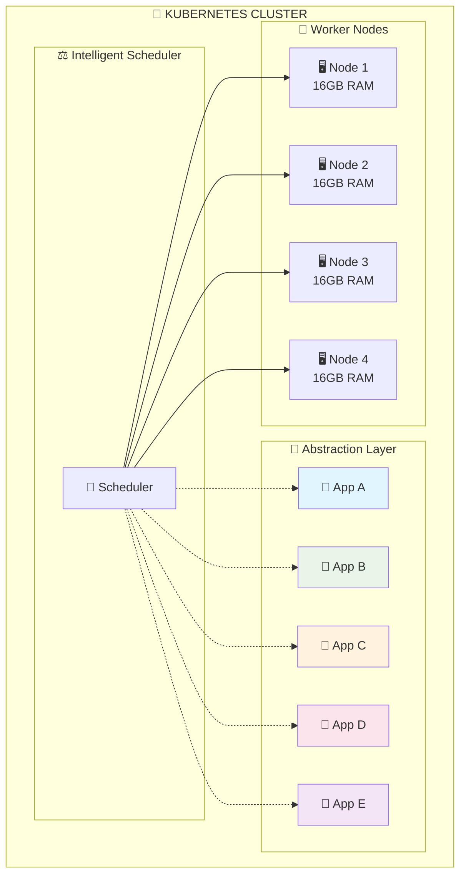
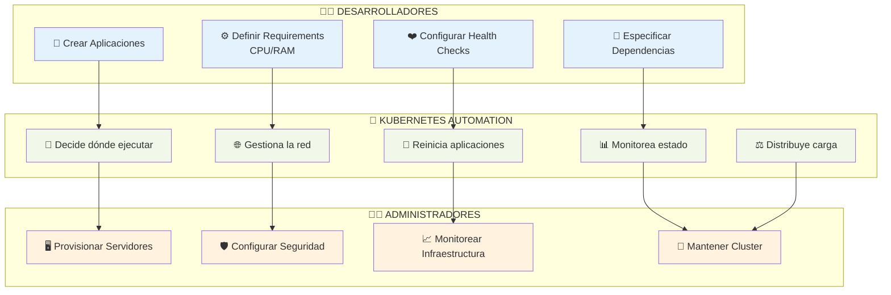

# 🌟 Módulo 01: Introducción a Kubernetes

**Duración**: 30 minutos  
**Modalidad**: Teórico  
**Dificultad**: Principiante

## 🎯 Objetivos del Módulo

Al completar este módulo serás capaz de:

- ✅ **Explicar qué es Kubernetes** y por qué es fundamental
- ✅ **Entender la evolución** desde Docker hasta Kubernetes
- ✅ **Identificar casos de uso** empresariales reales
- ✅ **Reconocer beneficios** de la orquestación de contenedores
- ✅ **Preparar el contexto** para aprender arquitectura

---

## 📚 1. ¿Qué es Kubernetes?

### **📖 Etimología y Pronunciación:**
> **Kubernetes** viene del griego **"κυβερνήτης" (kubernētēs)** que significa **"piloto"** o **"timonel"**

**Pronunciaciones comunes:**
- 🇪🇸 **Español**: "Kubernetes" o "Cuvernetes" 
- 🇺🇸 **Inglés**: "Koo-ber-NET-eez"
- 📝 **Abreviatura**: **K8s** (K + 8 letras + s)

### **🎯 Definición Simple:**
> **Kubernetes = El "piloto" que maneja tu flota de contenedores**

Como un capitán de barco que coordina todos los contenedores (la carga), Kubernetes es el **orquestador** que se asegura de que todo funcione correctamente.

### **Definición Oficial:**
> "Kubernetes es una plataforma de código abierto para automatizar el despliegue, escalado y gestión de aplicaciones contenerizadas."

### **Definición Práctica:**
**Kubernetes = Sistema que supervisa y administra contenedores automáticamente**

### **🎯 Abstracción de Infraestructura:**

**Problema tradicional:**
```
┌─────────────────────────────────────────────────────────────────────────┐
│                        🏢 ENTORNO TRADICIONAL                          │
│                                                                         │
│  ┌─────────────────────────────────────────────────────────────────────┐ │
│  │  📱 App A    📱 App B    📱 App C    📱 App D    📱 App E         │ │
│  │     │           │           │           │           │              │ │
│  │     ▼           ▼           ▼           ▼           ▼              │ │
│  │  ┌─────┐     ┌─────┐     ┌─────┐     ┌─────┐     ┌─────┐          │ │
│  │  │ VM1 │     │ VM2 │     │ VM3 │     │ VM4 │     │ VM5 │          │ │
│  │  │ 🐧  │     │ 🐧  │     │ 🐧  │     │ 🐧  │     │ 🐧  │          │ │
│  │  │ 4GB │     │ 8GB │     │ 6GB │     │ 4GB │     │ 2GB │          │ │
│  │  └─────┘     └─────┘     └─────┘     └─────┘     └─────┘          │ │
│  └─────────────────────────────────────────────────────────────────────┘ │
│                                    │                                     │
│                                    ▼                                     │
│  ┌─────────────────────────────────────────────────────────────────────┐ │
│  │              🖥️  SERVIDOR FÍSICO (64GB RAM)                      │ │
│  │                    ⚠️  Solo 24GB utilizados                        │ │
│  └─────────────────────────────────────────────────────────────────────┘ │
└─────────────────────────────────────────────────────────────────────────┘
```
**❌ Problema**: Una VM por aplicación = 62% desperdicio de recursos

**✅ Solución Kubernetes:**


**🎯 Resultado**: 5 aplicaciones → 4 nodos = 95% utilización de recursos

```
Docker (Área 1)          →    Kubernetes (Área 2)
├── Un contenedor        →    ├── Miles de contenedores
├── Una máquina          →    ├── Múltiples servidores  
├── Gestión manual       →    ├── Automatización total
└── Desarrollo local     →    └── Producción enterprise
```

### **🤔 El Problema de Escalabilidad:**

**Imagina este escenario:**
```
1 máquina:     ✅ Fácil gestionar contenedores manualmente
2 máquinas:    ⚠️  Aún manejable con scripts
10 máquinas:   🔴 Complejo coordinar manualmente  
50 máquinas:   💥 IMPOSIBLE gestionar sin automatización
```

**Preguntas críticas que surgen:**
- ❓ ¿Cómo garantizar que los contenedores estén en el estado correcto?
- ❓ ¿Qué pasa si un contenedor se cae en la máquina 23?
- ❓ ¿Cómo mantener siempre 50 réplicas distribuidas?
- ❓ ¿Cómo actualizar 200 contenedores sin downtime?

**Respuesta: Kubernetes = El supervisor automático**

### **👥 Separación de Responsabilidades:**



**🎯 División clara de responsabilidades:**

| 👨‍💻 **Desarrolladores** | 🤖 **Kubernetes** | 👨‍🔧 **Administradores** |
|:-----------------------:|:------------------:|:------------------------:|
| ✅ Crear aplicaciones | 🎯 Decide dónde ejecutar | 🖥️ Provisionar servidores |
| ⚙️ Definir CPU/RAM | 🌐 Gestiona networking | 🛡️ Configurar seguridad |
| ❤️ Health checks | 🔄 Auto-restart servicios | 📈 Monitorear infraestructura |
| 🔗 Dependencias | ⚖️ Load balancing | 🔧 Mantener cluster health |
| | 📊 Monitoreo automático | |

**💡 Resultado**: Cada equipo se enfoca en su expertise, Kubernetes conecta todo automáticamente.
```
┌─────────────────────────────────────────┐
│        DESARROLLADOR ENFOQUE            │
│                                         │
│  ✅ Crear aplicaciones                 │
│  ✅ Definir requirements (CPU/RAM)     │
│  ✅ Configurar health checks           │
│  ✅ Especificar dependencias           │
│                                         │
│  ❌ NO preocuparse por:                │
│     - ¿En qué servidor correr?         │
│     - ¿Cómo gestionar la red?          │
│     - ¿Qué pasa si falla el hardware?  │
└─────────────────────────────────────────┘
```

**Para Administradores:**
```
┌─────────────────────────────────────────┐
│       ADMINISTRADOR ENFOQUE             │
│                                         │
│  ✅ Mantener cluster de nodos          │
│  ✅ Gestionar recursos globales        │
│  ✅ Aplicar políticas de seguridad     │
│  ✅ Monitorear infraestructura         │
│                                         │
│  ❌ NO preocuparse por:                │
│     - ¿Cómo configurar cada app?       │
│     - ¿Dónde colocar cada contenedor?  │
│     - ¿Cómo escalar aplicaciones?      │
└─────────────────────────────────────────┘
```

**Kubernetes maneja la comunicación entre ambos mundos automáticamente**

---

## 🚀 2. Evolución: De Docker a Kubernetes

### **El problema que resuelve:**

#### **🔴 Limitaciones de Docker standalone:**
```bash
# Problemas reales en producción:
docker run -d nginx                    # ¿En qué servidor?
docker run -d --scale 10 app           # ¿Cómo balancear carga?
docker stop container                  # ¿Quién lo reinicia?
docker network create                  # ¿Cómo comunicar entre hosts?
```

#### **✅ Soluciones con Kubernetes:**
```yaml
# Mismo resultado, pero automatizado y escalable:
apiVersion: apps/v1
kind: Deployment
metadata:
  name: nginx-deployment
spec:
  replicas: 10                    # ✅ Escalado automático
  selector:                       # ✅ Distribución inteligente
    matchLabels:
      app: nginx
  template:
    metadata:
      labels:
        app: nginx
    spec:
      containers:
      - name: nginx
        image: nginx
        ports:
        - containerPort: 80
---
apiVersion: v1
kind: Service                     # ✅ Load balancing automático
metadata:
  name: nginx-service
spec:
  selector:
    app: nginx
  ports:
  - port: 80
    targetPort: 80
  type: LoadBalancer              # ✅ Exposición externa
```

### **🔄 Self-Healing en Acción:**
```bash
# Kubernetes observa constantemente:
Evento: "Container nginx-pod-1 crashed"
Acción: "Eliminando pod fallido + Creando nuevo pod"
Resultado: "Estado deseado restaurado automáticamente"

Evento: "Alto consumo CPU detectado"  
Acción: "Escalando de 3 a 5 réplicas"
Resultado: "Load distribuido automáticamente"

Evento: "Nodo worker-2 no responde"
Acción: "Migrando pods a nodos saludables"
Resultado: "Aplicación sigue funcionando"
```

---

## 🏢 3. Casos de Uso Empresariales

### **🎯 Casos de uso principales:**

#### **1. Microservicios a Escala**
```
Antes (Monolito):
┌─────────────────────────┐
│    Aplicación Única     │
│     (Un servidor)       │
└─────────────────────────┘

Después (Microservicios):
┌─────────┬─────────┬─────────┬─────────┐
│Frontend │ API     │ Auth    │ Database│
│Service  │ Service │ Service │ Service │
└─────────┴─────────┴─────────┴─────────┘
  Auto-scaling independiente
```

#### **2. CI/CD y DevOps**
- **Deploys automáticos** sin downtime
- **Testing** en múltiples entornos
- **Rollbacks** instantáneos ante fallos
- **Feature flags** y A/B testing

#### **3. Multi-Cloud y Híbrido**
- **Portabilidad** entre proveedores cloud
- **Disaster recovery** automático
- **Burst to cloud** desde on-premise
- **Vendor lock-in** avoidance

#### **4. Big Data y ML**
- **Batch processing** de datos masivos
- **Model training** distribuido
- **Real-time analytics** pipelines
- **GPU scheduling** para ML workloads

---

## 💼 4. Beneficios Empresariales

### **📊 Beneficios empresariales:**

| Métrica | Sin Kubernetes | Con Kubernetes | Mejora |
|---------|----------------|----------------|--------|
| **Deploy time** | 2-4 horas | 5-10 minutos | **96% reducción** |
| **Downtime** | 4-8 horas/mes | < 1 hora/mes | **85% reducción** |
| **Resource utilization** | 30-40% | 70-80% | **100% mejora** |
| **Recovery time** | 30-60 min | 2-5 min | **90% reducción** |
| **Team productivity** | Baseline | +200-300% | **Significativa** |

### **🎯 Beneficios estratégicos actualizados (2025):**

#### **1. 📈 Escalabilidad Avanzada:**
- ✅ **Horizontal Pod Autoscaling (HPA)**: Escala pods basado en CPU/memoria/métricas custom
- ✅ **Vertical Pod Autoscaling (VPA)**: Ajusta recursos automáticamente
- ✅ **Cluster Autoscaling**: Añade/remueve nodos según demanda
- ✅ **Multi-dimensional scaling**: CPU + memoria + métricas de negocio

#### **2. 🛡️ Resiliencia y Tolerancia a Fallos:**
- ✅ **Self-healing automático**: Restart de contenedores fallidos
- ✅ **Node failure recovery**: Migración automática de workloads
- ✅ **Multi-zone deployment**: Distribución geográfica automática
- ✅ **Disaster recovery**: Backup y restore integrados

#### **3. 🤖 Automatización Completa:**
- ✅ **GitOps workflows**: Deploy automático desde Git
- ✅ **Rolling updates**: Actualizaciones sin downtime
- ✅ **Canary deployments**: Despliegues seguros graduales
- ✅ **Blue-green deployments**: Switch instantáneo entre versiones

#### **4. 🌐 Estandarización Multi-Cloud:**
- ✅ **Vendor neutrality**: Funciona en AWS, Azure, GCP, On-premise
- ✅ **Hybrid cloud**: Cargas de trabajo distribuidas
- ✅ **Multi-cloud strategy**: Evita vendor lock-in
- ✅ **Edge computing**: Kubernetes en edge locations

#### **5. 🔧 Ecosistema Rico:**
- ✅ **CNCF projects**: +150 proyectos certificados
- ✅ **Operators**: Automatización específica por aplicación
- ✅ **Service mesh**: Istio, Linkerd para microservicios
- ✅ **Observability**: Prometheus, Grafana, Jaeger integrados

#### **6. 💼 Oportunidades Laborales:**
- ✅ **Alta demanda**: +300% crecimiento en ofertas K8s
- ✅ **Salarios premium**: 20-40% sobre roles tradicionales
- ✅ **Certificaciones valoradas**: CKA, CKAD, CKS
- ✅ **Skills transferibles**: DevOps, SRE, Cloud Architecture

#### **7. 👥 Comunidad y Soporte:**
- ✅ **CNCF governance**: Neutralidad y estabilidad
- ✅ **Active community**: 3M+ developers worldwide
- ✅ **Enterprise support**: Todos los vendors principales
- ✅ **Continuous innovation**: Release cada 4 meses

---

## 🌍 5. Historia y Evolución de Kubernetes

### **🏗️ Los Orígenes: Google Borg (2003-2014)**

**El problema de Google:**
```
Google en 2003:
├── Millones de servidores
├── Miles de millones de contenedores  
├── Cientos de aplicaciones críticas
└── Necesidad: Sistema de orquestación masiva
```

**Solución interna: Borg**
- 🏭 **15+ años** gestionando contenedores en producción
- 🌐 **Global scale**: Clusters de miles de nodos
- 🤖 **Automatización total**: Sin intervención humana
- 🔥 **Battle-tested**: Gmail, Search, YouTube, Maps

### **🎁 Kubernetes: El Regalo de Google al Mundo (2014)**

**¿Por qué Google opensourced Kubernetes?**
```
Motivaciones de Google:
├── 🌍 Estandardizar orquestación en la industria
├── 🚀 Acelerar adopción de contenedores
├── 🏗️ Crear ecosistema cloud-native
└── 💼 Posicionar Google Cloud Platform
```

**Borg vs Kubernetes:**
| Aspecto | Google Borg | Kubernetes |
|---------|-------------|------------|
| **Escala** | Billones de contenedores | Millones de contenedores |
| **Complejidad** | Extremadamente complejo | Simplificado para uso general |
| **Acceso** | Solo Google | Open source global |
| **Ecosistema** | Interno Google | Multi-cloud, multi-vendor |
| **Evolución** | 15+ años refinamiento | Heredó mejores prácticas |

### **📈 Adopción Kubernetes (2014-2025)**

```
2014: ✨ Kubernetes opensourced por Google
2015: 🏢 Primeras empresas adoptan (CoreOS, Red Hat)
2016: 🌟 CNCF adopta Kubernetes como proyecto
2017: 🚀 Major cloud providers ofrecen K8s managed
2018: 📊 50% empresas Fortune 500 usando K8s
2019: 🎯 Kubernetes se convierte en estándar
2020: 💥 Explosión durante COVID (remote work)
2021: 🏭 Kubernetes ubiquitous en enterprise
2022: 🔧 Focus en security, observability
2023: 🤖 AI/ML workloads adoption
2024: ⚡ Edge computing integration
2025: 🌐 Universal orchestration platform
```

### **🔄 Cambios Importantes (2020-2025)**

#### **Container Runtime Evolution:**
```bash
# 2020: Docker dominance
docker run myapp

# 2021: Docker deprecated in K8s
# containerd becomes default

# 2025: Multiple runtime options
containerd, CRI-O, gVisor, Kata Containers
```

#### **Security Revolution:**
```yaml
# 2020: Basic RBAC
# 2025: Zero-trust, policy engines
apiVersion: v1
kind: Pod
spec:
  securityContext:
    runAsNonRoot: true
    seccompProfile:
      type: RuntimeDefault
  containers:
  - name: app
    securityContext:
      allowPrivilegeEscalation: false
      capabilities:
        drop: ["ALL"]
```

#### **GitOps Mainstream:**
```bash
# 2020: kubectl apply
kubectl apply -f deployment.yaml

# 2025: GitOps standard  
git push → ArgoCD → Automated deployment
```

### **🏗️ Cloud Native Landscape:**

```
┌─────────────────────────────────────────────────┐
│                 APLICACIONES                    │
├─────────────────────────────────────────────────┤
│  KUBERNETES (Orquestación)                     │
├─────────────────────────────────────────────────┤
│  CONTENEDORES (Docker, containerd, CRI-O)      │
├─────────────────────────────────────────────────┤
│  INFRAESTRUCTURA (AWS, Azure, GCP, Bare Metal) │
└─────────────────────────────────────────────────┘
```

## 🌍 6. Kubernetes en el Ecosistema Cloud-Native

### **🏗️ Cloud Native Landscape:**

```
┌─────────────────────────────────────────────────┐
│                 APLICACIONES                    │
├─────────────────────────────────────────────────┤
│  KUBERNETES (Orquestación)                     │
├─────────────────────────────────────────────────┤
│  CONTENEDORES (containerd, CRI-O, Docker)      │
├─────────────────────────────────────────────────┤
│  INFRAESTRUCTURA (AWS, Azure, GCP, Bare Metal) │
└─────────────────────────────────────────────────┘
```

### **🔗 Integración con herramientas:**

#### **Desarrollo:**
- **Docker** → Building containers
- **Helm** → Package management
- **Skaffold** → Local development
- **Telepresence** → Remote debugging

#### **CI/CD:**
- **Jenkins** → Build automation
- **GitLab CI** → Source-to-deployment
- **ArgoCD** → GitOps delivery
- **Tekton** → Cloud-native pipelines

#### **Observabilidad:**
- **Prometheus** → Metrics collection
- **Grafana** → Visualization
- **Jaeger** → Distributed tracing
- **ELK Stack** → Log aggregation

#### **Seguridad:**
- **Falco** → Runtime security
- **OPA/Gatekeeper** → Policy enforcement
- **Vault** → Secrets management
- **Twistlock** → Container scanning

---

## 🎓 7. Preparación para este Curso

### **� Prerequisito CRÍTICO: Dominio de Docker**

> ⚠️ **IMPORTANTE**: Este curso asume que tienes **conocimiento sólido de Docker** del Área 1

**¿Por qué Docker es esencial?**
- 🧠 **Kubernetes usa conceptos Docker**: Imágenes, contenedores, registries
- 🔧 **Container runtimes**: Docker, containerd, CRI-O (todos compatibles)
- 🎯 **Troubleshooting**: Entender qué pasa dentro de los contenedores
- 📦 **Building images**: Para deployar aplicaciones custom

**Conocimientos Docker requeridos:**
```bash
# Debes dominar estos comandos y conceptos:
docker build -t myapp:v1.0 .
docker run -d -p 8080:80 myapp:v1.0
docker exec -it container_id bash
docker logs container_id
docker network create mynetwork
docker volume create myvolume
```

**Si necesitas reforzar Docker:**
- ✅ Completa el **[Área 1: Fundamentos Docker](../../area-1-fundamentos-docker/README.md)**
- ✅ Practica con **Docker Compose** especialmente
- ✅ Entiende **namespaces y cgroups** (crítico para K8s)

### **�🔄 Conexión con Área 1:**

| Concepto Docker | Equivalente K8s | Este Curso |
|-----------------|-----------------|------------|
| **Contenedores** | **Pods** | ✅ Módulo 4-5 |
| **docker run** | **Deployments** | ✅ Módulo 6-7 |
| **Networks** | **Services** | ✅ Módulo 8 |
| **Volumes** | **PersistentVolumes** | ✅ Módulo 17-18 |
| **Compose** | **Manifests** | ✅ Todo el área |

### **🎯 Lo que aprenderás:**

#### **Fundamentos (M1-M3):**
- Arquitectura completa de Kubernetes
- Setup de entorno de desarrollo (Minikube)
- Herramientas esenciales (kubectl)

#### **Workloads (M4-M7):**
- Pods como unidad básica
- ReplicaSets para alta disponibilidad
- Deployments para gestión de versiones
- Strategies de actualización

#### **Networking (M8-M9):**
- Service discovery interno
- Load balancing automático
- Ingress para acceso externo
- TLS y certificados

#### **Gestión (M10-M13):**
- Namespaces para organización
- Resource management granular
- Quotas y límites empresariales
- Multi-tenancy patterns

#### **Configuración (M14-M18):**
- Health checks y probes
- ConfigMaps y Secrets
- Persistent storage
- Data management patterns

#### **Seguridad (M19-M20):**
- RBAC para control de acceso
- ServiceAccounts para automatización
- Security best practices
- Compliance y governance

---

## 🚀 8. Capacidades Principales de Kubernetes

### **🎯 Principales funcionalidades que aprenderás:**

#### **1. 🔄 Self-Healing (Auto-reparación)**
```yaml
# Kubernetes observa continuamente:
desired_state: 5 replicas
current_state: 3 replicas (2 crashed)
action: "Crear 2 nuevas réplicas automáticamente"
result: "Estado deseado = Estado actual"
```

**Eventos que Kubernetes maneja automáticamente:**
- 💥 **Container crashes** → Restart automático
- 🖥️ **Node failures** → Migración a nodos healthy
- 📊 **Resource exhaustion** → Evict pods problemáticos
- 🌐 **Network issues** → Reroute traffic automáticamente

#### **2. 🔍 Service Discovery & Load Balancing**
```yaml
# Frontend encuentra Backend automáticamente:
Frontend Pod → "Necesito hablar con Backend"
Kubernetes → "Backend está en: backend-service:8080"  
Service → Load balances entre 5 Backend pods
```

**Ejemplo práctico:**
```bash
# Frontend puede hacer simplemente:
curl http://backend-service:8080/api/users
# Kubernetes maneja todo el routing y load balancing
```

#### **3. 🚀 Rolling Updates & Rollbacks**
```bash
# Deploy nueva versión sin downtime:
kubectl set image deployment/web web=myapp:v2.0

# Kubernetes hace:
# 1. Crea pod con nueva versión
# 2. Espera que esté Ready
# 3. Termina pod con versión antigua  
# 4. Repite hasta completar

# Si algo sale mal:
kubectl rollout undo deployment/web
# ↑ Regresa a versión anterior en segundos
```

#### **4. 🎯 Resource Optimization**
```yaml
# Kubernetes decide la mejor ubicación:
apiVersion: v1
kind: Pod
spec:
  containers:
  - name: app
    resources:
      requests:
        cpu: "200m"
        memory: "256Mi"
      limits:
        cpu: "500m" 
        memory: "512Mi"

# Scheduler evalúa:
# - ¿Qué nodo tiene recursos disponibles?
# - ¿Cuál está menos cargado?
# - ¿Hay afinidad/anti-afinidad rules?
# - ¿El nodo cumple los requisitos?
```

#### **5. ⚖️ Auto-scaling**
```yaml
# Horizontal Pod Autoscaler
apiVersion: autoscaling/v2
kind: HorizontalPodAutoscaler
metadata:
  name: web-hpa
spec:
  scaleTargetRef:
    apiVersion: apps/v1
    kind: Deployment
    name: web
  minReplicas: 2
  maxReplicas: 10
  metrics:
  - type: Resource
    resource:
      name: cpu
      target:
        type: Utilization
        averageUtilization: 70
# Si CPU > 70% → Crear más pods
# Si CPU < 70% → Reducir pods
```

### **📊 Kubernetes vs Gestión Manual:**

| Tarea | Manual | Kubernetes |
|-------|--------|------------|
| **Restart failed containers** | SSH + docker restart | ✅ Automático |
| **Deploy new version** | Script custom + downtime | ✅ Rolling update |
| **Scale based on load** | Manual monitoring | ✅ Auto-scaling |
| **Distribute across servers** | Manual placement | ✅ Scheduler inteligente |
| **Load balance traffic** | Configure nginx/HAProxy | ✅ Service automático |
| **Health monitoring** | Custom scripts | ✅ Probes integradas |
| **Rollback deployment** | Manual process | ✅ Un comando |
| **Resource optimization** | Manual analysis | ✅ Scheduler automático |

---

## 🏢 9. Casos de Éxito Reales

### **🏢 Empresas usando Kubernetes:**

#### **Netflix:**
- **Problema**: 1000+ microservicios, múltiples regiones
- **Solución**: K8s para auto-scaling global
- **Resultado**: 99.99% uptime, deploys 4000x/día

#### **Spotify:**
- **Problema**: 100+ equipos, diferentes tecnologías  
- **Solución**: K8s como plataforma unificada
- **Resultado**: Self-service infrastructure

#### **Uber:**
- **Problema**: Peak traffic 10x durante eventos
- **Solución**: K8s auto-scaling por ciudad
- **Resultado**: Cost optimization 40%

#### **Airbnb:**
- **Problema**: Seasonal traffic patterns
- **Solución**: K8s cluster federation
- **Resultado**: Resource efficiency 60%

---

## 🔍 10. Mitos vs Realidades (Actualizado 2025)

### **❌ Mitos comunes:**

| Mito | Realidad |
|------|----------|
| "K8s es solo para grandes empresas" | ✅ Startups también se benefician |
| "Es demasiado complejo" | ✅ Herramientas modernas simplifican |
| "Solo para microservicios" | ✅ Monolitos también se benefician |
| "Reemplaza Docker" | ✅ Usa Docker como base |
| "Solo para cloud" | ✅ Funciona on-premise también |

### **✅ Realidades actualizadas (2025):**

- **Kubernetes NO reemplaza Docker** → Los complementa (usa containerd/CRI-O)
- **NO es solo orquestación** → Es una plataforma completa
- **NO es "vendor lock-in"** → Es estándar abierto multi-cloud
- **NO requiere reescribir apps** → Migrate incrementally
- **NO es solo para DevOps** → Developers también lo usan diariamente
- **NO es solo para "cloud giants"** → SMBs también se benefician
- **NO requiere PhD** → Herramientas modernas lo simplifican

---

## 📝 11. Preparación Mental para Kubernetes

### **🧠 Cambio de paradigma:**

#### **De imperativo a declarativo:**
```bash
# Imperativo (Docker)
docker run nginx
docker scale nginx=5
docker update nginx

# Declarativo (Kubernetes)  
kubectl apply -f deployment.yaml
# K8s mantiene el estado deseado automáticamente
```

#### **De manual a automatizado:**
```
Manual                    →    Automatizado
├── "Run this command"    →    ├── "Describe desired state"
├── "Scale when needed"   →    ├── "Auto-scale based on metrics"
├── "Fix when broken"     →    ├── "Self-heal automatically"
└── "Deploy carefully"    →    └── "Deploy with confidence"
```

### **🎯 Mindset para dominar Kubernetes:**

1. **Piensa en sistemas distribuidos**, no en máquinas individuales
2. **Declara el estado deseado**, no pasos específicos  
3. **Confía en la automatización**, no en intervención manual
4. **Diseña para fallos**, asume que componentes fallarán
5. **Iteración rápida**, experimenta y aprende continuamente
6. **Observabilidad first**, siempre instrumenta tus aplicaciones
7. **Security by design**, nunca como afterthought

### **📚 Lo que cubriremos en este curso:**

**Exploraremos TODOS los componentes de Kubernetes:**
- 🏗️ **Arquitectura completa** (Control plane + Workers)
- 🐳 **Workloads** (Pods, Deployments, ReplicaSets)
- 🌐 **Networking** (Services, Ingress, DNS)
- 💾 **Storage** (Volumes, PVs, StorageClasses)
- ⚙️ **Configuration** (ConfigMaps, Secrets, Environment)
- 🔐 **Security** (RBAC, ServiceAccounts, Policies)
- 📊 **Observability** (Logging, Metrics, Tracing)

**Aprenderás a:**
- ✅ **Diagnosticar y resolver problemas** en clusters
- ✅ **Crear tus propios Deployments** desde cero
- ✅ **Automatizar tareas** con manifests YAML
- ✅ **Administrar clusters** completos
- ✅ **Implementar servicios** robustos y escalables
- ✅ **Usar CLI (kubectl)** como un expert
- ✅ **Entender cada componente** a nivel granular

### **🎓 Preparación para Certificaciones:**

Este curso está alineado con las **certificaciones oficiales de Kubernetes**:

#### **📜 CKA (Certified Kubernetes Administrator):**
- 🏗️ **Cluster installation & management**
- 🔧 **Workload & scheduling**
- 🌐 **Services & networking** 
- 💾 **Storage**
- 🚨 **Troubleshooting**

#### **📜 CKAD (Certified Kubernetes Application Developer):**
- 🐳 **Application design & build**
- ⚙️ **Application deployment**
- 🔍 **Application observability & maintenance**
- 🌐 **Application environment, configuration & security**
- 🔧 **Services & networking**

#### **📜 CKS (Certified Kubernetes Security Specialist):**
- 🛡️ **Cluster setup (10%)**
- 🔒 **Cluster hardening (15%)**  
- 🔍 **System hardening (15%)**
- 🛡️ **Minimize microservice vulnerabilities (20%)**
- 📊 **Supply chain security (20%)**
- 🚨 **Monitoring, logging & runtime security (20%)**

### **🎯 Estructura de Aprendizaje por Roles:**

```
📚 CONTENIDO COMÚN (Módulos 1-20):
├── Fundamentos & Arquitectura
├── Workloads & Networking  
├── Configuration & Storage
└── Security Basics

🔀 ESPECIALIZACIÓN POR ROL:
├── 👨‍💻 DESARROLLADOR (CKAD):
│   ├── Application lifecycle
│   ├── Pod design patterns
│   └── Debug & troubleshooting
│
├── 👨‍🔧 ADMINISTRADOR (CKA):
│   ├── Cluster management
│   ├── Node maintenance
│   └── Backup & restore
│
└── 🛡️ SECURITY (CKS):
    ├── Hardening techniques
    ├── Runtime security
    └── Compliance
```

### **🔄 Progresión del aprendizaje:**
```
Módulo 1: Introducción      ← Estás aquí
    ↓
Módulo 2: Arquitectura      ← Entender cómo funciona
    ↓  
Módulo 3: Setup Minikube    ← Hands-on environment
    ↓
Módulos 4-7: Workloads      ← Pods, Deployments (CKAD focus)
    ↓
Módulos 8-9: Networking     ← Services, Ingress (CKA focus) 
    ↓
Módulos 10-13: Resources    ← Namespaces, Limits (CKA focus)
    ↓
Módulos 14-18: Config       ← ConfigMaps, Secrets, Volumes (CKAD focus)
    ↓
Módulos 19-20: Security     ← RBAC, ServiceAccounts (CKS focus)
```

### **🏆 Objetivos de Certificación:**
Al completar este área estarás preparado para:
- 📜 **Examen CKAD**: Desarrollo de aplicaciones en K8s
- 📜 **Examen CKA**: Administración de clusters
- 📜 **Base sólida para CKS**: Seguridad especializada

---

## ⏭️ Siguiente Paso

**¡Estás listo para dominar Kubernetes desde sus fundamentos!**

Con esta introducción tienes:
- ✅ **Contexto histórico** de Google Borg → Kubernetes
- ✅ **Comprensión clara** de qué problemas resuelve K8s
- ✅ **Ejemplos prácticos** de self-healing y automation
- ✅ **Prerequisitos verificados** (especialmente Docker)
- ✅ **Mindset correcto** para aprendizaje declarativo

🎯 **Próximo módulo**: **[M02: Arquitectura de Cluster](../modulo-02-arquitectura-cluster/README.md)**

Donde aprenderás:
- Componentes del Control Plane (API Server, etcd, Scheduler, Controllers)
- Arquitectura de Worker Nodes (kubelet, kube-proxy, runtime)
- Comunicación entre componentes
- Flujo completo de requests en K8s
- Cómo todo lo que acabas de aprender se implementa técnicamente

---

## 📖 Recursos Adicionales

### **🔗 Enlaces Oficiales:**
- **[📚 Documentación oficial Kubernetes](https://kubernetes.io/docs/)**
- **[🎥 Kubernetes in 5 minutes](https://www.youtube.com/watch?v=PH-2FfFD2PU)**
- **[📊 CNCF Landscape](https://landscape.cncf.io/)**
- **[📈 Kubernetes adoption stats](https://www.cncf.io/surveys/)**

### **🎓 Recursos de Certificación:**
- **[📜 CKA Exam Guide](https://kubernetes.io/docs/reference/config-file/kubeconfig/)**
- **[📜 CKAD Exam Guide](https://kubernetes.io/docs/reference/generated/kubernetes-api/v1.28/)**  
- **[📜 CKS Exam Guide](https://kubernetes.io/docs/concepts/security/)**
- **[🛠️ Killer.sh Practice Exams](https://killer.sh/)**

### **🎨 Diagramas Conceptuales:**

Los siguientes diagramas ilustran la evolución y arquitectura de Kubernetes:

#### **Evolución: Tradicional → Kubernetes:**
```
TRADICIONAL:                    KUBERNETES:
┌─────────────┐                ┌─────────────────────────┐
│   App A     │                │     CLUSTER ABSTRACTION │
│     │       │                │   ┌─────────────────────┐ │
│   ┌─▼─┐     │                │   │ App A │ App B │ ... │ │
│   │VM1│     │                │   └─────────────────────┘ │
│   └───┘     │    ──────►     │           │               │
│             │                │           ▼               │
│   App B     │                │   ┌─────────────────────┐ │
│     │       │                │   │   Worker Nodes      │ │
│   ┌─▼─┐     │                │   │ ┌───┐ ┌───┐ ┌───┐   │ │
│   │VM2│     │                │   │ │N1 │ │N2 │ │N3 │   │ │
│   └───┘     │                │   │ └───┘ └───┘ └───┘   │ │
└─────────────┘                │   └─────────────────────┘ │
                               └─────────────────────────┘
1 App = 1 VM                   N Apps = Cluster Shared
```

#### **Abstracción de Recursos:**
```
DESARROLLADOR VE:              KUBERNETES GESTIONA:
┌─────────────────┐           ┌──────────────────────────┐
│ "Necesito:"     │           │ "Tengo disponible:"     │
│ - 2 CPU cores   │    ◄──►   │ - Node1: 8 CPU, 16GB    │
│ - 4 GB RAM      │           │ - Node2: 16 CPU, 32GB   │
│ - 100GB storage │           │ - Node3: 4 CPU, 8GB     │
│ - 3 replicas    │           │                          │
└─────────────────┘           │ Scheduler optimiza       │
                             │ distribución automática   │
                             └──────────────────────────┘
```

### **🎪 Recursos de la Comunidad:**
- **[💬 Kubernetes Slack](https://kubernetes.slack.com/)**
- **[📺 KubeCon Talks](https://www.youtube.com/c/cloudnativefdn)**
- **[📰 Kubernetes Blog](https://kubernetes.io/blog/)**
- **[🐙 Awesome Kubernetes](https://github.com/ramitsurana/awesome-kubernetes)**

---

## 🏠 Navegación

- **[⬅️ Área 1: Fundamentos Docker](../../area-1-fundamentos-docker/README.md)**
- **[🏠 Área 2: Índice Principal](../README-NUEVO.md)**
- **[➡️ M02: Arquitectura de Cluster](../modulo-02-arquitectura-cluster/README.md)**