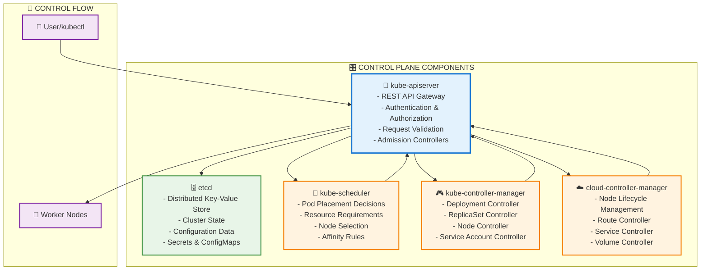
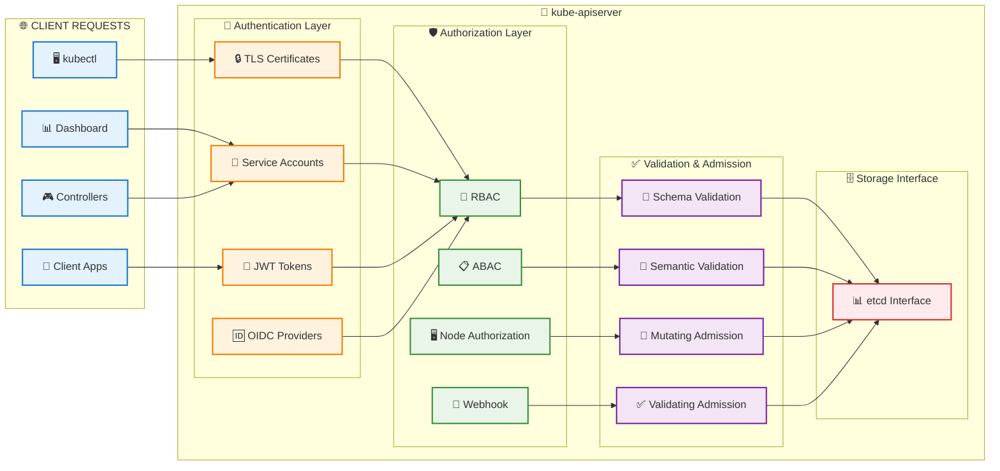
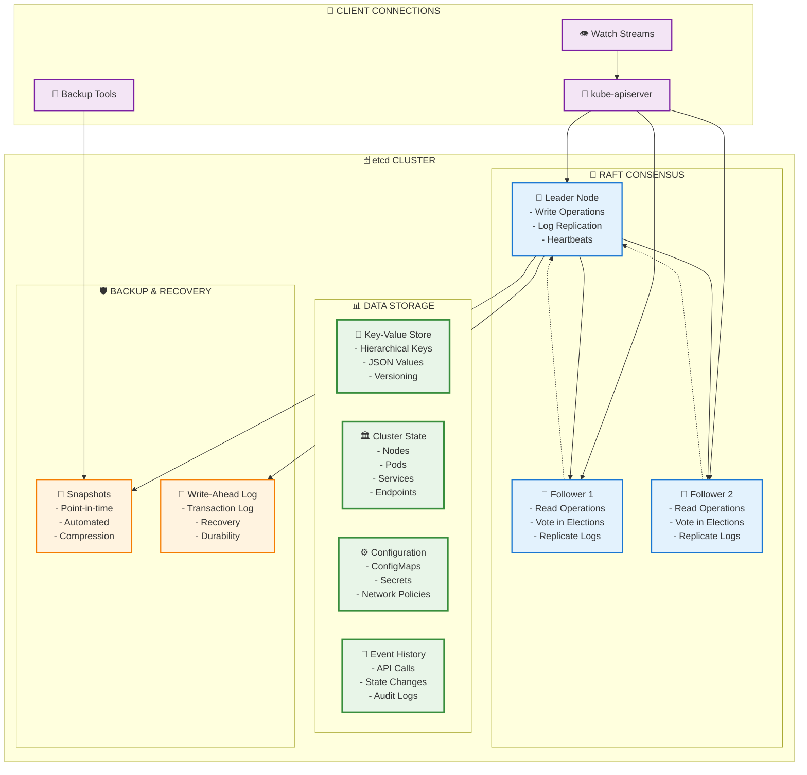
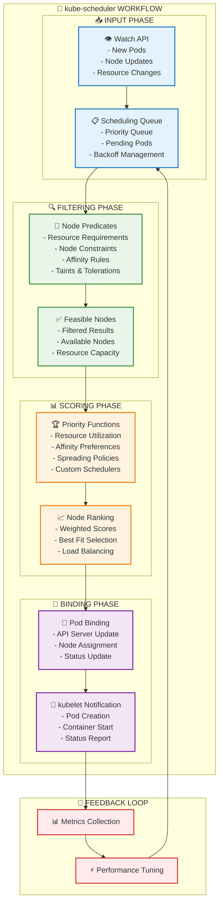
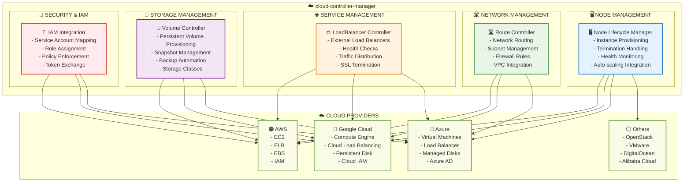
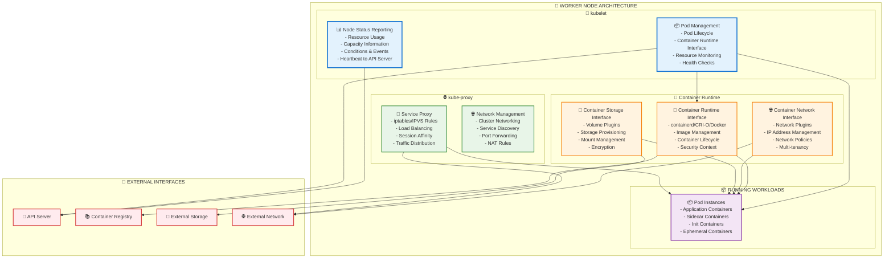
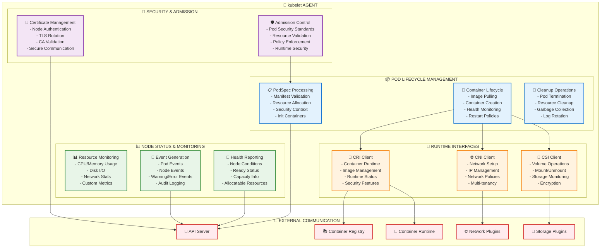

# 🏗️ Módulo 02: Arquitectura de Cluster Kubernetes

**Duración**: 60 minutos  
**Modalidad**: Teórico-Práctico  
**Dificultad**: Intermedio

## 🎯 Objetivos del Módulo

Al completar este módulo serás capaz de:

- ✅ **Identificar todos los componentes** del Control Plane
- ✅ **Entender la arquitectura** de Worker Nodes
- ✅ **Explicar la comunicación** entre componentes
- ✅ **Diagnosticar problemas** básicos de cluster
- ✅ **Visualizar el flujo** de requests en Kubernetes

---

## 🏛️ 1. Arquitectura General

### **🎯 Vista de Alto Nivel - Arquitectura Kubernetes Completa:**

```mermaid
graph TB
    subgraph "🌍 EXTERNAL CLIENTS & TRAFFIC"
        KUBECTL[�️ kubectl<br/>Admin CLI]
        DASHBOARD[📊 K8s Dashboard<br/>Web UI]
        APPS[📱 Applications<br/>Client Traffic]
        DEVS[👨‍💻 Developers<br/>DevOps Tools]
        MONITORING[📊 Monitoring<br/>Prometheus/Grafana]
    end
    
    subgraph "�🚀 KUBERNETES CLUSTER"
        subgraph "🎛️ CONTROL PLANE - Master Components"
            API[📡 kube-apiserver<br/>• REST API Gateway<br/>• Authentication & Authorization<br/>• Admission Control<br/>• API Versioning]
            ETCD[🗄️ etcd Cluster<br/>• Distributed Key-Value Store<br/>• Cluster State & Configuration<br/>• RAFT Consensus<br/>• Backup & Recovery]
            SCHED[🧠 kube-scheduler<br/>• Pod Placement Engine<br/>• Resource Scheduling<br/>• Affinity & Anti-Affinity<br/>• Constraints & Policies]
            CM[🎮 kube-controller-manager<br/>• Node Controller<br/>• Replication Controller<br/>• Endpoints Controller<br/>• Service Account Controller]
            CCM[☁️ cloud-controller-manager<br/>• Cloud Provider Integration<br/>• LoadBalancer Services<br/>• Volume Management<br/>• Network Routes]
        end
        
        subgraph "🌐 NETWORK & INGRESS LAYER"
            LB[⚖️ Cloud Load Balancer<br/>• External Traffic Distribution<br/>• Health Checks<br/>• SSL Termination]
            ING[� Ingress Controller<br/>• HTTP/HTTPS Routing<br/>• Path-based Routing<br/>• SSL Certificates<br/>• Rate Limiting]
            DNS[🔗 CoreDNS<br/>• Service Discovery<br/>• Internal DNS Resolution<br/>• External DNS Integration]
        end
        
        subgraph "�💪 WORKER NODES - Data Plane"
            subgraph "🖥️ Worker Node 1 - Production"
                KUBELET1[🤖 kubelet<br/>• Pod Lifecycle Management<br/>• Container Health Monitoring<br/>• Resource Reporting<br/>• Volume Management]
                PROXY1[🌐 kube-proxy<br/>• Service Load Balancing<br/>• Network Policies<br/>• Traffic Routing<br/>• Connection Forwarding]
                RUNTIME1[🐳 Container Runtime<br/>• containerd/CRI-O<br/>• Image Management<br/>• Container Execution<br/>• Resource Isolation]
                CNI1[🔌 CNI Plugin<br/>• Pod Networking<br/>• IP Address Management<br/>• Network Policies<br/>• Multi-tenancy]
                
                subgraph "📦 Application Pods"
                    POD1A[🎯 Frontend Pod<br/>React/Angular App]
                    POD1B[⚙️ Backend API Pod<br/>Node.js/Python]
                    POD1C[🗄️ Database Pod<br/>PostgreSQL/MySQL]
                    POD1D[� Monitoring Pod<br/>Prometheus Agent]
                    POD1E[🔒 Security Pod<br/>Security Scanner]
                end
            end
            
            subgraph "🖥️ Worker Node 2 - Development"
                KUBELET2[🤖 kubelet<br/>• Pod Lifecycle Management<br/>• Container Health Monitoring<br/>• Resource Reporting<br/>• Volume Management]
                PROXY2[🌐 kube-proxy<br/>• Service Load Balancing<br/>• Network Policies<br/>• Traffic Routing<br/>• Connection Forwarding]
                RUNTIME2[🐳 Container Runtime<br/>• containerd/CRI-O<br/>• Image Management<br/>• Container Execution<br/>• Resource Isolation]
                CNI2[🔌 CNI Plugin<br/>• Pod Networking<br/>• IP Address Management<br/>• Network Policies<br/>• Multi-tenancy]
                
                subgraph "📦 Development Pods"
                    POD2A[🧪 Test Runner Pod<br/>Jest/Pytest]
                    POD2B[� Build Pod<br/>CI/CD Pipeline]
                    POD2C[📝 Documentation Pod<br/>GitBook/Docs]
                    POD2D[🐛 Debug Pod<br/>Development Tools]
                    POD2E[🌱 Staging Pod<br/>Preview Environment]
                end
            end
            
            subgraph "🖥️ Worker Node 3 - Infrastructure"
                KUBELET3[🤖 kubelet<br/>• Pod Lifecycle Management<br/>• Container Health Monitoring<br/>• Resource Reporting<br/>• Volume Management]
                PROXY3[🌐 kube-proxy<br/>• Service Load Balancing<br/>• Network Policies<br/>• Traffic Routing<br/>• Connection Forwarding]
                RUNTIME3[🐳 Container Runtime<br/>• containerd/CRI-O<br/>• Image Management<br/>• Container Execution<br/>• Resource Isolation]
                CNI3[🔌 CNI Plugin<br/>• Pod Networking<br/>• IP Address Management<br/>• Network Policies<br/>• Multi-tenancy]
                
                subgraph "📦 System Pods"
                    POD3A[📊 Metrics Server<br/>Resource Metrics]
                    POD3B[� Logging Agent<br/>Fluent Bit/Filebeat]
                    POD3C[🔧 System Tools<br/>Troubleshooting]
                    POD3D[💾 Storage CSI<br/>Volume Management]
                    POD3E[🛡️ Network Policy<br/>Security Enforcement]
                end
            end
        end
        
        subgraph "💾 PERSISTENT STORAGE"
            PV[💿 Persistent Volumes<br/>• Block Storage<br/>• File Systems<br/>• Object Storage<br/>• Database Storage]
            SC[⚙️ Storage Classes<br/>• Dynamic Provisioning<br/>• Storage Types<br/>• Performance Tiers<br/>• Backup Policies]
        end
    end

    %% External Client Connections
    KUBECTL ==> API
    DASHBOARD ==> API
    APPS ==> LB
    DEVS ==> API
    MONITORING ==> API

    %% Load Balancer to Ingress
    LB ==> ING
    ING ==> POD1A
    ING ==> POD1B

    %% Control Plane Internal Communications
    API <==> ETCD
    API ==> SCHED
    API ==> CM
    API ==> CCM
    SCHED -.-> API
    CM -.-> API
    CCM -.-> API

    %% Control Plane to Worker Nodes
    API ==> KUBELET1
    API ==> KUBELET2
    API ==> KUBELET3
    
    %% DNS Integration
    DNS -.-> POD1A
    DNS -.-> POD1B
    DNS -.-> POD2A

    %% Worker Node 1 Internal
    KUBELET1 ==> RUNTIME1
    KUBELET1 ==> POD1A
    KUBELET1 ==> POD1B
    KUBELET1 ==> POD1C
    KUBELET1 ==> POD1D
    KUBELET1 ==> POD1E
    PROXY1 -.-> POD1A
    PROXY1 -.-> POD1B
    PROXY1 -.-> POD1C
    CNI1 -.-> POD1A
    CNI1 -.-> POD1B
    CNI1 -.-> POD1C

    %% Worker Node 2 Internal
    KUBELET2 ==> RUNTIME2
    KUBELET2 ==> POD2A
    KUBELET2 ==> POD2B
    KUBELET2 ==> POD2C
    KUBELET2 ==> POD2D
    KUBELET2 ==> POD2E
    PROXY2 -.-> POD2A
    PROXY2 -.-> POD2B
    PROXY2 -.-> POD2C
    CNI2 -.-> POD2A
    CNI2 -.-> POD2B
    CNI2 -.-> POD2C

    %% Worker Node 3 Internal
    KUBELET3 ==> RUNTIME3
    KUBELET3 ==> POD3A
    KUBELET3 ==> POD3B
    KUBELET3 ==> POD3C
    KUBELET3 ==> POD3D
    KUBELET3 ==> POD3E
    PROXY3 -.-> POD3A
    PROXY3 -.-> POD3B
    PROXY3 -.-> POD3C
    CNI3 -.-> POD3A
    CNI3 -.-> POD3B
    CNI3 -.-> POD3C

    %% Storage Connections
    POD1C -.-> PV
    POD3D -.-> PV
    SC -.-> PV

    %% Inter-Pod Communications
    POD1A -.-> POD1B
    POD1B -.-> POD1C
    POD2A -.-> POD1A
    POD3A -.-> POD1A
    POD3B -.-> POD1A

    %% Styling
    classDef externalStyle fill:#E1F5FE,stroke:#0277BD,stroke-width:2px
    classDef controlPlaneStyle fill:#FFF3E0,stroke:#F57C00,stroke-width:3px
    classDef networkStyle fill:#E8F5E8,stroke:#388E3C,stroke-width:2px
    classDef workerStyle fill:#F3E5F5,stroke:#7B1FA2,stroke-width:2px
    classDef podStyle fill:#FFEBEE,stroke:#D32F2F,stroke-width:1px
    classDef storageStyle fill:#E0F2F1,stroke:#00695C,stroke-width:2px

    class KUBECTL,DASHBOARD,APPS,DEVS,MONITORING externalStyle
    class API,ETCD,SCHED,CM,CCM controlPlaneStyle
    class LB,ING,DNS networkStyle
    class KUBELET1,PROXY1,RUNTIME1,CNI1,KUBELET2,PROXY2,RUNTIME2,CNI2,KUBELET3,PROXY3,RUNTIME3,CNI3 workerStyle
    class POD1A,POD1B,POD1C,POD1D,POD1E,POD2A,POD2B,POD2C,POD2D,POD2E,POD3A,POD3B,POD3C,POD3D,POD3E podStyle
    class PV,SC storageStyle
```



**🏗️ Componentes Principales:**

| 🎛️ **Control Plane** | 💪 **Worker Nodes** | 🌐 **Networking** | 💾 **Storage** |
|----------------------|---------------------|-------------------|----------------|
| API Server | kubelet | Ingress Controller | Persistent Volumes |
| etcd | kube-proxy | Load Balancer | Storage Classes |
| Scheduler | Container Runtime | CoreDNS | Volume Drivers |
| Controller Manager | CNI Plugin | Network Policies | CSI Drivers |
| Cloud Controller | Pod Security | Service Mesh | Backup Solutions |


> 🎯 **Diagrama desarrollado con Mermaid para mejor mantenimiento y visualización**

### **🔑 Principios Fundamentales:**

1. **Separación de Responsabilidades**: Control vs Workload
2. **API-Driven**: Todo pasa por el API Server
3. **Desired State**: Control loops mantienen estado deseado
4. **Distributed**: Componentes pueden ejecutarse en múltiples nodos
5. **Extensible**: Plugins y custom resources

---

## 🧠 2. Control Plane (Master Nodes)



**� Diagrama Detallado del Control Plane:**

[](https://mermaid.live/)

> 🎯 **Control Plane desarrollado con Mermaid para mejor visualización de componentes**

### **🎛️ Componentes del Control Plane:**

#### **2.1 API Server (kube-apiserver)**



**Función**: Punto de entrada único para todas las operaciones del cluster

[](https://mermaid.live/)

**� Flujo completo de procesamiento de requests en el API Server de Kubernetes**

El API Server de Kubernetes procesa todas las requests siguiendo un pipeline estructurado en 4 etapas principales:

#### 🔐 **Etapa 1: Autenticación**
- **TLS Certificates**: Autenticación mutua con certificados y cadena de CA
- **Service Accounts**: Cuentas de servicio por defecto y personalizadas con gestión de tokens
- **JWT Tokens**: Tokens Bearer con verificación de expiración y firma
- **OIDC Providers**: Identidad externa integrada con LDAP y Active Directory

#### 🛡️ **Etapa 2: Autorización**
- **RBAC**: Control de acceso basado en roles con Roles y RoleBindings
- **ABAC**: Control de acceso basado en atributos con motor de políticas
- **Node Authorization**: Permisos específicos para kubelet y recursos de nodos
- **Webhook**: Autorización externa con motor de políticas personalizado

#### ✅ **Etapa 3: Validación y Control de Admisión**
- **Schema Validation**: Verificación de esquema JSON con validación de tipos y formatos
- **Semantic Validation**: Verificación de lógica de negocio y dependencias de recursos
- **Mutating Admission**: Modificación de objetos con inyección de valores por defecto y etiquetas
- **Validating Admission**: Aplicación de políticas y cumplimiento de seguridad

#### 🗄️ **Etapa 4: Interfaz de Almacenamiento**
- **Operaciones CRUD**: Creación, lectura, actualización y eliminación de recursos
- **Watch Streams**: Actualizaciones en tiempo real con notificaciones de eventos
- **Actualizaciones Atómicas**: Seguridad transaccional con garantías de consistencia
- **Historial de Eventos**: Auditoría y seguimiento de cambios
- **Consistencia**: Consistencia fuerte con cumplimiento ACID

**📚 Recursos Adicionales para API Server:**
- [📖 **Documentación Oficial**](https://kubernetes.io/docs/concepts/overview/kubernetes-api/)
- [🔧 **API Reference**](https://kubernetes.io/docs/reference/kubernetes-api/)
│                                                                                         │
└─────────────────────────────────────────────────────────────────────────────────────────┘
```

**Responsabilidades:**
- ✅ **Autenticación y autorización** de requests
- ✅ **Validación** de objetos de Kubernetes
- ✅ **Admission control** y políticas
- ✅ **RESTful API** para todos los recursos
- ✅ **Frontend** único para el cluster

**Ejemplo de interacción:**
```bash
# Todo pasa por API Server
kubectl get pods              # → GET /api/v1/pods
kubectl create deployment     # → POST /apis/apps/v1/deployments
kubectl scale deployment      # → PATCH /apis/apps/v1/deployments
```

#### **2.2 etcd - Almacén de Estado Distribuido**



**Función**: Base de datos distribuida que almacena todo el estado del cluster

**🏗️ Arquitectura de Almacenamiento etcd:**
```
┌─────────────────────────────────────────────────────────────────────────────────────────┐
│                              🗄️ etcd DISTRIBUTED DATABASE                              │
│                                                                                         │
│  ┌─────────────────────────────────────────────────────────────────────────────────────┐ │
│  │                            📊 DATA ORGANIZATION                                     │ │
│  │  ┌─────────────────┐ ┌─────────────────┐ ┌─────────────────┐ ┌─────────────────┐   │ │
│  │  │🏛️ Cluster State │ │⚙️ Configuration │ │🔐 Secrets       │ │📦 ConfigMaps    │   │ │
│  │  │                 │ │                 │ │                 │ │                 │   │ │
│  │  │/registry/       │ │/registry/       │ │/registry/       │ │/registry/       │   │ │
│  │  │  nodes/         │ │  configmaps/    │ │  secrets/       │ │  configmaps/    │   │ │
│  │  │  pods/          │ │  networkpolicies│ │  default/       │ │  kube-system/   │   │ │
│  │  │  services/      │ │  storageclasses/│ │  kube-system/   │ │  default/       │   │ │
│  │  │  endpoints/     │ │  csinodes/      │ │  tls-certs/     │ │  app-configs/   │   │ │
│  │  │  deployments/   │ │  persistentv/   │ │  docker-registry│ │  feature-flags/ │   │ │
│  │  │  replicasets/   │ │  validating/    │ │  ssh-keys/      │ │  environments/  │   │ │
│  │  │  namespaces/    │ │  mutating/      │ │  api-tokens/    │ │  templates/     │   │ │
│  │  └─────────────────┘ └─────────────────┘ └─────────────────┘ └─────────────────┘   │ │
│  │  ┌─────────────────┐ ┌─────────────────┐ ┌─────────────────┐ ┌─────────────────┐   │ │
│  │  │📝 Events        │ │👥 RBAC          │ │🌐 Network       │ │💾 Storage       │   │ │
│  │  │                 │ │                 │ │                 │ │                 │   │ │
│  │  │/registry/       │ │/registry/       │ │/registry/       │ │/registry/       │   │ │
│  │  │  events/        │ │  roles/         │ │  services/      │ │  persistentv/   │   │ │
│  │  │  audit/         │ │  rolebindings/  │ │  ingresses/     │ │  storageclasses/│   │ │
│  │  │  warnings/      │ │  clusterroles/  │ │  networkpolicies│ │  volumeclaims/  │   │ │
│  │  │  normal/        │ │  clusterrolebind│ │  endpoints/     │ │  csidriver/     │   │ │
│  │  │  failed/        │ │  serviceaccounts│ │  endpointslices/│ │  csistoragecap/ │   │ │
│  │  └─────────────────┘ └─────────────────┘ └─────────────────┘ └─────────────────┘   │ │
│  └─────────────────────────────────────────────────────────────────────────────────────┘ │
│                                         ▲                                               │
│                                         │                                               │
│  ┌──────────────────────────────────────┼──────────────────────────────────────────────┐ │
│  │                         🔄 RAFT CONSENSUS ALGORITHM                                 │ │
│  │                                      │                                               │ │
│  │  ┌───────────────────────────────────┼───────────────────────────────────────────┐   │ │
│  │  │                   👑 LEADER NODE  │                                           │   │ │
│  │  │  ┌─────────────────┐ ┌────────────┼──────────┐ ┌─────────────────┐ ┌───────┐ │   │ │
│  │  │  │📝 Write Ops     │ │🔄 Log Repl │ication   │ │💓 Heartbeats    │ │⚖️ Load│ │   │ │
│  │  │  │   - PUT/POST    │ │   - Entries│          │ │   - Health      │ │  Bal  │ │   │ │
│  │  │  │   - DELETE      │ │   - Order  │          │ │   - Timeout     │ │   ance│ │   │ │
│  │  │  │   - PATCH       │ │   - Commit │          │ │   - Election    │ │      │ │   │ │
│  │  │  └─────────────────┘ └────────────┼──────────┘ └─────────────────┘ └───────┘ │   │ │
│  │  └───────────────────────────────────┼───────────────────────────────────────────┘   │ │
│  │                                      ▼                                               │ │
│  │  ┌─────────────────────────────────────────────────────────────────────────────────┐ │ │
│  │  │                            🤝 FOLLOWER NODES                                   │ │ │
│  │  │  ┌─────────────────┐ ┌─────────────────┐ ┌─────────────────┐ ┌─────────────────┐ │ │
│  │  │  │📖 Read Ops      │ │🗳️ Elections     │ │📥 Log Entries   │ │🔍 Health Checks │ │ │
│  │  │  │   - GET         │ │   - Vote Cast   │ │   - Replication │ │   - Node Status │ │ │
│  │  │  │   - LIST        │ │   - Term Inc    │ │   - Apply Order │ │   - Conn Status │ │ │
│  │  │  │   - WATCH       │ │   - Candidate   │ │   - Consistency │ │   - Sync Status │ │ │
│  │  │  └─────────────────┘ └─────────────────┘ └─────────────────┘ └─────────────────┘ │ │
│  │  └─────────────────────────────────────────────────────────────────────────────────┘ │ │
│  └─────────────────────────────────────────────────────────────────────────────────────┘ │
│                                         ▲                                               │
│                                         │                                               │
│  ┌──────────────────────────────────────┼──────────────────────────────────────────────┐ │
│  │                      🛡️ BACKUP & RECOVERY SYSTEM                                   │ │
│  │  ┌─────────────────┐ ┌─────────────────┐ ┌─────────────────┐ ┌─────────────────┐   │ │
│  │  │📸 Snapshots     │ │📜 Write-Ahead   │ │🔄 Recovery      │ │🗜️ Compression   │   │ │
│  │  │   - Point-time  │ │   Log (WAL)     │ │   - Auto Repair │ │   - Storage Opt │   │ │
│  │  │   - Scheduled   │ │   - Durability  │ │   - Data Restore│ │   - Bandwidth   │   │ │
│  │  │   - Manual      │ │   - Transaction │ │   - Consistency │ │   - Encryption  │   │ │
│  │  │   - Incremental │ │   - Recovery    │ │   - Validation  │ │   - Dedup       │   │ │
│  │  └─────────────────┘ └─────────────────┘ └─────────────────┘ └─────────────────┘   │ │
│  └─────────────────────────────────────────────────────────────────────────────────────┘ │
│                                                                                         │
└─────────────────────────────────────────────────────────────────────────────────────────┘
**Responsabilidades:**
- ✅ **Almacenamiento** de todo el estado del cluster
- ✅ **Consistencia** ACID para operaciones críticas
- ✅ **Distribución** con consenso RAFT para alta disponibilidad
- ✅ **Watch API** para notificaciones en tiempo real
- ✅ **Backup/Recovery** con snapshots automáticos
- ✅ **Encriptación** de datos en reposo

**Ejemplo de datos almacenados:**
```bash
# Estructura jerárquica en etcd
/registry/pods/default/nginx-deployment-abc123
/registry/deployments/default/web-application
/registry/services/default/api-gateway-service
/registry/configmaps/kube-system/cluster-configuration
/registry/secrets/default/database-credentials
```

#### **2.3 Scheduler (kube-scheduler)**



**Función**: Inteligencia para la colocación óptima de Pods en el cluster

**🎯 Proceso Completo de Scheduling:**
```
┌─────────────────────────────────────────────────────────────────────────────────────────┐
│                               🧠 kube-scheduler ENGINE                                  │
│                                                                                         │
│  ┌─────────────────────────────────────────────────────────────────────────────────────┐ │
│  │                            📥 INPUT & QUEUE MANAGEMENT                              │ │
│  │  ┌─────────────────┐ ┌─────────────────┐ ┌─────────────────┐ ┌─────────────────┐   │ │
│  │  │📋 Priority Queue│ │👁️ API Watcher   │ │🔄 Backoff Mgmt  │ │⏱️ Rate Limiting │   │ │
│  │  │   - High Prior  │ │   - New Pods    │ │   - Failed Sched│ │   - Burst Control│  │ │
│  │  │   - Medium      │ │   - Node Events │ │   - Retry Logic │ │   - Throttling  │   │ │
│  │  │   - Low         │ │   - Resource Up │ │   - Exponential │ │   - Fairness    │   │ │
│  │  │   - Best Effort │ │   - Node Drain  │ │   - Max Attempts│ │   - SLA Control │   │ │
│  │  └─────────────────┘ └─────────────────┘ └─────────────────┘ └─────────────────┘   │ │
│  └─────────────────────────────────────────────────────────────────────────────────────┘ │
│                                         ▼                                               │
│  ┌─────────────────────────────────────────────────────────────────────────────────────┐ │
│  │                            🔍 FILTERING PHASE (Predicates)                         │ │
│  │  ┌─────────────────┐ ┌─────────────────┐ ┌─────────────────┐ ┌─────────────────┐   │ │
│  │  │📏 Resource Req  │ │🏷️ Node Selector │ │🧲 Affinity      │ │🚫 Taints &      │   │ │
│  │  │   - CPU         │ │   - Labels      │ │   - Node Affin  │ │   Tolerations   │   │ │
│  │  │   - Memory      │ │   - Annotations │ │   - Pod Affin   │ │   - NoSchedule  │   │ │
│  │  │   - Storage     │ │   - Zones       │ │   - Anti-Affin  │ │   - NoExecute   │   │ │
│  │  │   - GPU/Special │ │   - Arch        │ │   - Topology    │ │   - PreferNoSch │   │ │
│  │  └─────────────────┘ └─────────────────┘ └─────────────────┘ └─────────────────┘   │ │
│  │  ┌─────────────────┐ ┌─────────────────┐ ┌─────────────────┐ ┌─────────────────┐   │ │
│  │  │💾 Volume Zones  │ │🌐 Network       │ │🔒 Security      │ │🎛️ Custom        │   │ │
│  │  │   - PV Topology │ │   - Subnet      │ │   - Pod Security│ │   Predicates    │   │ │
│  │  │   - Storage Cls │ │   - Network Pol │ │   - AppArmor    │ │   - Extenders   │   │ │
│  │  │   - Access Mode │ │   - Service Mesh│ │   - SELinux     │ │   - Webhooks    │   │ │
│  │  │   - Mount Points│ │   - CNI Compat  │ │   - RBAC        │ │   - Plugins     │   │ │
│  │  └─────────────────┘ └─────────────────┘ └─────────────────┘ └─────────────────┘   │ │
│  └─────────────────────────────────────────────────────────────────────────────────────┘ │
│                                         ▼                                               │
│  ┌─────────────────────────────────────────────────────────────────────────────────────┐ │
│  │                           📊 SCORING PHASE (Priorities)                            │ │
│  │  ┌─────────────────┐ ┌─────────────────┐ ┌─────────────────┐ ┌─────────────────┐   │ │
│  │  │⚖️ Load Balancing│ │📏 Resource Util │ │🎯 Affinity Pref │ │🌍 Zone Spread   │   │ │
│  │  │   - Even Distrib│ │   - CPU Usage   │ │   - Preferences │ │   - Multi-Zone  │   │ │
│  │  │   - Replica Spr │ │   - Memory Load │ │   - Soft Rules  │ │   - Failure Dom │   │ │
│  │  │   - Anti-Affin  │ │   - Disk I/O    │ │   - Weights     │ │   - Region Dist │   │ │
│  │  │   - Pod Density │ │   - Network BW  │ │   - Priorities  │ │   - Rack Aware  │   │ │
│  │  └─────────────────┘ └─────────────────┘ └─────────────────┘ └─────────────────┘   │ │
│  │  ┌─────────────────┐ ┌─────────────────┐ ┌─────────────────┐ ┌─────────────────┐   │ │
│  │  │🏆 Priority Class│ │💰 Cost Optimiz  │ │🔧 Maintenance   │ │📊 Performance  │   │ │
│  │  │   - High Prior  │ │   - Spot Inst   │ │   - Drain Nodes │ │   - Latency     │   │ │
│  │  │   - Preemption  │ │   - Reserved    │ │   - Upgrades    │ │   - Throughput  │   │ │
│  │  │   - QoS Classes │ │   - On-Demand   │ │   - Cordon      │ │   - IOPS        │   │ │
│  │  │   - SLA Levels  │ │   - Savings     │ │   - Scheduling  │ │   - Optimization│   │ │
│  │  └─────────────────┘ └─────────────────┘ └─────────────────┘ └─────────────────┘   │ │
│  └─────────────────────────────────────────────────────────────────────────────────────┘ │
│                                         ▼                                               │
│  ┌─────────────────────────────────────────────────────────────────────────────────────┐ │
│  │                            🎯 BINDING & NOTIFICATION                                │ │
│  │  ┌─────────────────┐ ┌─────────────────┐ ┌─────────────────┐ ┌─────────────────┐   │ │
│  │  │🔗 Pod Binding   │ │📡 API Update    │ │🤖 kubelet Notify│ │📊 Metrics       │   │ │
│  │  │   - Node Assign │ │   - etcd Write  │ │   - Pod Creation│ │   - Schedule    │   │ │
│  │  │   - Spec Update │ │   - Event Log   │ │   - Image Pull  │ │   - Latency     │   │ │
│  │  │   - Status Set  │ │   - Audit Trail │ │   - Container   │ │   - Success Rate│   │ │
│  │  │   - Annotation  │ │   - Watch Notify│ │   - Health Check│ │   - Node Utiliz │   │ │
│  │  └─────────────────┘ └─────────────────┘ └─────────────────┘ └─────────────────┘   │ │
│  └─────────────────────────────────────────────────────────────────────────────────────┘ │
│                                                                                         │
└─────────────────────────────────────────────────────────────────────────────────────────┘
```
**Ejemplo de proceso de scheduling:**

1. **Filtering (Predicates)**:
```yaml
# Nodos válidos basado en:
spec:
  nodeSelector: 
    disk: "ssd"
    zone: "us-west-1a"
  resources:
    requests:
      cpu: "500m"
      memory: "1Gi"
      nvidia.com/gpu: "1"
  tolerations: 
  - key: "node-type"
    operator: "Equal"
    value: "gpu"
    effect: "NoSchedule"
  affinity:
    nodeAffinity:
      requiredDuringSchedulingIgnoredDuringExecution:
        nodeSelectorTerms:
        - matchExpressions:
          - key: "topology.kubernetes.io/zone"
            operator: In
            values: ["us-west-1a", "us-west-1b"]
```

2. **Scoring (Priorities)**:
```yaml
# Ranking de nodos por:
- LeastRequestedPriority: 85      # Menor uso de recursos (85/100)
- BalancedResourceAllocation: 78  # Balance CPU/Memory (78/100)
- NodeAffinityPriority: 92        # Cumple preferencias (92/100)
- InterPodAffinityPriority: 71    # Cumple afinidad pods (71/100)
- TaintTolerationPriority: 100    # Tolera taints (100/100)
- SelectorSpreadPriority: 88      # Distribución uniforme (88/100)
# Nodo final seleccionado: node-gpu-west-1a (Score: 89/100)
```

3. **Binding**:
```bash
# Resultado final
kubectl get pod web-app-abc123 -o wide
NAME            READY   STATUS    NODE
web-app-abc123  1/1     Running   node-gpu-west-1a
```

#### **2.4 Controller Manager (kube-controller-manager)**

```mermaid
graph TB
    subgraph "🎮 kube-controller-manager"
        subgraph "🚀 WORKLOAD CONTROLLERS"
            DEPLOY[📦 Deployment Controller<br/>- Rolling Updates<br/>- Rollback Management<br/>- Revision History]
            RS[📋 ReplicaSet Controller<br/>- Pod Scaling<br/>- Replica Management<br/>- Pod Recreation]
            JOB[🎫 Job Controller<br/>- Batch Processing<br/>- Completion Tracking<br/>- Parallel Execution]
            CRON[⏰ CronJob Controller<br/>- Scheduled Execution<br/>- History Management<br/>- Timezone Support]
        end
        
        subgraph "🖥️ NODE CONTROLLERS"
            NODE[🖥️ Node Controller<br/>- Health Monitoring<br/>- Lease Management<br/>- Eviction Control]
            NSL[🌐 NodeLifecycle Controller<br/>- Ready/NotReady States<br/>- Taint Management<br/>- Pod Eviction]
        end
        
        subgraph "🌐 SERVICE CONTROLLERS"
            SVC[🌐 Service Controller<br/>- Endpoint Management<br/>- Load Balancer Sync<br/>- ClusterIP Assignment]
            EP[🔗 Endpoint Controller<br/>- Service Discovery<br/>- Pod IP Tracking<br/>- Health Checks]
            ING[🚪 Ingress Controller<br/>- Traffic Routing<br/>- TLS Termination<br/>- Path-based Routing]
        end
        
        subgraph "🔐 SECURITY CONTROLLERS"
            SA[👤 ServiceAccount Controller<br/>- Token Management<br/>- Secret Injection<br/>- RBAC Integration]
            RBAC[🛡️ RBAC Controller<br/>- Role Management<br/>- Permission Updates<br/>- Access Control]
        end
        
        subgraph "📁 RESOURCE CONTROLLERS"
            NS[📁 Namespace Controller<br/>- Lifecycle Management<br/>- Resource Cleanup<br/>- Finalizers]
            PV[💾 PersistentVolume Controller<br/>- Volume Binding<br/>- Storage Classes<br/>- Provisioning]
            QUOTA[📊 ResourceQuota Controller<br/>- Usage Tracking<br/>- Limit Enforcement<br/>- Reporting]
        end
    end
    
    subgraph "🔄 CONTROL LOOP"
        API_WATCH[👁️ API Server Watch]
        DESIRED[🎯 Desired State]
        CURRENT[📊 Current State]
        RECONCILE[🔄 Reconciliation]
    end
    
    API_WATCH --> DESIRED
    DESIRED --> CURRENT
    CURRENT --> RECONCILE
    RECONCILE --> API_WATCH
    
    %% Controller connections
    DEPLOY --> RECONCILE
    RS --> RECONCILE
    JOB --> RECONCILE
    CRON --> RECONCILE
    NODE --> RECONCILE
    NSL --> RECONCILE
    SVC --> RECONCILE
    EP --> RECONCILE
    ING --> RECONCILE
    SA --> RECONCILE
    RBAC --> RECONCILE
    NS --> RECONCILE
    PV --> RECONCILE
    QUOTA --> RECONCILE
    
    classDef workload fill:#e3f2fd,stroke:#1976d2,stroke-width:2px
    classDef node fill:#e8f5e8,stroke:#388e3c,stroke-width:2px
    classDef service fill:#fff3e0,stroke:#f57c00,stroke-width:2px
    classDef security fill:#f3e5f5,stroke:#7b1fa2,stroke-width:2px
    classDef resource fill:#ffebee,stroke:#d32f2f,stroke-width:2px
    classDef control fill:#f9fbe7,stroke:#689f38,stroke-width:2px
    
    class DEPLOY,RS,JOB,CRON workload
    class NODE,NSL node
    class SVC,EP,ING service
    class SA,RBAC security
    class NS,PV,QUOTA resource
    class API_WATCH,DESIRED,CURRENT,RECONCILE control
```



**Función**: Conjunto de control loops que mantienen el estado deseado del cluster
**🔄 Control Loop Pattern (Reconciliation)**:
```
┌─────────────────────────────────────────────────────────────────────────────────────────┐
│                          🎮 CONTROLLER MANAGER - CONTROL LOOPS                         │
│                                                                                         │
│  ┌─────────────────────────────────────────────────────────────────────────────────────┐ │
│  │                              🔄 RECONCILIATION PATTERN                             │ │
│  │                                                                                     │ │
│  │  ┌─────────────┐    ┌─────────────┐    ┌─────────────┐    ┌─────────────┐          │ │
│  │  │👁️ Watch API │───►│🎯 Desired   │───►│📊 Current   │───►│🔄 Reconcile │          │ │
│  │  │   Events    │    │   State     │    │   State     │    │   Actions   │          │ │
│  │  │             │    │             │    │             │    │             │          │ │
│  │  │- Create     │    │- Spec       │    │- Status     │    │- Create     │          │ │
│  │  │- Update     │    │- Replicas: 3│    │- Ready: 2   │    │- Update     │          │ │
│  │  │- Delete     │    │- Image      │    │- Conditions │    │- Delete     │          │ │
│  │  │- Error      │    │- Resources  │    │- Metrics    │    │- Scale      │          │ │
│  │  └─────────────┘    └─────────────┘    └─────────────┘    └─────────────┘          │ │
│  │          ▲                                                        │                 │ │
│  │          │                                                        ▼                 │ │
│  │          └────────────────────────── CONTINUOUS LOOP ─────────────┘                 │ │
│  └─────────────────────────────────────────────────────────────────────────────────────┘ │
│                                                                                         │
│  ┌─────────────────────────────────────────────────────────────────────────────────────┐ │
│  │                            🚀 WORKLOAD CONTROLLERS                                 │ │
│  │  ┌─────────────────┐ ┌─────────────────┐ ┌─────────────────┐ ┌─────────────────┐   │ │
│  │  │📦 Deployment    │ │📋 ReplicaSet    │ │🎫 Job           │ │⏰ CronJob       │   │ │
│  │  │   Controller    │ │   Controller    │ │   Controller    │ │   Controller    │   │ │
│  │  │                 │ │                 │ │                 │ │                 │   │ │
│  │  │🔄 Rolling Update│ │📊 Scale Up/Down │ │✅ Completion    │ │📅 Schedule      │   │ │
│  │  │📚 Revisions     │ │🔄 Pod Recreation│ │🔁 Retry Logic   │ │📈 History Mgmt  │   │ │
│  │  │⏪ Rollback      │ │⚖️ Load Balance  │ │⏸️ Parallelism   │ │🕐 Timezone      │   │ │
│  │  │🎯 Strategy      │ │🏥 Health Check  │ │🔒 Security Ctx  │ │🚫 Suspend       │   │ │
│  │  └─────────────────┘ └─────────────────┘ └─────────────────┘ └─────────────────┘   │ │
│  └─────────────────────────────────────────────────────────────────────────────────────┘ │
│                                                                                         │
│  ┌─────────────────────────────────────────────────────────────────────────────────────┐ │
│  │                           🖥️ INFRASTRUCTURE CONTROLLERS                            │ │
│  │  ┌─────────────────┐ ┌─────────────────┐ ┌─────────────────┐ ┌─────────────────┐   │ │
│  │  │🖥️ Node          │ │🔄 NodeLifecycle │ │🌐 Service       │ │🔗 Endpoint      │   │ │
│  │  │   Controller    │ │   Controller    │ │   Controller    │ │   Controller    │   │ │
│  │  │                 │ │                 │ │                 │ │                 │   │ │
│  │  │💓 Health Mon    │ │🟢 Ready/NotReady│ │⚖️ Load Balancer │ │🎯 Service Disc  │   │ │
│  │  │⏰ Lease Mgmt    │ │🏷️ Taint Mgmt    │ │🌐 ClusterIP     │ │📍 Pod IP Track  │   │ │
│  │  │🚫 Eviction      │ │👥 Pod Eviction  │ │🔄 Sync External │ │🔍 Health Check  │   │ │
│  │  │📊 Conditions    │ │🕐 Grace Period  │ │📡 External IP   │ │📊 Ready Count   │   │ │
│  │  └─────────────────┘ └─────────────────┘ └─────────────────┘ └─────────────────┘   │ │
│  └─────────────────────────────────────────────────────────────────────────────────────┘ │
│                                                                                         │
│  ┌─────────────────────────────────────────────────────────────────────────────────────┐ │
│  │                            🔐 SECURITY & ACCESS CONTROLLERS                        │ │
│  │  ┌─────────────────┐ ┌─────────────────┐ ┌─────────────────┐ ┌─────────────────┐   │ │
│  │  │👤 ServiceAccount│ │🛡️ RBAC          │ │📁 Namespace     │ │🎫 Token         │   │ │
│  │  │   Controller    │ │   Controller    │ │   Controller    │ │   Controller    │   │ │
│  │  │                 │ │                 │ │                 │ │                 │   │ │
│  │  │🔑 Token Mgmt    │ │👥 Role Mgmt     │ │🔄 Lifecycle     │ │⏰ Rotation      │   │ │
│  │  │🔐 Secret Inject │ │🔐 Permission    │ │🧹 Cleanup       │ │🚫 Expiration    │   │ │
│  │  │🔗 RBAC Integr   │ │📋 Updates       │ │🏁 Finalizers    │ │🔐 Auto-mount    │   │ │
│  │  │📊 Auto-creation │ │🔍 Access Control│ │🗑️ Resource Del  │ │📊 Usage Track   │   │ │
│  │  └─────────────────┘ └─────────────────┘ └─────────────────┘ └─────────────────┘   │ │
│  └─────────────────────────────────────────────────────────────────────────────────────┘ │
│                                                                                         │
│  ┌─────────────────────────────────────────────────────────────────────────────────────┐ │
│  │                           💾 STORAGE & RESOURCE CONTROLLERS                        │ │
│  │  ┌─────────────────┐ ┌─────────────────┐ ┌─────────────────┐ ┌─────────────────┐   │ │
│  │  │💾 PersistentVol │ │📊 ResourceQuota │ │🚫 LimitRange    │ │🗂️ CSI           │   │ │
│  │  │   Controller    │ │   Controller    │ │   Controller    │ │   Controller    │   │ │
│  │  │                 │ │                 │ │                 │ │                 │   │ │
│  │  │🔗 Volume Bind   │ │📈 Usage Track   │ │⚖️ Resource Limit│ │🔌 Driver Mgmt   │   │ │
│  │  │🏭 Provisioning  │ │🚫 Limit Enforce │ │🔍 Validation    │ │📦 Volume Attach │   │ │
│  │  │📊 Storage Class │ │📊 Reporting     │ │📋 Default Set   │ │🔄 Mount/Unmount │   │ │
│  │  │🔄 Status Update │ │🔔 Alerts        │ │🎯 Policy Apply  │ │🛠️ Capabilities  │   │ │
│  │  └─────────────────┘ └─────────────────┘ └─────────────────┘ └─────────────────┘   │ │
│  └─────────────────────────────────────────────────────────────────────────────────────┘ │
│                                                                                         │
└─────────────────────────────────────────────────────────────────────────────────────────┘
```

**Ejemplo de Controller en acción:**

```yaml
# Deployment deseado
apiVersion: apps/v1
kind: Deployment
metadata:
  name: web-app
spec:
  replicas: 3              # DESIRED STATE
  selector:
    matchLabels:
      app: web
  template:
    metadata:
      labels:
        app: web
    spec:
      containers:
      - name: nginx
        image: nginx:1.21
        resources:
          requests:
            cpu: 100m
            memory: 128Mi
```

```bash
# Controller detecta diferencia y reconcilia
kubectl get pods -l app=web
NAME                      READY   STATUS    RESTARTS   AGE
web-app-abc123           1/1     Running   0          30s
web-app-def456           1/1     Running   0          30s
# Solo 2 pods → Controller crea el tercero
web-app-ghi789           0/1     Pending   0          1s
```
│  │Controller   │Controller   │Controller   │ │
│  └─────────────┴─────────────┴─────────────┘ │
└─────────────────────────────────────────────┘
```

**Controllers principales:**

```go
// Ejemplo conceptual: ReplicaSet Controller
for {
    desired := getReplicaSetSpec().Replicas
    current := countRunningPods()
    
    if current < desired {
        createPods(desired - current)
    } else if current > desired {
        deletePods(current - desired)
    }
    
    sleep(reconcileInterval)
}
```

#### **2.5 Cloud Controller Manager (cloud-controller-manager)**



**Función**: Interfaz entre Kubernetes y proveedores de nube

**☁️ Integración con Proveedores de Nube:**
```
┌─────────────────────────────────────────────────────────────────────────────────────────┐
│                         ☁️ CLOUD CONTROLLER MANAGER                                    │
│                                                                                         │
│  ┌─────────────────────────────────────────────────────────────────────────────────────┐ │
│  │                           🖥️ NODE LIFECYCLE MANAGEMENT                             │ │
│  │  ┌─────────────────┐ ┌─────────────────┐ ┌─────────────────┐ ┌─────────────────┐   │ │
│  │  │🚀 Provisioning  │ │💀 Termination   │ │💓 Health Mon    │ │📈 Auto-scaling  │   │ │
│  │  │   - Instance Sz │ │   - Graceful    │ │   - Node Ready  │ │   - Scale Up    │   │ │
│  │  │   - AMI/Image   │ │   - Drain Pods  │ │   - Resource    │ │   - Scale Down  │   │ │
│  │  │   - Security Gr │ │   - Cleanup     │ │   - Network     │ │   - Triggers    │   │ │
│  │  │   - Tagging     │ │   - Spot Handle │ │   - Storage     │ │   - Policies    │   │ │
│  │  └─────────────────┘ └─────────────────┘ └─────────────────┘ └─────────────────┘   │ │
│  └─────────────────────────────────────────────────────────────────────────────────────┘ │
│                                         ▼                                               │
│  ┌─────────────────────────────────────────────────────────────────────────────────────┐ │
│  │                           🛣️ NETWORK & ROUTING MANAGEMENT                          │ │
│  │  ┌─────────────────┐ ┌─────────────────┐ ┌─────────────────┐ ┌─────────────────┐   │ │
│  │  │🌐 Route Tables  │ │🔥 Firewall      │ │🏢 VPC/VNet      │ │📡 DNS           │   │ │
│  │  │   - Pod CIDR    │ │   - Security Gr │ │   - Subnets     │ │   - Service     │   │ │
│  │  │   - Service     │ │   - Network ACL │ │   - Peering     │ │   - Discovery   │   │ │
│  │  │   - External    │ │   - Ingress     │ │   - Gateways    │ │   - External    │   │ │
│  │  │   - Multi-zone  │ │   - Egress      │ │   - NAT         │ │   - Resolution  │   │ │
│  │  └─────────────────┘ └─────────────────┘ └─────────────────┘ └─────────────────┘   │ │
│  └─────────────────────────────────────────────────────────────────────────────────────┘ │
│                                         ▼                                               │
│  ┌─────────────────────────────────────────────────────────────────────────────────────┐ │
│  │                           🌐 SERVICE & LOAD BALANCER MANAGEMENT                    │ │
│  │  ┌─────────────────┐ ┌─────────────────┐ ┌─────────────────┐ ┌─────────────────┐   │ │
│  │  │⚖️ Load Balancer │ │🔍 Health Checks │ │📊 Traffic Dist  │ │🔐 SSL/TLS       │   │ │
│  │  │   - External LB │ │   - HTTP/TCP    │ │   - Round Robin │ │   - Cert Mgmt   │   │ │
│  │  │   - Internal LB │ │   - Custom      │ │   - Weighted    │ │   - Termination │   │ │
│  │  │   - Layer 4/7   │ │   - Endpoints   │ │   - Geolocation │ │   - SNI         │   │ │
│  │  │   - Multi-zone  │ │   - Failover    │ │   - Sticky Sess │ │   - Auto-renew  │   │ │
│  │  └─────────────────┘ └─────────────────┘ └─────────────────┘ └─────────────────┘   │ │
│  └─────────────────────────────────────────────────────────────────────────────────────┘ │
│                                         ▼                                               │
│  ┌─────────────────────────────────────────────────────────────────────────────────────┐ │
│  │                            💾 STORAGE & VOLUME MANAGEMENT                          │ │
│  │  ┌─────────────────┐ ┌─────────────────┐ ┌─────────────────┐ ┌─────────────────┐   │ │
│  │  │🏭 Dynamic Prov  │ │📸 Snapshots     │ │🔄 Backup        │ │📊 Storage Class │   │ │
│  │  │   - PV Creation │ │   - Point-time  │ │   - Automated   │ │   - Performance │   │ │
│  │  │   - Auto-attach │ │   - Incremental │ │   - Retention   │ │   - Encryption  │   │ │
│  │  │   - Mount/Unmnt │ │   - Cross-region│ │   - Restore     │ │   - Replication │   │ │
│  │  │   - Resize      │ │   - Scheduling  │ │   - Compliance  │ │   - Access Mode │   │ │
│  │  └─────────────────┘ └─────────────────┘ └─────────────────┘ └─────────────────┘   │ │
│  └─────────────────────────────────────────────────────────────────────────────────────┘ │
│                                                                                         │
└─────────────────────────────────────────────────────────────────────────────────────────┘
```

**Responsabilidades por Cloud Provider:**

```yaml
# AWS Integration
aws:
  nodeLifecycle:
    - instanceTypes: ["m5.large", "c5.xlarge", "t3.medium"]
    - spotInstances: true
    - autoScaling: enabled
    - tagging: 
        Environment: "production"
        Team: "platform"
  loadBalancer:
    - type: "Network Load Balancer"
    - crossZone: true
    - sslPolicy: "ELBSecurityPolicy-TLS-1-2-2017-01"
  storage:
    - ebs: ["gp3", "io2", "sc1"]
    - efs: enabled
    - backup: automated

# Google Cloud Integration  
gcp:
  nodeLifecycle:
    - machineTypes: ["e2-standard-4", "n1-standard-2"]
    - preemptible: true
    - autoScaling: enabled
  loadBalancer:
    - type: "Global Load Balancer"
    - cdn: enabled
    - ssl: managed
  storage:
    - persistentDisk: ["pd-ssd", "pd-balanced"]
    - filestore: enabled
    - backup: scheduled

# Azure Integration
azure:
  nodeLifecycle:
    - vmSizes: ["Standard_D2s_v3", "Standard_B2ms"]
    - spotInstances: true
    - vmss: enabled
  loadBalancer:
    - type: "Standard Load Balancer"
    - zones: ["1", "2", "3"]
    - ssl: applicationGateway
  storage:
    - managedDisks: ["Premium_SSD", "Standard_SSD"]
    - azureFiles: enabled
    - backup: vaults
```

---

## 🔧 3. Worker Nodes



**🎨 Diagrama Detallado de Worker Nodes:**

[](https://mermaid.live/)

> 🎯 **Worker Nodes desarrollados con Mermaid para visualización detallada de componentes**

### **⚙️ Componentes de Worker Nodes:**

#### **3.1 kubelet - Agente de Nodo**



**Función**: Agente principal que ejecuta y gestiona los Pods en cada nodo

**🔄 Ciclo de Vida Completo de un Pod:**
```
┌─────────────────────────────────────────────────────────────────────────────────────────┐
│                               🤖 kubelet POD LIFECYCLE                                  │
│                                                                                         │
│  ┌─────────────────────────────────────────────────────────────────────────────────────┐ │
│  │                            📥 POD SPECIFICATION PROCESSING                         │ │
│  │  ┌─────────────────┐ ┌─────────────────┐ ┌─────────────────┐ ┌─────────────────┐   │ │
│  │  │📋 Manifest      │ │🔍 Validation    │ │📊 Resource      │ │🔐 Security      │   │ │
│  │  │   Reception     │ │   - Schema      │ │   Allocation    │ │   Context       │   │ │
│  │  │   - API Watch   │ │   - Semantic    │ │   - CPU/Memory  │ │   - User/Group  │   │ │
│  │  │   - Config File │ │   - Policy      │ │   - Storage     │ │   - Capabilities│   │ │
│  │  │   - Static Pods │ │   - Admission   │ │   - Network     │ │   - SELinux     │   │ │
│  │  └─────────────────┘ └─────────────────┘ └─────────────────┘ └─────────────────┘   │ │
│  └─────────────────────────────────────────────────────────────────────────────────────┘ │
│                                         ▼                                               │
│  ┌─────────────────────────────────────────────────────────────────────────────────────┐ │
│  │                              🔄 INITIALIZATION PHASE                               │ │
│  │  ┌─────────────────┐ ┌─────────────────┐ ┌─────────────────┐ ┌─────────────────┐   │ │
│  │  │🌐 Network Setup │ │💾 Volume Mount  │ │🔧 Init Container│ │📋 Environment   │   │ │
│  │  │   - Pod IP      │ │   - PV Binding  │ │   - Pre-work    │ │   - ConfigMaps  │   │ │
│  │  │   - DNS Config  │ │   - Mount Points│ │   - Dependencies│ │   - Secrets     │   │ │
│  │  │   - Network Pol │ │   - Permissions │ │   - Setup Tasks │ │   - Variables   │   │ │
│  │  │   - CNI Plugin  │ │   - Encryption  │ │   - Exit Codes  │ │   - Service Acc │   │ │
│  │  └─────────────────┘ └─────────────────┘ └─────────────────┘ └─────────────────┘   │ │
│  └─────────────────────────────────────────────────────────────────────────────────────┘ │
│                                         ▼                                               │
│  ┌─────────────────────────────────────────────────────────────────────────────────────┐ │
│  │                             🚀 CONTAINER EXECUTION                                 │ │
│  │  ┌─────────────────┐ ┌─────────────────┐ ┌─────────────────┐ ┌─────────────────┐   │ │
│  │  │📥 Image Pull    │ │🐳 Container     │ │💓 Health Checks │ │📊 Resource      │   │ │
│  │  │   - Registry    │ │   Creation      │ │   - Liveness    │ │   Monitoring    │   │ │
│  │  │   - Auth        │ │   - Runtime     │ │   - Readiness   │ │   - CPU Usage   │   │ │
│  │  │   - Layers      │ │   - Security    │ │   - Startup     │ │   - Memory      │   │ │
│  │  │   - Caching     │ │   - Namespaces  │ │   - Custom      │ │   - Disk I/O    │   │ │
│  │  └─────────────────┘ └─────────────────┘ └─────────────────┘ └─────────────────┘   │ │
│  └─────────────────────────────────────────────────────────────────────────────────────┘ │
│                                         ▼                                               │
│  ┌─────────────────────────────────────────────────────────────────────────────────────┐ │
│  │                              📊 MONITORING & REPORTING                             │ │
│  │  ┌─────────────────┐ ┌─────────────────┐ ┌─────────────────┐ ┌─────────────────┐   │ │
│  │  │💓 Status Report │ │📝 Event Gen     │ │🔔 Alerts        │ │📈 Metrics       │   │ │
│  │  │   - Pod Status  │ │   - Lifecycle   │ │   - Failures    │ │   - Performance │   │ │
│  │  │   - Node Health │ │   - Errors      │ │   - Resource    │ │   - Availability│   │ │
│  │  │   - Conditions  │ │   - Warnings    │ │   - Threshold   │ │   - Utilization │   │ │
│  │  │   - Heartbeat   │ │   - Audit       │ │   - SLA         │ │   - Trends      │   │ │
│  │  └─────────────────┘ └─────────────────┘ └─────────────────┘ └─────────────────┘   │ │
│  └─────────────────────────────────────────────────────────────────────────────────────┘ │
│                                         ▼                                               │
│  ┌─────────────────────────────────────────────────────────────────────────────────────┐ │
│  │                              🧹 CLEANUP & TERMINATION                              │ │
│  │  ┌─────────────────┐ ┌─────────────────┐ ┌─────────────────┐ ┌─────────────────┐   │ │
│  │  │⏹️ Graceful Stop │ │🗑️ Resource      │ │🧹 Garbage       │ │📋 Final Status  │   │ │
│  │  │   - SIGTERM     │ │   Cleanup       │ │   Collection    │ │   - Exit Codes  │   │ │
│  │  │   - Grace Period│ │   - Volumes     │ │   - Logs        │ │   - Timestamps  │   │ │
│  │  │   - SIGKILL     │ │   - Network     │ │   - Images      │ │   - Conditions  │   │ │
│  │  │   - Exit Hooks  │ │   - Storage     │ │   - Containers  │ │   - Events      │   │ │
│  │  └─────────────────┘ └─────────────────┘ └─────────────────┘ └─────────────────┘   │ │
│  └─────────────────────────────────────────────────────────────────────────────────────┘ │
│                                                                                         │
└─────────────────────────────────────────────────────────────────────────────────────────┘
```
      requests:
        cpu: "100m"
        memory: "128Mi"
    livenessProbe:
      httpGet:
        path: /health
        port: 80
    volumeMounts:
    - name: data
      mountPath: /var/data
```

#### **3.2 kube-proxy - Networking**

**Función**: Implementa Services y load balancing

```
┌─────────────────────────────────────────┐
│               kube-proxy                │
│                                         │
│  ┌─────────────┐    ┌─────────────┐    │
│  │   Service   │───►│   iptables  │    │
│  │   Rules     │    │    Rules    │    │
│  └─────────────┘    └─────────────┘    │
│                                         │
│  ┌─────────────┐    ┌─────────────┐    │
│  │ EndpointS   │───►│   IPVS      │    │
│  │   Updates   │    │   Config    │    │
│  └─────────────┘    └─────────────┘    │
└─────────────────────────────────────────┘
```

**Modos de operación:**

1. **iptables mode** (default):
```bash
# kube-proxy crea reglas como:
iptables -A KUBE-SERVICES -d 10.96.0.1/32 -p tcp --dport 443 -j KUBE-SVC-NPX46M4PTMTKRN6Y
iptables -A KUBE-SVC-NPX46M4PTMTKRN6Y -m statistic --mode random --probability 0.33333 -j KUBE-SEP-ID1
```

2. **IPVS mode** (high performance):
```bash
# kube-proxy configura IPVS:
ipvsadm -A -t 10.96.0.1:443 -s rr
ipvsadm -a -t 10.96.0.1:443 -r 192.168.1.10:6443 -m
ipvsadm -a -t 10.96.0.1:443 -r 192.168.1.11:6443 -m
```

#### **3.3 Container Runtime**

**Función**: Ejecuta y gestiona contenedores

```
┌─────────────────────────────────────────┐
│           Container Runtime             │
│                                         │
│  ┌─────────────┐    ┌─────────────┐    │
│  │   Docker    │    │ containerd  │    │
│  │   Engine    │    │             │    │
│  └─────────────┘    └─────────────┘    │
│                                         │
│  ┌─────────────┐    ┌─────────────┐    │
│  │   CRI-O     │    │    runc     │    │
│  │             │    │  (OCI)      │    │
│  └─────────────┘    └─────────────┘    │
└─────────────────────────────────────────┘
```

**Container Runtime Interface (CRI)**:
```protobuf
// kubelet habla con runtime via CRI
service RuntimeService {
    rpc CreateContainer(CreateContainerRequest) returns (CreateContainerResponse);
    rpc StartContainer(StartContainerRequest) returns (StartContainerResponse);
    rpc StopContainer(StopContainerRequest) returns (StopContainerResponse);
    rpc RemoveContainer(RemoveContainerRequest) returns (RemoveContainerResponse);
}
```

---

## 🔄 4. Flujo de Comunicación

### **📡 Request Flow Ejemplo:**

```
kubectl create deployment nginx --image=nginx
    │
    ▼
┌─────────────────────────────────────────────────┐
│ 1. API Server                                   │
│    ├─ Autenticación ✓                          │
│    ├─ Autorización ✓                           │
│    ├─ Admission Controllers ✓                  │
│    └─ Validación ✓                             │
└─────────────┬───────────────────────────────────┘
              ▼
┌─────────────────────────────────────────────────┐
│ 2. etcd                                         │
│    └─ Guarda Deployment object                 │
└─────────────┬───────────────────────────────────┘
              ▼
┌─────────────────────────────────────────────────┐
│ 3. Deployment Controller                        │
│    ├─ Detecta nuevo Deployment (watch)         │
│    └─ Crea ReplicaSet                          │
└─────────────┬───────────────────────────────────┘
              ▼
┌─────────────────────────────────────────────────┐
│ 4. ReplicaSet Controller                        │
│    ├─ Detecta nuevo ReplicaSet (watch)         │
│    └─ Crea Pod                                 │
└─────────────┬───────────────────────────────────┘
              ▼
┌─────────────────────────────────────────────────┐
│ 5. Scheduler                                    │
│    ├─ Detecta Pod sin nodo (watch)             │
│    ├─ Evalúa nodos disponibles                 │
│    └─ Asigna Pod a mejor nodo                  │
└─────────────┬───────────────────────────────────┘
              ▼
┌─────────────────────────────────────────────────┐
│ 6. kubelet (en nodo seleccionado)              │
│    ├─ Detecta Pod asignado (watch)             │
│    ├─ Descarga imagen                          │
│    ├─ Crea contenedor                          │
│    └─ Reporta estado a API Server              │
└─────────────────────────────────────────────────┘
```

### **⚡ Watch API Pattern:**

```go
// Todos los componentes usan watch para eficiencia
watch, err := clientset.CoreV1().Pods("default").Watch(context.TODO(), metav1.ListOptions{})
for event := range watch.ResultChan() {
    switch event.Type {
    case watch.Added:
        handlePodAdded(event.Object)
    case watch.Modified:
        handlePodModified(event.Object)
    case watch.Deleted:
        handlePodDeleted(event.Object)
    }
}
```

---

## 🔍 5. Estados y Condiciones

### **📊 Node Conditions:**

```yaml
# kubectl describe node worker-1
Conditions:
  Type                 Status  Reason                       Message
  ----                 ------  ------                       -------
  NetworkUnavailable   False   RouteCreated                 
  MemoryPressure       False   KubeletHasSufficientMemory   
  DiskPressure         False   KubeletHasNoDiskPressure     
  PIDPressure          False   KubeletHasSufficientPID      
  Ready                True    KubeletReady                 
```

### **🔄 Pod Phases:**

```yaml
# Lifecycle de un Pod
Pod Phases:
  Pending    → Pod creado, esperando scheduling/descarga imagen
  Running    → Contenedores ejecutándose
  Succeeded  → Containers terminated successfully (Jobs)
  Failed     → Containers terminated with errors
  Unknown    → Node communication lost
```

### **⚕️ Container States:**

```yaml
# Estados de contenedores individuales
Container States:
  Waiting:
    reason: "ImagePullBackOff"
  Running:
    startedAt: "2023-01-01T10:00:00Z"
  Terminated:
    exitCode: 0
    finishedAt: "2023-01-01T11:00:00Z"
```

---

## 🛠️ 6. Troubleshooting Arquitectura

### **🔧 Comandos de Diagnóstico:**

#### **Control Plane Health:**
```bash
# Verificar componentes del control plane
kubectl get componentstatuses
kubectl get nodes
kubectl cluster-info

# Logs de componentes
kubectl logs -n kube-system kube-apiserver-master
kubectl logs -n kube-system etcd-master
kubectl logs -n kube-system kube-scheduler-master
kubectl logs -n kube-system kube-controller-manager-master
```

#### **Worker Node Health:**
```bash
# En el worker node
systemctl status kubelet
systemctl status docker  # o containerd
journalctl -u kubelet -f

# Network troubleshooting
kubectl get pods -n kube-system -l k8s-app=kube-proxy
kubectl logs -n kube-system -l k8s-app=kube-proxy
```

#### **etcd Health:**
```bash
# Verificar etcd cluster
ETCDCTL_API=3 etcdctl --endpoints=https://127.0.0.1:2379 \
  --cacert=/etc/etcd/ca.crt \
  --cert=/etc/etcd/server.crt \
  --key=/etc/etcd/server.key \
  endpoint health

# Backup de etcd
ETCDCTL_API=3 etcdctl --endpoints=https://127.0.0.1:2379 \
  --cacert=/etc/etcd/ca.crt \
  snapshot save backup.db
```

### **🚨 Problemas Comunes:**

| Síntoma | Causa Probable | Solución |
|---------|----------------|----------|
| Pods "Pending" | Scheduler down / No resources | Check scheduler logs / Add nodes |
| Services not working | kube-proxy issues | Restart kube-proxy |
| API slow | etcd performance | Check etcd metrics |
| Nodes "NotReady" | kubelet/network issues | Check kubelet logs |

---

## 📊 7. Arquitecturas de Despliegue

### **🏠 Single-Node (Minikube/Kind):**
```
┌─────────────────────────┐
│    Single Node         │
│  ┌─────────────────┐   │
│  │ Control Plane   │   │
│  ├─────────────────┤   │
│  │ Worker          │   │
│  │ Components      │   │
│  └─────────────────┘   │
└─────────────────────────┘
```

### **🏢 Multi-Master HA:**
```
┌─────────────┐  ┌─────────────┐  ┌─────────────┐
│  Master 1   │  │  Master 2   │  │  Master 3   │
│             │  │             │  │             │
└─────────────┘  └─────────────┘  └─────────────┘
       │                │                │
       └────────────────┼────────────────┘
                        │
┌─────────────┐  ┌─────────────┐  ┌─────────────┐
│  Worker 1   │  │  Worker 2   │  │  Worker N   │
└─────────────┘  └─────────────┘  └─────────────┘
```

### **☁️ Managed Kubernetes:**
```
┌─────────────────────────────────────┐
│        Cloud Provider               │
│  ┌─────────────────────────────────┐ │
│  │     Managed Control Plane       │ │  ← Invisible
│  │   (API Server, etcd, etc.)      │ │
│  └─────────────────────────────────┘ │
└─────────────────────────────────────┘
              │
┌─────────────┐  ┌─────────────┐
│  Worker 1   │  │  Worker N   │      ← You manage
└─────────────┘  └─────────────┘
```

---

## 🧪 Laboratorio: Explorando la Arquitectura

### **[🔬 Lab: Cluster Architecture Deep Dive](./laboratorios/cluster-architecture-lab.md)**

En este laboratorio vas a:
- Instalar y configurar Minikube
- Explorar todos los componentes del control plane
- Analizar la comunicación entre componentes
- Diagnosticar problemas comunes
- Entender el flujo de requests

**Duración**: 45 minutos  
**Dificultad**: Intermedio

---

## 📚 8. Conceptos Avanzados

### **🔐 Security Context:**
```yaml
# Los componentes ejecutan con privilegios mínimos
apiVersion: v1
kind: Pod
spec:
  securityContext:
    runAsNonRoot: true
    runAsUser: 1000
    fsGroup: 2000
  containers:
  - name: app
    securityContext:
      allowPrivilegeEscalation: false
      readOnlyRootFilesystem: true
      capabilities:
        drop:
        - ALL
```

### **📊 Resource Management:**
```yaml
# Control plane components también tienen límites
apiVersion: v1
kind: Pod
spec:
  containers:
  - name: kube-apiserver
    resources:
      requests:
        cpu: 250m
        memory: 512Mi
      limits:
        cpu: 1000m
        memory: 1Gi
```

### **🔄 High Availability:**
```yaml
# Control plane distribuido
- Multiple masters (odd number: 3, 5, 7)
- etcd cluster (separate from masters recommended)
- Load balancer in front of API servers
- Shared storage for persistent data
```

---

## ✅ Resumen del Módulo

### **🎯 Lo que aprendiste:**

1. **Control Plane Components**:
   - API Server como punto único de entrada
   - etcd como almacén de estado distribuido
   - Scheduler para placement de Pods
   - Controller Manager para mantener estado deseado

2. **Worker Node Components**:
   - kubelet como agente de nodo
   - kube-proxy para networking
   - Container runtime para ejecutar contenedores

3. **Communication Patterns**:
   - Watch API para eficiencia
   - Reconciliation loops en controllers
   - Desired state management

4. **Troubleshooting**:
   - Comandos de diagnóstico
   - Logs y métricas
   - Problemas comunes y soluciones

### **🔄 Preparación para siguiente módulo:**

Con este conocimiento de arquitectura, estás listo para:
- Instalar tu propio cluster (Minikube)
- Entender cómo los comandos kubectl afectan los componentes
- Diagnosticar problemas cuando aparezcan
- Apreciar la robustez del diseño de Kubernetes

---

## ⏭️ Siguiente Paso

**¡Ahora instalemos Kubernetes!**

🎯 **Próximo módulo**: **[M03: Instalación de Minikube](../modulo-03-instalacion-minikube/README.md)**

Donde vas a:
- Instalar Minikube en tu sistema
- Configurar kubectl
- Crear tu primer cluster
- Verificar todos los componentes que acabas de aprender

---

## 🏠 Navegación

- **[⬅️ M01: Introducción](../modulo-01-introduccion-kubernetes/README.md)**
- **[🏠 Área 2: Índice Principal](../README-NUEVO.md)**
- **[➡️ M03: Instalación Minikube](../modulo-03-instalacion-minikube/README.md)**