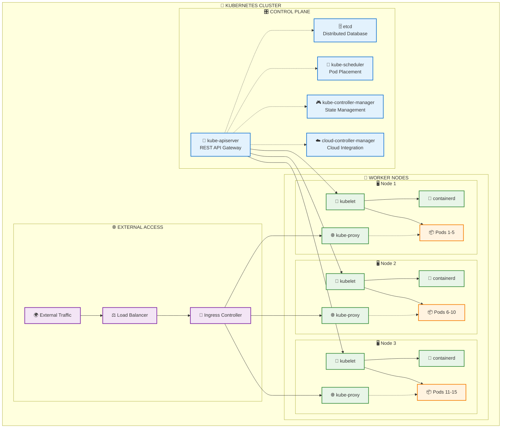
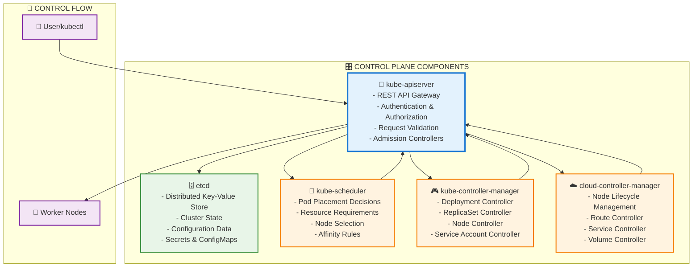
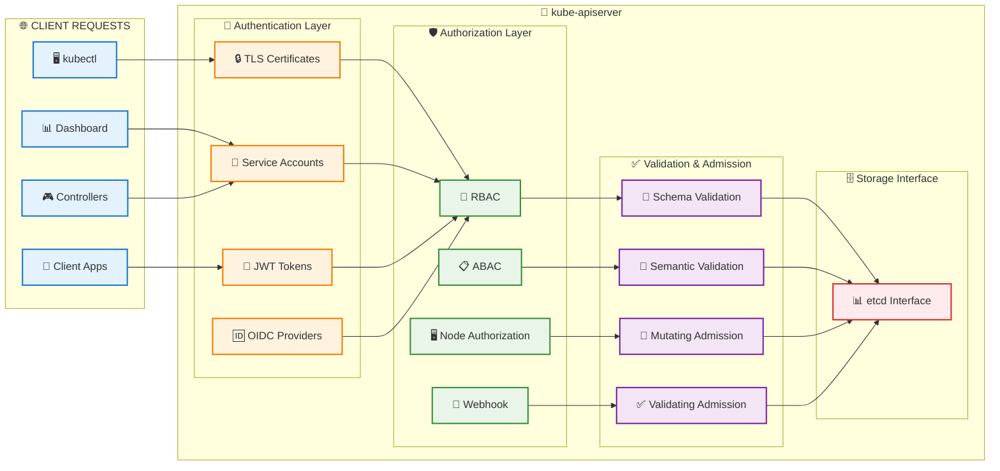
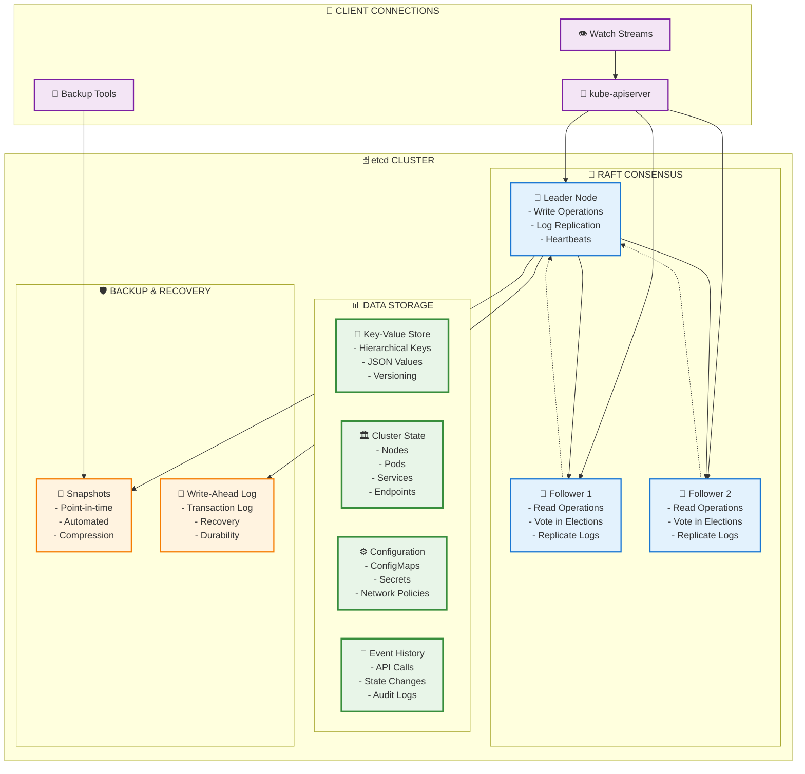
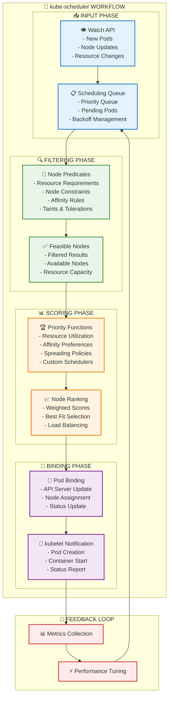
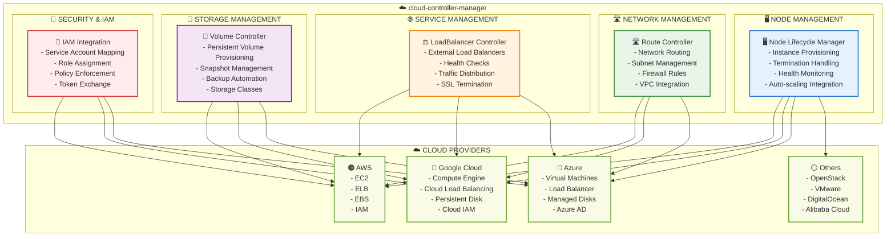
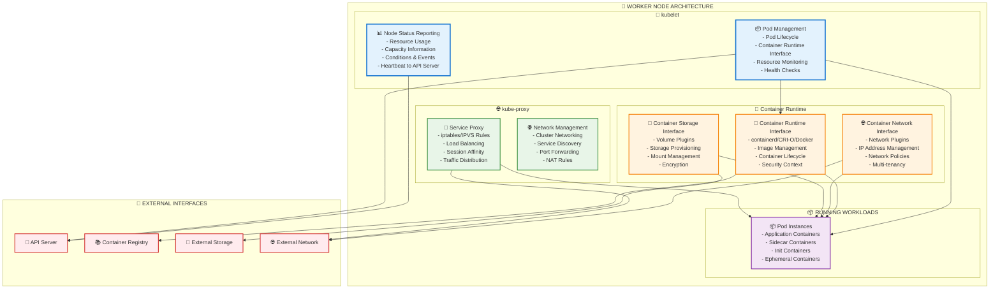
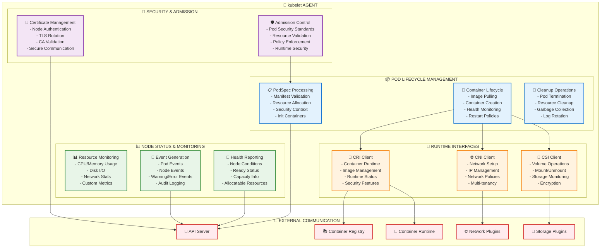

# 🏗️ Módulo 02: Arquitectura de Cluster Kubernetes

> **Componentes Técnicos del Cluster**: Entender cómo funciona Kubernetes por dentro - Control Plane, Workers, y la orquestación de todo el sistema.

---

## 📋 Objetivos de Aprendizaje

Al completar este módulo serás capaz de:

### 🎓 Objetivos Conceptuales
- **Arquitectura de alto nivel**: Visualizar y explicar la estructura completa de un cluster K8s
- **Control Plane vs Workers**: Distinguir claramente los roles y responsabilidades
- **Flujo de requests**: Entender el ciclo de vida de una petición en K8s
- **Componentes esenciales**: Conocer cada pieza del sistema y su función

### 🛠️ Objetivos Técnicos
- **Identificar componentes del Control Plane**: API Server, etcd, Scheduler, Controllers
- **Conocer componentes de Worker Nodes**: kubelet, kube-proxy, container runtime
- **Entender comunicación**: Cómo interactúan todos los componentes entre sí
- **Diagnosticar problemas básicos**: Usar kubectl para verificar estado de componentes
- **Arquitectura HA**: Comprender multi-master y tolerancia a fallos

### 🔍 Objetivos de Troubleshooting
- **Verificar salud del cluster**: kubectl get nodes, componentstatuses
- **Diagnosticar problemas de Control Plane**: Logs de API server, scheduler
- **Identificar problemas de Workers**: Estado de kubelet, pods en nodos
- **Entender puntos de fallo**: Qué sucede si falla cada componente

### 🏢 Objetivos Profesionales
- **Diseñar clusters**: Decidir arquitectura según requisitos (HA, escala)
- **Planear infraestructura**: Dimensionamiento de Control Plane y Workers
- **Preparación para certificaciones**: CKA (componentes), CKAD (contexto)
- **Conversaciones técnicas**: Hablar con confianza sobre arquitectura K8s

---

## ✅ Prerrequisitos

### Conocimientos Previos
- ✅ **Módulo 01 completado**: Entender QUÉ es K8s y POR QUÉ existe
- ✅ **Conceptos de redes**: IPs, puertos, APIs REST
- ✅ **Arquitecturas distribuidas**: Cliente-servidor, bases de datos
- ✅ **Linux básico**: Procesos, servicios, systemd

### Mindset Necesario
- 🧠 **Paciencia**: Esta es la parte más técnica hasta ahora
- 🧠 **Curiosidad por detalles**: Entender "cómo funciona" internamente
- 🧠 **Pensamiento sistémico**: Ver K8s como sistema distribuido complejo

### Herramientas (Opcional para este módulo)
- 🔧 **kubectl** (si quieres explorar en cluster real)
- 🔧 **Minikube** (se instalará en Módulo 03)
- 📝 **Diagrama mental**: Papel y lápiz para dibujar arquitectura

### Verificación
Este módulo es principalmente teórico. Si tienes acceso a un cluster:
```bash
# Ver componentes del Control Plane (si tienes acceso)
kubectl get componentstatuses

# Ver nodos del cluster
kubectl get nodes

# Ver pods del sistema
kubectl get pods -n kube-system
```

---

## 🗺️ Estructura del Módulo

### Contenido Teórico (60-90 minutos)
1. **Arquitectura General** (15 min) - Vista de alto nivel del cluster
2. **Control Plane Detallado** (20 min) - kube-apiserver, etcd, scheduler, controllers
3. **Worker Nodes Detallado** (15 min) - kubelet, kube-proxy, runtime
4. **Flujo de Comunicación** (15 min) - Cómo interactúan los componentes
5. **Alta Disponibilidad** (10 min) - Multi-master, tolerancia a fallos
6. **Addons del Sistema** (10 min) - DNS, Dashboard, Metrics Server

### Ejemplos Visuales (5 directorios)
- 📁 **01-arquitectura-general/** - Diagramas de cluster completo
- 📁 **02-control-plane/** - Componentes master en detalle
- 📁 **03-worker-nodes/** - Arquitectura de workers
- 📁 **04-alta-disponibilidad/** - HA con múltiples masters
- 📁 **05-addons/** - Componentes opcionales

### Laboratorios (conceptuales)
- 🔬 **Exploración de componentes**: Inspeccionar componentes en cluster real
- 🔬 **Análisis de logs**: Ver logs de API server y kubelet
- 🔬 **Verificación de salud**: Comandos para diagnóstico

---

## 📚 Rutas de Estudio Recomendadas

### 🟢 Ruta Principiante (Primera vez con arquitectura distribuida)
**Tiempo**: 2-3 horas (lectura + diagramas + notas)
```
Día 1: Arquitectura General (45 min)
  ├─ Sección 1: Vista de alto nivel
  ├─ Ver diagramas en 01-arquitectura-general/
  └─ Dibujar tu propia versión de la arquitectura

Día 1: Control Plane (45 min)
  ├─ Sección 2: Componentes del Control Plane
  ├─ Ver diagramas en 02-control-plane/
  └─ Hacer lista de qué hace cada componente

Día 2: Worker Nodes y Comunicación (60 min)
  ├─ Sección 3: Worker Nodes
  ├─ Sección 4: Flujo de comunicación
  ├─ Ver diagramas en 03-worker-nodes/
  └─ Trazar flujo de un "kubectl create pod"

Día 2: HA y Repaso (30 min)
  ├─ Sección 5: Alta disponibilidad
  ├─ RESUMEN-MODULO.md completo
  └─ Responder preguntas de repaso
```

### 🟡 Ruta Intermedia (Ya conoces sistemas distribuidos)
**Tiempo**: 90-120 minutos
```
Sesión Única:
  ├─ Lectura completa enfocada (60 min)
  │   ├─ Identificar componentes clave
  │   ├─ Entender flujo de comunicación
  │   └─ Ver todos los diagramas
  │
  ├─ Análisis de HA (20 min)
  │   └─ Arquitectura multi-master
  │
  └─ RESUMEN-MODULO.md (10 min)
      └─ Cheat sheet de componentes
```

### 🔴 Ruta Certificación (CKA/CKAD)
**Tiempo**: 45-60 minutos
```
Estrategia:
  ├─ RESUMEN-MODULO.md primero (20 min)
  │   ├─ Componentes esenciales
  │   ├─ Comandos de diagnóstico
  │   └─ Cheat sheet
  │
  ├─ Sección 2 y 3 (Control Plane + Workers) (20 min)
  │   └─ Enfoque en qué hace cada componente
  │
  └─ Comandos prácticos (10 min)
      ├─ kubectl get componentstatuses
      ├─ kubectl get nodes
      └─ kubectl logs <componente>

Memorizar para examen:
  - Componentes Control Plane: apiserver, etcd, scheduler, controller-manager
  - Componentes Workers: kubelet, kube-proxy, runtime
  - Puerto API server: 6443
  - etcd: puerto 2379
```

---

## 📁 Organización de Recursos

### Carpeta `ejemplos/`
```
ejemplos/
├── 01-arquitectura-general/
│   ├── README.md                      # Explicación arquitectura completa
│   ├── cluster-overview.png           # Vista general del cluster
│   └── componentes-interaccion.png    # Cómo se comunican componentes
│
├── 02-control-plane/
│   ├── README.md                      # Detalles Control Plane
│   ├── kube-apiserver.png             # API Server en detalle
│   ├── etcd-cluster.png               # etcd distribuido
│   ├── scheduler-workflow.png         # Flujo del scheduler
│   └── controllers.png                # Tipos de controllers
│
├── 03-worker-nodes/
│   ├── README.md                      # Arquitectura de workers
│   ├── node-components.png            # Componentes de un nodo
│   ├── kubelet-workflow.png           # Flujo del kubelet
│   └── kube-proxy-networking.png      # Networking con kube-proxy
│
├── 04-alta-disponibilidad/
│   ├── README.md                      # HA explicado
│   ├── multi-master.png               # Múltiples Control Planes
│   ├── etcd-ha.png                    # etcd con quorum
│   └── load-balancer.png              # LB frente a API servers
│
└── 05-addons/
    ├── README.md                      # Addons del sistema
    ├── coredns.png                    # DNS interno
    ├── metrics-server.png             # Recolección de métricas
    └── dashboard.png                  # Kubernetes Dashboard
```

---

## 🎯 Metodología de Aprendizaje

Este módulo es **70% teórico, 30% visual**:

### Distribución de Contenido
```
📖 Teoría arquitectura        50%  ██████████▓░░░░░░░░░
🎨 Diagramas y visuales        30%  ██████▓░░░░░░░░░░░░░
🔍 Análisis y exploración      20%  ████▓░░░░░░░░░░░░░░░
```

### Enfoque Pedagógico
1. **Capas progresivas**: De general a específico
   - Vista de alto nivel → Control Plane → Workers → Comunicación
2. **Analogías**: Comparar con sistemas conocidos
   - API Server = Recepcionista de hospital
   - etcd = Base de datos central
   - Scheduler = Gerente asignando tareas
3. **Diagramas abundantes**: Una imagen vale más que mil palabras
4. **Sin práctica hands-on**: Eso viene en Módulo 03+

### Flujo de Trabajo
```
1. Lee sección teórica → 2. Ve diagrama correspondiente → 3. Toma notas
                ↓
4. Dibuja tu propia versión → 5. Continúa siguiente sección
                ↓
6. Repasa RESUMEN-MODULO.md → 7. Preguntas de repaso
```

---

## 🔗 Conexión con Otros Módulos

### Este Módulo te Prepara Para
- ➡️ **Módulo 03**: Instalación de Minikube (verás componentes en acción)
- ➡️ **Módulo 04+**: Creación de recursos (entenderás dónde viven)
- ➡️ **Módulo 08-09**: Networking (kube-proxy, Services, Ingress)
- ➡️ **Módulo 17-18**: RBAC (API Server, autenticación)

### Relación con Módulo Anterior
```
Módulo 01: ¿QUÉ es K8s? ¿POR QUÉ existe?
              ↓
Módulo 02: ¿CÓMO funciona? (arquitectura) ← ESTÁS AQUÍ
              ↓
Módulo 03: Instalación (ver arquitectura real)
```

---

## 🎯 Objetivos del Módulo (Expandido)

Al completar este módulo serás capaz de:

- ✅ **Identificar todos los componentes** del Control Plane y explicar su función
- ✅ **Entender la arquitectura** de Worker Nodes y cómo ejecutan workloads
- ✅ **Explicar la comunicación** entre componentes (API Server como centro)
- ✅ **Diagnosticar problemas básicos** usando kubectl para verificar estado
- ✅ **Visualizar el flujo** completo de un request (kubectl → API → Scheduler → kubelet → Pod)
- ✅ **Comprender Alta Disponibilidad** con múltiples masters y etcd distribuido
- ✅ **Reconocer addons** esenciales (CoreDNS, Metrics Server, Dashboard)

---

## 🏛️ 1. Arquitectura General

### **🎯 Vista de Alto Nivel:**



### **📋 Explicación del Diagrama:**

**🎛️ CONTROL PLANE (Plano de Control):**
- **📡 kube-apiserver**: Punto central de comunicación - todos los componentes hablan con él
- **🗄️ etcd**: Base de datos distribuida que almacena todo el estado del cluster
- **🧠 kube-scheduler**: Inteligencia que decide en qué nodo colocar cada Pod
- **🎮 kube-controller-manager**: Gestores que mantienen el estado deseado del sistema
- **☁️ cloud-controller-manager**: Integración específica con proveedores de nube

**💪 WORKER NODES (Nodos de Trabajo):**
- **🤖 kubelet**: Agente en cada nodo que ejecuta y monitorea los Pods
- **🌐 kube-proxy**: Gestiona la red y el balanceo de carga para los servicios
- **🐳 containerd**: Runtime que ejecuta los contenedores dentro de los Pods
- **📦 Pods**: Unidades mínimas de despliegue que contienen las aplicaciones

**🌐 ACCESO EXTERNO:**
- **🌍 External Traffic**: Tráfico de usuarios externos (internet, VPN, etc.)
- **⚖️ Load Balancer**: Distribuye el tráfico entre múltiples puntos de entrada
- **🚪 Ingress Controller**: Enruta las requests HTTP/HTTPS a los servicios internos

**🔄 Flujo de Comunicación:**
1. **Control Interno**: API Server se comunica con etcd para persistir estado
2. **Coordinación**: Scheduler y Controller Manager consultan API Server para decisiones
3. **Ejecución**: API Server envía instrucciones a kubelet en cada worker node
4. **Networking**: kube-proxy gestiona la conectividad entre Pods y servicios
5. **Acceso Externo**: External Traffic → Load Balancer → Ingress → kube-proxy → Pods

**🎨 Diagrama Interactivo Completo:**

[](https://app.diagrams.net/#Uhttps://raw.githubusercontent.com/Harol-Reina/kubernetes-aks-course/main/area-2-arquitectura-kubernetes/assets/diagrams/02-arquitectura-cluster/cluster-overview.drawio)

> 🔗 **[Abrir diagrama interactivo en Draw.io](https://app.diagrams.net/#Uhttps://raw.githubusercontent.com/Harol-Reina/kubernetes-aks-course/main/area-2-arquitectura-kubernetes/assets/diagrams/02-arquitectura-cluster/cluster-overview.drawio)**

### **🔑 Principios Fundamentales:**

1. **Separación de Responsabilidades**: Control vs Workload
2. **API-Driven**: Todo pasa por el API Server
3. **Desired State**: Control loops mantienen estado deseado
4. **Distributed**: Componentes pueden ejecutarse en múltiples nodos
5. **Extensible**: Plugins y custom resources

---

## 🧠 2. Control Plane (Master Nodes)



**� Diagrama Detallado del Control Plane:**

[](https://app.diagrams.net/#Uhttps://raw.githubusercontent.com/Harol-Reina/kubernetes-aks-course/main/area-2-arquitectura-kubernetes/assets/diagrams/02-arquitectura-cluster/control-plane-detailed.drawio)

> 🔗 **[Abrir diagrama interactivo en Draw.io](https://app.diagrams.net/#Uhttps://raw.githubusercontent.com/Harol-Reina/kubernetes-aks-course/main/area-2-arquitectura-kubernetes/assets/diagrams/02-arquitectura-cluster/control-plane-detailed.drawio)**

### **🎛️ Componentes del Control Plane:**

#### **2.1 API Server (kube-apiserver)**



**Función**: Punto de entrada único para todas las operaciones del cluster

[](https://app.diagrams.net/#Uhttps://raw.githubusercontent.com/Harol-Reina/kubernetes-aks-course/main/area-2-arquitectura-kubernetes/assets/diagrams/02-arquitectura-cluster/api-request-flow.drawio)

**� Flujo completo de procesamiento de requests en el API Server de Kubernetes**

El API Server de Kubernetes procesa todas las requests siguiendo un pipeline estructurado en 4 etapas principales:

#### 🔐 **Etapa 1: Autenticación**
- **TLS Certificates**: Autenticación mutua con certificados y cadena de CA
- **Service Accounts**: Cuentas de servicio por defecto y personalizadas con gestión de tokens
- **JWT Tokens**: Tokens Bearer con verificación de expiración y firma
- **OIDC Providers**: Identidad externa integrada con LDAP y Active Directory

#### 🛡️ **Etapa 2: Autorización**
- **RBAC**: Control de acceso basado en roles con Roles y RoleBindings
- **ABAC**: Control de acceso basado en atributos con motor de políticas
- **Node Authorization**: Permisos específicos para kubelet y recursos de nodos
- **Webhook**: Autorización externa con motor de políticas personalizado

#### ✅ **Etapa 3: Validación y Control de Admisión**
- **Schema Validation**: Verificación de esquema JSON con validación de tipos y formatos
- **Semantic Validation**: Verificación de lógica de negocio y dependencias de recursos
- **Mutating Admission**: Modificación de objetos con inyección de valores por defecto y etiquetas
- **Validating Admission**: Aplicación de políticas y cumplimiento de seguridad

#### 🗄️ **Etapa 4: Interfaz de Almacenamiento**
- **Operaciones CRUD**: Creación, lectura, actualización y eliminación de recursos
- **Watch Streams**: Actualizaciones en tiempo real con notificaciones de eventos
- **Actualizaciones Atómicas**: Seguridad transaccional con garantías de consistencia
- **Historial de Eventos**: Auditoría y seguimiento de cambios
- **Consistencia**: Consistencia fuerte con cumplimiento ACID

[🔗 **Editar Diagrama en Draw.io**](https://app.diagrams.net/?mode=github&url=https%3A%2F%2Fraw.githubusercontent.com%2Fuser%2Frepo%2Fbranch%2Fassets%2Fdiagrams%2F02-arquitectura-cluster%2Fapi-request-flow.drawio)
                                                                                         │


**Responsabilidades:**
- ✅ **Autenticación y autorización** de requests
- ✅ **Validación** de objetos de Kubernetes
- ✅ **Admission control** y políticas
- ✅ **RESTful API** para todos los recursos
- ✅ **Frontend** único para el cluster

**Ejemplo de interacción:**
```bash
# Todo pasa por API Server
kubectl get pods              # → GET /api/v1/pods
kubectl create deployment     # → POST /apis/apps/v1/deployments
kubectl scale deployment      # → PATCH /apis/apps/v1/deployments
```

#### **2.2 etcd - Almacén de Estado Distribuido**



**Función**: Base de datos distribuida que almacena todo el estado del cluster

**🏗️ Arquitectura de Almacenamiento etcd:**
```
┌─────────────────────────────────────────────────────────────────────────────────────────────────┐
│                              🗄️ etcd DISTRIBUTED DATABASE                                       │
│                                                                                                 │
│  ┌────────────────────────────────────────────────────────────────────────────────────────────┐ │
│  │                            📊 DATA ORGANIZATION                                            │ │
│  │  ┌─────────────────┐ ┌─────────────────┐ ┌─────────────────┐ ┌─────────────────┐           │ │
│  │  │🏛️ Cluster State │ │⚙️ Configuration │ │🔐 Secrets       │ │📦 ConfigMaps    │           │ │
│  │  │                 │ │                 │ │                 │ │                 │           │ │
│  │  │/registry/       │ │/registry/       │ │/registry/       │ │/registry/       │           │ │
│  │  │  nodes/         │ │  configmaps/    │ │  secrets/       │ │  configmaps/    │           │ │
│  │  │  pods/          │ │  networkpolicies│ │  default/       │ │  kube-system/   │           │ │
│  │  │  services/      │ │  storageclasses/│ │  kube-system/   │ │  default/       │           │ │
│  │  │  endpoints/     │ │  csinodes/      │ │  tls-certs/     │ │  app-configs/   │           │ │
│  │  │  deployments/   │ │  persistentv/   │ │  docker-registry│ │  feature-flags/ │           │ │
│  │  │  replicasets/   │ │  validating/    │ │  ssh-keys/      │ │  environments/  │           │ │
│  │  │  namespaces/    │ │  mutating/      │ │  api-tokens/    │ │  templates/     │           │ │
│  │  └─────────────────┘ └─────────────────┘ └─────────────────┘ └─────────────────┘           │ │
│  │  ┌─────────────────┐ ┌─────────────────┐ ┌─────────────────┐ ┌─────────────────┐           │ │
│  │  │📝 Events        │ │👥 RBAC          │ │🌐 Network       │ │💾 Storage       │           │ │
│  │  │                 │ │                 │ │                 │ │                 │           │ │
│  │  │/registry/       │ │/registry/       │ │/registry/       │ │/registry/       │           │ │
│  │  │  events/        │ │  roles/         │ │  services/      │ │  persistentv/   │           │ │
│  │  │  audit/         │ │  rolebindings/  │ │  ingresses/     │ │  storageclasses/│           │ │
│  │  │  warnings/      │ │  clusterroles/  │ │  networkpolicies│ │  volumeclaims/  │           │ │
│  │  │  normal/        │ │  clusterrolebind│ │  endpoints/     │ │  csidriver/     │           │ │
│  │  │  failed/        │ │  serviceaccounts│ │  endpointslices/│ │  csistoragecap/ │           │ │
│  │  └─────────────────┘ └─────────────────┘ └─────────────────┘ └─────────────────┘           │ │
│  └────────────────────────────────────────────────────────────────────────────────────────────┘ │
│                                         ▲                                                       │
│                                         │                                                       │
│  ┌──────────────────────────────────────┼─────────────────────────────────────────────────────┐ │
│  │                         🔄 RAFT CONSENSUS ALGORITHM                                        │ │
│  │                                      │                                                     │ │
│  │  ┌───────────────────────────────────┼─────────────────────────────────────────────────┐   │ │
│  │  │                   👑 LEADER NODE  │                                                 │   │ │
│  │  │  ┌─────────────────┐ ┌────────────┼──────────┐ ┌─────────────────┐ ┌──────────────┐ │   │ │
│  │  │  │📝 Write Ops     │ │🔄 Log Repl │ication   │ │💓 Heartbeats    │ │⚖️ LoadBalance│ │   │ │
│  │  │  │   - PUT/POST    │ │   - Entries│          │ │   - Health      │ │              │ │   │ │
│  │  │  │   - DELETE      │ │   - Order  │          │ │   - Timeout     │ │              │ │   │ │
│  │  │  │   - PATCH       │ │   - Commit │          │ │   - Election    │ │              │ │   │ │
│  │  │  └─────────────────┘ └────────────┼──────────┘ └─────────────────┘ └──────────────┘ │   │ │
│  │  └───────────────────────────────────┼─────────────────────────────────────────────────┘   │ │
│  │                                      ▼                                                     │ │
│  │  ┌───────────────────────────────────────────────────────────────────────────────────────┐ │ │
│  │  │                            🤝 FOLLOWER NODES                                          │ │ │
│  │  │  ┌─────────────────┐ ┌─────────────────┐ ┌─────────────────┐ ┌─────────────────┐      │ │ │
│  │  │  │📖 Read Ops      │ │🗳️ Elections     │ │📥 Log Entries   │ │🔍 Health Checks │      │ │ │
│  │  │  │   - GET         │ │   - Vote Cast   │ │   - Replication │ │   - Node Status │      │ │ │
│  │  │  │   - LIST        │ │   - Term Inc    │ │   - Apply Order │ │   - Conn Status │      │ │ │
│  │  │  │   - WATCH       │ │   - Candidate   │ │   - Consistency │ │   - Sync Status │      │ │ │
│  │  │  └─────────────────┘ └─────────────────┘ └─────────────────┘ └─────────────────┘      │ │ │
│  │  └───────────────────────────────────────────────────────────────────────────────────────┘ │ │
│  └────────────────────────────────────────────────────────────────────────────────────────────┘ │
│                                         ▲                                                       │
│                                         │                                                       │
│  ┌──────────────────────────────────────┼─────────────────────────────────────────────────────┐ │
│  │                      🛡️ BACKUP & RECOVERY SYSTEM                                           │ │
│  │  ┌─────────────────┐ ┌─────────────────┐ ┌─────────────────┐ ┌─────────────────┐           │ │
│  │  │📸 Snapshots     │ │📜 Write-Ahead   │ │🔄 Recovery      │ │🗜️ Compression   │           │ │
│  │  │   - Point-time  │ │   Log (WAL)     │ │   - Auto Repair │ │   - Storage Opt │           │ │
│  │  │   - Scheduled   │ │   - Durability  │ │   - Data Restore│ │   - Bandwidth   │           │ │
│  │  │   - Manual      │ │   - Transaction │ │   - Consistency │ │   - Encryption  │           │ │
│  │  │   - Incremental │ │   - Recovery    │ │   - Validation  │ │   - Dedup       │           │ │
│  │  └─────────────────┘ └─────────────────┘ └─────────────────┘ └─────────────────┘           │ │
│  └────────────────────────────────────────────────────────────────────────────────────────────┘ │
│                                                                                                 │
└─────────────────────────────────────────────────────────────────────────────────────────────────┘
```

**Responsabilidades:**
- ✅ **Almacenamiento** de todo el estado del cluster
- ✅ **Consistencia** ACID para operaciones críticas
- ✅ **Distribución** con consenso RAFT para alta disponibilidad
- ✅ **Watch API** para notificaciones en tiempo real
- ✅ **Backup/Recovery** con snapshots automáticos
- ✅ **Encriptación** de datos en reposo

**Ejemplo de datos almacenados:**
```bash
# Estructura jerárquica en etcd
/registry/pods/default/nginx-deployment-abc123
/registry/deployments/default/web-application
/registry/services/default/api-gateway-service
/registry/configmaps/kube-system/cluster-configuration
/registry/secrets/default/database-credentials
```

#### **2.3 Scheduler (kube-scheduler)**



**Función**: Inteligencia para la colocación óptima de Pods en el cluster

[](../../assets/diagrams/02-arquitectura-cluster/scheduler-process.drawio)

**🎯 Proceso Profesional de Scheduling:**

> 🔗 **[Editar Diagrama en Draw.io](https://app.diagrams.net/#Uhttps://raw.githubusercontent.com/Harol-Reina/kubernetes-aks-course/main/area-2-arquitectura-kubernetes/assets/diagrams/02-arquitectura-cluster/scheduler-process.drawio)**

**📋 Etapas del Proceso:**

1. **📥 INPUT**: Monitor de nuevos pods y cambios de nodos
2. **🔍 FILTERING**: Aplicación de predicados para encontrar nodos viables  
3. **📊 SCORING**: Clasificación de nodos usando funciones de prioridad
4. **🎯 BINDING**: Asignación del pod al mejor nodo y notificación al kubelet

**⚡ Métricas de Rendimiento:**
- **Tiempo típico**: 5-10ms por pod
- **Throughput**: 1000+ pods/segundo  
- **Predicados estándar**: 15+ filtros automáticos
- **Funciones de prioridad**: 10+ algoritmos de scoring
```
┌─────────────────────────────────────────────────────────────────────────────────────────┐
│  ┌────────────────────────────────────────────────────────────────────────────────────┐ │
│  │                           📊 SCORING PHASE (Priorities)                            │ │
│  │  ┌─────────────────┐ ┌─────────────────┐ ┌─────────────────┐ ┌─────────────────┐   │ │
│  │  │⚖️ Load Balancing│ │📏 Resource Util │ │🎯 Affinity Pref │ │🌍 Zone Spread   │   │ │
│  │  │   - Even Distrib│ │   - CPU Usage   │ │   - Preferences │ │   - Multi-Zone  │   │ │
│  │  │   - Replica Spr │ │   - Memory Load │ │   - Soft Rules  │ │   - Failure Dom │   │ │
│  │  │   - Anti-Affin  │ │   - Disk I/O    │ │   - Weights     │ │   - Region Dist │   │ │
│  │  │   - Pod Density │ │   - Network BW  │ │   - Priorities  │ │   - Rack Aware  │   │ │
│  │  └─────────────────┘ └─────────────────┘ └─────────────────┘ └─────────────────┘   │ │
│  │  ┌─────────────────┐ ┌─────────────────┐ ┌─────────────────┐ ┌─────────────────┐   │ │
│  │  │🏆 Priority Class│ │💰 Cost Optimiz  │ │🔧 Maintenance   │ │📊 Performance   │   │ │
│  │  │   - High Prior  │ │   - Spot Inst   │ │   - Drain Nodes │ │   - Latency     │   │ │
│  │  │   - Preemption  │ │   - Reserved    │ │   - Upgrades    │ │   - Throughput  │   │ │
│  │  │   - QoS Classes │ │   - On-Demand   │ │   - Cordon      │ │   - IOPS        │   │ │
│  │  │   - SLA Levels  │ │   - Savings     │ │   - Scheduling  │ │   - Optimization│   │ │
│  │  └─────────────────┘ └─────────────────┘ └─────────────────┘ └─────────────────┘   │ │
│  └─────────────────────────────────────────────────────────────────────────────────────┘│
│                                         ▼                                               │
│  ┌────────────────────────────────────────────────────────────────────────────────────┐ │
│  │                            🎯 BINDING & NOTIFICATION                               │ │
│  │  ┌─────────────────┐ ┌─────────────────┐ ┌─────────────────┐ ┌─────────────────┐   │ │
│  │  │🔗 Pod Binding   │ │📡 API Update    │ │🤖 kubelet Notify│ │📊 Metrics       │   │ │
│  │  │   - Node Assign │ │   - etcd Write  │ │   - Pod Creation│ │   - Schedule    │   │ │
│  │  │   - Spec Update │ │   - Event Log   │ │   - Image Pull  │ │   - Latency     │   │ │
│  │  │   - Status Set  │ │   - Audit Trail │ │   - Container   │ │   - Success Rate│   │ │
│  │  │   - Annotation  │ │   - Watch Notify│ │   - Health Check│ │   - Node Utiliz │   │ │
│  │  └─────────────────┘ └─────────────────┘ └─────────────────┘ └─────────────────┘   │ │
│  └────────────────────────────────────────────────────────────────────────────────────┘ │
│                                                                                         │
└─────────────────────────────────────────────────────────────────────────────────────────┘
```
**Ejemplo de proceso de scheduling:**

1. **Filtering (Predicates)**:
```yaml
# Nodos válidos basado en:
spec:
  nodeSelector: 
    disk: "ssd"
    zone: "us-west-1a"
  resources:
    requests:
      cpu: "500m"
      memory: "1Gi"
      nvidia.com/gpu: "1"
  tolerations: 
  - key: "node-type"
    operator: "Equal"
    value: "gpu"
    effect: "NoSchedule"
  affinity:
    nodeAffinity:
      requiredDuringSchedulingIgnoredDuringExecution:
        nodeSelectorTerms:
        - matchExpressions:
          - key: "topology.kubernetes.io/zone"
            operator: In
            values: ["us-west-1a", "us-west-1b"]
```

2. **Scoring (Priorities)**:
```yaml
# Ranking de nodos por:
- LeastRequestedPriority: 85      # Menor uso de recursos (85/100)
- BalancedResourceAllocation: 78  # Balance CPU/Memory (78/100)
- NodeAffinityPriority: 92        # Cumple preferencias (92/100)
- InterPodAffinityPriority: 71    # Cumple afinidad pods (71/100)
- TaintTolerationPriority: 100    # Tolera taints (100/100)
- SelectorSpreadPriority: 88      # Distribución uniforme (88/100)
# Nodo final seleccionado: node-gpu-west-1a (Score: 89/100)
```

3. **Binding**:
```bash
# Resultado final
kubectl get pod web-app-abc123 -o wide
NAME            READY   STATUS    NODE
web-app-abc123  1/1     Running   node-gpu-west-1a
```

#### **2.4 Controller Manager (kube-controller-manager)**

```mermaid
graph TB
    subgraph "🎮 kube-controller-manager"
        subgraph "🚀 WORKLOAD CONTROLLERS"
            DEPLOY[📦 Deployment Controller<br/>- Rolling Updates<br/>- Rollback Management<br/>- Revision History]
            RS[📋 ReplicaSet Controller<br/>- Pod Scaling<br/>- Replica Management<br/>- Pod Recreation]
            JOB[🎫 Job Controller<br/>- Batch Processing<br/>- Completion Tracking<br/>- Parallel Execution]
            CRON[⏰ CronJob Controller<br/>- Scheduled Execution<br/>- History Management<br/>- Timezone Support]
        end
        
        subgraph "🖥️ NODE CONTROLLERS"
            NODE[🖥️ Node Controller<br/>- Health Monitoring<br/>- Lease Management<br/>- Eviction Control]
            NSL[🌐 NodeLifecycle Controller<br/>- Ready/NotReady States<br/>- Taint Management<br/>- Pod Eviction]
        end
        
        subgraph "🌐 SERVICE CONTROLLERS"
            SVC[🌐 Service Controller<br/>- Endpoint Management<br/>- Load Balancer Sync<br/>- ClusterIP Assignment]
            EP[🔗 Endpoint Controller<br/>- Service Discovery<br/>- Pod IP Tracking<br/>- Health Checks]
            ING[🚪 Ingress Controller<br/>- Traffic Routing<br/>- TLS Termination<br/>- Path-based Routing]
        end
        
        subgraph "🔐 SECURITY CONTROLLERS"
            SA[👤 ServiceAccount Controller<br/>- Token Management<br/>- Secret Injection<br/>- RBAC Integration]
            RBAC[🛡️ RBAC Controller<br/>- Role Management<br/>- Permission Updates<br/>- Access Control]
        end
        
        subgraph "📁 RESOURCE CONTROLLERS"
            NS[📁 Namespace Controller<br/>- Lifecycle Management<br/>- Resource Cleanup<br/>- Finalizers]
            PV[💾 PersistentVolume Controller<br/>- Volume Binding<br/>- Storage Classes<br/>- Provisioning]
            QUOTA[📊 ResourceQuota Controller<br/>- Usage Tracking<br/>- Limit Enforcement<br/>- Reporting]
        end
    end
    
    subgraph "🔄 CONTROL LOOP"
        API_WATCH[👁️ API Server Watch]
        DESIRED[🎯 Desired State]
        CURRENT[📊 Current State]
        RECONCILE[🔄 Reconciliation]
    end
    
    API_WATCH --> DESIRED
    DESIRED --> CURRENT
    CURRENT --> RECONCILE
    RECONCILE --> API_WATCH
    
    %% Controller connections
    DEPLOY --> RECONCILE
    RS --> RECONCILE
    JOB --> RECONCILE
    CRON --> RECONCILE
    NODE --> RECONCILE
    NSL --> RECONCILE
    SVC --> RECONCILE
    EP --> RECONCILE
    ING --> RECONCILE
    SA --> RECONCILE
    RBAC --> RECONCILE
    NS --> RECONCILE
    PV --> RECONCILE
    QUOTA --> RECONCILE
    
    classDef workload fill:#e3f2fd,stroke:#1976d2,stroke-width:2px
    classDef node fill:#e8f5e8,stroke:#388e3c,stroke-width:2px
    classDef service fill:#fff3e0,stroke:#f57c00,stroke-width:2px
    classDef security fill:#f3e5f5,stroke:#7b1fa2,stroke-width:2px
    classDef resource fill:#ffebee,stroke:#d32f2f,stroke-width:2px
    classDef control fill:#f9fbe7,stroke:#689f38,stroke-width:2px
    
    class DEPLOY,RS,JOB,CRON workload
    class NODE,NSL node
    class SVC,EP,ING service
    class SA,RBAC security
    class NS,PV,QUOTA resource
    class API_WATCH,DESIRED,CURRENT,RECONCILE control
```



**Función**: Conjunto de control loops que mantienen el estado deseado del cluster
**🔄 Control Loop Pattern (Reconciliation)**:
```
┌──────────────────────────────────────────────────────────────────────────────────────────┐
│                          🎮 CONTROLLER MANAGER - CONTROL LOOPS                           │
│                                                                                          │
│  ┌─────────────────────────────────────────────────────────────────────────────────────┐ │
│  │                              🔄 RECONCILIATION PATTERN                              │ │
│  │                                                                                     │ │
│  │  ┌─────────────┐    ┌─────────────┐    ┌─────────────┐    ┌─────────────┐           │ │
│  │  │👁️ Watch API │───►│🎯 Desired   │───►│📊 Current   │───►│🔄 Reconcile │           │ │
│  │  │   Events    │    │   State     │    │   State     │    │   Actions   │           │ │
│  │  │             │    │             │    │             │    │             │           │ │
│  │  │- Create     │    │- Spec       │    │- Status     │    │- Create     │           │ │
│  │  │- Update     │    │- Replicas: 3│    │- Ready: 2   │    │- Update     │           │ │
│  │  │- Delete     │    │- Image      │    │- Conditions │    │- Delete     │           │ │
│  │  │- Error      │    │- Resources  │    │- Metrics    │    │- Scale      │           │ │
│  │  └─────────────┘    └─────────────┘    └─────────────┘    └─────────────┘           │ │
│  │          ▲                                                        │                 │ │
│  │          │                                                        ▼                 │ │
│  │          └────────────────────────── CONTINUOUS LOOP ─────────────┘                 │ │
│  └─────────────────────────────────────────────────────────────────────────────────────┘ │
│                                                                                          │
│  ┌─────────────────────────────────────────────────────────────────────────────────────┐ │
│  │                            🚀 WORKLOAD CONTROLLERS                                  │ │
│  │  ┌─────────────────┐ ┌─────────────────┐ ┌─────────────────┐ ┌─────────────────┐    │ │
│  │  │📦 Deployment    │ │📋 ReplicaSet    │ │🎫 Job           │ │⏰ CronJob       │    │ │
│  │  │   Controller    │ │   Controller    │ │   Controller    │ │   Controller    │    │ │
│  │  │                 │ │                 │ │                 │ │                 │    │ │
│  │  │🔄 Rolling Update│ │📊 Scale Up/Down │ │✅ Completion    │ │📅 Schedule      │    │ │
│  │  │📚 Revisions     │ │🔄 Pod Recreation│ │🔁 Retry Logic   │ │📈 History Mgmt  │    │ │
│  │  │⏪ Rollback      │ │⚖️ Load Balance  │ │⏸️ Parallelism   │ │🕐 Timezone      │    │ │
│  │  │🎯 Strategy      │ │🏥 Health Check  │ │🔒 Security Ctx  │ │🚫 Suspend       │    │ │
│  │  └─────────────────┘ └─────────────────┘ └─────────────────┘ └─────────────────┘    │ │
│  └─────────────────────────────────────────────────────────────────────────────────────┘ │
│                                                                                          │
│  ┌─────────────────────────────────────────────────────────────────────────────────────┐ │
│  │                           🖥️ INFRASTRUCTURE CONTROLLERS                             │ │
│  │  ┌─────────────────┐ ┌─────────────────┐ ┌─────────────────┐ ┌─────────────────┐    │ │
│  │  │🖥️ Node          │ │🔄 NodeLifecycle │ │🌐 Service       │ │🔗 Endpoint      │    │ │
│  │  │   Controller    │ │   Controller    │ │   Controller    │ │   Controller    │    │ │
│  │  │                 │ │                 │ │                 │ │                 │    │ │
│  │  │💓 Health Mon    │ │🟢 Ready/NotReady│ │⚖️ Load Balancer │ │🎯 Service Disc  │    │ │
│  │  │⏰ Lease Mgmt    │ │🏷️ Taint Mgmt    │ │🌐 ClusterIP     │ │📍 Pod IP Track  │    │ │
│  │  │🚫 Eviction      │ │👥 Pod Eviction  │ │🔄 Sync External │ │🔍 Health Check  │    │ │
│  │  │📊 Conditions    │ │🕐 Grace Period  │ │📡 External IP   │ │📊 Ready Count   │    │ │
│  │  └─────────────────┘ └─────────────────┘ └─────────────────┘ └─────────────────┘    │ │
│  └─────────────────────────────────────────────────────────────────────────────────────┘ │
│                                                                                          │
│  ┌─────────────────────────────────────────────────────────────────────────────────────┐ │
│  │                            🔐 SECURITY & ACCESS CONTROLLERS                         │ │
│  │  ┌─────────────────┐ ┌─────────────────┐ ┌─────────────────┐ ┌─────────────────┐    │ │
│  │  │👤 ServiceAccount│ │🛡️ RBAC          │ │📁 Namespace     │ │🎫 Token         │    │ │
│  │  │   Controller    │ │   Controller    │ │   Controller    │ │   Controller    │    │ │
│  │  │                 │ │                 │ │                 │ │                 │    │ │
│  │  │🔑 Token Mgmt    │ │👥 Role Mgmt     │ │🔄 Lifecycle     │ │⏰ Rotation      │    │ │
│  │  │🔐 Secret Inject │ │🔐 Permission    │ │🧹 Cleanup       │ │🚫 Expiration    │    │ │
│  │  │🔗 RBAC Integr   │ │📋 Updates       │ │🏁 Finalizers    │ │🔐 Auto-mount    │    │ │
│  │  │📊 Auto-creation │ │🔍 Access Control│ │🗑️ Resource Del  │ │📊 Usage Track   │    │ │
│  │  └─────────────────┘ └─────────────────┘ └─────────────────┘ └─────────────────┘    │ │
│  └─────────────────────────────────────────────────────────────────────────────────────┘ │
│                                                                                          │
│  ┌─────────────────────────────────────────────────────────────────────────────────────┐ │
│  │                           💾 STORAGE & RESOURCE CONTROLLERS                         │ │
│  │  ┌─────────────────┐ ┌─────────────────┐ ┌─────────────────┐ ┌─────────────────┐    │ │
│  │  │💾 PersistentVol │ │📊 ResourceQuota │ │🚫 LimitRange    │ │🗂️ CSI           │    │ │
│  │  │   Controller    │ │   Controller    │ │   Controller    │ │   Controller    │    │ │
│  │  │                 │ │                 │ │                 │ │                 │    │ │
│  │  │🔗 Volume Bind   │ │📈 Usage Track   │ │⚖️ Resource Limit│ │🔌 Driver Mgmt   │    │ │
│  │  │🏭 Provisioning  │ │🚫 Limit Enforce │ │🔍 Validation    │ │📦 Volume Attach │    │ │
│  │  │📊 Storage Class │ │📊 Reporting     │ │📋 Default Set   │ │🔄 Mount/Unmount │    │ │
│  │  │🔄 Status Update │ │🔔 Alerts        │ │🎯 Policy Apply  │ │🛠️ Capabilities  │    │ │
│  │  └─────────────────┘ └─────────────────┘ └─────────────────┘ └─────────────────┘    │ │
│  └─────────────────────────────────────────────────────────────────────────────────────┘ │
│                                                                                          │
└──────────────────────────────────────────────────────────────────────────────────────────┘
```

**Ejemplo de Controller en acción:**

```yaml
# Deployment deseado
apiVersion: apps/v1
kind: Deployment
metadata:
  name: web-app
spec:
  replicas: 3              # DESIRED STATE
  selector:
    matchLabels:
      app: web
  template:
    metadata:
      labels:
        app: web
    spec:
      containers:
      - name: nginx
        image: nginx:1.21
        resources:
          requests:
            cpu: 100m
            memory: 128Mi
```

```bash
# Controller detecta diferencia y reconcilia
kubectl get pods -l app=web
NAME                      READY   STATUS    RESTARTS   AGE
web-app-abc123           1/1     Running   0          30s
web-app-def456           1/1     Running   0          30s
# Solo 2 pods → Controller crea el tercero
web-app-ghi789           0/1     Pending   0          1s


┌──────────────────────────────────────────────┐
│  ┌─────────────────────────────────────────┐ │
│  │Controller   │Controller   │Controller   │ │
│  └─────────────┴─────────────┴─────────────┘ │
└──────────────────────────────────────────────┘
```

**Controllers principales:**

```go
// Ejemplo conceptual: ReplicaSet Controller
for {
    desired := getReplicaSetSpec().Replicas
    current := countRunningPods()
    
    if current < desired {
        createPods(desired - current)
    } else if current > desired {
        deletePods(current - desired)
    }
    
    sleep(reconcileInterval)
}
```

#### **2.5 Cloud Controller Manager (cloud-controller-manager)**



**Función**: Interfaz entre Kubernetes y proveedores de nube

**☁️ Integración con Proveedores de Nube:**
```
┌──────────────────────────────────────────────────────────────────────────────────────────┐
│                         ☁️ CLOUD CONTROLLER MANAGER                                      │
│                                                                                          │
│  ┌─────────────────────────────────────────────────────────────────────────────────────┐ │
│  │                           🖥️ NODE LIFECYCLE MANAGEMENT                              │ │
│  │  ┌─────────────────┐ ┌─────────────────┐ ┌─────────────────┐ ┌─────────────────┐    │ │
│  │  │🚀 Provisioning  │ │💀 Termination   │ │💓 Health Mon    │ │📈 Auto-scaling  │    │ │
│  │  │   - Instance Sz │ │   - Graceful    │ │   - Node Ready  │ │   - Scale Up    │    │ │
│  │  │   - AMI/Image   │ │   - Drain Pods  │ │   - Resource    │ │   - Scale Down  │    │ │
│  │  │   - Security Gr │ │   - Cleanup     │ │   - Network     │ │   - Triggers    │    │ │
│  │  │   - Tagging     │ │   - Spot Handle │ │   - Storage     │ │   - Policies    │    │ │
│  │  └─────────────────┘ └─────────────────┘ └─────────────────┘ └─────────────────┘    │ │
│  └─────────────────────────────────────────────────────────────────────────────────────┘ │
│                                         ▼                                                │
│  ┌─────────────────────────────────────────────────────────────────────────────────────┐ │
│  │                           🛣️ NETWORK & ROUTING MANAGEMENT                           │ │
│  │  ┌─────────────────┐ ┌─────────────────┐ ┌─────────────────┐ ┌─────────────────┐    │ │
│  │  │🌐 Route Tables  │ │🔥 Firewall      │ │🏢 VPC/VNet      │ │📡 DNS           │    │ │
│  │  │   - Pod CIDR    │ │   - Security Gr │ │   - Subnets     │ │   - Service     │    │ │
│  │  │   - Service     │ │   - Network ACL │ │   - Peering     │ │   - Discovery   │    │ │
│  │  │   - External    │ │   - Ingress     │ │   - Gateways    │ │   - External    │    │ │
│  │  │   - Multi-zone  │ │   - Egress      │ │   - NAT         │ │   - Resolution  │    │ │
│  │  └─────────────────┘ └─────────────────┘ └─────────────────┘ └─────────────────┘    │ │
│  └─────────────────────────────────────────────────────────────────────────────────────┘ │
│                                         ▼                                                │
│  ┌─────────────────────────────────────────────────────────────────────────────────────┐ │
│  │                           🌐 SERVICE & LOAD BALANCER MANAGEMENT                     │ │
│  │  ┌─────────────────┐ ┌─────────────────┐ ┌─────────────────┐ ┌─────────────────┐    │ │
│  │  │⚖️ Load Balancer │ │🔍 Health Checks │ │📊 Traffic Dist  │ │🔐 SSL/TLS       │    │ │
│  │  │   - External LB │ │   - HTTP/TCP    │ │   - Round Robin │ │   - Cert Mgmt   │    │ │
│  │  │   - Internal LB │ │   - Custom      │ │   - Weighted    │ │   - Termination │    │ │
│  │  │   - Layer 4/7   │ │   - Endpoints   │ │   - Geolocation │ │   - SNI         │    │ │
│  │  │   - Multi-zone  │ │   - Failover    │ │   - Sticky Sess │ │   - Auto-renew  │    │ │
│  │  └─────────────────┘ └─────────────────┘ └─────────────────┘ └─────────────────┘    │ │
│  └─────────────────────────────────────────────────────────────────────────────────────┘ │
│                                         ▼                                                │
│  ┌─────────────────────────────────────────────────────────────────────────────────────┐ │
│  │                            💾 STORAGE & VOLUME MANAGEMENT                           │ │
│  │  ┌─────────────────┐ ┌─────────────────┐ ┌─────────────────┐ ┌─────────────────┐    │ │
│  │  │🏭 Dynamic Prov  │ │📸 Snapshots     │ │🔄 Backup        │ │📊 Storage Class │    │ │
│  │  │   - PV Creation │ │   - Point-time  │ │   - Automated   │ │   - Performance │    │ │
│  │  │   - Auto-attach │ │   - Incremental │ │   - Retention   │ │   - Encryption  │    │ │
│  │  │   - Mount/Unmnt │ │   - Cross-region│ │   - Restore     │ │   - Replication │    │ │
│  │  │   - Resize      │ │   - Scheduling  │ │   - Compliance  │ │   - Access Mode │    │ │
│  │  └─────────────────┘ └─────────────────┘ └─────────────────┘ └─────────────────┘    │ │
│  └─────────────────────────────────────────────────────────────────────────────────────┘ │
│                                                                                         │
└──────────────────────────────────────────────────────────────────────────────────────────┘
```

**Responsabilidades por Cloud Provider:**

```yaml
# AWS Integration
aws:
  nodeLifecycle:
    - instanceTypes: ["m5.large", "c5.xlarge", "t3.medium"]
    - spotInstances: true
    - autoScaling: enabled
    - tagging: 
        Environment: "production"
        Team: "platform"
  loadBalancer:
    - type: "Network Load Balancer"
    - crossZone: true
    - sslPolicy: "ELBSecurityPolicy-TLS-1-2-2017-01"
  storage:
    - ebs: ["gp3", "io2", "sc1"]
    - efs: enabled
    - backup: automated

# Google Cloud Integration  
gcp:
  nodeLifecycle:
    - machineTypes: ["e2-standard-4", "n1-standard-2"]
    - preemptible: true
    - autoScaling: enabled
  loadBalancer:
    - type: "Global Load Balancer"
    - cdn: enabled
    - ssl: managed
  storage:
    - persistentDisk: ["pd-ssd", "pd-balanced"]
    - filestore: enabled
    - backup: scheduled

# Azure Integration
azure:
  nodeLifecycle:
    - vmSizes: ["Standard_D2s_v3", "Standard_B2ms"]
    - spotInstances: true
    - vmss: enabled
  loadBalancer:
    - type: "Standard Load Balancer"
    - zones: ["1", "2", "3"]
    - ssl: applicationGateway
  storage:
    - managedDisks: ["Premium_SSD", "Standard_SSD"]
    - azureFiles: enabled
    - backup: vaults
```

---

## 🔧 3. Worker Nodes



**🎨 Diagrama Detallado de Worker Nodes:**

[](https://app.diagrams.net/#Uhttps://raw.githubusercontent.com/Harol-Reina/kubernetes-aks-course/main/area-2-arquitectura-kubernetes/assets/diagrams/02-arquitectura-cluster/worker-nodes-detailed.drawio)

> 🔗 **[Abrir diagrama interactivo en Draw.io](https://app.diagrams.net/#Uhttps://raw.githubusercontent.com/Harol-Reina/kubernetes-aks-course/main/area-2-arquitectura-kubernetes/assets/diagrams/02-arquitectura-cluster/worker-nodes-detailed.drawio)**

### **⚙️ Componentes de Worker Nodes:**

#### **3.1 kubelet - Agente de Nodo**



**Función**: Agente principal que ejecuta y gestiona los Pods en cada nodo

**🔄 Ciclo de Vida Completo de un Pod:**
```
┌──────────────────────────────────────────────────────────────────────────────────────────┐
│                               🤖 kubelet POD LIFECYCLE                                   │
│                                                                                          │
│  ┌─────────────────────────────────────────────────────────────────────────────────────┐ │
│  │                            📥 POD SPECIFICATION PROCESSING                          │ │
│  │  ┌─────────────────┐ ┌─────────────────┐ ┌─────────────────┐ ┌─────────────────┐    │ │
│  │  │📋 Manifest      │ │🔍 Validation    │ │📊 Resource      │ │🔐 Security      │    │ │
│  │  │   Reception     │ │   - Schema      │ │   Allocation    │ │   Context       │    │ │
│  │  │   - API Watch   │ │   - Semantic    │ │   - CPU/Memory  │ │   - User/Group  │    │ │
│  │  │   - Config File │ │   - Policy      │ │   - Storage     │ │   - Capabilities│    │ │
│  │  │   - Static Pods │ │   - Admission   │ │   - Network     │ │   - SELinux     │    │ │
│  │  └─────────────────┘ └─────────────────┘ └─────────────────┘ └─────────────────┘    │ │
│  └─────────────────────────────────────────────────────────────────────────────────────┘ │
│                                         ▼                                                │
│  ┌─────────────────────────────────────────────────────────────────────────────────────┐ │
│  │                              🔄 INITIALIZATION PHASE                                │ │
│  │  ┌─────────────────┐ ┌─────────────────┐ ┌─────────────────┐ ┌─────────────────┐    │ │
│  │  │🌐 Network Setup │ │💾 Volume Mount  │ │🔧 Init Container│ │📋 Environment   │    │ │
│  │  │   - Pod IP      │ │   - PV Binding  │ │   - Pre-work    │ │   - ConfigMaps  │    │ │
│  │  │   - DNS Config  │ │   - Mount Points│ │   - Dependencies│ │   - Secrets     │    │ │
│  │  │   - Network Pol │ │   - Permissions │ │   - Setup Tasks │ │   - Variables   │    │ │
│  │  │   - CNI Plugin  │ │   - Encryption  │ │   - Exit Codes  │ │   - Service Acc │    │ │
│  │  └─────────────────┘ └─────────────────┘ └─────────────────┘ └─────────────────┘    │ │
│  └─────────────────────────────────────────────────────────────────────────────────────┘ │
│                                         ▼                                                │
│  ┌─────────────────────────────────────────────────────────────────────────────────────┐ │
│  │                             🚀 CONTAINER EXECUTION                                  │ │
│  │  ┌─────────────────┐ ┌─────────────────┐ ┌─────────────────┐ ┌─────────────────┐    │ │
│  │  │📥 Image Pull    │ │🐳 Container     │ │💓 Health Checks │ │📊 Resource      │    │ │
│  │  │   - Registry    │ │   Creation      │ │   - Liveness    │ │   Monitoring    │    │ │
│  │  │   - Auth        │ │   - Runtime     │ │   - Readiness   │ │   - CPU Usage   │    │ │
│  │  │   - Layers      │ │   - Security    │ │   - Startup     │ │   - Memory      │    │ │
│  │  │   - Caching     │ │   - Namespaces  │ │   - Custom      │ │   - Disk I/O    │    │ │
│  │  └─────────────────┘ └─────────────────┘ └─────────────────┘ └─────────────────┘    │ │
│  └─────────────────────────────────────────────────────────────────────────────────────┘ │
│                                         ▼                                                │
│  ┌─────────────────────────────────────────────────────────────────────────────────────┐ │
│  │                              📊 MONITORING & REPORTING                              │ │
│  │  ┌─────────────────┐ ┌─────────────────┐ ┌─────────────────┐ ┌─────────────────┐    │ │
│  │  │💓 Status Report │ │📝 Event Gen     │ │🔔 Alerts        │ │📈 Metrics       │    │ │
│  │  │   - Pod Status  │ │   - Lifecycle   │ │   - Failures    │ │   - Performance │    │ │
│  │  │   - Node Health │ │   - Errors      │ │   - Resource    │ │   - Availability│    │ │
│  │  │   - Conditions  │ │   - Warnings    │ │   - Threshold   │ │   - Utilization │    │ │
│  │  │   - Heartbeat   │ │   - Audit       │ │   - SLA         │ │   - Trends      │    │ │
│  │  └─────────────────┘ └─────────────────┘ └─────────────────┘ └─────────────────┘    │ │
│  └─────────────────────────────────────────────────────────────────────────────────────┘ │
│                                         ▼                                                │
│  ┌─────────────────────────────────────────────────────────────────────────────────────┐ │
│  │                              🧹 CLEANUP & TERMINATION                               │ │
│  │  ┌─────────────────┐ ┌─────────────────┐ ┌─────────────────┐ ┌─────────────────┐    │ │
│  │  │⏹️ Graceful Stop │ │🗑️ Resource      │ │🧹 Garbage       │ │📋 Final Status  │    │ │
│  │  │   - SIGTERM     │ │   Cleanup       │ │   Collection    │ │   - Exit Codes  │    │ │
│  │  │   - Grace Period│ │   - Volumes     │ │   - Logs        │ │   - Timestamps  │    │ │
│  │  │   - SIGKILL     │ │   - Network     │ │   - Images      │ │   - Conditions  │    │ │
│  │  │   - Exit Hooks  │ │   - Storage     │ │   - Containers  │ │   - Events      │    │ │
│  │  └─────────────────┘ └─────────────────┘ └─────────────────┘ └─────────────────┘    │ │
│  └─────────────────────────────────────────────────────────────────────────────────────┘ │
│                                                                                          │
└──────────────────────────────────────────────────────────────────────────────────────────┘
```

#### **3.2 kube-proxy - Networking**

**Función**: Implementa Services y load balancing

```
┌─────────────────────────────────────────┐
│               kube-proxy                │
│                                         │
│  ┌─────────────┐    ┌─────────────┐     │
│  │   Service   │───►│   iptables  │     │
│  │   Rules     │    │    Rules    │     │
│  └─────────────┘    └─────────────┘     │
│                                         │
│  ┌─────────────┐    ┌─────────────┐     │
│  │ EndpointS   │───►│   IPVS      │     │
│  │   Updates   │    │   Config    │     │
│  └─────────────┘    └─────────────┘     │
└─────────────────────────────────────────┘
```

**Modos de operación:**

1. **iptables mode** (default):
```bash
# kube-proxy crea reglas como:
iptables -A KUBE-SERVICES -d 10.96.0.1/32 -p tcp --dport 443 -j KUBE-SVC-NPX46M4PTMTKRN6Y
iptables -A KUBE-SVC-NPX46M4PTMTKRN6Y -m statistic --mode random --probability 0.33333 -j KUBE-SEP-ID1
```

2. **IPVS mode** (high performance):
```bash
# kube-proxy configura IPVS:
ipvsadm -A -t 10.96.0.1:443 -s rr
ipvsadm -a -t 10.96.0.1:443 -r 192.168.1.10:6443 -m
ipvsadm -a -t 10.96.0.1:443 -r 192.168.1.11:6443 -m
```

#### **3.3 Container Runtime**

**Función**: Ejecuta y gestiona contenedores

```
┌─────────────────────────────────────────┐
│           Container Runtime             │
│                                         │
│  ┌─────────────┐    ┌─────────────┐     │
│  │   Docker    │    │ containerd  │     │
│  │   Engine    │    │             │     │
│  └─────────────┘    └─────────────┘     │
│                                         │
│  ┌─────────────┐    ┌─────────────┐     │
│  │   CRI-O     │    │    runc     │     │
│  │             │    │  (OCI)      │     │
│  └─────────────┘    └─────────────┘     │
└─────────────────────────────────────────┘
```

**Container Runtime Interface (CRI)**:
```protobuf
// kubelet habla con runtime via CRI
service RuntimeService {
    rpc CreateContainer(CreateContainerRequest) returns (CreateContainerResponse);
    rpc StartContainer(StartContainerRequest) returns (StartContainerResponse);
    rpc StopContainer(StopContainerRequest) returns (StopContainerResponse);
    rpc RemoveContainer(RemoveContainerRequest) returns (RemoveContainerResponse);
}
```

---

## 🔄 4. Flujo de Comunicación

### **📡 Request Flow Ejemplo:**

```
kubectl create deployment nginx --image=nginx
    │
    ▼
┌─────────────────────────────────────────────────┐
│ 1. API Server                                   │
│    ├─ Autenticación ✓                           │
│    ├─ Autorización ✓                            │
│    ├─ Admission Controllers ✓                   │
│    └─ Validación ✓                              │
└─────────────┬───────────────────────────────────┘
              ▼
┌─────────────────────────────────────────────────┐
│ 2. etcd                                         │
│    └─ Guarda Deployment object                  │
└─────────────┬───────────────────────────────────┘
              ▼
┌─────────────────────────────────────────────────┐
│ 3. Deployment Controller                        │
│    ├─ Detecta nuevo Deployment (watch)          │
│    └─ Crea ReplicaSet                           │
└─────────────┬───────────────────────────────────┘
              ▼
┌─────────────────────────────────────────────────┐
│ 4. ReplicaSet Controller                        │
│    ├─ Detecta nuevo ReplicaSet (watch)          │
│    └─ Crea Pod                                  │
└─────────────┬───────────────────────────────────┘
              ▼
┌─────────────────────────────────────────────────┐
│ 5. Scheduler                                    │
│    ├─ Detecta Pod sin nodo (watch)              │
│    ├─ Evalúa nodos disponibles                  │
│    └─ Asigna Pod a mejor nodo                   │
└─────────────┬───────────────────────────────────┘
              ▼
┌─────────────────────────────────────────────────┐
│ 6. kubelet (en nodo seleccionado)               │
│    ├─ Detecta Pod asignado (watch)              │
│    ├─ Descarga imagen                           │
│    ├─ Crea contenedor                           │
│    └─ Reporta estado a API Server               │
└─────────────────────────────────────────────────┘
```

### **⚡ Watch API Pattern:**

```go
// Todos los componentes usan watch para eficiencia
watch, err := clientset.CoreV1().Pods("default").Watch(context.TODO(), metav1.ListOptions{})
for event := range watch.ResultChan() {
    switch event.Type {
    case watch.Added:
        handlePodAdded(event.Object)
    case watch.Modified:
        handlePodModified(event.Object)
    case watch.Deleted:
        handlePodDeleted(event.Object)
    }
}
```

---

## 🔍 5. Estados y Condiciones

### **📊 Node Conditions:**

```yaml
# kubectl describe node worker-1
Conditions:
  Type                 Status  Reason                       Message
  ----                 ------  ------                       -------
  NetworkUnavailable   False   RouteCreated                 
  MemoryPressure       False   KubeletHasSufficientMemory   
  DiskPressure         False   KubeletHasNoDiskPressure     
  PIDPressure          False   KubeletHasSufficientPID      
  Ready                True    KubeletReady                 
```

### **🔄 Pod Phases:**

```yaml
# Lifecycle de un Pod
Pod Phases:
  Pending    → Pod creado, esperando scheduling/descarga imagen
  Running    → Contenedores ejecutándose
  Succeeded  → Containers terminated successfully (Jobs)
  Failed     → Containers terminated with errors
  Unknown    → Node communication lost
```

### **⚕️ Container States:**

```yaml
# Estados de contenedores individuales
Container States:
  Waiting:
    reason: "ImagePullBackOff"
  Running:
    startedAt: "2023-01-01T10:00:00Z"
  Terminated:
    exitCode: 0
    finishedAt: "2023-01-01T11:00:00Z"
```

---

## 🛠️ 6. Troubleshooting Arquitectura

### **🔧 Comandos de Diagnóstico:**

#### **Control Plane Health:**
```bash
# Verificar componentes del control plane
kubectl get componentstatuses
kubectl get nodes
kubectl cluster-info

# Logs de componentes
kubectl logs -n kube-system kube-apiserver-master
kubectl logs -n kube-system etcd-master
kubectl logs -n kube-system kube-scheduler-master
kubectl logs -n kube-system kube-controller-manager-master
```

#### **Worker Node Health:**
```bash
# En el worker node
systemctl status kubelet
systemctl status docker  # o containerd
journalctl -u kubelet -f

# Network troubleshooting
kubectl get pods -n kube-system -l k8s-app=kube-proxy
kubectl logs -n kube-system -l k8s-app=kube-proxy
```

#### **etcd Health:**
```bash
# Verificar etcd cluster
ETCDCTL_API=3 etcdctl --endpoints=https://127.0.0.1:2379 \
  --cacert=/etc/etcd/ca.crt \
  --cert=/etc/etcd/server.crt \
  --key=/etc/etcd/server.key \
  endpoint health

# Backup de etcd
ETCDCTL_API=3 etcdctl --endpoints=https://127.0.0.1:2379 \
  --cacert=/etc/etcd/ca.crt \
  snapshot save backup.db
```

### **🚨 Problemas Comunes:**

| Síntoma | Causa Probable | Solución |
|---------|----------------|----------|
| Pods "Pending" | Scheduler down / No resources | Check scheduler logs / Add nodes |
| Services not working | kube-proxy issues | Restart kube-proxy |
| API slow | etcd performance | Check etcd metrics |
| Nodes "NotReady" | kubelet/network issues | Check kubelet logs |

---

## 📊 7. Arquitecturas de Despliegue

### **🏠 Single-Node (Minikube/Kind):**
```
┌─────────────────────────┐
│    Single Node          │
│  ┌─────────────────┐    │
│  │ Control Plane   │    │
│  ├─────────────────┤    │
│  │ Worker          │    │
│  │ Components      │    │
│  └─────────────────┘    │
└─────────────────────────┘
```

### **🏢 Multi-Master HA:**
```
┌─────────────┐  ┌─────────────┐  ┌─────────────┐
│  Master 1   │  │  Master 2   │  │  Master 3   │
│             │  │             │  │             │
└─────────────┘  └─────────────┘  └─────────────┘
       │                │                │
       └────────────────┼────────────────┘
                        │
┌─────────────┐  ┌─────────────┐  ┌─────────────┐
│  Worker 1   │  │  Worker 2   │  │  Worker N   │
└─────────────┘  └─────────────┘  └─────────────┘
```

### **☁️ Managed Kubernetes:**
```
┌─────────────────────────────────────┐
│        Cloud Provider               │
│  ┌─────────────────────────────────┐│
│  │     Managed Control Plane       ││  ← Invisible
│  │   (API Server, etcd, etc.)      ││
│  └─────────────────────────────────┘│
└─────────────────────────────────────┘
              │
┌─────────────┐  ┌─────────────┐
│  Worker 1   │  │  Worker N   │      ← You manage
└─────────────┘  └─────────────┘
```

---

## 🧪 Ejercicios Prácticos: Explorando la Arquitectura

### **🔬 Ejercicio 1: Verificar Componentes del Cluster**

**Objetivo**: Identificar todos los componentes del Control Plane y Worker Nodes

```bash
# 1. Ver todos los componentes del sistema
kubectl get pods -n kube-system

# Deberías ver:
# - kube-apiserver
# - etcd
# - kube-scheduler
# - kube-controller-manager
# - coredns
# - kube-proxy

# 2. Ver detalles de un componente específico
kubectl describe pod kube-apiserver-minikube -n kube-system

# 3. Ver logs del API Server
kubectl logs kube-apiserver-minikube -n kube-system

# 4. Verificar los nodos del cluster
kubectl get nodes -o wide

# 5. Ver información detallada del nodo
kubectl describe node minikube
```

**✅ Validación**: Debes poder identificar cada componente y entender su función.

---

### **🔍 Ejercicio 2: Explorar el API Server**

**Objetivo**: Entender cómo funciona el API Server

```bash
# 1. Ver la versión del API Server
kubectl version

# 2. Ver todos los recursos disponibles (API Resources)
kubectl api-resources

# 3. Ver todas las API versions
kubectl api-versions

# 4. Hacer una petición directa al API Server
kubectl proxy &
curl http://localhost:8001/api/v1/namespaces/default/pods

# 5. Ver configuración de acceso al cluster
kubectl config view

# 6. Ver el contexto actual
kubectl config current-context
```

**✅ Validación**: Entiendes que todas las operaciones pasan por el API Server.

---

### **🗄️ Ejercicio 3: Inspeccionar etcd (Conceptual)**

**Objetivo**: Entender qué datos almacena etcd

```bash
# 1. Crear un deployment para ver qué se guarda en etcd
kubectl create deployment test-etcd --image=nginx --replicas=2

# 2. Ver el deployment
kubectl get deployment test-etcd -o yaml

# 3. Ver los pods creados
kubectl get pods -l app=test-etcd

# 4. Ver el ReplicaSet creado automáticamente
kubectl get replicaset

# 5. Eliminar el deployment y observar la cascada
kubectl delete deployment test-etcd

# 6. Verificar que todo se eliminó
kubectl get all
```

**💡 Conceptual**: Cada comando `kubectl` hace que:
- API Server reciba la petición
- API Server guarde el estado en etcd
- Controllers lean de etcd y actúen en consecuencia

**✅ Validación**: Entiendes que etcd es la única fuente de verdad del cluster.

---

### **🧠 Ejercicio 4: Observar el Scheduler en Acción**

**Objetivo**: Ver cómo el Scheduler asigna Pods a Nodos

```bash
# 1. Crear un deployment sin especificar nodo
kubectl create deployment scheduler-test --image=nginx --replicas=3

# 2. Ver en qué nodos se asignaron los pods
kubectl get pods -o wide

# 3. Ver eventos del scheduler
kubectl get events --sort-by='.lastTimestamp' | grep -i scheduled

# 4. Crear un pod con nodeSelector (forzar scheduler)
cat <<EOF | kubectl apply -f -
apiVersion: v1
kind: Pod
metadata:
  name: nginx-manual-schedule
spec:
  nodeName: minikube  # Asignación manual (bypassing scheduler)
  containers:
  - name: nginx
    image: nginx
EOF

# 5. Ver que se asignó directamente sin scheduler
kubectl get pod nginx-manual-schedule -o wide

# 6. Cleanup
kubectl delete deployment scheduler-test
kubectl delete pod nginx-manual-schedule
```

**✅ Validación**: Entiendes cómo el Scheduler decide dónde colocar los Pods.

---

### **🎮 Ejercicio 5: Ver Controllers en Acción**

**Objetivo**: Observar el comportamiento de auto-healing de los Controllers

```bash
# 1. Crear un deployment con 3 réplicas
kubectl create deployment controller-demo --image=nginx --replicas=3

# 2. Ver los pods
kubectl get pods -l app=controller-demo

# 3. Eliminar manualmente un pod
POD_NAME=$(kubectl get pods -l app=controller-demo -o jsonpath='{.items[0].metadata.name}')
kubectl delete pod $POD_NAME

# 4. Ver inmediatamente cómo se crea un nuevo pod (self-healing)
kubectl get pods -l app=controller-demo --watch

# (Presiona Ctrl+C para salir del watch)

# 5. Escalar el deployment (ReplicaSet Controller)
kubectl scale deployment controller-demo --replicas=5

# 6. Ver cómo se crean 2 pods adicionales
kubectl get pods -l app=controller-demo

# 7. Ver el ReplicaSet que gestiona estos pods
kubectl get replicaset

# 8. Cleanup
kubectl delete deployment controller-demo
```

**✅ Validación**: Observaste el ReplicaSet Controller manteniendo el estado deseado.

---

### **🌐 Ejercicio 6: Analizar kube-proxy y Networking**

**Objetivo**: Entender cómo funciona el Service networking

```bash
# 1. Crear un deployment y exponer como Service
kubectl create deployment web --image=nginx --replicas=3
kubectl expose deployment web --port=80 --target-port=80

# 2. Ver el Service creado
kubectl get service web

# 3. Describir el Service (ver Endpoints)
kubectl describe service web

# 4. Ver los Endpoints (IPs de los pods)
kubectl get endpoints web

# 5. Ver las reglas de iptables creadas por kube-proxy (en el nodo)
# Si usas Minikube:
minikube ssh
sudo iptables-save | grep web
exit

# 6. Probar conectividad desde otro pod
kubectl run test-pod --image=busybox --rm -it --restart=Never -- wget -qO- http://web

# 7. Ver logs de kube-proxy
kubectl logs -n kube-system -l k8s-app=kube-proxy

# 8. Cleanup
kubectl delete deployment web
kubectl delete service web
```

**✅ Validación**: Entiendes cómo kube-proxy implementa el Service networking.

---

### **🤖 Ejercicio 7: Inspeccionar kubelet (Worker Node)**

**Objetivo**: Ver el agente que ejecuta en cada nodo

```bash
# 1. Ver información del nodo
kubectl get nodes -o wide

# 2. Describir el nodo para ver capacidad y recursos
kubectl describe node minikube

# 3. Ver los pods ejecutando en el nodo
kubectl get pods --all-namespaces -o wide --field-selector spec.nodeName=minikube

# 4. Si usas Minikube, ver el proceso kubelet
minikube ssh
ps aux | grep kubelet
exit

# 5. Ver métricas del nodo (si metrics-server está instalado)
kubectl top node

# 6. Ver métricas de pods
kubectl top pods --all-namespaces
```

**✅ Validación**: Entiendes que kubelet es el responsable de ejecutar los pods en cada nodo.

---

### **📊 Ejercicio 8: Request Flow Completo**

**Objetivo**: Seguir el flujo completo de una petición

```bash
# 1. Crear un deployment y seguir cada paso
echo "=== PASO 1: Usuario ejecuta kubectl ==="
kubectl create deployment flow-demo --image=nginx --replicas=2 --dry-run=client -o yaml

echo "=== PASO 2: kubectl construye JSON y lo envía al API Server ==="
kubectl create deployment flow-demo --image=nginx --replicas=2 -v=8

# El flag -v=8 muestra todos los detalles de comunicación con API Server

echo "=== PASO 3: Ver que se guardó en etcd (verificar deployment existe) ==="
kubectl get deployment flow-demo -o yaml

echo "=== PASO 4: Deployment Controller crea ReplicaSet ==="
kubectl get replicaset

echo "=== PASO 5: ReplicaSet Controller solicita creación de Pods ==="
kubectl get pods -l app=flow-demo

echo "=== PASO 6: Scheduler asigna Pods a Nodos ==="
kubectl get pods -l app=flow-demo -o wide

echo "=== PASO 7: Kubelet ejecuta los contenedores ==="
kubectl describe pod -l app=flow-demo

echo "=== PASO 8: Ver eventos de todo el proceso ==="
kubectl get events --sort-by='.lastTimestamp' | head -20

# Cleanup
kubectl delete deployment flow-demo
```

**✅ Validación**: Puedes explicar cada paso del flujo de un deployment.

---

### **🔧 Ejercicio 9: Troubleshooting de Componentes**

**Objetivo**: Diagnosticar problemas comunes

```bash
# 1. Ver salud general del cluster
kubectl get componentstatuses
# Nota: Este comando está deprecated pero útil para clusters auto-gestionados

# 2. Ver eventos del cluster
kubectl get events --all-namespaces --sort-by='.lastTimestamp'

# 3. Verificar que todos los pods del sistema están corriendo
kubectl get pods -n kube-system

# 4. Crear un pod problemático intencionalmente
cat <<EOF | kubectl apply -f -
apiVersion: v1
kind: Pod
metadata:
  name: bad-pod
spec:
  containers:
  - name: app
    image: imagen-que-no-existe:v1.0
EOF

# 5. Ver por qué falla
kubectl describe pod bad-pod
kubectl get events --field-selector involvedObject.name=bad-pod

# 6. Ver logs de API Server para diagnóstico
kubectl logs -n kube-system -l component=kube-apiserver --tail=50

# 7. Cleanup
kubectl delete pod bad-pod
```

**✅ Validación**: Sabes usar comandos de diagnóstico cuando algo falla.

---

### **📝 Ejercicio 10: Resumen de Arquitectura**

**Objetivo**: Consolidar todo el conocimiento

**Completa este checklist ejecutando comandos:**

```bash
# ✅ Control Plane Components
kubectl get pods -n kube-system | grep -E "(apiserver|etcd|scheduler|controller)"

# ✅ Worker Node Components
kubectl get pods -n kube-system | grep -E "(proxy|coredns)"

# ✅ Ver todos los recursos del cluster
kubectl api-resources | wc -l

# ✅ Crear un deployment completo
kubectl create deployment final-test --image=nginx --replicas=3
kubectl expose deployment final-test --port=80
kubectl get all -l app=final-test

# ✅ Verificar que todo funciona
kubectl run test --image=busybox --rm -it --restart=Never -- wget -qO- http://final-test

# ✅ Cleanup final
kubectl delete deployment final-test
kubectl delete service final-test
```

---

## 📚 8. Conceptos Avanzados

### **🔐 Security Context:**
```yaml
# Los componentes ejecutan con privilegios mínimos
apiVersion: v1
kind: Pod
spec:
  securityContext:
    runAsNonRoot: true
    runAsUser: 1000
    fsGroup: 2000
  containers:
  - name: app
    securityContext:
      allowPrivilegeEscalation: false
      readOnlyRootFilesystem: true
      capabilities:
        drop:
        - ALL
```

### **📊 Resource Management:**
```yaml
# Control plane components también tienen límites
apiVersion: v1
kind: Pod
spec:
  containers:
  - name: kube-apiserver
    resources:
      requests:
        cpu: 250m
        memory: 512Mi
      limits:
        cpu: 1000m
        memory: 1Gi
```

### **🔄 High Availability:**
```yaml
# Control plane distribuido
- Multiple masters (odd number: 3, 5, 7)
- etcd cluster (separate from masters recommended)
- Load balancer in front of API servers
- Shared storage for persistent data
```

---

## ✅ Resumen del Módulo

### **🎯 Lo que aprendiste:**

1. **Control Plane Components**:
   - API Server como punto único de entrada
   - etcd como almacén de estado distribuido
   - Scheduler para placement de Pods
   - Controller Manager para mantener estado deseado

2. **Worker Node Components**:
   - kubelet como agente de nodo
   - kube-proxy para networking
   - Container runtime para ejecutar contenedores

3. **Communication Patterns**:
   - Watch API para eficiencia
   - Reconciliation loops en controllers
   - Desired state management

4. **Troubleshooting**:
   - Comandos de diagnóstico
   - Logs y métricas
   - Problemas comunes y soluciones

### **🔄 Preparación para siguiente módulo:**

Con este conocimiento de arquitectura, estás listo para:
- Instalar tu propio cluster (Minikube)
- Entender cómo los comandos kubectl afectan los componentes
- Diagnosticar problemas cuando aparezcan
- Apreciar la robustez del diseño de Kubernetes

---

## ⏭️ Siguiente Paso

**¡Ahora instalemos Kubernetes!**

🎯 **Próximo módulo**: **[M03: Instalación de Minikube](../modulo-03-instalacion-minikube/README.md)**

Donde vas a:
- Instalar Minikube en tu sistema
- Configurar kubectl
- Crear tu primer cluster
- Verificar todos los componentes que acabas de aprender

---

## 🏠 Navegación

- **[⬅️ M01: Introducción](../modulo-01-introduccion-kubernetes/README.md)**
- **[🏠 Área 2: Índice Principal](../README-NUEVO.md)**
- **[➡️ M03: Instalación Minikube](../modulo-03-instalacion-minikube/README.md)**