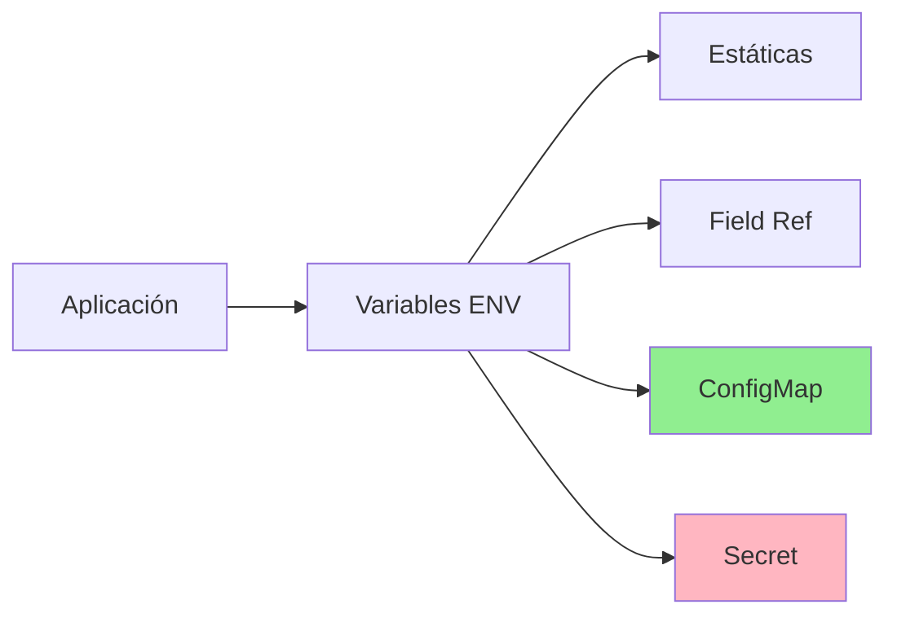

# Capítulo 15: ConfigMaps y Variables de Entorno

Las apps corren sanas. Ahora externalizamos su configuración para no recompilar imágenes con cada cambio de entorno.

---

## 🎓 Metodología de Aprendizaje

Este módulo sigue el patrón pedagógico del curso:

1. **Teoría estructurada**: Cada sección explica conceptos con ejemplos claros
2. **Ejemplos inline**: YAMLs completos en `ejemplos/` referenciados inmediatamente
3. **Laboratorios progresivos**: 3 labs de básico a troubleshooting
4. **Resumen ejecutivo**: [RESUMEN-MODULO.md](RESUMEN-MODULO.md) para repaso rápido

### Consejos de Estudio
- ⚠️ **Crítico**: Entender cuándo usar env vars vs ConfigMaps vs Secrets
- 🧪 Experimentar con updates: ¿Se actualizan automáticamente los Pods?
- 📊 Usar `kubectl describe pod` para ver variables de entorno
- 🔍 Probar volumeMounts para ver archivos en tiempo real
- 💡 Implementar hot-reload en tus apps para detectar cambios de config

---

## 📋 Índice Detallado

1. [Introducción](#introducción)
2. [Variables de Entorno Básicas](#variables-de-entorno-básicas)
3. [Field References (Referencias a Campos)](#field-references)
4. [ConfigMaps](#configmaps)
5. [Secrets](#secrets)
6. [ConfigMaps Inmutables](#configmaps-inmutables)
7. [Mejores Prácticas](#mejores-prácticas)
8. [Troubleshooting](#troubleshooting)
9. [Recursos Adicionales](#recursos-adicionales)

---

## Introducción

### ¿Por qué Separar la Configuración del Código?

En aplicaciones modernas, seguir el principio de [The Twelve-Factor App](https://12factor.net/) es fundamental: **separar la configuración del código**. Esto permite:

✅ **Portabilidad**: La misma imagen funciona en dev, staging y producción  
✅ **Seguridad**: Secretos no viven en el código fuente  
✅ **Flexibilidad**: Cambiar configuración sin reconstruir imágenes  
✅ **Simplicidad**: Gestión centralizada de configuración

### Kubernetes y la Gestión de Configuración

Kubernetes ofrece **tres mecanismos** principales para inyectar configuración en Pods:

1. **Variables de entorno estáticas** → Valores hardcoded en manifiestos
2. **Field References** → Valores dinámicos del Pod (metadata, status)
3. **ConfigMaps/Secrets** → Objetos dedicados para configuración



### Diferencias Clave: ConfigMap vs Secret

| Característica | ConfigMap | Secret |
|----------------|-----------|--------|
| **Propósito** | Configuración pública | Datos sensibles |
| **Almacenamiento** | Plain text en etcd | Base64 en etcd (cifrado at-rest opcional) |
| **Límite de tamaño** | 1 MiB | 1 MiB |
| **Uso típico** | Archivos config, variables app | Passwords, tokens, certs TLS |
| **Permisos RBAC** | Granulares | Más restrictivos |

⚠️ **IMPORTANTE**: ConfigMaps **NO son seguros** para datos confidenciales. Siempre usa Secrets para contraseñas, API keys, certificados, etc.

---

## Variables de Entorno Básicas

### Definición Estática

La forma más simple de inyectar configuración:

```yaml
apiVersion: v1
kind: Pod
metadata:
  name: env-vars-basic
spec:
  containers:
  - name: app
    image: nginx:alpine
    env:
    - name: DATABASE_HOST
      value: "db.example.com"
    - name: DATABASE_PORT
      value: "5432"
    - name: APP_ENV
      value: "production"
```

**📄 Ver ejemplo completo**: [`ejemplos/01-env-vars-basicas/pod-env-static.yaml`](ejemplos/01-env-vars-basicas/pod-env-static.yaml)

### Verificación

```bash
kubectl apply -f ejemplos/01-env-vars-basicas/pod-env-static.yaml
kubectl exec env-vars-basic -- env | grep DATABASE

# Output:
# DATABASE_HOST=db.example.com
# DATABASE_PORT=5432
```

### Cuándo Usar Variables Estáticas

✅ **Úsalas cuando**:
- La configuración es simple y no cambia
- Son valores específicos del Deployment (no compartidos)
- Quieres mantener todo en un solo archivo

❌ **Evítalas cuando**:
- Necesitas reutilizar valores en múltiples Pods
- La configuración debe cambiar sin reconstruir
- Los valores son sensibles (usa Secrets)

---

## Field References

### ¿Qué Son las Field References?

Permiten **inyectar información dinámica del Pod** como variables de entorno:

- **Metadata**: Nombre del Pod, namespace, labels, annotations
- **Status**: IP del Pod, nombre del nodo
- **Recursos**: Límites y requests de CPU/memoria

### Sintaxis

```yaml
env:
- name: MY_POD_NAME
  valueFrom:
    fieldRef:
      fieldPath: metadata.name
```

### Campos Disponibles

| Campo | Descripción | Ejemplo |
|-------|-------------|---------|
| `metadata.name` | Nombre del Pod | `my-app-7d8f6c9b4-x5k2p` |
| `metadata.namespace` | Namespace del Pod | `production` |
| `metadata.uid` | UID único del Pod | `a1b2c3d4-...` |
| `status.podIP` | IP asignada al Pod | `10.244.1.5` |
| `spec.nodeName` | Nodo donde corre | `node-worker-01` |
| `spec.serviceAccountName` | ServiceAccount | `default` |

### Ejemplo Completo

```yaml
apiVersion: v1
kind: Pod
metadata:
  name: field-ref-demo
  namespace: default
  labels:
    app: demo
    version: "1.0"
spec:
  containers:
  - name: app
    image: busybox
    command: ["sh", "-c", "env && sleep 3600"]
    env:
    # Metadata
    - name: MY_POD_NAME
      valueFrom:
        fieldRef:
          fieldPath: metadata.name
    
    - name: MY_POD_NAMESPACE
      valueFrom:
        fieldRef:
          fieldPath: metadata.namespace
    
    - name: MY_POD_IP
      valueFrom:
        fieldRef:
          fieldPath: status.podIP
    
    # Labels como JSON
    - name: MY_POD_LABELS
      valueFrom:
        fieldRef:
          fieldPath: metadata.labels
    
    # Nodo donde corre
    - name: MY_NODE_NAME
      valueFrom:
        fieldRef:
          fieldPath: spec.nodeName
```

**📄 Ver ejemplo completo**: [`ejemplos/02-field-references/pod-field-ref.yaml`](ejemplos/02-field-references/pod-field-ref.yaml)

### Uso Práctico: Logging Distribuido

```yaml
env:
- name: LOG_POD_NAME
  valueFrom:
    fieldRef:
      fieldPath: metadata.name

- name: LOG_NAMESPACE
  valueFrom:
    fieldRef:
      fieldPath: metadata.namespace

# En la aplicación (ejemplo Python):
# import os
# logger.info(f"[{os.getenv('LOG_NAMESPACE')}/{os.getenv('LOG_POD_NAME')}] Request received")
```

### Resource Field References

Inyectar límites/requests de recursos:

```yaml
env:
- name: MY_CPU_REQUEST
  valueFrom:
    resourceFieldRef:
      containerName: app
      resource: requests.cpu

- name: MY_MEMORY_LIMIT
  valueFrom:
    resourceFieldRef:
      containerName: app
      resource: limits.memory
      divisor: "1Mi"  # Convertir a MiB
```

**📄 Ver ejemplo**: [`ejemplos/02-field-references/pod-resource-ref.yaml`](ejemplos/02-field-references/pod-resource-ref.yaml)

---

## ConfigMaps

### ¿Qué es un ConfigMap?

Un **ConfigMap** es un objeto de Kubernetes que almacena **configuración no sensible** en pares clave-valor. Pertenece a un namespace y puede ser consumido por múltiples Pods.

```yaml
apiVersion: v1
kind: ConfigMap
metadata:
  name: app-config
  namespace: production
data:
  # Configuración simple (key: value)
  database.host: "postgres.prod.svc.cluster.local"
  database.port: "5432"
  app.mode: "production"
  
  # Archivo completo (key: |multiline)
  app.properties: |
    spring.datasource.url=jdbc:postgresql://postgres:5432/mydb
    spring.jpa.hibernate.ddl-auto=update
    logging.level.root=INFO
```

### Límites Importantes

⚠️ **Tamaño máximo**: 1 MiB por ConfigMap  
⚠️**Scope**: Solo accesible en el mismo namespace  
⚠️ **No es un volumen persistente**: Para datos grandes, usa PersistentVolumes

---

## Crear ConfigMaps

### Método 1: Desde Literales (CLI)

```bash
kubectl create configmap app-config \
  --from-literal=database.host=postgres.default.svc.cluster.local \
  --from-literal=database.port=5432 \
  --from-literal=app.environment=production
```

**📄 Ver ejemplo**: [`ejemplos/03-configmap-literal/create-from-literal.sh`](ejemplos/03-configmap-literal/create-from-literal.sh)

### Método 2: Desde Archivos

#### Opción A: Un archivo

```bash
# Contenido de nginx.conf
cat > nginx.conf <<EOF
server {
    listen 8080;
    server_name localhost;
    
    location / {
        root /usr/share/nginx/html;
        index index.html;
    }
}
EOF

kubectl create configmap nginx-config --from-file=nginx.conf
```

#### Opción B: Directorio completo

```bash
# Estructura:
# config/
# ├── app.properties
# ├── database.yaml
# └── logging.xml

kubectl create configmap app-files --from-file=config/
```

**📄 Ver ejemplos**: [`ejemplos/04-configmap-file/`](ejemplos/04-configmap-file/)

### Método 3: Manifiesto YAML (Recomendado)

```yaml
apiVersion: v1
kind: ConfigMap
metadata:
  name: nginx-config
  namespace: default
data:
  # Archivo de configuración completo
  nginx.conf: |
    user nginx;
    worker_processes auto;
    error_log /var/log/nginx/error.log warn;
    
    events {
        worker_connections 1024;
    }
    
    http {
        include /etc/nginx/mime.types;
        default_type application/octet-stream;
        
        server {
            listen 8080;
            server_name localhost;
            
            location / {
                root /usr/share/nginx/html;
                index index.html;
            }
            
            location /health {
                access_log off;
                return 200 "OK\n";
                add_header Content-Type text/plain;
            }
        }
    }
  
  # Script de inicialización
  init.sh: |
    #!/bin/bash
    echo "Initializing application..."
    echo "DATABASE_HOST: ${DATABASE_HOST}"
    echo "DATABASE_PORT: ${DATABASE_PORT}"
```

**📄 Ver ejemplo**: [`ejemplos/04-configmap-file/nginx-configmap.yaml`](ejemplos/04-configmap-file/nginx-configmap.yaml)

---

## Consumir ConfigMaps

Kubernetes ofrece **tres formas** de consumir ConfigMaps en Pods:

### 1️⃣ Variables de Entorno Individuales

```yaml
apiVersion: v1
kind: Pod
metadata:
  name: env-from-configmap
spec:
  containers:
  - name: app
    image: busybox
    command: ["sh", "-c", "env && sleep 3600"]
    env:
    - name: DATABASE_HOST
      valueFrom:
        configMapKeyRef:
          name: app-config
          key: database.host
    
    - name: DATABASE_PORT
      valueFrom:
        configMapKeyRef:
          name: app-config
          key: database.port
```

✅ **Ventajas**: Control granular, renombrar variables  
❌ **Desventajas**: Verboso para muchas claves

**📄 Ver ejemplo**: [`ejemplos/05-configmap-env/pod-env-individual.yaml`](ejemplos/05-configmap-env/pod-env-individual.yaml)

### 2️⃣ Todas las Claves como Variables (envFrom)

```yaml
apiVersion: v1
kind: Pod
metadata:
  name: env-from-configmap-all
spec:
  containers:
  - name: app
    image: busybox
    command: ["sh", "-c", "env | sort && sleep 3600"]
    envFrom:
    - configMapRef:
        name: app-config
```

✅ **Ventajas**: Menos código, todas las claves automáticamente  
❌ **Desventajas**: Nombres de variables = nombres de claves (no se pueden renombrar)

⚠️ **Restricciones de nombres**: Solo caracteres alfanuméricos, `_` permitidos. Claves inválidas (ej: `my-key`) se omiten silenciosamente.

**📄 Ver ejemplo**: [`ejemplos/05-configmap-env/pod-env-all.yaml`](ejemplos/05-configmap-env/pod-env-all.yaml)

### 3️⃣ Montar como Volumen (Archivos)

```yaml
apiVersion: v1
kind: Pod
metadata:
  name: configmap-volume
spec:
  containers:
  - name: nginx
    image: nginx:alpine
    volumeMounts:
    - name: config
      mountPath: /etc/nginx/nginx.conf
      subPath: nginx.conf  # Montar solo este archivo
      readOnly: true
  
  volumes:
  - name: config
    configMap:
      name: nginx-config
```

#### Variaciones

**Opción A: Montar todas las claves**

```yaml
volumes:
- name: config
  configMap:
    name: nginx-config
# Resultado: /etc/config/nginx.conf, /etc/config/init.sh
```

**Opción B: Seleccionar claves específicas**

```yaml
volumes:
- name: config
  configMap:
    name: nginx-config
    items:
    - key: nginx.conf
      path: custom-nginx.conf  # Renombrar
    - key: init.sh
      path: scripts/init.sh    # Subdirectorio
```

**Opción C: Montar un solo archivo (subPath)**

```yaml
volumeMounts:
- name: config
  mountPath: /etc/nginx/nginx.conf
  subPath: nginx.conf  # ⚠️ NO se actualiza automáticamente
```

**📄 Ver ejemplos**: [`ejemplos/06-configmap-volume/`](ejemplos/06-configmap-volume/)

---

## Actualizaciones de ConfigMaps

### Comportamiento Predeterminado

| Método de Consumo | ¿Se Actualiza Automáticamente? | Tiempo de Propagación |
|-------------------|--------------------------------|----------------------|
| Variables de entorno (`env`) | ❌ NO | N/A - Requiere recrear Pod |
| Variables de entorno (`envFrom`) | ❌ NO | N/A - Requiere recrear Pod |
| Volumen (mountPath) | ✅ SÍ | ~kubelet sync period (default: 60s) + cache delay |
| Volumen con `subPath` | ❌ NO | N/A - Requiere recrear Pod |

### Ejemplo: Actualización Automática

```bash
# 1. Crear ConfigMap
kubectl apply -f ejemplos/06-configmap-volume/nginx-configmap.yaml

# 2. Desplegar Pod con volumen
kubectl apply -f ejemplos/06-configmap-volume/pod-volume-auto-update.yaml

# 3. Verificar contenido inicial
kubectl exec nginx-volume -- cat /etc/config/nginx.conf

# 4. Actualizar ConfigMap
kubectl patch configmap nginx-config \
  --patch '{"data":{"nginx.conf":"server { listen 9090; }"}}'

# 5. Esperar ~60-90 segundos y verificar
kubectl exec nginx-volume -- cat /etc/config/nginx.conf
# Verás el nuevo contenido automáticamente!
```

⚠️ **IMPORTANTE**: Aunque el archivo se actualiza, la aplicación debe **recargar** la configuración. Opciones:

1. **Sidecar con inotify** → Detecta cambios y envía señal (ej: `nginx -s reload`)
2. **Reloader controller** → Herramientas como [Reloader](https://github.com/stakater/Reloader)
3. **Recrear Pod** → Estrategia simple pero con downtime

**📄 Ver ejemplo con sidecar**: [`ejemplos/07-combinados/deployment-auto-reload.yaml`](ejemplos/07-combinados/deployment-auto-reload.yaml)

---

## Secrets

### ¿Qué es un Secret?

Un **Secret** es similar a un ConfigMap pero diseñado para **datos confidenciales**:

- Almacenados en **base64** (no es cifrado, solo encoding)
- Cifrado **at-rest** opcional (requiere configuración del cluster)
- Permisos RBAC más restrictivos
- Kubernetes evita escribirlos en logs

### Tipos de Secrets

| Tipo | Uso | Ejemplo |
|------|-----|---------|
| `Opaque` | Genérico (default) | Passwords, API keys |
| `kubernetes.io/dockerconfigjson` | Credenciales de registry | Pull images privadas |
| `kubernetes.io/tls` | Certificados TLS | Ingress HTTPS |
| `kubernetes.io/service-account-token` | ServiceAccount token | Automático |
| `kubernetes.io/basic-auth` | HTTP Basic Auth | Usuario/password |

### Crear Secrets

#### Desde Literales

```bash
kubectl create secret generic db-credentials \
  --from-literal=username=admin \
  --from-literal=password='SuperSecret123!'
```

#### Desde Archivos

```bash
# Crear certificado TLS
openssl req -x509 -nodes -days 365 -newkey rsa:2048 \
  -keyout tls.key -out tls.crt \
  -subj "/CN=example.com"

kubectl create secret tls example-tls \
  --cert=tls.crt \
  --key=tls.key
```

#### Docker Registry

```bash
kubectl create secret docker-registry regcred \
  --docker-server=https://index.docker.io/v1/ \
  --docker-username=myuser \
  --docker-password='MyPassword' \
  --docker-email=user@example.com
```

#### Manifiesto YAML

```yaml
apiVersion: v1
kind: Secret
metadata:
  name: db-credentials
type: Opaque
data:
  # Valores en base64
  username: YWRtaW4=          # "admin"
  password: U3VwZXJTZWNyZXQxMjMh  # "SuperSecret123!"

# Alternativamente (K8s 1.18+):
stringData:
  username: admin              # Plain text (auto-convertido a base64)
  password: SuperSecret123!
```

⚠️ **Codificar/Decodificar base64**:

```bash
# Codificar
echo -n 'admin' | base64
# Output: YWRtaW4=

# Decodificar
echo 'YWRtaW4=' | base64 -d
# Output: admin
```

### Consumir Secrets

Exactamente igual que ConfigMaps:

**Variables de entorno**:

```yaml
env:
- name: DB_USERNAME
  valueFrom:
    secretKeyRef:
      name: db-credentials
      key: username

- name: DB_PASSWORD
  valueFrom:
    secretKeyRef:
      name: db-credentials
      key: password
```

**Volumen**:

```yaml
volumes:
- name: secrets
  secret:
    secretName: db-credentials
    defaultMode: 0400  # Read-only para owner
```

### Mejores Prácticas con Secrets

✅ **Usar RBAC** → Limitar acceso con roles específicos  
✅ **Habilitar cifrado at-rest** → `encryptionConfiguration` en API server  
✅ **Usar herramientas externas** → Vault, Sealed Secrets, External Secrets Operator  
✅ **Rotar regularmente** → Automatizar rotación de credenciales  
✅ **No commitear en Git** → Usar `.gitignore` o herramientas de GitOps seguras

❌ **NO usar base64 como seguridad** → Es solo encoding  
❌ **NO exponer en logs** → Aplicación no debe loggear secrets  
❌ **NO usar ConfigMaps para secretos** → Siempre usa Secrets

---

## ConfigMaps Inmutables

### ¿Por Qué Inmutabilidad?

En clusters grandes (10k+ Pods), los ConfigMaps mutables generan **carga excesiva** en kube-apiserver:

- Kubelet hace **watch** constante de ConfigMaps montados
- Cada cambio notifica a todos los Pods consumidores
- Escalar a millones de Pods es inviable

**Solución**: ConfigMaps **inmutables** (Kubernetes 1.21+)

### Beneficios

✅ **Protección contra cambios accidentales** → Aplicaciones no se rompen  
✅ **Mejor rendimiento** → kubelet cierra watches, reduce carga en API server  
✅ **Escalabilidad** → Clusters de 100k+ Pods viables  
✅ **Despliegues deterministas** → Configuración nunca cambia silenciosamente

### Sintaxis

```yaml
apiVersion: v1
kind: ConfigMap
metadata:
  name: app-config-v1
immutable: true
data:
  database.host: postgres.prod.svc.cluster.local
  database.port: "5432"
```

⚠️ **Una vez marcado como `immutable: true`, NO se puede**:
- Cambiar `data` o `binaryData`
- Volver a `immutable: false`

✅ **Única opción**: Eliminar y recrear con nuevo nombre (ej: `app-config-v2`)

### Estrategia de Versionado

```yaml
# Version 1
apiVersion: v1
kind: ConfigMap
metadata:
  name: app-config-v1
  labels:
    app: myapp
    version: "1"
immutable: true
data:
  feature.enabled: "false"
---
# Deployment usando v1
apiVersion: apps/v1
kind: Deployment
metadata:
  name: myapp
spec:
  template:
    spec:
      containers:
      - name: app
        envFrom:
        - configMapRef:
            name: app-config-v1  # Referencia explícita a v1
```

**Actualización**:

```bash
# 1. Crear nueva versión
kubectl apply -f app-config-v2.yaml

# 2. Actualizar Deployment
kubectl set env deployment/myapp --from=configmap/app-config-v2 --overwrite

# 3. Rollout
kubectl rollout status deployment/myapp

# 4. Eliminar versión antigua (opcional)
kubectl delete configmap app-config-v1
```

**📄 Ver ejemplo completo**: [`ejemplos/07-combinados/immutable-configmap-versioning.yaml`](ejemplos/07-combinados/immutable-configmap-versioning.yaml)

---

## Mejores Prácticas

### 1. Separación de Configuración

```
✅ BIEN:
- ConfigMap para cada entorno (dev, staging, prod)
- Deployment genérico que referencia el ConfigMap del namespace

❌ MAL:
- Mismo ConfigMap para todos los entornos
- Lógica de selección dentro de la aplicación
```

### 2. Nomenclatura Clara

```yaml
# ✅ Descriptivo y versionado
metadata:
  name: nginx-config-prod-v2
  labels:
    app: nginx
    environment: production
    version: "2"

# ❌ Genérico
metadata:
  name: config
```

### 3. Validación

```bash
# Validar YAML antes de aplicar
kubectl create configmap test --from-file=config.yaml --dry-run=client -o yaml

# Ver qué cambiaría
kubectl diff -f configmap.yaml
```

### 4. Documentación

```yaml
apiVersion: v1
kind: ConfigMap
metadata:
  name: app-config
  annotations:
    description: "Configuración principal de la aplicación"
    owner: "team-backend"
    last-updated: "2025-11-10"
data:
  # Puerto donde escucha la aplicación
  app.port: "8080"
  
  # URL de conexión a PostgreSQL (formato: postgres://host:port/db)
  database.url: "postgres://db.prod.svc.cluster.local:5432/myapp"
```

### 5. Límites de Tamaño

```bash
# ⚠️ Si el ConfigMap > 1 MiB, considera:
# 1. Dividir en múltiples ConfigMaps
# 2. Usar un PersistentVolume
# 3. Externalizar en un servidor de configuración (Consul, etcd)
```

### 6. Seguridad

```yaml
# ❌ NUNCA hagas esto
apiVersion: v1
kind: ConfigMap
data:
  database.password: "admin123"  # ⚠️ Usar Secret!

# ✅ Correcto
apiVersion: v1
kind: Secret
stringData:
  database.password: "admin123"
```

---

## Troubleshooting

### Problema 1: Variables No Aparecen en el Pod

**Síntomas**:

```bash
kubectl exec mypod -- env | grep DATABASE
# (vacío, no devuelve nada)
```

**Diagnóstico**:

```bash
# 1. Verificar que el ConfigMap existe
kubectl get configmap app-config

# 2. Ver contenido
kubectl describe configmap app-config

# 3. Verificar referencia en el Pod
kubectl get pod mypod -o yaml | grep -A10 envFrom
```

**Causas comunes**:

1. **Nombre incorrecto**:
   ```yaml
   # ❌
   envFrom:
   - configMapRef:
       name: app-confg  # Typo
   ```

2. **Namespace diferente**:
   ```bash
   # ConfigMap en namespace "default"
   # Pod en namespace "production"
   # ❌ No funcionará (ConfigMaps no cruzan namespaces)
   ```

3. **Claves con caracteres inválidos**:
   ```yaml
   # ConfigMap
   data:
     my-key: value  # ❌ Guión no permitido en env vars
   
   # Solución: Usar env individual y renombrar
   env:
   - name: MY_KEY
     valueFrom:
       configMapKeyRef:
         key: my-key
   ```

### Problema 2: ConfigMap No Se Actualiza

**Síntomas**:

```bash
# Actualicé el ConfigMap pero el Pod sigue viendo valores antiguos
```

**Diagnóstico**:

```bash
# Verificar método de consumo
kubectl get pod mypod -o yaml | grep -E "(envFrom|volumeMounts|subPath)"
```

**Causas**:

1. **Variables de entorno** → Nunca se actualizan (requiere recrear Pod)
2. **Volumen con subPath** → Nunca se actualiza
3. **Volumen sin subPath** → Se actualiza, pero tarda ~60-90s

**Solución**:

```bash
# Opción 1: Recrear Pods
kubectl rollout restart deployment/myapp

# Opción 2: Usar herramienta como Reloader
# https://github.com/stakater/Reloader
```

### Problema 3: Pod en CrashLoopBackOff por ConfigMap

**Síntomas**:

```bash
kubectl get pods
# NAME    READY   STATUS              RESTARTS
# mypod   0/1     CrashLoopBackOff    5
```

**Diagnóstico**:

```bash
kubectl describe pod mypod | tail -20

# Events:
# Warning  Failed  2m  kubelet  Error: configmap "app-config" not found
```

**Causas**:

1. **ConfigMap no existe** → Crear primero el ConfigMap
2. **Referencia incorrecta** → Verificar nombre exacto
3. **Clave inexistente**:
   ```yaml
   # ConfigMap solo tiene "database.host"
   env:
   - name: DB_PORT
     valueFrom:
       configMapKeyRef:
         key: database.port  # ❌ No existe
         # ✅ Agregar: optional: true
   ```

**Solución**:

```yaml
env:
- name: DB_PORT
  valueFrom:
    configMapKeyRef:
      name: app-config
      key: database.port
      optional: true  # ✅ Pod arranca incluso si falta la clave
```

### Problema 4: Archivo Montado Está Vacío

**Síntomas**:

```bash
kubectl exec nginx -- cat /etc/nginx/nginx.conf
# (archivo vacío)
```

**Diagnóstico**:

```bash
# 1. Verificar contenido del ConfigMap
kubectl get configmap nginx-config -o yaml

# 2. Verificar mountPath
kubectl describe pod nginx | grep -A5 Mounts
```

**Causas**:

1. **Llave incorrecta en items**:
   ```yaml
   volumes:
   - name: config
     configMap:
       name: nginx-config
       items:
       - key: nginx.cnf  # ❌ Typo (debería ser nginx.conf)
         path: nginx.conf
   ```

2. **mountPath sobrescribe directorio**:
   ```yaml
   # ❌ Borra todo /etc/nginx/
   volumeMounts:
   - name: config
     mountPath: /etc/nginx
   
   # ✅ Montar solo el archivo específico
   volumeMounts:
   - name: config
     mountPath: /etc/nginx/nginx.conf
     subPath: nginx.conf
   ```

### Comandos Útiles de Debugging

```bash
# Ver ConfigMap en formato legible
kubectl get configmap <name> -o yaml

# Comparar antes/después de editar
kubectl diff -f configmap-updated.yaml

# Ver eventos relacionados
kubectl get events --field-selector involvedObject.name=<pod-name>

# Ejecutar shell en Pod para inspeccionar
kubectl exec -it <pod-name> -- sh
# Dentro del Pod:
env | sort
ls -la /etc/config/
cat /etc/config/myfile.conf
```

---

## Ejemplo Completo: Aplicación Node.js con ConfigMaps

### Escenario

Desplegar una API Node.js que:
- Lee configuración desde variables de entorno
- Carga un archivo `app-config.json` desde un volumen
- Usa diferentes configuraciones para dev/prod

### 1. ConfigMap

```yaml
apiVersion: v1
kind: ConfigMap
metadata:
  name: nodejs-app-config
  namespace: production
data:
  # Variables de entorno
  NODE_ENV: "production"
  PORT: "3000"
  LOG_LEVEL: "info"
  
  # Archivo de configuración completo
  app-config.json: |
    {
      "database": {
        "host": "postgres.production.svc.cluster.local",
        "port": 5432,
        "name": "myapp",
        "pool": {
          "min": 2,
          "max": 10
        }
      },
      "redis": {
        "host": "redis.production.svc.cluster.local",
        "port": 6379
      },
      "features": {
        "enableCache": true,
        "enableMetrics": true
      }
    }
```

### 2. Secret (Credenciales)

```yaml
apiVersion: v1
kind: Secret
metadata:
  name: nodejs-app-secrets
  namespace: production
type: Opaque
stringData:
  DB_PASSWORD: "SuperSecurePassword123!"
  REDIS_PASSWORD: "AnotherSecret456"
  API_KEY: "sk-1234567890abcdef"
```

### 3. Deployment

```yaml
apiVersion: apps/v1
kind: Deployment
metadata:
  name: nodejs-app
  namespace: production
spec:
  replicas: 3
  selector:
    matchLabels:
      app: nodejs-app
  template:
    metadata:
      labels:
        app: nodejs-app
    spec:
      containers:
      - name: app
        image: node:alpine
        ports:
        - containerPort: 3000
        
        # Variables de entorno desde ConfigMap
        envFrom:
        - configMapRef:
            name: nodejs-app-config
        
        # Secretos como variables
        env:
        - name: DB_PASSWORD
          valueFrom:
            secretKeyRef:
              name: nodejs-app-secrets
              key: DB_PASSWORD
        
        - name: REDIS_PASSWORD
          valueFrom:
            secretKeyRef:
              name: nodejs-app-secrets
              key: REDIS_PASSWORD
        
        # Montar app-config.json como archivo
        volumeMounts:
        - name: config-volume
          mountPath: /app/config/app-config.json
          subPath: app-config.json
          readOnly: true
        
        # Healthcheck
        livenessProbe:
          httpGet:
            path: /health
            port: 3000
          initialDelaySeconds: 10
          periodSeconds: 10
        
        readinessProbe:
          httpGet:
            path: /ready
            port: 3000
          initialDelaySeconds: 5
          periodSeconds: 5
      
      volumes:
      - name: config-volume
        configMap:
          name: nodejs-app-config
```

### 4. Código Node.js (ejemplo)

```javascript
// app.js
const fs = require('fs');
const express = require('express');

// Leer variables de entorno
const PORT = process.env.PORT || 3000;
const NODE_ENV = process.env.NODE_ENV || 'development';
const LOG_LEVEL = process.env.LOG_LEVEL || 'debug';

// Leer archivo de configuración
const configFile = fs.readFileSync('/app/config/app-config.json', 'utf8');
const config = JSON.parse(configFile);

// Credenciales desde Secrets
const dbPassword = process.env.DB_PASSWORD;
const redisPassword = process.env.REDIS_PASSWORD;

const app = express();

app.get('/health', (req, res) => {
  res.status(200).send('OK');
});

app.get('/config', (req, res) => {
  // ⚠️ NO exponer passwords en producción (solo para demo)
  res.json({
    environment: NODE_ENV,
    port: PORT,
    database: {
      host: config.database.host,
      port: config.database.port
    },
    features: config.features
  });
});

app.listen(PORT, () => {
  console.log(`Server running on port ${PORT} in ${NODE_ENV} mode`);
});
```

**📄 Ver ejemplo completo**: [`ejemplos/07-combinados/nodejs-app-complete/`](ejemplos/07-combinados/nodejs-app-complete/)

---

## Recursos Adicionales

### Documentación Oficial

- [Kubernetes Docs - ConfigMaps](https://kubernetes.io/docs/concepts/configuration/configmap/)
- [Kubernetes Docs - Secrets](https://kubernetes.io/docs/concepts/configuration/secret/)
- [Kubernetes Docs - Environment Variables](https://kubernetes.io/docs/tasks/inject-data-application/define-environment-variable-container/)
- [The Twelve-Factor App - Config](https://12factor.net/config)

### Herramientas Recomendadas

- **[Reloader](https://github.com/stakater/Reloader)**: Auto-restart Pods cuando ConfigMaps/Secrets cambian
- **[Sealed Secrets](https://github.com/bitnami-labs/sealed-secrets)**: Cifrar Secrets para Git
- **[External Secrets Operator](https://external-secrets.io/)**: Sincronizar desde Vault, AWS Secrets Manager, etc.
- **[Kustomize](https://kustomize.io/)**: Gestionar variantes de ConfigMaps por entorno

### Laboratorios

- **[Laboratorio 1: Variables y Field References](laboratorios/lab-01-env-vars-field-ref.md)** (30 min)
- **[Laboratorio 2: ConfigMaps Avanzado](laboratorios/lab-02-configmaps-avanzado.md)** (60 min)
- **[Laboratorio 3: Troubleshooting](laboratorios/lab-03-troubleshooting.md)** (45 min)

### Ejemplos de Este Módulo

Todos los ejemplos están en [`ejemplos/`](ejemplos/):

```
ejemplos/
├── 01-env-vars-basicas/        # Variables estáticas
├── 02-field-references/        # Metadata, status, resources
├── 03-configmap-literal/       # Crear desde CLI
├── 04-configmap-file/          # Crear desde archivos
├── 05-configmap-env/           # Consumir como env vars
├── 06-configmap-volume/        # Montar como volúmenes
└── 07-combinados/              # Casos reales (nginx, nodejs, etc.)
```

---

## Próximos Pasos

Has completado el módulo de **ConfigMaps y Variables de Entorno**! 🎉

**Continúa con**:
- **[Módulo 14: Almacenamiento Persistente](../modulo-14-persistent-volumes/README.md)** → PersistentVolumes, PVC, StorageClasses
- **[Módulo 15: StatefulSets](../modulo-15-statefulsets/README.md)** → Aplicaciones stateful (bases de datos)

**Repasa conceptos relacionados**:
- **[Módulo 11: Resource Limits](../modulo-11-resource-limits-pods/README.md)** → Recursos en Pods
- **[Módulo 12: Health Checks](../modulo-12-health-checks-probes/README.md)** → Probes

---

**📝 Feedback**: ¿Encontraste algún error o tienes sugerencias? Abre un issue en el repositorio.

**⭐ Recursos**: Todos los ejemplos están probados con Kubernetes 1.31+.

## Resumen del Capítulo

Este capítulo cubrió los conceptos fundamentales de configmaps y variables de entorno, desde la teoría hasta la práctica con ejemplos y manifiestos YAML aplicables en entornos reales. Los laboratorios en el directorio `laboratorios/` permiten practicar cada concepto, y el `RESUMEN-MODULO.md` sirve como guía de repaso rápido.
