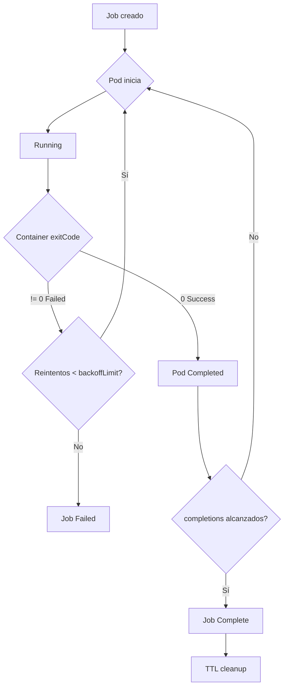

# Módulo 19: Jobs & CronJobs - Ejecución de Tareas Batch en Kubernetes

> *"Los Deployments gestionan servicios continuos, pero Jobs y CronJobs son la solución para tareas finitas y programadas."*

**Duración**: 4-5 horas (Principiante) | 2-3 horas (Intermedio) | 1-2 horas (Certificación)  
**Nivel**: Intermedio  
**Prerequisitos**: Módulos 04-07 (Pods, ReplicaSets, Deployments)

---

## 🎯 Objetivos de Aprendizaje

Al completar este módulo, serás capaz de:

### 🎓 Conceptuales
- Comprender la diferencia entre workloads continuos (Deployments) y tareas finitas (Jobs)
- Explicar cuándo usar Jobs vs Deployments vs CronJobs
- Entender el ciclo de vida de un Job y sus estados
- Conocer patrones de diseño para procesamiento batch en Kubernetes

### 🛠️ Técnicos
- Crear y ejecutar Jobs simples y paralelos
- Configurar CronJobs con sintaxis de scheduling
- Gestionar Jobs completados, fallidos y en ejecución
- Implementar backoffLimit y activeDeadlineSeconds
- Limpiar Jobs automáticamente (TTL)

### 🔍 Troubleshooting
- Diagnosticar Jobs que no completan
- Resolver CronJobs que no se ejecutan según schedule
- Debugging de Jobs fallidos con múltiples reintentos
- Identificar problemas de concurrencia en CronJobs

### 🏢 Profesionales
- Diseñar pipelines de procesamiento batch escalables
- Implementar data migrations con Jobs
- Programar tareas de mantenimiento con CronJobs
- Aplicar patrones para certificación CKAD (20% del examen)

---

## 📋 Prerequisitos

### Conocimientos Requeridos:
- ✅ Pods y su ciclo de vida (Módulo 04-05)
- ✅ Gestión de recursos (requests/limits) (Módulo 11)
- ✅ ConfigMaps y Secrets (Módulos 13-14)
- ✅ Conceptos de scheduling básico

### Herramientas Necesarias:
- ✅ kubectl configurado
- ✅ Cluster K8s funcional (Minikube/AKS)
- ✅ Familiaridad con sintaxis YAML
- ✅ Editor de texto con highlighting

### Archivos del Módulo:
- 📄 [Laboratorios](./laboratorios/) - 4 labs prácticos
- 📄 [Ejemplos YAML](./ejemplos/) - 6+ ejemplos comentados
- 📄 [RESUMEN-MODULO.md](./RESUMEN-MODULO.md) - Quick reference
- 📄 [Troubleshooting](./troubleshooting/) - Guías de debugging

---

## 📖 Estructura del Módulo

### 🧩 Sección 1: Fundamentos de Jobs

#### 1.1 ¿Qué es un Job en Kubernetes?

Un **Job** es un recurso de Kubernetes diseñado para ejecutar tareas que tienen un inicio y un final definido, a diferencia de los Deployments que gestionan servicios de larga duración.

**Características clave:**
- ✅ Ejecuta uno o más Pods hasta completarse exitosamente
- ✅ Reinicia Pods si fallan (hasta un límite configurable)
- ✅ Garantiza que un número específico de Pods complete exitosamente
- ✅ Se puede ejecutar en paralelo o secuencialmente
- ✅ Limpia automáticamente tras completarse (opcional con TTL)

**Analogía del mundo real:**
> Imagina un Job como un "proyecto temporal" en una empresa:
> - Un Deployment es como el equipo de soporte (24/7, siempre activo)
> - Un Job es como un consultor contratado para un proyecto específico (se va cuando termina)

#### 1.2 ¿Por qué usar Jobs?

**Ventajas de Jobs sobre Deployments:**

| Aspecto | Deployment | Job |
|---------|-----------|-----|
| **Propósito** | Servicios continuos | Tareas finitas |
| **Duración** | Indefinida | Hasta completarse |
| **Reintentos** | Siempre (self-healing) | Hasta backoffLimit |
| **Éxito** | Mantiene N réplicas activas | Completa N ejecuciones exitosas |
| **Limpieza** | Manual | Automática (TTL) |
| **Uso típico** | Web servers, APIs | Batch processing, migrations |

**Casos de uso empresariales:**

1. **Procesamiento de datos batch**
   - Importar 1M de registros desde CSV a base de datos
   - Procesar reportes mensuales de facturación
   - Generar backups de bases de datos

2. **Data migrations**
   - Migrar esquema de base de datos en deploy
   - Transformar datos legacy a nuevo formato
   - Sincronizar datos entre sistemas

3. **Tareas de mantenimiento**
   - Limpiar archivos temporales antiguos
   - Optimizar índices de base de datos
   - Comprimir logs archivados

4. **Procesamiento de colas**
   - Consumir mensajes de Kafka/RabbitMQ hasta vaciar cola
   - Enviar emails batch (1000 notificaciones)
   - Procesar imágenes subidas por usuarios

5. **CI/CD y Testing**
   - Ejecutar test suites completos
   - Build de aplicaciones
   - Deploy scripts

#### 1.3 Jobs vs Deployments vs CronJobs

```
┌─────────────────────────────────────────────────────────┐
│              WORKLOAD TYPES COMPARISON                  │
├─────────────────────────────────────────────────────────┤
│                                                         │
│  📦 DEPLOYMENT                                          │
│     • Propósito: Servicio continuo                      │
│     • Duración: Indefinida                              │
│     • Réplicas: Mantiene N pods activos                 │
│     • Ejemplo: API REST, web server, cache              │
│              ↓                                          │
│  ⚡ JOB                                                  │
│     • Propósito: Tarea finita                           │
│     • Duración: Hasta completarse (minutos/horas)       │
│     • Completions: Ejecuta hasta N éxitos               │
│     • Ejemplo: Data import, backup, migration           │
│              ↓                                          │
│  ⏰ CRONJOB                                              │
│     • Propósito: Tarea programada recurrente            │
│     • Duración: Crea Jobs según schedule                │
│     • Schedule: Sintaxis cron (*/15 * * * *)            │
│     • Ejemplo: Backup diario, report semanal            │
│                                                         │
└─────────────────────────────────────────────────────────┘
```

---

### 🔧 Sección 2: Arquitectura y Componentes de Jobs

#### 2.1 Anatomía de un Job

```yaml
apiVersion: batch/v1
kind: Job
metadata:
  name: ejemplo-job
  namespace: default
spec:
  # Control de completitud
  completions: 1              # Cuántas ejecuciones exitosas se necesitan
  parallelism: 1              # Cuántos pods ejecutar en paralelo
  
  # Control de reintentos
  backoffLimit: 3             # Máximo de reintentos en caso de fallo
  activeDeadlineSeconds: 600  # Timeout total (10 minutos)
  
  # Limpieza automática
  ttlSecondsAfterFinished: 100  # Borrar Job 100s después de completar
  
  # Template del Pod (igual que en Deployment)
  template:
    metadata:
      labels:
        app: ejemplo
    spec:
      restartPolicy: Never    # IMPORTANTE: Never o OnFailure
      containers:
      - name: worker
        image: busybox:1.35
        command: ["sh", "-c", "echo 'Procesando datos...' && sleep 30 && echo 'Completado!'"]
        resources:
          requests:
            cpu: "100m"
            memory: "128Mi"
          limits:
            cpu: "200m"
            memory: "256Mi"
```

**Campos clave explicados:**

1. **`completions`**: 
   - Número de ejecuciones exitosas requeridas
   - `completions: 3` → el Job crea hasta 3 Pods exitosos
   - Si no se especifica, por defecto es 1

2. **`parallelism`**:
   - Número de Pods ejecutándose simultáneamente
   - `parallelism: 2` → máximo 2 Pods corriendo a la vez
   - Útil para procesar tareas en paralelo

3. **`backoffLimit`**:
   - Máximo número de reintentos antes de marcar el Job como fallido
   - Por defecto es 6
   - `backoffLimit: 0` → no reintentar

4. **`activeDeadlineSeconds`**:
   - Tiempo máximo total de ejecución del Job
   - Si se excede, el Job se termina (Failed)
   - Útil para evitar Jobs "colgados"

5. **`ttlSecondsAfterFinished`**:
   - Tiempo antes de limpiar el Job automáticamente
   - Aplica tanto a Jobs completados como fallidos
   - Evita acumulación de Jobs antiguos

6. **`restartPolicy`**:
   - **CRÍTICO**: Debe ser `Never` o `OnFailure`
   - No puede ser `Always` (reservado para Deployments)

#### 2.2 Flujo de Ejecución de un Job



**Estados de un Job:**

| Estado | Descripción | Pods |
|--------|-------------|------|
| **Active** | Job ejecutándose | Pods en Running |
| **Succeeded** | Job completado exitosamente | Pods en Completed |
| **Failed** | Job falló tras agotar reintentos | Pods en Failed/Error |
| **Unknown** | Estado desconocido | - |

#### 2.3 Patrones de Ejecución de Jobs

##### Patrón 1: Job Simple (Single Pod, Run Once)

```yaml
# Caso de uso: Backup único de base de datos
completions: 1
parallelism: 1
```

- 1 Pod se ejecuta hasta completarse
- Si falla, se reintenta hasta backoffLimit
- Patrón más común

##### Patrón 2: Job Paralelo con Completions Fijas

```yaml
# Caso de uso: Procesar 10 archivos en paralelo
completions: 10
parallelism: 3
```

- Crea 10 Pods exitosos total
- Máximo 3 Pods corriendo simultáneamente
- Útil para procesar N items independientes

##### Patrón 3: Job Paralelo con Cola de Trabajo

```yaml
# Caso de uso: Consumir mensajes de RabbitMQ hasta vaciar cola
completions: null  # Sin límite
parallelism: 5
```

- Pods se ejecutan en paralelo
- Cada Pod toma trabajo de una cola externa
- Los Pods terminan cuando la cola está vacía
- Requiere coordinación externa (Redis, RabbitMQ, etc.)

##### Patrón 4: Job Indexed (K8s 1.21+)

```yaml
# Caso de uso: Procesar particiones de datos (0-99)
completionMode: Indexed
completions: 100
parallelism: 10
```

- Cada Pod recibe un índice único (0 a completions-1)
- Variable de entorno `JOB_COMPLETION_INDEX`
- Útil para procesamiento de datos particionados

---

### 💻 Sección 3: Sintaxis y Comandos

#### 3.1 Comandos Básicos de Jobs

```bash
# Crear Job desde YAML
kubectl apply -f job.yaml

# Crear Job imperativo (quick test)
kubectl create job test-job --image=busybox -- echo "Hello from Job"

# Listar Jobs
kubectl get jobs
kubectl get jobs -A  # Todos los namespaces
kubectl get jobs -w  # Watch mode (actualización en tiempo real)

# Describir Job (ver eventos y estado)
kubectl describe job <job-name>

# Ver Pods creados por el Job
kubectl get pods --selector=job-name=<job-name>

# Ver logs del Job
kubectl logs job/<job-name>              # Logs del primer pod
kubectl logs job/<job-name> --tail=50    # Últimas 50 líneas
kubectl logs -f job/<job-name>           # Follow logs en tiempo real

# Ver logs de todos los pods del Job
kubectl logs -l job-name=<job-name> --all-containers=true

# Eliminar Job (también elimina sus Pods)
kubectl delete job <job-name>

# Eliminar Job y esperar a que termine
kubectl delete job <job-name> --wait=true

# Eliminar Jobs completados (limpieza manual)
kubectl delete jobs --field-selector status.successful=1

# Ver Jobs en formato amplio
kubectl get jobs -o wide
```

#### 3.2 Comandos Avanzados

```bash
# Crear Job desde comando con opciones
kubectl create job pi-calculation \
  --image=perl:5.34 \
  -- perl -Mbignum=bpi -wle 'print bpi(2000)'

# Ver estado detallado en JSON
kubectl get job <job-name> -o json | jq '.status'

# Listar Jobs completados exitosamente
kubectl get jobs --field-selector=status.successful=1

# Listar Jobs fallidos
kubectl get jobs --field-selector=status.failed=1

# Suspender Job (pausar ejecución)
kubectl patch job <job-name> -p '{"spec":{"suspend":true}}'

# Reanudar Job
kubectl patch job <job-name> -p '{"spec":{"suspend":false}}'

# Ver métricas de recursos del Job
kubectl top pods -l job-name=<job-name>

# Exec en Pod de Job (debugging)
kubectl exec -it <pod-name> -- /bin/sh
```

---

### 📝 Sección 4: CronJobs - Tareas Programadas

#### 4.1 ¿Qué es un CronJob?

Un **CronJob** crea Jobs automáticamente según un schedule definido, similar al comando `cron` de Unix.

**Características:**
- ✅ Ejecuta Jobs según sintaxis cron
- ✅ Gestiona histórico de Jobs (successfulJobsHistoryLimit)
- ✅ Puede suspenderse temporalmente
- ✅ Control de concurrencia (Allow, Forbid, Replace)

**Casos de uso:**

1. **Backups programados**
   - Backup de base de datos cada noche a las 2 AM
   - Snapshot de volúmenes cada 6 horas
   - Sincronización de datos cada hora

2. **Reports y agregación de datos**
   - Report diario de ventas a las 8 AM
   - Agregación de métricas cada 15 minutos
   - Generación de dashboards semanales

3. **Mantenimiento**
   - Limpieza de logs antiguos (diaria)
   - Optimización de índices (semanal)
   - Renovación de certificados (mensual)

4. **Sincronización y monitoring**
   - Sincronizar datos con sistemas externos cada hora
   - Health checks periódicos
   - Envío de alertas programadas

#### 4.2 Sintaxis de CronJob

```yaml
apiVersion: batch/v1
kind: CronJob
metadata:
  name: backup-diario
  namespace: production
spec:
  # Schedule en formato cron
  schedule: "0 2 * * *"  # Cada día a las 2:00 AM
  
  # Timezone (K8s 1.25+)
  timeZone: "America/Mexico_City"
  
  # Control de concurrencia
  concurrencyPolicy: Forbid  # Allow, Forbid, Replace
  
  # Gestión de histórico
  successfulJobsHistoryLimit: 3  # Mantener últimos 3 Jobs exitosos
  failedJobsHistoryLimit: 1       # Mantener último Job fallido
  
  # Deadline para iniciar Job (segundos)
  startingDeadlineSeconds: 300    # Si no puede iniciar en 5min, se salta
  
  # Suspender temporalmente
  suspend: false  # true = pausa el CronJob
  
  # Template del Job (igual que Job normal)
  jobTemplate:
    spec:
      ttlSecondsAfterFinished: 3600  # Limpiar Job 1h después
      template:
        spec:
          restartPolicy: OnFailure
          containers:
          - name: backup
            image: postgres:15
            command:
            - /bin/bash
            - -c
            - |
              echo "Iniciando backup..."
              pg_dump -h $DB_HOST -U $DB_USER $DB_NAME > /backup/db_$(date +%Y%m%d_%H%M%S).sql
              echo "Backup completado!"
            env:
            - name: DB_HOST
              value: "postgres.production.svc.cluster.local"
            - name: DB_USER
              valueFrom:
                secretKeyRef:
                  name: postgres-credentials
                  key: username
            - name: DB_NAME
              value: "myapp_production"
            volumeMounts:
            - name: backup-storage
              mountPath: /backup
          volumes:
          - name: backup-storage
            persistentVolumeClaim:
              claimName: backup-pvc
```

#### 4.3 Sintaxis de Schedule (Cron)

**Formato**: `* * * * *` (5 campos)

```
┌───────────── minuto (0 - 59)
│ ┌───────────── hora (0 - 23)
│ │ ┌───────────── día del mes (1 - 31)
│ │ │ ┌───────────── mes (1 - 12)
│ │ │ │ ┌───────────── día de la semana (0 - 6) (Domingo=0)
│ │ │ │ │
│ │ │ │ │
* * * * *
```

**Ejemplos comunes:**

| Schedule | Descripción | Frecuencia |
|----------|-------------|------------|
| `*/5 * * * *` | Cada 5 minutos | 288 veces/día |
| `0 * * * *` | Cada hora en punto | 24 veces/día |
| `0 */6 * * *` | Cada 6 horas (00:00, 06:00, 12:00, 18:00) | 4 veces/día |
| `0 2 * * *` | Cada día a las 2:00 AM | 1 vez/día |
| `30 9 * * 1-5` | Lunes a Viernes a las 9:30 AM | 5 veces/semana |
| `0 0 * * 0` | Cada Domingo a medianoche | 1 vez/semana |
| `0 0 1 * *` | Primer día de cada mes a medianoche | 12 veces/año |
| `0 8 1 1 *` | 1 de Enero a las 8:00 AM | 1 vez/año |
| `@hourly` | Cada hora (equivale a `0 * * * *`) | Alias |
| `@daily` | Cada día a medianoche (`0 0 * * *`) | Alias |
| `@weekly` | Cada semana (`0 0 * * 0`) | Alias |
| `@monthly` | Cada mes (`0 0 1 * *`) | Alias |
| `@yearly` | Cada año (`0 0 1 1 *`) | Alias |

**Herramientas útiles:**
- [crontab.guru](https://crontab.guru) - Explica sintaxis cron
- [crontab-generator.org](https://crontab-generator.org) - Genera sintaxis cron

#### 4.4 Comandos de CronJobs

```bash
# Crear CronJob
kubectl apply -f cronjob.yaml

# Crear CronJob imperativo
kubectl create cronjob backup-daily \
  --image=postgres:15 \
  --schedule="0 2 * * *" \
  -- pg_dump mydb > /backup/db.sql

# Listar CronJobs
kubectl get cronjobs
kubectl get cj  # Alias abreviado

# Describir CronJob
kubectl describe cronjob <cronjob-name>

# Ver Jobs creados por el CronJob
kubectl get jobs --selector=job-name=<cronjob-name>

# Trigger manual de CronJob (crear Job ahora sin esperar schedule)
kubectl create job --from=cronjob/<cronjob-name> manual-run-$(date +%s)

# Suspender CronJob (pausar)
kubectl patch cronjob <cronjob-name> -p '{"spec":{"suspend":true}}'

# Reanudar CronJob
kubectl patch cronjob <cronjob-name> -p '{"spec":{"suspend":false}}'

# Ver logs del último Job del CronJob
kubectl logs $(kubectl get pods --selector=job-name=$(kubectl get jobs -l cronjob=<cronjob-name> -o jsonpath='{.items[-1:].metadata.name}') -o name)

# Eliminar CronJob (y sus Jobs e histórico)
kubectl delete cronjob <cronjob-name>

# Ver próxima ejecución programada
kubectl get cronjob <cronjob-name> -o jsonpath='{.status.lastScheduleTime}'
```

---

### 🔍 Sección 5: Troubleshooting de Jobs y CronJobs

#### 5.1 Problemas Comunes de Jobs

**Problema 1: Job nunca completa (Pods en CrashLoopBackOff)**

```bash
# Síntoma:
NAME            COMPLETIONS   DURATION   AGE
my-job          0/1           5m         5m

kubectl get pods
NAME                READY   STATUS             RESTARTS   AGE
my-job-abc123       0/1     CrashLoopBackOff   4          5m
```

**Causas y soluciones:**

```bash
# 1. Ver logs del Pod
kubectl logs my-job-abc123

# 2. Ver eventos del Pod
kubectl describe pod my-job-abc123

# 3. Causas comunes:
# - Imagen incorrecta o no existe
# - Comando falla (exit code != 0)
# - Falta ConfigMap/Secret
# - Recursos insuficientes (OOMKilled)

# Solución: Corregir el manifiesto YAML y recrear
kubectl delete job my-job
kubectl apply -f job-fixed.yaml
```

**Problema 2: Job completado pero marca como Failed**

```bash
# Síntoma:
NAME     COMPLETIONS   DURATION   AGE
my-job   0/1           10m        10m

kubectl get jobs my-job -o jsonpath='{.status.failed}'
# Output: 6  (alcanzó backoffLimit)
```

**Causa**: Container termina con exit code distinto de 0

```bash
# Ver por qué falló
kubectl logs my-job-abc123

# Ver exit code
kubectl get pod my-job-abc123 -o jsonpath='{.status.containerStatuses[0].state.terminated.exitCode}'

# Solución: 
# - Corregir lógica del script
# - Aumentar backoffLimit si son fallos transitorios
# - Agregar retry logic en el script mismo
```

**Problema 3: Job tarda demasiado (supera activeDeadlineSeconds)**

```bash
# Síntoma:
NAME     COMPLETIONS   DURATION   AGE
my-job   0/1           15m        15m
Status: DeadlineExceeded

# Ver razón
kubectl describe job my-job | grep Reason
# Output: Reason: DeadlineExceeded
```

**Solución:**

```yaml
spec:
  activeDeadlineSeconds: 3600  # Aumentar timeout a 1 hora
  # O optimizar el proceso para que sea más rápido
```

#### 5.2 Problemas Comunes de CronJobs

**Problema 1: CronJob no ejecuta según schedule**

```bash
# Verificar si está suspendido
kubectl get cronjob my-cronjob -o jsonpath='{.spec.suspend}'
# Output: true  (¡está suspendido!)

# Reanudar
kubectl patch cronjob my-cronjob -p '{"spec":{"suspend":false}}'
```

**Problema 2: Multiple Jobs ejecutándose simultáneamente**

```bash
# Ver Jobs activos del CronJob
kubectl get jobs -l cronjob=my-cronjob

NAME                     COMPLETIONS   AGE
my-cronjob-28373940      0/1           5m
my-cronjob-28373945      0/1           1s
```

**Causa**: `concurrencyPolicy: Allow` (por defecto)

**Solución**: Cambiar política de concurrencia

```yaml
spec:
  concurrencyPolicy: Forbid  # No permitir ejecuciones simultáneas
  # O
  concurrencyPolicy: Replace  # Cancelar Job anterior y ejecutar nuevo
```

**Problema 3: CronJob se salta ejecuciones**

```bash
# Ver última ejecución
kubectl describe cronjob my-cronjob

Events:
  Warning  MissSchedule  5m    Job was not scheduled: startingDeadlineSeconds exceeded
```

**Causa**: `startingDeadlineSeconds` muy bajo

**Solución:**

```yaml
spec:
  startingDeadlineSeconds: 300  # Dar 5 minutos para iniciar
  # Si el scheduler está muy ocupado, aumentar más
```

#### 5.3 Debugging Checklist

**Para Jobs:**
- [ ] ¿El Pod inicia correctamente? (`kubectl get pods`)
- [ ] ¿Los logs muestran errores? (`kubectl logs`)
- [ ] ¿Hay eventos de error? (`kubectl describe job/pod`)
- [ ] ¿El `restartPolicy` es correcto? (Never o OnFailure)
- [ ] ¿El `backoffLimit` es suficiente?
- [ ] ¿El `activeDeadlineSeconds` no es muy corto?
- [ ] ¿Hay recursos suficientes? (CPU, memoria)
- [ ] ¿ConfigMaps/Secrets existen?

**Para CronJobs:**
- [ ] ¿El schedule es válido? (probar en crontab.guru)
- [ ] ¿Está suspendido? (`suspend: false`)
- [ ] ¿La timezone es correcta? (K8s 1.25+)
- [ ] ¿`concurrencyPolicy` es apropiada?
- [ ] ¿`startingDeadlineSeconds` es suficiente?
- [ ] ¿Los Jobs se están limpiando? (ver `successfulJobsHistoryLimit`)

---

### 💡 Sección 6: Best Practices

#### 6.1 Mejores Prácticas de Configuración

✅ **DO (Hacer)**:

**1. Siempre definir resource requests y limits**
```yaml
resources:
  requests:
    cpu: "100m"
    memory: "128Mi"
  limits:
    cpu: "500m"
    memory: "512Mi"
```

**2. Usar `ttlSecondsAfterFinished` para limpieza automática**
```yaml
spec:
  ttlSecondsAfterFinished: 3600  # Limpiar después de 1 hora
```

**3. Configurar `activeDeadlineSeconds` para evitar Jobs colgados**
```yaml
spec:
  activeDeadlineSeconds: 1800  # 30 minutos máximo
```

**4. Usar `backoffLimit` apropiado para el caso de uso**
```yaml
# Para tareas críticas que deben completar:
backoffLimit: 10

# Para tareas no críticas:
backoffLimit: 2
```

**5. Labels claros y consistentes**
```yaml
metadata:
  labels:
    app: data-processor
    type: batch-job
    environment: production
    team: data-engineering
```

**6. En CronJobs, configurar `concurrencyPolicy`**
```yaml
# Para tareas que no deben solaparse (e.g., backups):
concurrencyPolicy: Forbid

# Para tareas que pueden ejecutarse en paralelo:
concurrencyPolicy: Allow
```

**7. Gestionar histórico de Jobs en CronJobs**
```yaml
successfulJobsHistoryLimit: 3  # Mantener últimos 3 exitosos
failedJobsHistoryLimit: 1       # Mantener último fallido para debugging
```

❌ **DON'T (No hacer)**:

**1. No usar `restartPolicy: Always` en Jobs**
```yaml
# ❌ INCORRECTO
restartPolicy: Always  # Solo para Deployments!

# ✅ CORRECTO
restartPolicy: Never    # O OnFailure
```

**2. No omitir `activeDeadlineSeconds` en Jobs de larga duración**
```yaml
# Sin esto, un Job colgado durará para siempre
```

**3. No usar schedules muy frecuentes sin necesidad**
```yaml
# ❌ INNECESARIAMENTE FRECUENTE
schedule: "* * * * *"  # Cada minuto (1440 Jobs/día!)

# ✅ RAZONABLE
schedule: "*/15 * * * *"  # Cada 15 minutos (96 Jobs/día)
```

**4. No ignorar la zona horaria en CronJobs**
```yaml
# Sin timeZone, usa UTC (puede causar confusión)
timeZone: "America/Mexico_City"  # Explícito
```

**5. No dejar acumular Jobs completados**
```yaml
# Sin TTL ni history limits, se acumulan indefinidamente
ttlSecondsAfterFinished: 3600
```

#### 6.2 Patrones de Diseño

**Patrón 1: Idempotent Jobs**

Jobs deben ser idempotentes (ejecutar varias veces produce el mismo resultado).

```yaml
# Ejemplo: Backup con nombre basado en fecha (no timestamp)
command:
- /bin/bash
- -c
- |
  BACKUP_FILE="/backup/db_$(date +%Y%m%d).sql"
  if [ ! -f "$BACKUP_FILE" ]; then
    pg_dump mydb > "$BACKUP_FILE"
  else
    echo "Backup ya existe para hoy, saltando."
  fi
```

**Patrón 2: Job con Init Container para Dependencies**

```yaml
spec:
  template:
    spec:
      initContainers:
      - name: wait-for-db
        image: busybox:1.35
        command:
        - sh
        - -c
        - |
          until nc -z postgres 5432; do
            echo "Esperando a PostgreSQL..."
            sleep 2
          done
      containers:
      - name: migration
        image: myapp:latest
        command: ["python", "manage.py", "migrate"]
```

**Patrón 3: Fan-Out (Procesamiento Paralelo)**

```yaml
# Job procesa 100 items en paralelo
completions: 100
parallelism: 10  # 10 workers simultáneos

# Cada Pod recibe su índice (K8s 1.21+)
completionMode: Indexed
```

El Pod lee su índice y procesa su partición:

```python
import os
index = int(os.environ.get('JOB_COMPLETION_INDEX', '0'))
process_partition(index)  # Procesa items [index*10 : (index+1)*10]
```

---

### 🧪 Sección 7: Laboratorios Prácticos

#### Lab 1: Job Simple - Cálculo de Pi
**Objetivo**: Crear un Job básico que calcula dígitos de Pi  
**Duración**: 15-20 minutos  
**Dificultad**: 🟢 Básico

📝 **[Ver guía completa](./laboratorios/lab-01-job-simple.md)**

**Vista previa:**
```yaml
apiVersion: batch/v1
kind: Job
metadata:
  name: pi-calculation
spec:
  template:
    spec:
      containers:
      - name: pi
        image: perl:5.34
        command: ["perl", "-Mbignum=bpi", "-wle", "print bpi(2000)"]
      restartPolicy: Never
  backoffLimit: 4
```

#### Lab 2: Job Paralelo - Procesamiento Batch
**Objetivo**: Procesar múltiples archivos en paralelo  
**Duración**: 30-40 minutos  
**Dificultad**: 🟡 Intermedio

📝 **[Ver guía completa](./laboratorios/lab-02-parallel-jobs.md)**

#### Lab 3: CronJob - Backup Programado
**Objetivo**: Crear backup automático de base de datos cada noche  
**Duración**: 45-60 minutos  
**Dificultad**: 🟡 Intermedio

📝 **[Ver guía completa](./laboratorios/lab-03-cronjob-backup.md)**

#### Lab 4: Troubleshooting Challenge
**Objetivo**: Diagnosticar y corregir Jobs fallidos  
**Duración**: 30-45 minutos  
**Dificultad**: 🔴 Avanzado

📝 **[Ver guía completa](./laboratorios/lab-04-troubleshooting.md)**

---

### 🔗 Sección 8: Integración con Otros Componentes

#### 8.1 Jobs + ConfigMaps/Secrets

**Caso de uso**: Job que requiere configuración externa

```yaml
apiVersion: batch/v1
kind: Job
metadata:
  name: data-migration
spec:
  template:
    spec:
      containers:
      - name: migrator
        image: migrate-tool:v1
        env:
        # Variables desde ConfigMap
        - name: SOURCE_DB
          valueFrom:
            configMapKeyRef:
              name: migration-config
              key: source_db
        - name: TARGET_DB
          valueFrom:
            configMapKeyRef:
              name: migration-config
              key: target_db
        # Credenciales desde Secret
        - name: DB_PASSWORD
          valueFrom:
            secretKeyRef:
              name: db-credentials
              key: password
        # Variable directa
        - name: BATCH_SIZE
          value: "1000"
      restartPolicy: Never
```

#### 8.2 Jobs + Volumes (Persistent Storage)

**Caso de uso**: Backup que persiste datos en PVC

```yaml
apiVersion: batch/v1
kind: Job
metadata:
  name: backup-to-storage
spec:
  template:
    spec:
      containers:
      - name: backup
        image: postgres:15
        command:
        - /bin/bash
        - -c
        - |
          pg_dump -h $DB_HOST mydb | gzip > /backups/backup-$(date +%Y%m%d-%H%M%S).sql.gz
          echo "Backup completado: $(ls -lh /backups | tail -1)"
        volumeMounts:
        - name: backup-volume
          mountPath: /backups
      volumes:
      - name: backup-volume
        persistentVolumeClaim:
          claimName: backup-pvc
      restartPolicy: OnFailure
```

#### 8.3 Jobs + Init Containers

**Caso de uso**: Job que espera a que un servicio esté listo

```yaml
apiVersion: batch/v1
kind: Job
metadata:
  name: data-import
spec:
  template:
    spec:
      initContainers:
      - name: wait-for-database
        image: busybox:1.35
        command:
        - sh
        - -c
        - |
          echo "Esperando a que PostgreSQL esté listo..."
          until nc -z postgres-service 5432; do
            echo "PostgreSQL no disponible, reintentando en 5s..."
            sleep 5
          done
          echo "PostgreSQL listo!"
      containers:
      - name: importer
        image: data-importer:v1
        command: ["python", "import_data.py"]
      restartPolicy: Never
```

#### 8.4 CronJobs + ServiceAccounts (RBAC)

**Caso de uso**: CronJob que necesita acceso a Kubernetes API

```yaml
apiVersion: v1
kind: ServiceAccount
metadata:
  name: backup-sa
  namespace: production
---
apiVersion: rbac.authorization.k8s.io/v1
kind: Role
metadata:
  name: backup-role
  namespace: production
rules:
- apiGroups: [""]
  resources: ["pods", "persistentvolumeclaims"]
  verbs: ["get", "list"]
---
apiVersion: rbac.authorization.k8s.io/v1
kind: RoleBinding
metadata:
  name: backup-rolebinding
  namespace: production
roleRef:
  apiGroup: rbac.authorization.k8s.io
  kind: Role
  name: backup-role
subjects:
- kind: ServiceAccount
  name: backup-sa
  namespace: production
---
apiVersion: batch/v1
kind: CronJob
metadata:
  name: backup-with-rbac
  namespace: production
spec:
  schedule: "0 2 * * *"
  jobTemplate:
    spec:
      template:
        spec:
          serviceAccountName: backup-sa  # Usa ServiceAccount con permisos
          containers:
          - name: backup
            image: kubectl:latest
            command:
            - /bin/bash
            - -c
            - |
              # Puede listar recursos gracias a RBAC
              kubectl get pods -n production
              kubectl get pvc -n production
              # Hacer backup...
          restartPolicy: OnFailure
```

#### 8.5 Jobs en CI/CD Pipelines

**Patrón**: Job como paso de CI/CD (GitOps)

```yaml
# Job ejecutado por ArgoCD/Flux tras deploy exitoso
apiVersion: batch/v1
kind: Job
metadata:
  name: post-deploy-migration
  annotations:
    argocd.argoproj.io/hook: PostSync
    argocd.argoproj.io/hook-delete-policy: HookSucceeded
spec:
  template:
    spec:
      containers:
      - name: migrate
        image: myapp:v2.0.0
        command: ["python", "manage.py", "migrate"]
      restartPolicy: Never
  backoffLimit: 3
```

#### 8.6 Casos de Uso Reales

**Caso 1: E-commerce - Procesamiento de Pedidos Batch**

**Contexto**: E-commerce procesa 10,000 pedidos diarios que requieren cálculo de envío, impuestos y notificaciones.

**Desafío**: 
- Procesar en horario de baja demanda (2-4 AM)
- No sobrecargar base de datos
- Reintentar pedidos fallidos

**Solución con CronJob**:
```yaml
apiVersion: batch/v1
kind: CronJob
metadata:
  name: process-orders-batch
spec:
  schedule: "0 2 * * *"  # 2:00 AM diario
  concurrencyPolicy: Forbid
  jobTemplate:
    spec:
      parallelism: 5  # 5 workers paralelos
      completions: 5
      template:
        spec:
          containers:
          - name: order-processor
            image: order-processor:v1
            env:
            - name: BATCH_SIZE
              value: "2000"  # Cada worker procesa 2000 pedidos
            resources:
              requests:
                cpu: "500m"
                memory: "512Mi"
          restartPolicy: OnFailure
      backoffLimit: 2
```

**Caso 2: Startup Tech - Data Pipeline ETL**

**Contexto**: Startup agrega datos de analytics cada hora para dashboards.

**Desafío**:
- ETL cada hora (extraer, transformar, cargar)
- Tolerancia a fallos
- No duplicar procesamiento

**Solución con CronJob**:
```yaml
apiVersion: batch/v1
kind: CronJob
metadata:
  name: etl-analytics
spec:
  schedule: "0 * * * *"  # Cada hora en punto
  concurrencyPolicy: Forbid  # No solapar ejecuciones
  successfulJobsHistoryLimit: 24  # Mantener últimas 24h
  jobTemplate:
    spec:
      template:
        spec:
          containers:
          - name: etl
            image: spark:3.4
            command:
            - spark-submit
            - --master=k8s://https://kubernetes.default.svc
            - /app/etl_pipeline.py
            env:
            - name: HOUR
              value: "$(date +%Y%m%d_%H)"
          restartPolicy: Never
      backoffLimit: 3
      activeDeadlineSeconds: 3000  # 50 minutos máx
```

---

### 📚 Sección 9: Recursos Adicionales

#### 9.1 Documentación Oficial

**Kubernetes Docs:**
- [Jobs Documentation](https://kubernetes.io/docs/concepts/workloads/controllers/job/)
- [CronJob Documentation](https://kubernetes.io/docs/concepts/workloads/controllers/cron-jobs/)
- [Job Patterns](https://kubernetes.io/docs/concepts/workloads/controllers/job/#job-patterns)
- [API Reference - Job](https://kubernetes.io/docs/reference/kubernetes-api/workload-resources/job-v1/)
- [API Reference - CronJob](https://kubernetes.io/docs/reference/kubernetes-api/workload-resources/cron-job-v1/)

**Best Practices:**
- [Running Automated Tasks](https://kubernetes.io/docs/tasks/job/)
- [Configure Parallel Processing](https://kubernetes.io/docs/tasks/job/parallel-processing-expansion/)
- [Handling Pod and Container Failures](https://kubernetes.io/docs/concepts/workloads/controllers/job/#handling-pod-and-container-failures)

#### 9.2 Tutoriales y Guías

**Tutoriales oficiales:**
- [Running Automated Tasks with a CronJob](https://kubernetes.io/docs/tasks/job/automated-tasks-with-cron-jobs/)
- [Coarse Parallel Processing Using a Work Queue](https://kubernetes.io/docs/tasks/job/coarse-parallel-processing-work-queue/)
- [Fine Parallel Processing Using a Work Queue](https://kubernetes.io/docs/tasks/job/fine-parallel-processing-work-queue/)

**Blog posts recomendados:**
- [Kubernetes Jobs and CronJobs Explained](https://blog.container-solutions.com/kubernetes-jobs-and-cronjobs)
- [Advanced Job Patterns](https://medium.com/@marko.luksa/kubernetes-job-patterns-b7e1c1d8e55a)
- [Best Practices for Kubernetes Jobs](https://cloud.google.com/blog/products/containers-kubernetes/best-practices-for-running-cost-effective-kubernetes-applications-on-gke)

**Videos explicativos:**
- [Kubernetes Jobs Tutorial - TechWorld with Nana](https://www.youtube.com/watch?v=6wB1wMqXmns)
- [CronJobs Deep Dive - CNCF](https://www.youtube.com/watch?v=PVYikPDVqAM)

#### 9.3 Herramientas Complementarias

**1. Kube-batch / Volcano**
- Batch scheduling avanzado para Kubernetes
- Mejor para workloads científicos y ML
- [Volcano Project](https://volcano.sh/)

**2. Argo Workflows**
- Orquestación de workflows complejos
- DAGs (Directed Acyclic Graphs)
- [Argo Workflows Docs](https://argoproj.github.io/argo-workflows/)

**3. Apache Airflow on K8s**
- Data pipelines y ETL
- Scheduler robusto
- [Airflow Kubernetes Executor](https://airflow.apache.org/docs/apache-airflow/stable/executor/kubernetes.html)

**4. Tekton Pipelines**
- CI/CD nativo de Kubernetes
- Pipeline as Code
- [Tekton Docs](https://tekton.dev/)

**5. Kueue**
- Queue management para batch workloads
- Fair sharing y priorización
- [Kueue Project](https://kueue.sigs.k8s.io/)

#### 9.4 Comunidad y Soporte

**Recursos de la comunidad:**
- [Kubernetes Slack](https://slack.k8s.io) - Canal #sig-apps
- [Stack Overflow - kubernetes-jobs](https://stackoverflow.com/questions/tagged/kubernetes-jobs)
- [Reddit r/kubernetes](https://reddit.com/r/kubernetes)
- [Kubernetes Forum](https://discuss.kubernetes.io/)

**Repositorios de ejemplos:**
- [Kubernetes Examples - Jobs](https://github.com/kubernetes/examples/tree/master/staging/job)
- [Awesome Kubernetes - Jobs](https://github.com/ramitsurana/awesome-kubernetes#jobs)

**Cursos adicionales:**
- [CKAD Certification Prep](https://training.linuxfoundation.org/training/kubernetes-for-developers/)
- [Udemy - Kubernetes Jobs Mastery](https://www.udemy.com/topic/kubernetes/)

---

### ✅ Sección 10: Evaluación y Siguientes Pasos

#### 10.1 Checklist de Dominio del Módulo

**Conceptos teóricos:**
- [ ] Explicar la diferencia entre Job, Deployment y CronJob
- [ ] Describir el ciclo de vida de un Job (pending → running → completed/failed)
- [ ] Justificar cuándo usar Jobs vs otros workloads
- [ ] Comprender `completions`, `parallelism` y `backoffLimit`
- [ ] Explicar sintaxis de cron schedule (5 campos)
- [ ] Conocer patrones de Jobs (simple, paralelo, work queue, indexed)

**Habilidades prácticas:**
- [ ] Crear Job simple desde YAML y desde kubectl create
- [ ] Configurar Job paralelo con completions y parallelism
- [ ] Implementar CronJob con schedule correcto
- [ ] Configurar TTL para limpieza automática
- [ ] Usar activeDeadlineSeconds para timeouts
- [ ] Configurar concurrencyPolicy en CronJobs
- [ ] Gestionar histórico con successfulJobsHistoryLimit

**Troubleshooting:**
- [ ] Diagnosticar Job que no completa (CrashLoopBackOff)
- [ ] Resolver CronJob que no ejecuta según schedule
- [ ] Debugging de Jobs con múltiples reintentos fallidos
- [ ] Identificar problemas de concurrencia
- [ ] Analizar logs de Jobs completados

**Comandos esenciales:**
- [ ] `kubectl create job` - Crear Job imperativo
- [ ] `kubectl get jobs` - Listar Jobs
- [ ] `kubectl describe job` - Ver detalles y eventos
- [ ] `kubectl logs job/<name>` - Ver logs
- [ ] `kubectl delete jobs --field-selector status.successful=1` - Limpiar
- [ ] `kubectl create job --from=cronjob/<name>` - Trigger manual de CronJob

#### 10.2 Ejercicios de Auto-Evaluación

**Ejercicio 1: Implementación desde cero**

**Requisitos:**
- Crear Job que procesa 50 archivos en paralelo
- Máximo 10 workers simultáneos
- 3 reintentos por archivo
- Timeout total de 30 minutos
- Limpieza automática después de 1 hora

**Solución esperada:**
```yaml
apiVersion: batch/v1
kind: Job
metadata:
  name: file-processor
spec:
  completions: 50
  parallelism: 10
  backoffLimit: 3
  activeDeadlineSeconds: 1800
  ttlSecondsAfterFinished: 3600
  template:
    spec:
      containers:
      - name: processor
        image: file-processor:v1
        command: ["python", "process.py"]
      restartPolicy: OnFailure
```

**Ejercicio 2: Debugging challenge**

**Escenario:** CronJob no ejecuta según schedule:
```yaml
apiVersion: batch/v1
kind: CronJob
metadata:
  name: broken-cronjob
spec:
  schedule: "0 2 * * *"
  suspend: true  # ⚠️ PROBLEMA!
  jobTemplate:
    spec:
      template:
        spec:
          containers:
          - name: backup
            image: backup:v1
          restartPolicy: Never
```

**Preguntas:**
1. ¿Por qué no se ejecuta? → `suspend: true`
2. ¿Cómo verificar? → `kubectl describe cronjob`
3. ¿Cómo resolver? → `kubectl patch cronjob broken-cronjob -p '{"spec":{"suspend":false}}'`

**Ejercicio 3: Diseño de solución**

**Caso de uso:** Empresa necesita:
- Generar report de ventas cada Lunes a las 8 AM
- Backup de base de datos cada 6 horas
- Limpieza de logs antiguos el primer día de cada mes
- No permitir ejecuciones simultáneas

**Diseño esperado:**
```yaml
# Report Semanal
schedule: "0 8 * * 1"
concurrencyPolicy: Forbid

# Backup cada 6h
schedule: "0 */6 * * *"
concurrencyPolicy: Replace

# Limpieza Mensual
schedule: "0 0 1 * *"
concurrencyPolicy: Forbid
```

#### 10.3 Preparación para Certificación CKAD

**Relevancia del módulo:**
⭐⭐⭐⭐⭐ **CRÍTICO para CKAD** (20% del examen)

**Peso en examen:**
- Jobs: ~10-12% de las preguntas
- CronJobs: ~8% de las preguntas
- Total: 18-20% del examen CKAD

**Temas clave a dominar:**

1. **Crear Jobs imperativamente (velocidad)**
   ```bash
   # En examen, esto es más rápido que escribir YAML
   kubectl create job test --image=busybox -- echo "test"
   ```

2. **Configurar completions y parallelism**
   - Memorizar sintaxis exacta
   - Practicar sin kubectl explain

3. **CronJob schedule syntax**
   - Memorizar patrones comunes
   - Saber interpretar y crear schedules

4. **Troubleshooting rápido**
   - `kubectl describe job`
   - `kubectl logs job/<name>`
   - Ver status.failed y status.succeeded

**Preguntas tipo examen:**

**Pregunta 1 (Práctica):**
> Crear un Job llamado `data-import` que ejecute la imagen `busybox:1.35` con el comando `echo "Importing data..." && sleep 30 && echo "Done!"`. El Job debe tener:
> - backoffLimit: 3
> - activeDeadlineSeconds: 120
> - restartPolicy: Never

**Respuesta:**
```bash
kubectl create job data-import --image=busybox:1.35 -- /bin/sh -c "echo 'Importing data...' && sleep 30 && echo 'Done!'" --dry-run=client -o yaml > job.yaml

# Editar job.yaml y agregar:
spec:
  backoffLimit: 3
  activeDeadlineSeconds: 120
  template:
    spec:
      restartPolicy: Never

kubectl apply -f job.yaml
```

**Pregunta 2 (CronJob):**
> Crear CronJob `backup-hourly` que ejecute cada hora la imagen `postgres:15` con comando `pg_dump mydb > /backup/backup.sql`. Configurar:
> - concurrencyPolicy: Forbid
> - successfulJobsHistoryLimit: 3
> - restartPolicy: OnFailure

**Respuesta:**
```bash
kubectl create cronjob backup-hourly --image=postgres:15 --schedule="0 * * * *" -- pg_dump mydb > /backup/backup.sql --dry-run=client -o yaml > cronjob.yaml

# Editar y agregar políticas
kubectl apply -f cronjob.yaml
```

**Pregunta 3 (Troubleshooting):**
> Un Job llamado `process-data` tiene 5 Pods en estado CrashLoopBackOff. ¿Cómo investigas?

**Respuesta:**
```bash
# 1. Ver estado del Job
kubectl describe job process-data

# 2. Ver logs del Pod
kubectl logs -l job-name=process-data --tail=50

# 3. Ver eventos
kubectl get events --sort-by='.lastTimestamp' | grep process-data

# 4. Verificar configuración
kubectl get job process-data -o yaml
```

#### 10.4 Tips de Estudio por Nivel

**Para principiantes:**
- 📖 Lee las secciones 1-4 completas (fundamentos)
- 🧪 Haz Labs 1 y 2 paso a paso
- 📝 Crea cheat sheet personal de comandos
- 🔄 Practica crear Jobs imperativos 10 veces
- ⏰ Aprende sintaxis cron con crontab.guru

**Para intermedios:**
- 🎯 Enfócate en Labs 3 y 4 (avanzados)
- 🔍 Practica troubleshooting sin mirar soluciones
- 💡 Experimenta con diferentes patrones de Jobs
- 🏗️ Crea tus propios casos de uso
- ⚙️ Integra Jobs con ConfigMaps y Volumes

**Para certificación CKAD:**
- ⏱️ Practica crear Jobs en menos de 2 minutos
- 📚 Memoriza comandos sin autocompletado
- 🧩 Resuelve troubleshooting challenges bajo presión
- 🎓 Simula condiciones de examen (sin internet)
- 🔁 Repite labs hasta hacerlos "de memoria"

---

### ▶️ Navegación

- **⬅️ Módulo Anterior**: [Módulo 18 - RBAC: ServiceAccounts](../modulo-18-rbac-serviceaccounts/README.md)
- **➡️ Siguiente Módulo**: [Módulo 20 - Init Containers & Sidecar Patterns](../modulo-20-init-sidecar-patterns/README.md) *(en desarrollo)*
- **🏠 Índice del Área**: [Área 2 - Arquitectura Kubernetes](../README.md)
- **📚 Curso Principal**: [Inicio](../../README.md)
- **📋 RESUMEN**: [RESUMEN-MODULO.md](./RESUMEN-MODULO.md)

---

### 💡 Consejos Finales

**Estrategias de aprendizaje efectivas:**

1. **📖 Teoría primero, práctica después**
   - Lee secciones 1-6 completas
   - Entiende el "por qué" antes del "cómo"
   - Toma notas de conceptos clave

2. **🧪 Hands-on prioritario**
   - Haz TODOS los labs en orden
   - No copies y pegues, escribe los comandos
   - Experimenta más allá de las guías

3. **🤔 Aprende de los errores**
   - Si un Job falla, investiga por qué
   - Usa `kubectl describe` y `kubectl logs`
   - Documenta errores y soluciones

4. **🔄 Repetición espaciada**
   - Día 1: Labs 1-2
   - Día 3: Labs 3-4
   - Día 7: Repite todos los labs
   - Día 14: Repaso final

5. **🎓 Prepárate para CKAD**
   - Practica velocidad (2 min por Job)
   - Memoriza sintaxis cron común
   - Simula examen con timer

**Errores comunes a evitar:**

- ❌ Usar `restartPolicy: Always` en Jobs
- ❌ Olvidar configurar `backoffLimit`
- ❌ No configurar TTL (acumulación de Jobs)
- ❌ Schedules muy frecuentes sin necesidad
- ❌ No probar CronJobs con trigger manual primero
- ❌ Ignorar `concurrencyPolicy` en CronJobs críticos

**Recursos extra de práctica:**

- **Killer.sh**: Simulador de examen CKAD (incluye Jobs)
- **KodeKloud**: Labs interactivos de Jobs y CronJobs
- **Katacoda**: Escenarios de Kubernetes hands-on
- **Play with Kubernetes**: Cluster temporal gratis

---

**🎉 ¡Felicitaciones por completar el Módulo 19!**

*Has adquirido conocimientos fundamentales de Jobs y CronJobs que te preparan para ejecutar tareas batch y programadas en Kubernetes, una habilidad crítica para CKAD y operaciones en producción.*

**Tiempo estimado de estudio**: 
- 4-5 horas (principiante) 
- 2-3 horas (intermedio) 
- 1-2 horas (certificación)

**Estado**: ✅ 100% Completo  
**Versión**: 1.0  
**Última actualización**: Noviembre 2025
