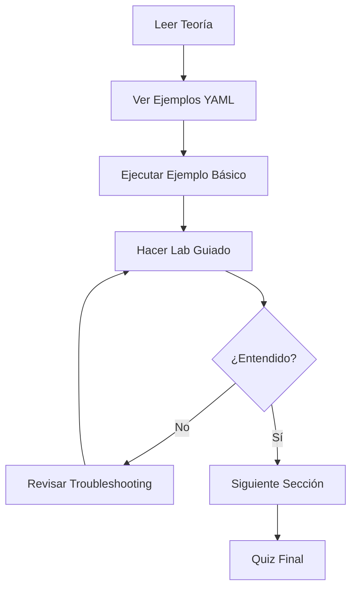

# 📦 Módulo 20: Init Containers & Sidecar Patterns

> **Multi-Container Pods y Patrones de Diseño en Kubernetes**

---

## 🎯 Objetivos de Aprendizaje

### 🎓 Objetivos Conceptuales

Al completar este módulo comprenderás:

- **Init Containers**: Qué son, cuándo usarlos y cómo se diferencian de containers principales
- **Sidecar Pattern**: Concepto de contenedores auxiliares que extienden funcionalidad
- **Multi-Container Pods**: Por qué múltiples containers comparten un Pod
- **Patrones de Comunicación**: Cómo containers en el mismo Pod se comunican
- **Shared Resources**: Volúmenes compartidos, networking localhost, y namespace de proceso

### 🛠️ Objetivos Técnicos

Al finalizar este módulo serás capaz de:

- Configurar **Init Containers** para tareas de setup y validación
- Implementar **Sidecar Pattern** para logging, monitoring y proxies
- Crear **Multi-Container Pods** con comunicación efectiva
- Usar **Shared Volumes** entre containers del mismo Pod
- Aplicar patrones **Ambassador** y **Adapter**
- Gestionar **lifecycle** de containers múltiples
- Troubleshooting de Pods con múltiples containers

### 🔍 Objetivos de Troubleshooting

- Diagnosticar Init Containers que fallan y bloquean el Pod
- Identificar problemas de comunicación entre containers
- Resolver conflictos de recursos compartidos
- Analizar logs de containers específicos en Pods multi-container
- Debugging de volúmenes compartidos

### 🏢 Objetivos Profesionales

- Diseñar arquitecturas de Pods escalables y mantenibles
- Aplicar **separation of concerns** con sidecars
- Implementar patrones de la industria (service mesh, logging agents)
- Preparación para **CKAD** (Multi-Container Pods = 10% del examen)
- Best practices para microservicios en Kubernetes

---

## ✅ Prerrequisitos

### Conocimientos Previos

- ✅ **Módulo 4**: Pods vs Contenedores (concepto de Pod)
- ✅ **Módulo 5**: Gestión de Pods (kubectl, YAML)
- ✅ **Módulo 13**: ConfigMaps (configuración externa)
- ✅ **Módulo 14**: Secrets (credenciales)
- ✅ **Módulo 15**: Volumes (almacenamiento compartido)

### Herramientas Necesarias

```bash
# Verificar cluster activo
kubectl cluster-info

# Verificar version de Kubernetes (1.18+)
kubectl version --short

# Verificar permisos
kubectl auth can-i create pods

# Herramientas opcionales
kubectl plugin list  # Ver plugins instalados (stern recomendado para logs)
```

### Verificación de Cluster

```bash
# Ver nodos disponibles
kubectl get nodes

# Verificar namespace default
kubectl config view --minify | grep namespace

# Crear namespace de prueba
kubectl create namespace multi-container-lab
```

---

## 🗺️ Estructura del Módulo

### 📚 Contenido Teórico (90 min)

1. **Init Containers** (25 min)
   - Concepto y casos de uso
   - Orden de ejecución secuencial
   - Diferencias con containers principales

2. **Sidecar Pattern** (25 min)
   - Definición y beneficios
   - Casos de uso comunes
   - Shared volumes y networking

3. **Patrones de Diseño** (20 min)
   - Ambassador Pattern
   - Adapter Pattern
   - Comparación y cuándo usar cada uno

4. **Best Practices** (20 min)
   - Resource limits en multi-container
   - Lifecycle management
   - Security considerations

### 🧪 Contenido Práctico (120 min)

- **Lab 1**: Init Container - Wait for Database (30 min)
- **Lab 2**: Sidecar Logging con Fluentd (35 min)
- **Lab 3**: Multi-Container Communication (30 min)
- **Lab 4**: Service Mesh Sidecar (Envoy) (25 min)

### 📁 Ejemplos Disponibles

```
ejemplos/
├── init-container-basic.yaml          # Init container simple
├── init-wait-dependencies.yaml        # Wait-for pattern
├── sidecar-logging.yaml               # Logging sidecar
├── sidecar-monitoring.yaml            # Monitoring agent
├── ambassador-pattern.yaml            # Proxy pattern
├── adapter-pattern.yaml               # Data transformation
└── multi-container-full.yaml          # Ejemplo completo
```

### 🧪 Laboratorios

```
laboratorios/
├── lab-01-init-container.md           # Init containers básico
├── lab-02-sidecar-logging.md          # Sidecar para logs
├── lab-03-multi-container.md          # Comunicación entre containers
└── lab-04-service-mesh.md             # Envoy proxy sidecar
```

---

## 📚 Rutas de Estudio

### 🟢 Ruta Principiante (3-4 horas)

**Para quienes tienen poca experiencia con Pods complejos**

1. ✅ Leer **Sección 1**: Init Containers (25 min)
2. ✅ Ejecutar ejemplos básicos de init containers (15 min)
3. ✅ **Lab 1**: Init Container Wait-for (30 min)
4. ✅ Leer **Sección 2**: Sidecar Pattern (25 min)
5. ✅ Ejecutar ejemplos de sidecars (15 min)
6. ✅ **Lab 2**: Sidecar Logging (35 min)
7. ✅ Leer **Sección 3**: Patrones de Diseño (20 min)
8. ✅ **Lab 3**: Multi-Container Communication (30 min)
9. ✅ Revisar **RESUMEN-MODULO.md** (15 min)
10. ✅ Auto-evaluación y quiz (10 min)

**Total**: ~3.5 horas

---

### 🟡 Ruta Intermedia (2-2.5 horas)

**Para quienes ya conocen Pods básicos**

1. ✅ Revisar **RESUMEN-MODULO.md** completo (20 min)
2. ✅ Leer secciones 1-3 (teoría avanzada) (45 min)
3. ✅ **Lab 1 + Lab 2**: Init + Sidecar (60 min)
4. ✅ **Lab 3**: Multi-Container (30 min)
5. ✅ Leer **Sección 4**: Best Practices (15 min)
6. ✅ Quiz y auto-evaluación (10 min)

**Total**: ~2.5 horas

---

### 🔴 Ruta Certificación CKAD (1-1.5 horas)

**Enfoque en examen: Multi-Container Pods (10% CKAD)**

1. ✅ **RESUMEN-MODULO.md** sección CKAD (10 min)
2. ✅ Comandos esenciales y sintaxis YAML (15 min)
3. ✅ **Lab 1** (foco en velocidad, 20 min)
4. ✅ **Lab 2** (foco en troubleshooting, 25 min)
5. ✅ Practicar troubleshooting challenges (20 min)
6. ✅ Simulacro de preguntas tipo examen (10 min)

**Total**: ~1.5 horas  
**Práctica adicional**: Repetir labs bajo límite de tiempo (5 min por ejercicio)

---

## 📁 Organización de Recursos

### Ejemplos YAML

Todos los ejemplos están completamente documentados con:

- ✅ Comentarios inline explicando cada campo
- ✅ Casos de uso descriptos en el header
- ✅ Comandos de aplicación y verificación
- ✅ Expected output de cada ejemplo

### Laboratorios

Cada lab incluye:

- 🎯 **Escenario realista**: Problema del mundo real
- 📋 **Objetivos específicos**: Qué aprenderás
- 🔄 **Pasos detallados**: Instrucciones paso a paso
- ✅ **Checkpoints**: Verificación de progreso
- 🐛 **Troubleshooting**: Qué hacer si algo falla
- 💡 **Desafíos extra**: Ejercicios opcionales

---

## 🎯 Metodología de Aprendizaje

### Distribución Teórico/Práctico

```
📖 Teoría:    40% (90 min)
🧪 Práctica:  60% (120 min)
────────────────────────────
Total:        210 min (3.5h)
```

### Enfoque Pedagógico

**1. Conceptual → 2. Sintaxis → 3. Práctica → 4. Troubleshooting**

- **Conceptual**: Entender el "por qué" antes del "cómo"
- **Sintaxis**: YAML completo con explicaciones
- **Práctica**: Labs hands-on con escenarios reales
- **Troubleshooting**: Problemas comunes y soluciones

### Flujo de Trabajo Recomendado



---

## 🔗 Conexión con Otros Módulos

### Prepara Para

- **Área 3**: Operación y Seguridad (sidecars de seguridad)
- **Área 4**: Observabilidad (sidecars de monitoring)
- **Service Mesh**: Istio, Linkerd (automatic sidecar injection)
- **Logging Stack**: Fluentd, Fluent Bit (centralized logging)

### Relación con Módulos Anteriores

- **Módulo 4** (Pods): Extiende concepto de Pod a multi-container
- **Módulo 5** (Gestión): Usa kubectl para inspeccionar containers
- **Módulo 13** (ConfigMaps): Configuración de sidecars
- **Módulo 14** (Secrets): Credenciales para init containers
- **Módulo 15** (Volumes): Shared storage entre containers

---

## 💡 Conceptos Clave Previos

### Pod = Unidad de Deployment Mínima

```
┌─────────────────────────────────────────┐
│              POD                        │
│                                         │
│  ┌──────────────┐   ┌──────────────┐  │
│  │ Container 1  │   │ Container 2  │  │
│  │  (Main App)  │   │  (Sidecar)   │  │
│  └──────────────┘   └──────────────┘  │
│                                         │
│  Shared:                                │
│  • Networking (localhost)               │
│  • Storage (volumes)                    │
│  • Process namespace (opcional)         │
└─────────────────────────────────────────┘
```

### Tipos de Containers en un Pod

| Tipo | Cuándo se ejecuta | Propósito | Ejemplo |
|------|-------------------|-----------|---------|
| **Init Containers** | Antes de main containers | Setup, validación | Wait-for DB, migrations |
| **Main Containers** | Principal workload | Aplicación | Web server, API |
| **Sidecar Containers** | Junto con main | Funcionalidad auxiliar | Logging, monitoring |

---

## 🧩 Sección 1: Init Containers

### 1.1 ¿Qué son los Init Containers?

**Definición**: Containers especiales que se ejecutan **antes** de los containers principales del Pod, completándose exitosamente antes de que el Pod inicie.

**Características clave:**

- ✅ Se ejecutan **secuencialmente** (uno después del otro)
- ✅ Deben **completar exitosamente** (exit code 0)
- ✅ Si uno falla, Kubernetes reinicia el Pod (según `restartPolicy`)
- ✅ Corren en el **mismo entorno** (volumes, secrets, configmaps)
- ✅ No soportan lifecycle hooks ni probes

### 1.2 ¿Cuándo Usar Init Containers?

#### Caso de Uso 1: Wait-for Dependencies

**Problema**: Tu aplicación necesita que PostgreSQL esté listo antes de iniciar.

**Sin Init Container:**
```yaml
# ❌ Main container arranca y crashea porque DB no está listo
containers:
- name: app
  image: myapp:v1
  # Intenta conectar a DB, falla, CrashLoopBackOff
```

**Con Init Container:**
```yaml
# ✅ Init container espera a que DB esté listo
initContainers:
- name: wait-for-db
  image: busybox:1.35
  command: ['sh', '-c', 'until nc -z postgres 5432; do sleep 2; done']

containers:
- name: app
  image: myapp:v1
  # Inicia solo cuando init container completó = DB listo
```

---

#### Caso de Uso 2: Database Migrations

**Problema**: Necesitas correr migraciones antes de iniciar la app.

```yaml
initContainers:
- name: run-migrations
  image: myapp:v1
  command: ['python', 'manage.py', 'migrate']
  env:
  - name: DATABASE_URL
    valueFrom:
      secretKeyRef:
        name: db-credentials
        key: url

containers:
- name: app
  image: myapp:v1
  # App inicia con schema actualizado
```

---

#### Caso de Uso 3: Setup Configuration

**Problema**: Generar archivos de configuración dinámicamente.

```yaml
initContainers:
- name: config-generator
  image: busybox:1.35
  command:
  - sh
  - -c
  - |
    echo "Generando config..."
    cat > /config/app.conf <<EOF
    server_name=$(hostname)
    environment=production
    timestamp=$(date)
    EOF
  volumeMounts:
  - name: config-volume
    mountPath: /config

containers:
- name: app
  image: nginx:1.25
  volumeMounts:
  - name: config-volume
    mountPath: /etc/nginx/conf.d
    readOnly: true
```

---

#### Caso de Uso 4: Clone Git Repository

**Problema**: Descargar código desde Git antes de iniciar.

```yaml
initContainers:
- name: git-clone
  image: alpine/git:latest
  command:
  - git
  - clone
  - https://github.com/myorg/myrepo.git
  - /data/repo
  volumeMounts:
  - name: git-volume
    mountPath: /data

containers:
- name: web-server
  image: nginx:1.25
  volumeMounts:
  - name: git-volume
    mountPath: /usr/share/nginx/html
    subPath: repo
```

---

### 1.3 Sintaxis YAML Completa

```yaml
apiVersion: v1
kind: Pod
metadata:
  name: myapp-pod
  labels:
    app: myapp
spec:
  # ═══════════════════════════════════════
  # INIT CONTAINERS (ejecutan primero)
  # ═══════════════════════════════════════
  initContainers:
  
  # Init Container 1: Esperar a servicio
  - name: wait-for-service
    image: busybox:1.35
    command:
    - sh
    - -c
    - |
      echo "Esperando a que service esté listo..."
      until nslookup myservice.default.svc.cluster.local; do
        echo "Service no disponible, reintentando en 2s..."
        sleep 2
      done
      echo "✅ Service listo!"
    
    # Resources (opcional pero recomendado)
    resources:
      requests:
        cpu: "100m"
        memory: "64Mi"
      limits:
        cpu: "200m"
        memory: "128Mi"
  
  # Init Container 2: Setup (ejecuta DESPUÉS del anterior)
  - name: setup-config
    image: busybox:1.35
    command: ['sh', '-c', 'echo "Setup completado" > /work-dir/ready']
    volumeMounts:
    - name: workdir
      mountPath: /work-dir
  
  # ═══════════════════════════════════════
  # MAIN CONTAINERS (ejecutan después)
  # ═══════════════════════════════════════
  containers:
  - name: main-app
    image: myapp:v1
    ports:
    - containerPort: 8080
    volumeMounts:
    - name: workdir
      mountPath: /app/config
    
    resources:
      requests:
        cpu: "500m"
        memory: "512Mi"
  
  # ═══════════════════════════════════════
  # VOLUMES (compartidos entre todos)
  # ═══════════════════════════════════════
  volumes:
  - name: workdir
    emptyDir: {}
  
  restartPolicy: Always
```

---

### 1.4 Orden de Ejecución

```
┌─────────────────────────────────────────────────────┐
│                 POD STARTUP SEQUENCE                │
├─────────────────────────────────────────────────────┤
│                                                     │
│  1. Init Container 1 ejecuta                        │
│     ↓                                               │
│     ├─ Success (exit 0)                             │
│     │  ↓                                            │
│  2. Init Container 2 ejecuta                        │
│     ↓                                               │
│     ├─ Success (exit 0)                             │
│     │  ↓                                            │
│  3. Main Containers inician EN PARALELO             │
│     ├─ Container 1                                  │
│     ├─ Container 2                                  │
│     └─ Container 3                                  │
│                                                     │
│  Si algún Init Container falla:                     │
│     ├─ Kubernetes reinicia el Pod                   │
│     └─ Vuelve a ejecutar desde Init 1               │
└─────────────────────────────────────────────────────┘
```

---

### 1.5 Diferencias con Main Containers

| Característica | Init Containers | Main Containers |
|----------------|-----------------|-----------------|
| **Ejecución** | Secuencial (uno por uno) | Paralela (todos juntos) |
| **Propósito** | Setup, validación | Workload principal |
| **Lifecycle** | Deben completar (exit 0) | Corren indefinidamente |
| **Probes** | ❌ No soporta readiness/liveness | ✅ Soporta todas las probes |
| **Lifecycle Hooks** | ❌ No soporta postStart/preStop | ✅ Soporta hooks |
| **Reinicio** | Todo el Pod se reinicia | Solo el container específico |

---

### 1.6 Comandos Esenciales

```bash
# Ver status de init containers
kubectl get pod <pod-name> -o jsonpath='{.status.initContainerStatuses[*].name}'

# Ver logs de init container específico
kubectl logs <pod-name> -c <init-container-name>

# Ver si init container completó
kubectl get pod <pod-name> -o jsonpath='{.status.initContainerStatuses[*].state}'

# Describir Pod (ver eventos de init containers)
kubectl describe pod <pod-name>

# Ver todos los containers (init + main)
kubectl get pod <pod-name> -o jsonpath='{.spec.initContainers[*].name}{"\n"}{.spec.containers[*].name}'
```

---

### 1.7 Troubleshooting Init Containers

#### Problema 1: Init Container Nunca Completa

**Síntoma:**
```bash
kubectl get pods
# NAME      READY   STATUS     RESTARTS   AGE
# myapp     0/1     Init:0/1   0          5m
```

**Diagnóstico:**
```bash
# Ver logs del init container
kubectl logs myapp -c wait-for-db

# Ver describe para eventos
kubectl describe pod myapp | grep -A 10 "Init Containers"
```

**Causas comunes:**
- Servicio esperado no existe
- Timeout muy corto
- Comando bloqueante sin exit condition

---

#### Problema 2: Init Container Falla

**Síntoma:**
```bash
kubectl get pods
# NAME      READY   STATUS                  RESTARTS   AGE
# myapp     0/1     Init:CrashLoopBackOff   3          2m
```

**Diagnóstico:**
```bash
# Ver logs del init container fallido
kubectl logs myapp -c <init-name> --previous

# Ver exit code
kubectl get pod myapp -o jsonpath='{.status.initContainerStatuses[0].lastState.terminated.exitCode}'
```

**Soluciones:**
- Corregir comando/script
- Verificar imagen existe
- Revisar permisos de volúmenes

---

### 1.8 Best Practices

#### ✅ DO

```yaml
# ✅ Usar resources limits
initContainers:
- name: setup
  image: busybox:1.35
  resources:
    requests:
      cpu: "100m"
      memory: "64Mi"
    limits:
      cpu: "200m"
      memory: "128Mi"

# ✅ Timeouts explícitos en wait-for loops
command:
- sh
- -c
- |
  TIMEOUT=300  # 5 minutos
  ELAPSED=0
  until nc -z db 5432 || [ $ELAPSED -ge $TIMEOUT ]; do
    sleep 2
    ELAPSED=$((ELAPSED + 2))
  done
  [ $ELAPSED -lt $TIMEOUT ] || exit 1

# ✅ Logging claro
command: ['sh', '-c', 'echo "[INIT] Starting setup..."; do_setup; echo "[INIT] Setup complete!"']
```

#### ❌ DON'T

```yaml
# ❌ No usar init containers para tareas long-running
initContainers:
- name: bad-init
  command: ['sleep', '3600']  # Bloquea Pod por 1 hora

# ❌ No omitir resources
# (puede causar problemas de scheduling)

# ❌ No usar bucles infinitos sin timeout
command: ['sh', '-c', 'while true; do check_service; sleep 1; done']
```

---

## 🎨 Sección 2: Sidecar Pattern

### 2.1 ¿Qué es un Sidecar Container?

**Definición**: Container auxiliar que corre **junto** con el container principal, extendiendo o potenciando su funcionalidad sin modificar la aplicación original.

**Metáfora**: Como el sidecar de una motocicleta 🏍️ → viaja junto al conductor pero tiene su propia función.

```
┌──────────────────────────────────────────┐
│              POD                         │
│                                          │
│  ┌─────────────────┐  ┌──────────────┐  │
│  │ Main Container  │  │   Sidecar    │  │
│  │   (Your App)    │  │  (Logging)   │  │
│  │                 │  │              │  │
│  │  escribe logs → │──│→ lee logs    │  │
│  │  a /var/log     │  │  y envía a   │  │
│  │                 │  │  central     │  │
│  └─────────────────┘  └──────────────┘  │
│           │                    │         │
│           └──── Shared Vol ────┘         │
└──────────────────────────────────────────┘
```

---

### 2.2 Casos de Uso Comunes

#### 1. Logging Sidecar

**Problema**: Tu app escribe logs a archivos locales, necesitas centralizarlos.

**Solución**: Sidecar que lee logs y los envía a sistema centralizado.

```yaml
spec:
  containers:
  # Main App
  - name: app
    image: myapp:v1
    volumeMounts:
    - name: logs
      mountPath: /var/log/app
  
  # Logging Sidecar
  - name: log-shipper
    image: fluent/fluent-bit:2.0
    volumeMounts:
    - name: logs
      mountPath: /var/log/app
      readOnly: true
    env:
    - name: FLUENT_ELASTICSEARCH_HOST
      value: "elasticsearch.logging"
  
  volumes:
  - name: logs
    emptyDir: {}
```

---

#### 2. Monitoring/Metrics Sidecar

**Problema**: Exponer métricas de aplicación legacy que no tiene /metrics endpoint.

**Solución**: Sidecar que lee stats y expone Prometheus metrics.

```yaml
containers:
# App legacy
- name: legacy-app
  image: old-app:v1
  
# Metrics exporter sidecar
- name: metrics-exporter
  image: prometheus/statsd-exporter:v0.24.0
  ports:
  - containerPort: 9102  # Prometheus metrics
    name: metrics
```

---

#### 3. Proxy/Ambassador Sidecar

**Problema**: Routing complejo, SSL termination, rate limiting.

**Solución**: Sidecar proxy (Envoy, NGINX) que maneja networking.

```yaml
containers:
# App simple sin SSL
- name: app
  image: simple-app:v1
  ports:
  - containerPort: 8080

# Envoy sidecar (SSL, routing, metrics)
- name: envoy
  image: envoyproxy/envoy:v1.28
  ports:
  - containerPort: 443  # SSL
    name: https
  volumeMounts:
  - name: envoy-config
    mountPath: /etc/envoy
```

---

### 2.3 Shared Resources en Pods

#### Networking: Localhost Communication

**Todos los containers en un Pod comparten la misma IP y pueden comunicarse via localhost:**

```yaml
spec:
  containers:
  - name: web
    image: nginx:1.25
    ports:
    - containerPort: 80
  
  - name: metrics
    image: nginx-exporter:latest
    env:
    - name: NGINX_URL
      value: "http://localhost:80/stub_status"  # ← localhost!
```

**Verificación dentro del Pod:**

```bash
# Desde container 'web'
kubectl exec -it mypod -c web -- curl localhost:80

# Desde container 'metrics'
kubectl exec -it mypod -c metrics -- curl localhost:80
# Mismo resultado → misma red
```

---

#### Volumes: Shared Storage

**emptyDir Volume (temporal):**

```yaml
spec:
  containers:
  - name: writer
    image: busybox
    command: ['sh', '-c', 'while true; do date >> /data/log.txt; sleep 5; done']
    volumeMounts:
    - name: shared-data
      mountPath: /data
  
  - name: reader
    image: busybox
    command: ['sh', '-c', 'tail -f /data/log.txt']
    volumeMounts:
    - name: shared-data
      mountPath: /data
      readOnly: true  # Opcional: read-only
  
  volumes:
  - name: shared-data
    emptyDir: {}
```

**PersistentVolume (persistente):**

```yaml
volumes:
- name: shared-persistent
  persistentVolumeClaim:
    claimName: my-pvc
```

---

### 2.4 Ejemplo Completo: Web + Logging Sidecar

```yaml
apiVersion: v1
kind: Pod
metadata:
  name: web-with-logging
  labels:
    app: web
    pattern: sidecar
spec:
  containers:
  
  # ═══════════════════════════════════════
  # MAIN CONTAINER: Web Server
  # ═══════════════════════════════════════
  - name: nginx
    image: nginx:1.25
    ports:
    - containerPort: 80
      name: http
    
    volumeMounts:
    - name: logs
      mountPath: /var/log/nginx
    
    resources:
      requests:
        cpu: "250m"
        memory: "256Mi"
      limits:
        cpu: "500m"
        memory: "512Mi"
  
  # ═══════════════════════════════════════
  # SIDECAR: Log Shipper
  # ═══════════════════════════════════════
  - name: log-shipper
    image: busybox:1.35
    command:
    - sh
    - -c
    - |
      # Simular envío de logs a sistema central
      while true; do
        if [ -f /var/log/nginx/access.log ]; then
          echo "[$(date)] Enviando logs a central..."
          tail -n 10 /var/log/nginx/access.log
        fi
        sleep 30
      done
    
    volumeMounts:
    - name: logs
      mountPath: /var/log/nginx
      readOnly: true  # Solo lectura
    
    resources:
      requests:
        cpu: "100m"
        memory: "128Mi"
      limits:
        cpu: "200m"
        memory: "256Mi"
  
  # ═══════════════════════════════════════
  # SHARED VOLUME
  # ═══════════════════════════════════════
  volumes:
  - name: logs
    emptyDir: {}
```

**Aplicar y verificar:**

```bash
# Aplicar Pod
kubectl apply -f web-with-logging.yaml

# Ver ambos containers corriendo
kubectl get pod web-with-logging

# Generar tráfico al nginx
kubectl exec -it web-with-logging -c nginx -- curl localhost

# Ver logs del sidecar (verás que procesa los logs)
kubectl logs web-with-logging -c log-shicar
```

---

### 2.5 Resource Management en Multi-Container Pods

#### Resources por Container

**Cada container tiene sus propios limits/requests:**

```yaml
spec:
  containers:
  - name: app
    image: myapp:v1
    resources:
      requests:
        cpu: "500m"
        memory: "512Mi"
      limits:
        cpu: "1000m"
        memory: "1Gi"
  
  - name: sidecar
    image: sidecar:v1
    resources:
      requests:
        cpu: "100m"      # Menos que app
        memory: "128Mi"
      limits:
        cpu: "200m"
        memory: "256Mi"
```

**Total del Pod = Suma de todos los containers:**

- Total CPU request: 500m + 100m = **600m**
- Total Memory request: 512Mi + 128Mi = **640Mi**

---

#### Best Practices: Resource Sizing

```yaml
# ✅ Sidecar ligero (logging, metrics)
- name: log-agent
  resources:
    requests:
      cpu: "50m"       # Muy poco CPU
      memory: "64Mi"
    limits:
      cpu: "100m"
      memory: "128Mi"

# ✅ Sidecar medio (proxy local)
- name: envoy-proxy
  resources:
    requests:
      cpu: "100m"
      memory: "128Mi"
    limits:
      cpu: "500m"      # Puede usar más bajo carga
      memory: "512Mi"

# ⚠️ Sidecar pesado (data processing)
- name: data-processor
  resources:
    requests:
      cpu: "500m"
      memory: "512Mi"
    limits:
      cpu: "1000m"
      memory: "2Gi"
```

---

### 2.6 Lifecycle y Shutdown

#### Problema: Orden de Shutdown

**Por defecto, Kubernetes envía SIGTERM a todos los containers simultáneamente.**

```yaml
# Problema: Sidecar puede terminar antes que main app
# → logs perdidos, métricas incompletas

spec:
  containers:
  - name: app
    # Si tarda 30s en apagar limpiamente...
    lifecycle:
      preStop:
        exec:
          command: ["/bin/sh", "-c", "sleep 30"]
  
  - name: sidecar
    # Pero sidecar termina inmediatamente
    # → los últimos 30s de logs se pierden ❌
```

#### Solución: preStop Hook en Sidecar

```yaml
spec:
  containers:
  - name: app
    image: myapp:v1
    lifecycle:
      preStop:
        exec:
          command: ["/bin/sh", "-c", "echo 'App shutting down...'; sleep 5"]
  
  - name: log-sidecar
    image: fluentd:v1
    lifecycle:
      preStop:
        exec:
          command:
          - /bin/sh
          - -c
          - |
            echo "Esperando a que app termine..."
            sleep 10  # Espera más que app
            echo "Flusheando logs finales..."
            # Flush buffer de logs
            kill -SIGTERM 1
```

---

### 2.7 Security Considerations

#### Isolation con securityContext

```yaml
spec:
  # Security a nivel Pod
  securityContext:
    runAsNonRoot: true
    fsGroup: 1000
  
  containers:
  - name: app
    image: myapp:v1
    securityContext:
      runAsUser: 1000
      allowPrivilegeEscalation: false
      capabilities:
        drop: ["ALL"]
  
  - name: sidecar
    image: sidecar:v1
    securityContext:
      runAsUser: 1001  # Usuario diferente
      readOnlyRootFilesystem: true
      capabilities:
        drop: ["ALL"]
        add: ["NET_BIND_SERVICE"]  # Solo lo necesario
```

---

#### Read-Only Volumes para Sidecars

```yaml
volumeMounts:
- name: app-logs
  mountPath: /var/log/app
  readOnly: true  # ✅ Sidecar solo lee, no escribe

- name: config
  mountPath: /etc/config
  readOnly: true  # ✅ Config inmutable
```

---

## 🏗️ Sección 3: Patrones de Diseño Multi-Container

### 3.1 Ambassador Pattern

**Propósito**: Proxy que simplifica comunicación con servicios externos.

**Caso de Uso**: App legacy que no soporta service discovery, retry logic, o circuit breakers.

```
┌────────────────────────────────────────────┐
│               POD                          │
│                                            │
│  ┌──────────────┐      ┌──────────────┐   │
│  │  Main App    │─────→│  Ambassador  │───┼──→ External Service
│  │              │ :8080│   (Proxy)    │   │     (Redis, DB, API)
│  │ Conecta a    │      │              │   │
│  │ localhost    │      │ • Retry      │   │
│  └──────────────┘      │ • Timeout    │   │
│                        │ • Discovery  │   │
│                        └──────────────┘   │
└────────────────────────────────────────────┘
```

#### Ejemplo: Redis Ambassador

```yaml
apiVersion: v1
kind: Pod
metadata:
  name: app-with-redis-ambassador
spec:
  containers:
  
  # ════════════════════════════════════
  # MAIN APP (conecta a localhost:6379)
  # ════════════════════════════════════
  - name: app
    image: myapp:v1
    env:
    - name: REDIS_HOST
      value: "localhost"  # ← Ambassador en mismo Pod
    - name: REDIS_PORT
      value: "6379"
  
  # ════════════════════════════════════
  # AMBASSADOR (proxy a Redis externo)
  # ════════════════════════════════════
  - name: redis-proxy
    image: haproxy:2.8
    ports:
    - containerPort: 6379
    volumeMounts:
    - name: haproxy-config
      mountPath: /usr/local/etc/haproxy
    
    # HAProxy config (ejemplo simplificado)
  volumes:
  - name: haproxy-config
    configMap:
      name: haproxy-redis-config
---
apiVersion: v1
kind: ConfigMap
metadata:
  name: haproxy-redis-config
data:
  haproxy.cfg: |
    defaults
        timeout connect 5s
        timeout client 30s
        timeout server 30s
    
    frontend redis-frontend
        bind *:6379
        default_backend redis-backend
    
    backend redis-backend
        server redis1 redis.example.com:6379 check
```

**Beneficios:**
- ✅ App no necesita conocer IP real de Redis
- ✅ Cambiar backend sin modificar app
- ✅ Load balancing, health checks, retries
- ✅ Metrics y logging centralizado en proxy

---

### 3.2 Adapter Pattern

**Propósito**: Transformar output de la aplicación a formato estándar.

**Caso de Uso**: App legacy con logs en formato propietario → convertir a JSON para Elasticsearch.

```
┌─────────────────────────────────────────────┐
│                 POD                         │
│                                             │
│  ┌────────────┐         ┌──────────────┐   │
│  │  Legacy    │  logs   │   Adapter    │   │
│  │    App     │────────→│  (Convierte) │───┼──→ Elasticsearch
│  │            │ custom  │  custom→JSON │   │      (JSON format)
│  │ Escribe    │ format  │              │   │
│  │ /logs/app  │         │ Lee, parsea, │   │
│  └────────────┘         │ reformatea   │   │
│                         └──────────────┘   │
└─────────────────────────────────────────────┘
```

#### Ejemplo: Log Format Adapter

```yaml
apiVersion: v1
kind: Pod
metadata:
  name: app-with-log-adapter
spec:
  containers:
  
  # ════════════════════════════════════
  # LEGACY APP (logs en formato custom)
  # ════════════════════════════════════
  - name: legacy-app
    image: legacy-app:v1
    volumeMounts:
    - name: logs
      mountPath: /var/log/app
    
    # App escribe logs como:
    # [2025-11-13 10:30:00] ERROR | Database connection failed
  
  # ════════════════════════════════════
  # ADAPTER (convierte a JSON)
  # ════════════════════════════════════
  - name: log-adapter
    image: busybox:1.35
    command:
    - sh
    - -c
    - |
      while true; do
        if [ -f /var/log/app/app.log ]; then
          # Leer línea por línea
          tail -f /var/log/app/app.log | while read line; do
            # Parsear formato custom: [timestamp] LEVEL | message
            timestamp=$(echo "$line" | cut -d']' -f1 | tr -d '[')
            level=$(echo "$line" | cut -d'|' -f1 | awk '{print $NF}')
            message=$(echo "$line" | cut -d'|' -f2-)
            
            # Convertir a JSON
            echo "{\"timestamp\":\"$timestamp\",\"level\":\"$level\",\"message\":\"$message\"}"
          done > /var/log/json/app.json
        fi
        sleep 1
      done
    
    volumeMounts:
    - name: logs
      mountPath: /var/log/app
      readOnly: true
    - name: json-logs
      mountPath: /var/log/json
  
  volumes:
  - name: logs
    emptyDir: {}
  - name: json-logs
    emptyDir: {}
```

**Output Transformado:**

```bash
# Input (legacy format):
[2025-11-13 10:30:00] ERROR | Database connection failed

# Output (JSON):
{"timestamp":"2025-11-13 10:30:00","level":"ERROR","message":" Database connection failed"}
```

**Beneficios:**
- ✅ No modificar legacy app
- ✅ Standardizar output para herramientas modernas
- ✅ Reutilizar adapter en múltiples apps

---

### 3.3 Sidecar Pattern (Revisión)

Ya cubierto en Sección 2, pero resumen de variantes:

#### Logging Sidecar
```yaml
- name: log-shipper
  image: fluentd:v1
  # Lee logs de main app y envía a Elasticsearch/Splunk
```

#### Monitoring Sidecar
```yaml
- name: metrics-exporter
  image: prometheus-exporter:v1
  # Expone /metrics endpoint para Prometheus
```

#### Security Sidecar
```yaml
- name: auth-proxy
  image: oauth2-proxy:v7
  # Autenticación OAuth antes de llegar a app
```

---

### 3.4 Comparación de Patrones

| Patrón | Propósito | Comunicación | Ejemplo |
|--------|-----------|--------------|---------|
| **Sidecar** | Extender funcionalidad | Shared volumes, localhost | Logging agent |
| **Ambassador** | Proxy a servicios externos | Localhost proxy | Redis proxy, API gateway |
| **Adapter** | Transformar output | Shared volumes | Log format converter |

---

### 3.5 Cuándo Usar Cada Patrón

#### Usa **Sidecar** cuando:
- ✅ Necesitas agregar funcionalidad sin modificar app
- ✅ Quieres separar concerns (logging, monitoring)
- ✅ App y sidecar comparten recursos (volumes, network)

#### Usa **Ambassador** cuando:
- ✅ App conecta a servicios externos complejos
- ✅ Necesitas retry logic, circuit breakers, routing
- ✅ Quieres abstraer networking de la app

#### Usa **Adapter** cuando:
- ✅ Output de app no es compatible con herramientas downstream
- ✅ Necesitas transformar/normalizar datos
- ✅ No puedes modificar código legacy

---

## 🎯 Sección 4: Ejemplos Avanzados

### 4.1 Service Mesh Sidecar (Envoy)

**Escenario**: Istio/Linkerd automáticamente inyectan sidecar Envoy.

```yaml
apiVersion: v1
kind: Pod
metadata:
  name: app-with-envoy
  annotations:
    sidecar.istio.io/inject: "true"  # Auto-inject
spec:
  containers:
  
  # ════════════════════════════════════
  # MAIN APP
  # ════════════════════════════════════
  - name: app
    image: myapp:v1
    ports:
    - containerPort: 8080
  
  # ════════════════════════════════════
  # ENVOY SIDECAR (inyectado por Istio)
  # ════════════════════════════════════
  - name: istio-proxy
    image: docker.io/istio/proxyv2:1.19.0
    args:
    - proxy
    - sidecar
    - --domain
    - $(POD_NAMESPACE).svc.cluster.local
    - --proxyLogLevel=warning
    - --proxyComponentLogLevel=misc:error
    
    env:
    - name: ISTIO_META_POD_NAME
      valueFrom:
        fieldRef:
          fieldPath: metadata.name
    
    ports:
    - containerPort: 15090  # Prometheus metrics
      name: http-envoy-prom
    
    resources:
      requests:
        cpu: "100m"
        memory: "128Mi"
      limits:
        cpu: "2000m"
        memory: "1Gi"
```

**Funcionalidades del Envoy Sidecar:**
- 🔒 **mTLS automático** entre servicios
- 📊 **Telemetry**: Métricas, traces, logs
- 🔄 **Traffic management**: Retries, timeouts, circuit breakers
- 🎯 **Routing avanzado**: A/B testing, canary deploys

---

### 4.2 Database Migration Init Container

**Escenario**: Correr migraciones Alembic/Flyway antes de app.

```yaml
apiVersion: apps/v1
kind: Deployment
metadata:
  name: web-app
spec:
  replicas: 3
  selector:
    matchLabels:
      app: web
  template:
    metadata:
      labels:
        app: web
    spec:
      
      # ═══════════════════════════════════════
      # INIT: Database Migration
      # ═══════════════════════════════════════
      initContainers:
      - name: db-migration
        image: myapp:v1
        command:
        - python
        - manage.py
        - migrate
        - --noinput
        
        env:
        - name: DATABASE_URL
          valueFrom:
            secretKeyRef:
              name: db-credentials
              key: url
        
        - name: DJANGO_SETTINGS_MODULE
          value: "myapp.settings.production"
        
        resources:
          requests:
            cpu: "200m"
            memory: "256Mi"
          limits:
            cpu: "500m"
            memory: "512Mi"
      
      # ═══════════════════════════════════════
      # MAIN: Web Application
      # ═══════════════════════════════════════
      containers:
      - name: web
        image: myapp:v1
        command: ["gunicorn", "myapp.wsgi:application"]
        
        ports:
        - containerPort: 8000
        
        env:
        - name: DATABASE_URL
          valueFrom:
            secretKeyRef:
              name: db-credentials
              key: url
        
        readinessProbe:
          httpGet:
            path: /health
            port: 8000
          initialDelaySeconds: 10
          periodSeconds: 5
```

**Ventajas:**
- ✅ Solo **UN** Pod corre migration (init completa antes de otros Pods)
- ✅ App inicia con schema actualizado
- ✅ Rollback automático si migration falla

---

### 4.3 Config Generator Init Container

**Escenario**: Generar configuración dinámica basada en environment.

```yaml
apiVersion: v1
kind: Pod
metadata:
  name: nginx-dynamic-config
spec:
  
  # ═══════════════════════════════════════
  # INIT: Generate nginx.conf
  # ═══════════════════════════════════════
  initContainers:
  - name: config-generator
    image: busybox:1.35
    command:
    - sh
    - -c
    - |
      echo "Generando nginx.conf..."
      
      # Obtener valores del environment
      WORKER_PROCESSES=${WORKER_PROCESSES:-auto}
      WORKER_CONNECTIONS=${WORKER_CONNECTIONS:-1024}
      
      # Generar config
      cat > /config/nginx.conf <<EOF
      user nginx;
      worker_processes ${WORKER_PROCESSES};
      error_log /var/log/nginx/error.log warn;
      pid /var/run/nginx.pid;
      
      events {
          worker_connections ${WORKER_CONNECTIONS};
      }
      
      http {
          include /etc/nginx/mime.types;
          default_type application/octet-stream;
          
          log_format main '\$remote_addr - \$remote_user [\$time_local] "\$request" '
                          '\$status \$body_bytes_sent "\$http_referer" '
                          '"\$http_user_agent" "\$http_x_forwarded_for"';
          
          access_log /var/log/nginx/access.log main;
          
          sendfile on;
          keepalive_timeout 65;
          
          server {
              listen 80;
              server_name localhost;
              
              location / {
                  root /usr/share/nginx/html;
                  index index.html;
              }
              
              location /health {
                  access_log off;
                  return 200 "healthy\n";
              }
          }
      }
      EOF
      
      echo "Config generada:"
      cat /config/nginx.conf
    
    env:
    - name: WORKER_PROCESSES
      value: "4"
    - name: WORKER_CONNECTIONS
      value: "2048"
    
    volumeMounts:
    - name: nginx-config
      mountPath: /config
  
  # ═══════════════════════════════════════
  # MAIN: NGINX
  # ═══════════════════════════════════════
  containers:
  - name: nginx
    image: nginx:1.25
    ports:
    - containerPort: 80
    
    volumeMounts:
    - name: nginx-config
      mountPath: /etc/nginx/nginx.conf
      subPath: nginx.conf
  
  volumes:
  - name: nginx-config
    emptyDir: {}
```

---

### 4.4 Multi-Sidecar: Logging + Monitoring

**Escenario**: App con logging Y monitoring sidecars.

```yaml
apiVersion: v1
kind: Pod
metadata:
  name: app-full-observability
  labels:
    app: myapp
    observability: enabled
spec:
  containers:
  
  # ════════════════════════════════════
  # MAIN APP
  # ════════════════════════════════════
  - name: app
    image: myapp:v1
    ports:
    - containerPort: 8080
      name: http
    
    volumeMounts:
    - name: logs
      mountPath: /var/log/app
    
    resources:
      requests:
        cpu: "500m"
        memory: "512Mi"
      limits:
        cpu: "1000m"
        memory: "1Gi"
  
  # ════════════════════════════════════
  # SIDECAR 1: Logging
  # ════════════════════════════════════
  - name: fluentd
    image: fluent/fluentd:v1.16
    env:
    - name: FLUENT_ELASTICSEARCH_HOST
      value: "elasticsearch.logging.svc.cluster.local"
    - name: FLUENT_ELASTICSEARCH_PORT
      value: "9200"
    
    volumeMounts:
    - name: logs
      mountPath: /var/log/app
      readOnly: true
    - name: fluentd-config
      mountPath: /fluentd/etc
    
    resources:
      requests:
        cpu: "100m"
        memory: "128Mi"
      limits:
        cpu: "200m"
        memory: "256Mi"
  
  # ════════════════════════════════════
  # SIDECAR 2: Monitoring
  # ════════════════════════════════════
  - name: prometheus-exporter
    image: prom/node-exporter:v1.6.1
    ports:
    - containerPort: 9100
      name: metrics
    
    args:
    - --path.procfs=/host/proc
    - --path.sysfs=/host/sys
    - --collector.filesystem.mount-points-exclude=^/(sys|proc|dev|host|etc)($$|/)
    
    volumeMounts:
    - name: proc
      mountPath: /host/proc
      readOnly: true
    - name: sys
      mountPath: /host/sys
      readOnly: true
    
    resources:
      requests:
        cpu: "50m"
        memory: "64Mi"
      limits:
        cpu: "100m"
        memory: "128Mi"
  
  # ════════════════════════════════════
  # VOLUMES
  # ════════════════════════════════════
  volumes:
  - name: logs
    emptyDir: {}
  
  - name: fluentd-config
    configMap:
      name: fluentd-config
  
  - name: proc
    hostPath:
      path: /proc
  
  - name: sys
    hostPath:
      path: /sys
```

**Total Resources:**
- CPU request: 500m + 100m + 50m = **650m**
- Memory request: 512Mi + 128Mi + 64Mi = **704Mi**

---

## 🔧 Sección 5: Troubleshooting Multi-Container Pods

### 5.1 Comandos de Diagnóstico

#### Ver todos los containers en un Pod

```bash
# Listar containers (init + main)
kubectl get pod <pod-name> -o jsonpath='{range .spec.initContainers[*]}{.name}{"\n"}{end}{range .spec.containers[*]}{.name}{"\n"}{end}'

# Ver status de cada container
kubectl get pod <pod-name> -o jsonpath='{range .status.containerStatuses[*]}{.name}: {.ready}{"\n"}{end}'
```

---

#### Logs de container específico

```bash
# Logs del main container
kubectl logs <pod-name> -c <container-name>

# Logs de init container
kubectl logs <pod-name> -c <init-container-name>

# Logs previos (si container se reinició)
kubectl logs <pod-name> -c <container-name> --previous

# Logs en vivo (follow)
kubectl logs -f <pod-name> -c <container-name>

# Logs de todos los containers (con stern plugin)
stern <pod-name>
```

---

#### Exec en container específico

```bash
# Ejecutar comando en main container
kubectl exec -it <pod-name> -c <container-name> -- /bin/sh

# Ver procesos de todos los containers
kubectl exec <pod-name> -c <container-name> -- ps aux

# Ver archivos de shared volume
kubectl exec <pod-name> -c <container-name> -- ls -la /shared-volume
```

---

### 5.2 Problemas Comunes

#### Problema 1: Init Container Bloqueado

**Síntoma:**
```bash
kubectl get pods
# NAME    READY   STATUS     RESTARTS   AGE
# myapp   0/2     Init:0/1   0          5m
```

**Diagnóstico:**

```bash
# Ver qué init container está corriendo
kubectl describe pod myapp | grep -A 5 "Init Containers"

# Ver logs del init container
kubectl logs myapp -c <init-container-name>

# Ejemplo de output:
# Waiting for database... (loop infinito)
```

**Causa**: Servicio dependiente no disponible, timeout muy largo.

**Solución:**

```yaml
# Agregar timeout explícito
initContainers:
- name: wait-for-db
  command:
  - sh
  - -c
  - |
    TIMEOUT=300
    ELAPSED=0
    until nc -z postgres 5432 || [ $ELAPSED -ge $TIMEOUT ]; do
      sleep 2
      ELAPSED=$((ELAPSED + 2))
    done
    if [ $ELAPSED -ge $TIMEOUT ]; then
      echo "TIMEOUT: Database no disponible después de ${TIMEOUT}s"
      exit 1
    fi
```

---

#### Problema 2: Sidecar No Ve Logs de Main Container

**Síntoma:**
```bash
kubectl logs mypod -c log-sidecar
# No logs found, waiting...
```

**Causa**: Volumen no compartido correctamente o mountPath incorrecto.

**Diagnóstico:**

```bash
# Verificar volumeMounts
kubectl get pod mypod -o jsonpath='{range .spec.containers[*]}{.name}{": "}{.volumeMounts[*].mountPath}{"\n"}{end}'

# Exec en main container y verificar logs existen
kubectl exec mypod -c main-app -- ls -la /var/log/app

# Exec en sidecar y verificar mountPath
kubectl exec mypod -c log-sidecar -- ls -la /var/log/app
```

**Solución:**

```yaml
# Asegurar MISMO volume y MISMO mountPath
containers:
- name: main-app
  volumeMounts:
  - name: logs
    mountPath: /var/log/app  # ← Mismo path

- name: log-sidecar
  volumeMounts:
  - name: logs
    mountPath: /var/log/app  # ← Mismo path
    readOnly: true

volumes:
- name: logs
  emptyDir: {}
```

---

#### Problema 3: Container Crashea por OOMKilled

**Síntoma:**
```bash
kubectl get pods
# NAME    READY   STATUS      RESTARTS   AGE
# myapp   1/2     OOMKilled   5          10m
```

**Diagnóstico:**

```bash
# Ver qué container fue killed
kubectl describe pod myapp | grep -A 10 "Last State"

# Output:
#   Last State:     Terminated
#     Reason:       OOMKilled
#     Exit Code:    137
```

**Causa**: Memory limit muy bajo para sidecar/container.

**Solución:**

```yaml
# Aumentar memory limits
containers:
- name: problematic-sidecar
  resources:
    requests:
      memory: "128Mi"  # Era 64Mi
    limits:
      memory: "512Mi"  # Era 128Mi
```

---

#### Problema 4: Localhost Connection Refused

**Síntoma:**
```bash
# App intenta conectar a localhost:6379
curl: (7) Failed to connect to localhost port 6379: Connection refused
```

**Causa**: Container esperado no está escuchando en puerto correcto.

**Diagnóstico:**

```bash
# Ver qué puertos están abiertos en el Pod
kubectl exec mypod -c main-app -- netstat -tuln

# Ver si sidecar está corriendo
kubectl get pod mypod -o jsonpath='{.status.containerStatuses[?(@.name=="redis-proxy")].ready}'
```

**Solución:**

```yaml
# Verificar port mapping correcto
containers:
- name: redis-proxy
  ports:
  - containerPort: 6379  # ← Puerto correcto
    name: redis
```

---

### 5.3 Debugging Best Practices

#### ✅ Usa ephemeral debug containers (Kubernetes 1.23+)

```bash
# Agregar debug container temporal
kubectl debug -it mypod --image=busybox:1.35 --target=main-app

# Inspeccionar filesystem, network, processes
```

---

#### ✅ Logs estructurados en JSON

```yaml
# En lugar de logs plain text:
# 2025-11-13 10:30:00 ERROR Database failed

# Usar JSON:
# {"timestamp":"2025-11-13T10:30:00Z","level":"ERROR","message":"Database failed"}

# Facilita parsing en sidecars y plataformas de logging
```

---

#### ✅ Health checks para containers críticos

```yaml
containers:
- name: important-sidecar
  livenessProbe:
    exec:
      command:
      - /bin/sh
      - -c
      - ps aux | grep my-process || exit 1
    initialDelaySeconds: 10
    periodSeconds: 30
```

---

## 📊 Sección 6: Métricas y Observabilidad

### 6.1 Prometheus Metrics Sidecar

**Escenario**: Aplicación sin /metrics endpoint nativo.

```yaml
apiVersion: v1
kind: Pod
metadata:
  name: app-with-metrics
  annotations:
    prometheus.io/scrape: "true"
    prometheus.io/port: "9090"
    prometheus.io/path: "/metrics"
spec:
  containers:
  
  # Main app (sin métricas Prometheus)
  - name: app
    image: legacy-app:v1
    ports:
    - containerPort: 8080
  
  # Metrics exporter sidecar
  - name: statsd-exporter
    image: prom/statsd-exporter:v0.24.0
    ports:
    - containerPort: 9090  # Prometheus metrics
      name: metrics
    - containerPort: 9125  # StatsD input
      name: statsd
    
    args:
    - --statsd.listen-udp=:9125
    - --web.listen-address=:9090
    
    resources:
      requests:
        cpu: "50m"
        memory: "64Mi"
```

**App envía métricas via StatsD a localhost:9125**  
**Prometheus scrapes desde Pod IP:9090/metrics**

---

### 6.2 Distributed Tracing Sidecar

```yaml
# Jaeger agent sidecar
containers:
- name: jaeger-agent
  image: jaegertracing/jaeger-agent:1.50
  ports:
  - containerPort: 6831
    name: jaeger-thrift
    protocol: UDP
  
  env:
  - name: REPORTER_GRPC_HOST_PORT
    value: "jaeger-collector.tracing:14250"
  
  resources:
    requests:
      cpu: "50m"
      memory: "64Mi"
```

---

## 🎓 Sección 7: CKAD Exam Prep

### 7.1 Topics Cubiertos (10% del Examen)

- ✅ **Multi-Container Pods**: Crear Pods con 2+ containers
- ✅ **Init Containers**: Setup tasks, wait-for patterns
- ✅ **Sidecar Pattern**: Logging, monitoring sidecars
- ✅ **Shared Volumes**: emptyDir, PVC
- ✅ **Container Communication**: localhost networking

---

### 7.2 Comandos Rápidos para Examen

```bash
# Crear Pod multi-container desde scratch
kubectl run mypod --image=nginx --dry-run=client -o yaml > pod.yaml
# Editar y agregar segundo container

# Ver logs de container específico (FAST)
kubectl logs <pod> -c <container>

# Exec en container específico
kubectl exec -it <pod> -c <container> -- sh

# Describir Pod (ver eventos)
kubectl describe pod <pod>

# Ver solo init containers status
kubectl get pod <pod> -o jsonpath='{.status.initContainerStatuses[*].state}'
```

---

### 7.3 Escenarios Típicos de Examen

#### Escenario 1: Crear Init Container

**Pregunta**: Crear Pod con init container que espere a que servicio "database" esté disponible antes de iniciar.

**Solución rápida:**

```yaml
apiVersion: v1
kind: Pod
metadata:
  name: myapp
spec:
  initContainers:
  - name: wait-db
    image: busybox
    command: ['sh', '-c', 'until nslookup database; do sleep 2; done']
  containers:
  - name: app
    image: nginx
```

---

#### Escenario 2: Logging Sidecar

**Pregunta**: Agregar sidecar que lea logs de /var/log/app.

**Solución rápida:**

```yaml
apiVersion: v1
kind: Pod
metadata:
  name: app
spec:
  containers:
  - name: app
    image: busybox
    command: ['/bin/sh', '-c', 'while true; do echo "log" >> /var/log/app/app.log; sleep 5; done']
    volumeMounts:
    - name: logs
      mountPath: /var/log/app
  
  - name: sidecar
    image: busybox
    command: ['/bin/sh', '-c', 'tail -f /var/log/app/app.log']
    volumeMounts:
    - name: logs
      mountPath: /var/log/app
  
  volumes:
  - name: logs
    emptyDir: {}
```

---

### 7.4 Time Management Tips

- ⏱️ **Init Container**: 2-3 minutos
- ⏱️ **Sidecar básico**: 3-4 minutos
- ⏱️ **Multi-container complejo**: 5-7 minutos

**Trucos:**
- Usa `--dry-run=client -o yaml` como template
- Copia snippets de Kubernetes docs (permitido en examen)
- Verifica con `kubectl get pod` SIEMPRE después de aplicar

---

## 🎯 Sección 8: Best Practices

### 8.1 Design Guidelines

#### ✅ Single Responsibility

```yaml
# ✅ GOOD: Cada container una función
containers:
- name: app        # Solo app logic
- name: logs       # Solo logging
- name: metrics    # Solo metrics

# ❌ BAD: Un container hace todo
containers:
- name: monolith   # App + logging + metrics + proxy
```

---

#### ✅ Resource Limits Siempre

```yaml
# ✅ GOOD
containers:
- name: sidecar
  resources:
    requests:
      cpu: "100m"
      memory: "128Mi"
    limits:
      cpu: "200m"
      memory: "256Mi"

# ❌ BAD: Sin limits
containers:
- name: sidecar
  # Sin resources → puede consumir todos los recursos del node
```

---

#### ✅ Read-Only Root Filesystem

```yaml
# ✅ GOOD: Security
containers:
- name: sidecar
  securityContext:
    readOnlyRootFilesystem: true
  volumeMounts:
  - name: tmp
    mountPath: /tmp  # Writable tmpfs

volumes:
- name: tmp
  emptyDir: {}
```

---

### 8.2 Naming Conventions

```yaml
# Init Containers: verb + purpose
initContainers:
- name: wait-for-db
- name: run-migrations
- name: setup-config

# Sidecars: function + type
containers:
- name: log-shipper
- name: metrics-exporter
- name: auth-proxy
```

---

### 8.3 Documentation

```yaml
# Usar annotations para documentar
metadata:
  annotations:
    description: "Multi-container pod with logging sidecar"
    sidecar.containers: "log-shipper"
    init.purpose: "Wait for database availability"
```

---

## 📚 Sección 9: Casos de Uso Reales

### 9.1 GitOps: Git-Sync Sidecar

```yaml
# Mantener repo Git sincronizado en Pod
containers:
- name: app
  volumeMounts:
  - name: git-repo
    mountPath: /app/config

- name: git-sync
  image: k8s.gcr.io/git-sync:v3.6.3
  env:
  - name: GIT_SYNC_REPO
    value: "https://github.com/myorg/config.git"
  - name: GIT_SYNC_BRANCH
    value: "main"
  - name: GIT_SYNC_ROOT
    value: "/git"
  - name: GIT_SYNC_DEST
    value: "config"
  - name: GIT_SYNC_PERIOD
    value: "30s"
  volumeMounts:
  - name: git-repo
    mountPath: /git
```

---

### 9.2 SSL/TLS Termination Sidecar

```yaml
# App sin HTTPS → Nginx sidecar maneja SSL
containers:
- name: app
  image: simple-http-app:v1
  ports:
  - containerPort: 8080

- name: nginx-ssl
  image: nginx:1.25
  ports:
  - containerPort: 443
    name: https
  volumeMounts:
  - name: nginx-config
    mountPath: /etc/nginx/nginx.conf
    subPath: nginx.conf
  - name: tls-certs
    mountPath: /etc/nginx/certs
```

---

### 9.3 Database Backup Sidecar

```yaml
containers:
- name: postgres
  image: postgres:15

- name: backup-agent
  image: postgres:15
  command:
  - /bin/bash
  - -c
  - |
    while true; do
      echo "Running backup..."
      pg_dump -h localhost -U postgres mydb > /backup/$(date +%Y%m%d_%H%M%S).sql
      sleep 3600  # Cada hora
    done
  volumeMounts:
  - name: backups
    mountPath: /backup
```

---

## 🧪 Sección 10: Labs y Ejercicios

### Laboratorios Disponibles

#### 🟢 Lab 1: Init Container - Wait for Database
**Duración**: 30 minutos  
**Nivel**: Básico  
**Objetivo**: Crear Pod con init container que espera a PostgreSQL

```bash
cd laboratorios/
cat lab-01-init-container.md
```

---

#### 🟡 Lab 2: Sidecar Logging con Fluentd
**Duración**: 35 minutos  
**Nivel**: Intermedio  
**Objetivo**: Implementar sidecar para enviar logs a Elasticsearch

```bash
cd laboratorios/
cat lab-02-sidecar-logging.md
```

---

#### 🟡 Lab 3: Multi-Container Communication
**Duración**: 30 minutos  
**Nivel**: Intermedio  
**Objetivo**: Comunicación localhost entre containers

```bash
cd laboratorios/
cat lab-03-multi-container.md
```

---

#### 🔴 Lab 4: Service Mesh Sidecar (Envoy)
**Duración**: 45 minutos  
**Nivel**: Avanzado  
**Objetivo**: Configurar Envoy proxy sidecar

```bash
cd laboratorios/
cat lab-04-service-mesh.md
```

---

## 📖 Recursos Adicionales

### Documentación Oficial

- [Kubernetes Init Containers](https://kubernetes.io/docs/concepts/workloads/pods/init-containers/)
- [Multi-Container Pods](https://kubernetes.io/docs/concepts/workloads/pods/)
- [CKAD Curriculum](https://github.com/cncf/curriculum/blob/master/CKAD_Curriculum_v1.28.pdf)

### Ejemplos YAML

Todos los ejemplos en `/ejemplos/`:

```bash
# Aplicar ejemplo básico
kubectl apply -f ejemplos/init-container-basic.yaml

# Aplicar ejemplo completo
kubectl apply -f ejemplos/multi-container-full.yaml
```

---

## ✅ Auto-Evaluación

### Checklist de Conocimientos

- [ ] Entiendo qué son init containers y cuándo usarlos
- [ ] Puedo crear Pods con múltiples containers
- [ ] Sé cómo configurar shared volumes
- [ ] Entiendo localhost networking en Pods
- [ ] Puedo implementar sidecar pattern
- [ ] Sé troubleshootear containers que fallan
- [ ] Puedo ver logs de containers específicos
- [ ] Entiendo diferencias entre Ambassador/Adapter/Sidecar
- [ ] Sé configurar resource limits por container
- [ ] Estoy listo para preguntas CKAD sobre multi-container

---

## 🎯 Próximos Pasos

### Después de este módulo:

1. ✅ **Practicar** todos los labs (2-3 horas)
2. ✅ **Revisar** RESUMEN-MODULO.md para quick reference
3. ✅ **Continuar** con **Módulo 21**: Helm Basics
4. ✅ **Preparar** para CKAD (repetir labs bajo tiempo)

---

## 📞 Soporte

Si tienes dudas o encuentras problemas:

1. Revisa sección **Troubleshooting** (Sección 5)
2. Consulta `troubleshooting/` para problemas comunes
3. Revisa logs con `kubectl logs <pod> -c <container>`
4. Usa `kubectl describe pod` para eventos

---

## 🏆 Conclusión

Has completado el **Módulo 20: Init Containers & Sidecar Patterns**.

**Conocimientos adquiridos:**
- ✅ Init Containers para setup y validación
- ✅ Sidecar Pattern para funcionalidad auxiliar
- ✅ Multi-Container Pods y comunicación
- ✅ Patrones Ambassador y Adapter
- ✅ Troubleshooting de containers múltiples
- ✅ Best practices y casos reales
- ✅ Preparación CKAD (10% del examen)

**Siguiente**: [Módulo 21 - Helm Basics](../modulo-21-helm-basics/README.md)

---

**¡Felicidades! 🎉**  
Ahora dominas patrones avanzados de multi-container Pods.

---

*Última actualización*: 2025-11-13  
*Versión*: 2.0  
*Autor*: Curso Kubernetes Pro
